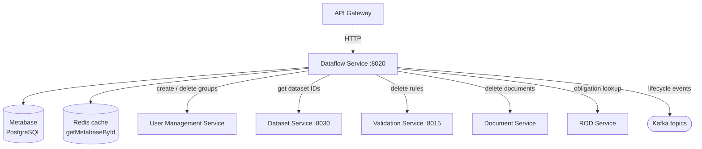

# Dataflow service

The Dataflow Service is the central organising layer of Reportnet 3. It models and manages the full lifecycle of a reporting workflow — from the initial design of data collection schemas through to the publication of submitted data. Every other service in the platform ultimately exists to serve a dataflow: datasets belong to one, validation rules apply within one, Kafka events carry a dataflow ID, and access control decisions reference it. The service runs on port 8020 and owns the Metabase PostgreSQL tables created in `V1__Init_Metabase_BD.sql` and extended through V85.

The Dataflow Service does not store data. It stores metadata about what should be reported, by whom, and under what conditions. The actual data lives in MongoDB-backed datasets managed by the Dataset Service. This distinction matters: when you delete a dataflow in the Dataflow Service, it instructs the Dataset Service to delete schemas and data, but the Dataflow Service itself has no direct access to that data.

## Flow overview



---

## Domain model

### Dataflow

A dataflow represents a reporting obligation and everything attached to it. In the simplest case a country is required by EU law to report on air quality every year: that obligation, the schema of what fields to collect, the list of participating countries, and the submission status of each country are all properties of a dataflow.

The `dataflow` table (V1, soft-delete columns added in V73) holds:

| Column | Type | Notes |
|---|---|---|
| `id` | Long | Auto-generated sequence |
| `name` | String | Must be unique (enforced at service layer) |
| `description` | String | |
| `status` | `TypeStatusEnum` | `DESIGN` or `DRAFT` |
| `type` | `TypeDataflowEnum` | `REPORTING`, `REFERENCE`, `BUSINESS`, or `CITIZEN_SCIENCE` |
| `deadline_date` | Date | Submission deadline |
| `creation_date` | Date | |
| `obligation_id` | Integer | FK to an obligation in the external ROD system; null for REFERENCE type |
| `manual_acceptance` | boolean | |
| `releasable` | boolean | Whether data snapshots can be released |
| `show_public_info` | boolean | Whether the dataflow appears on the public portal |
| `big_data` | boolean | Enables big-data (Parquet/Iceberg) processing paths |
| `snc_data` | boolean | Special Notification Clause flag |
| `official_reporting` | boolean | Added V84 |
| `dataprovider_group_id` | Long | Required for BUSINESS type; links to `data_provider_group` |
| `fme_user_id` | Long | Required for BUSINESS type; links to `fme_user` |
| `automatic_reporting_deletion` | boolean | |
| `is_deleted` | boolean | Soft-delete flag (V73) |
| `deleted_at` | Date | Soft-delete timestamp (V73) |

**Dataflow types.** `REPORTING` is the standard case: a dataflow linked to a ROD obligation, with countries submitting data against a deadline. `REFERENCE` dataflows hold shared lookup data (classifications, code lists) that other dataflows can use; they have no ROD obligation and no reporters. `BUSINESS` dataflows are for internal operational workflows and require both an FME user account (`fme_user_id`) and a data provider group (`dataprovider_group_id`). `CITIZEN_SCIENCE` supports community-contributed data.

**Dataflow statuses.** `DESIGN` is the initial state: schemas are being built, representatives are being assigned, and no data submission has opened. `DRAFT` indicates that data collection is open. The transition is triggered explicitly via `PUT /{dataflowId}/updateStatus` and requires the `DATA_STEWARD` or `DATA_CUSTODIAN` system role.

The `releasable` flag is separate from status. A `DRAFT` dataflow that is not releasable cannot have its data frozen into snapshots, which is how official reporting versions are created.

**Schema immutability.** Once a data collection is created and the dataflow moves to `DRAFT`, the dataset schemas are frozen. There is no supported mechanism to add, remove, or change fields in a live data collection without destroying and recreating the entire dataflow. This is a significant operational constraint: any schema mistake discovered after the data collection is created requires restarting from scratch. The data collection creation process takes approximately ten minutes. It provisions per-provider reporting dataset instances, creates the corresponding Keycloak groups, and initialises all QC rule checks — generating a large number of parallel operations against Keycloak and the Dataset Service.

### Representatives and data providers

A representative is the link between a dataflow and a reporting organisation. If Country A is required to report under a given dataflow, there will be a `representative` row connecting Country A's `data_provider` record to that dataflow. Each representative can have multiple `representative_leadreporter` rows — the primary contacts who are responsible for ensuring the data is submitted. The `representative` table tracks whether the submission receipt has been downloaded (`receipt_downloaded`) and whether the representative's data is restricted from public view (`restrict_from_public`).

`data_provider` holds the list of reporting organisations (countries, companies, or groups). Each provider belongs to a `data_provider_group`, which carries a `type` of `COUNTRY`, `COMPANY`, or `ORGANIZATION`. The group determines how the Dataflow Service treats the provider — for BUSINESS type dataflows, the service checks that a `dataprovider_group_id` is set.

### Integrations

An integration represents a configured connection to an external data exchange system, typically FME. The `integration` table stores a tool name, an operation type (`IMPORT`, `EXPORT`, `EXPORT_EU_DATASET`, or `IMPORT_FROM_OTHER_SYSTEM`), and references to two sets of parameters: internal parameters (field mappings) and external parameters (FME-specific config). Every execution of an integration becomes an asynchronous job tracked by the Orchestrator Service.

### Supporting entities

`document` holds uploaded guidance files attached to a dataflow (instructions, templates). `weblink` holds URLs. `contributor` records users who have been explicitly assigned a role on a dataflow (as opposed to inheriting one through a representative relationship). `submission_agreement` is a 1:1 companion to a dataflow holding terms-of-submission text. `temp_user` is used during the lead reporter invitation flow, before the reporter's account has been validated.

---

## How it works

### Creating a dataflow

When a user with the `DATA_CUSTODIAN` or `DATA_STEWARD` role calls `POST /dataflow`, the service validates that the name is not already in use. It sets `status=DESIGN`, `releasable=true`, `bigData=false`, `sncData=false`, and `officialReporting=false`. If the type is `BUSINESS`, it checks that both `dataProviderGroupId` and `fmeUserId` refer to existing records. Once the database row is created, the service calls the User Management Service to create the corresponding Keycloak groups (`DATAFLOW_CUSTODIAN`, `DATAFLOW_LEAD_REPORTER`, `DATAFLOW_EDITOR_READ`, `DATAFLOW_EDITOR_WRITE`) and adds the creating user to the `DATAFLOW_CUSTODIAN` group. This is the moment at which the dataflow becomes visible to the creator in the role-filtered views.

### Retrieving dataflows

The main listing endpoint (`POST /dataflow/getDataflows`) is paginated and filtered. It accepts a map of filter criteria (name, obligation, status, deadline), an order column, a sort direction, and page parameters. The query is executed through a custom repository method that joins across multiple tables and restricts results to dataflows the calling user has access to. The user's list of accessible dataflow IDs is fetched from the User Management Service before the query runs. Pinned dataflows (a user preference stored in Keycloak user attributes) are returned first.

`GET /v1/{dataflowId}` returns the full dataflow including documents, weblinks, and representatives. The optional `providerId` parameter causes the representatives list to be filtered so only the specified provider's entry is returned — used when a reporter opens a dataflow and needs to see only their own representative row.

`getMetabaseById()` is a lighter-weight version that skips documents and weblinks. It is annotated `@Cacheable(value = "dataflowVO", key = "#id")`, so subsequent calls for the same dataflow ID are served from Redis without hitting the database. This cache is evicted on any update to the dataflow row.

### Updating a dataflow

`PUT /dataflow` accepts a full `DataFlowVO` and can update name, description, obligation, deadline, `releasable`, `showPublicInfo`, `fmeUserId`, `dataProviderGroupId`, and `officialReporting`. Status changes are handled separately via `PUT /{dataflowId}/updateStatus`. After a successful update the `dataflowVO` cache entry for that ID is evicted.

### Soft delete and hard delete

Soft delete (`PUT /{dataflowId}/soft-delete`) sets `is_deleted=true` and `deleted_at=now()`. The dataflow stops appearing in normal listings but is not removed from the database. It can be reversed with `PUT /{dataflowId}/reverse-soft-delete`. This is used when a dataflow needs to be taken offline temporarily without destroying its data.

Hard delete (`DELETE /{dataflowId}`) is an asynchronous operation. The service runs it in a Spring thread pool and publishes a `DELETE_DATAFLOW_COMPLETED_EVENT` or `DELETE_DATAFLOW_FAILED_EVENT` to Kafka when it finishes. The hard delete sequence is:

```
1. Delete all documents from the document store
2. For each design dataset: delete the MongoDB schema and validation rules
3. Delete all representatives and lead reporters
4. Delete the dataflow row from PostgreSQL
5. Delete all Keycloak resource groups for this dataflow
→ Kafka: DELETE_DATAFLOW_COMPLETED_EVENT
```

### Representative and lead reporter management

Adding a representative links a `data_provider` to a dataflow. A representative can be created only once per provider/dataflow combination. Lead reporters are added to the representative and their emails are validated: `validateLeadReporters()` checks that each email is resolvable in Keycloak. An invalid lead reporter blocks certain progression steps in the reporting workflow.

`validateAllReporters()` is a system-wide async operation that iterates every representative across every dataflow and re-validates lead reporter emails. It is exposed via `PUT /dataflow/validateAllReporters` and is intended for use after bulk user migrations or email address changes.

### Contributor management

Contributors are users explicitly assigned a role on a dataflow outside the standard representative relationship. `ContributorService` handles the create/update/delete cycle and delegates role assignment to the User Management Service (Keycloak group management). `createAssociatedPermissions()` propagates a contributor's permissions from the dataflow level down to a specific dataset — called after a new reporting dataset is created for a provider so that the contributor's rights extend to the new dataset automatically.

### Integration execution

When an integration is executed via `POST /integration/execute/external/dataset/{datasetId}/integration/{integrationId}`, the Dataflow Service locks the dataset (to prevent concurrent operations), sends the integration configuration to the external system (FME), and returns immediately. The FME system calls back an endpoint in the Dataset Service when it completes. The Dataflow Service publishes one of eight Kafka events depending on the operation type and outcome (`EXTERNAL_IMPORT_DESIGN_COMPLETED_EVENT`, `EXTERNAL_IMPORT_REPORTING_COMPLETED_EVENT`, etc.).

### Schema information export

`exportSchemaInformation()` generates an Excel workbook describing the current state of a dataflow's schema. It is async and writes the file to the path configured in `exportDataflowSchemaInformationPath`. The workbook contains four sheets: the field definitions (tables and columns with data types), the QC rules, the unique constraints, and the external integration configurations. A `EXPORT_SCHEMA_INFORMATION_COMPLETED_EVENT` is published on completion, and the file can then be downloaded via `GET /dataflow/downloadSchemaInformation/{dataflowId}`.

### Public and private views

A dataflow has two public-facing views controlled by the `show_public_info` flag. When the flag is true the dataflow appears in `POST /dataflow/getPublicDataflows` with limited fields (name, description, obligation, deadline). National coordinator information is also included in the public view only when `show_public_info` is true. The internal view (`GET /dataflow/getPrivateDataflow/{dataflowId}`) provides full details including representative contact information.

---

## Relationships with other services

**User Management Service.** The Dataflow Service calls the User Management Service to create and delete Keycloak groups when dataflows are created and deleted, and to add or remove users from groups when contributors and representatives are managed. It also calls it to retrieve the current user's list of dataflow roles, which is used to filter the paginated listing query.

**Dataset Service.** The Dataflow Service calls the Dataset Service to retrieve the IDs of design, reporting, reference, and EU datasets that belong to a dataflow. It needs these IDs when hard-deleting a dataflow (to instruct the Dataset Service to delete the schemas and data) and when generating the schema export. The Dataset Service calls the Dataflow Service to look up dataflow metadata — notably `getMetabaseById()` — which is why that method is cached.

**Validation Service.** The Dataflow Service calls the Validation Service's `RulesControllerZuul` when deleting a dataflow, to remove the associated validation rules from MongoDB.

**ROD Service.** The Dataflow Service calls the ROD (Reporting Obligations Database) integration service to retrieve the list of open obligations for the dataflow creation form, so users can link a new dataflow to an existing EU reporting obligation.

**Orchestrator Service.** The Dataflow Service publishes Kafka events that the Orchestrator Service consumes to trigger jobs (integration executions, snapshot creation). It does not call the Orchestrator directly; the event-driven pattern keeps the two services decoupled.

**Notification Service.** The Kafka events published by the Dataflow Service are consumed by the Notification Service to send in-app notifications to relevant users. The Dataflow Service does not call the Notification Service directly over Feign.

**Document Service.** Documents attached to a dataflow are stored via the Document Service. The Dataflow Service calls `DocumentControllerZuul` when deleting documents during a hard delete.

---

## Process flows

### Dataflow creation

```
1. POST /dataflow  (DATA_CUSTODIAN or DATA_STEWARD role required)
2. Validate name uniqueness
3. For BUSINESS type: validate dataProviderGroupId and fmeUserId exist
4. Insert dataflow row (status=DESIGN, releasable=true)
5. Call User Management Service: create Keycloak groups (CUSTODIAN, LEAD_REPORTER, EDITOR_READ, EDITOR_WRITE)
6. Call User Management Service: add creator to DATAFLOW_CUSTODIAN group
7. Return dataflowId
```

### Hard delete

```
1. DELETE /{dataflowId}  (returns 200 immediately, delete runs async)
2. Delete all document files
3. For each dataset schema:
   a. Call Dataset Service: delete MongoDB schema
   b. Call Validation Service: delete MongoDB validation rules
4. Delete all representative/lead reporter rows
5. Delete dataflow row
6. Call User Management Service: delete Keycloak groups
→ Kafka: DELETE_DATAFLOW_COMPLETED_EVENT  (or FAILED if any step throws)
```

### Lead reporter validation

```
1. PUT /contributor/validateReporters/dataflow/{dataflowId}/provider/{dataProviderId}
2. For each LeadReporter on each Representative for that provider:
   a. Call User Management Service: check email exists in Keycloak
   b. Set LeadReporter.invalid = (not found)
3. If sendNotification=true: publish VALIDATE_REPORTERS_COMPLETED_EVENT
```

### Integration execution (FME import)

```
1. POST /integration/execute/external/dataset/{datasetId}/integration/{integrationId}
2. Acquire distributed lock on dataset (prevents concurrent imports)
3. Send job request to FME with integration parameters
4. Return 200 immediately
5. (FME calls back to Dataset Service on completion)
6. Dataset Service receives callback → publishes result event
7. Kafka: EXTERNAL_IMPORT_REPORTING_COMPLETED_EVENT or FAILED
8. Notification Service sends in-app notification to user
9. Release distributed lock
```

### Schema information export

```
1. POST /dataflow/exportSchemaInformation/{dataflowId}
2. Returns 200 immediately; export runs async
3. Fetch all design datasets for dataflow (via Dataset Service)
4. For each schema: fetch tables, fields, rules, unique constraints, integrations
5. Build Excel workbook (4 sheets)
6. Write to: {exportDataflowSchemaInformationPath}/dataflow-{id}-Schema_Information/
7. Kafka: EXPORT_SCHEMA_INFORMATION_COMPLETED_EVENT  (or FAILED)
8. User calls GET /dataflow/downloadSchemaInformation/{dataflowId}?filename=...
```

---

## Configuration and limits

```yaml
server:
  port: 8020
spring:
  application:
    name: dataflow

reportnet:
  url: <frontend-base-url>            # Used to build public portal links

rod:
  url: <rod-system-url>               # External Reporting Obligations Database

exportDataflowSchemaInformationPath: <path>   # Where Excel exports are written

eea:
  authorization:
    key: <api-key-secret>             # Internal API key for consul-authenticated calls

eea.keycloak:
  listUsersMax: 1000                  # Max users returned in user search; see keycloak.md
```

**`dataflowVO` cache.** The `getMetabaseById()` result is cached in Redis with no explicit TTL — it is evicted only by `@CacheEvict` on mutation methods. If the service pod that holds the warm cache crashes mid-mutation, stale data may persist in Redis until either the next mutation triggers an evict or the Redis entry ages out (Redis itself has no TTL on this key). See the Redis documentation for the wider implication of no-TTL Spring Cache entries.

**Thread pool for async operations.** Delete, reporter validation, and schema export run in a `ThreadPoolTaskExecutor`. If the pool is saturated, new async tasks will queue. Long-running deletes of large dataflows (many datasets, many Keycloak groups) can hold a thread for several minutes; operators should watch thread pool queue depth if throughput is an issue.

**Dataflow name uniqueness.** Uniqueness is enforced by the service layer (a `findByNameIgnoreCase` query before insert), not by a database unique constraint. There is a small race window between the check and the insert under concurrent creation of identically-named dataflows. In practice this has not been an issue because dataflow creation is infrequent.
