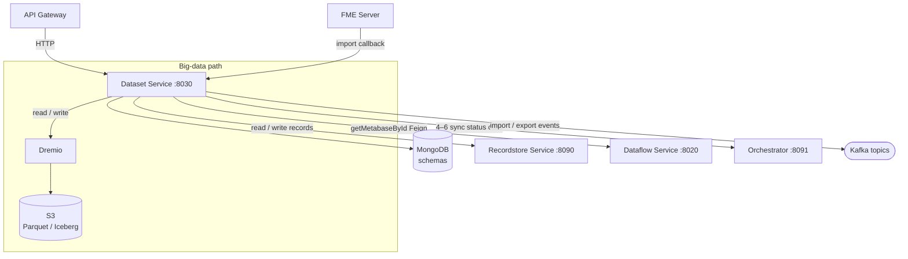

# Dataset Service

The Dataset Service is the central data-management service in Reportnet3. It is responsible for everything that touches the content and structure of datasets: defining what a dataset looks like (the schema), storing the actual reported data, orchestrating the lifecycle from initial design through reporting submission to final release, and providing import/export capabilities. It does not own the reporting workflow itself (that belongs to the Dataflow Service) and it does not run validation rules (that belongs to the Validation Service), but it owns the data that both of those services act upon.

## Flow overview



---

## Domain model

### Dataset types

Every dataset in the system is represented in the metabase (a shared PostgreSQL database) as a row in the `DATASET` table, using JPA joined-table inheritance. Five concrete sub-types extend it:

| Sub-type | Table | Role |
|---|---|---|
| `DesignDataset` | `DESIGN_DATASET` | The schema template a custodian builds before a dataflow is opened for reporting. It has no reported data; it is purely structural. |
| `ReportingDataset` | `REPORTING_DATASET` | One instance per data provider (country/organisation) per dataflow. This is where reporters submit their data. It carries a list of `Snapshot` records. |
| `DataCollection` | `DATA_COLLECTION` | One instance per dataflow. Created when the custodian transitions a dataflow from DESIGN to DRAFT. It accumulates data copied from all reporting datasets during the release process. Has a `dueDate` that represents the reporting deadline. |
| `EUDataset` | `EU_DATASET` | One instance per dataflow. The final aggregated view, populated from the DataCollection after all releases are consolidated. |
| `ReferenceDataset` | `REFERENCE_DATASET` | A shared lookup table (codelists, valid values) that belongs to a reference dataflow. Has an `updatable` flag that controls whether reporters can write to it. |
| `TestDataset` | `TEST_DATASET` | A sandbox instance used by custodians to test validation rules without affecting live data. |
| `PreparationDataset` | `PREPARATION_DATASET` | A staging area, typically used during complex schema copy or import operations. |

The `DataSetMetabase` base entity carries the fields shared by all types:

| Field | Meaning |
|---|---|
| `dataSetName` | Human-readable name |
| `dataflowId` | The owning dataflow |
| `datasetSchema` | The MongoDB ObjectId of the schema document |
| `dataProviderId` | Which provider this dataset belongs to (null for DataCollection, EUDataset, Reference) |
| `status` | `DatasetStatusEnum`: PENDING, TECHNICALLY_ACCEPTED, TECHNICALLY_INCORRECT, CORRECTION_REQUESTED, FINAL_FEEDBACK, RECALL_FOR_TECHNICAL_ACCEPTANCE |
| `datasetRunningStatus` | `DatasetRunningStatusEnum`: IN_PROGRESS, ERROR, etc. |
| `releasing` | Flag set to true while a release is in flight |
| `publicFileName` | Name of the file used for public export |

---

### Schema model (MongoDB)

Dataset schemas are stored in MongoDB, not in the relational database. The reason is that schemas are highly dynamic: custodians add, rename, and remove tables and fields frequently during the design phase, and a document store handles this more naturally than ALTER TABLE migrations.

The document hierarchy is:

```
DataSetSchema  (collection: DataSetSchema)
  └─ idDataSetSchema  (ObjectId, primary key)
  └─ idDataFlow       (Long, indexed)
  └─ tableSchemas[]
       └─ idTableSchema     (ObjectId)
       └─ nameTableSchema
       └─ readOnly, toPrefill, notEmpty, fixedNumber
       └─ dataAreManuallyEditable
       └─ recordSchema
            └─ idRecordSchema   (ObjectId)
            └─ fieldSchemas[]
                 └─ idFieldSchema   (ObjectId)
                 └─ headerName
                 └─ type            (DataType enum)
                 └─ codelistItems[]
                 └─ referencedField (foreign key to another schema)
                 └─ required, readOnly, pk
```

The same `idTableSchema`, `idRecordSchema`, and `idFieldSchema` ObjectIds are stored as strings in the relational data tables, acting as the join keys between the schema definition and the actual data.

A second MongoDB collection, `RulesSchema`, stores the validation rules linked to each schema. The Dataset Service reads this when it needs to propagate field changes or check integrity during data collection creation.

---

### Data model (per-dataset PostgreSQL)

Actual reported data lives in a dedicated PostgreSQL database per dataset, managed by the Record Store Service. The Dataset Service obtains connection strings from the Record Store at startup and whenever a new dataset is provisioned.

The multi-tenancy mechanism works through a `@DatasetId` parameter annotation and a `TenantResolver`. When a service method is annotated with `@DatasetId` on one of its parameters, a Spring AOP proxy intercepts the call, resolves the correct `DataSource` for that dataset ID, and sets it as the current tenant before the JPA call runs. This allows a single set of JPA entity classes to operate against many physical databases without any code branching.

The tables inside each dataset database are:

| Table | Entity | Relationship |
|---|---|---|
| `DATASET_VALUE` | `DatasetValue` | Root; keyed by the dataset ID that matches the metabase |
| `TABLE_VALUE` | `TableValue` | Many per dataset; joined to `DatasetValue` via `DATASET_ID`; `ID_TABLE_SCHEMA` links to MongoDB |
| `RECORD_VALUE` | `RecordValue` | Many per table; carries `DATA_PROVIDER_CODE` and `DATASET_PARTITION_ID` for provider-level filtering |
| `FIELD_VALUE` | `FieldValue` | Many per record; stores `VALUE` as text plus `TYPE` (the `DataType` enum); spatial data is also persisted in the native PostgreSQL `GEOMETRY` column using GeoLatte |
| `DATASET_VALIDATION` | `DatasetValidation` | Validation results at dataset level |
| `TABLE_VALIDATION` | `TableValidation` | Validation results at table level |
| `RECORD_VALIDATION` | `RecordValidation` | Validation results at record level |
| `FIELD_VALIDATION` | `FieldValidation` | Validation results at field level |

The `GEOMETRY` column in `FIELD_VALUE` is a specialised PostgreSQL/PostGIS column. The service reads from it when returning spatial data, but writes to it only indirectly by storing GeoJSON in the `VALUE` column and letting a trigger or converter maintain the geometry representation.

---

## How it works

### Schema lifecycle

A custodian begins by creating an empty dataset schema via `POST /dataschema/createEmptyDatasetSchema`. This creates a MongoDB `DataSetSchema` document and a `DesignDataset` row in the metabase. The custodian then adds tables (`POST /dataschema/createTableSchema`) and fields (`POST /dataschema/createFieldSchema`) through the schema controller. Each call inserts or updates the relevant MongoDB sub-document and, where applicable, calls the Validation Service to register a corresponding rules context.

When a field is added or changed on a design dataset that is already linked to live reporting datasets, the service must propagate the structural change to all reporting datasets. This is done asynchronously: `DatasetSchemaService` emits a `COMMAND_NEW_DESIGN_FIELD_PROPAGATION` Kafka event, which is consumed by `PropagateNewFieldCommand`, which then adds the new field columns to every affected dataset's `FIELD_VALUE` rows. `ExecutePropagateNewFieldCommand` handles the per-dataset execution step.

Schemas can be copied between dataflows (`POST /dataschema/copy`) to support the pattern where a new dataflow reuses the structure of an existing one.

---

### Data collection creation

When a custodian is satisfied with the design and opens the dataflow for reporting, they call `POST /datacollection/create`. The service validates that the dataflow is still in DESIGN status, then calls `DataCollectionServiceImpl.createEmptyDataCollection()` asynchronously. This method:

1. Retrieves the list of data providers (countries/organisations) registered for the dataflow from the Dataflow Service.
2. Creates one `ReportingDataset` per provider in the metabase.
3. Creates one `DataCollection` and one `EUDataset` in the metabase.
4. Calls the Record Store Service to create a physical PostgreSQL database for each new dataset.
5. Registers each new dataset as a resource in the User Management Service (UMS) and assigns roles to the relevant users.
6. Calls the Validation Service to validate the SQL rules in the schema before finalising, unless the caller has disabled that check.
7. Emits `ADD_DATACOLLECTION_COMPLETED_EVENT` on Kafka once all datasets are ready.

For reference dataflows, the flow is similar but creates only `ReferenceDataset` instances rather than reporting/collection/EU datasets, and the public info and manual-check flags are forced to false.

If anything fails mid-way, `undoDataCollectionCreation` rolls back by deleting the partially created datasets and releasing any locks.

---

### Data import

Reporters and custodians import data through `DatasetControllerImpl`. There are two paths depending on whether the dataflow is a big-data dataflow.

**Standard import** (`FileTreatmentHelper`):

File size limits enforced by the platform: Citus-backed dataflows accept up to 2 GB per import; big-data (DLH) dataflows accept up to 10 GB. A separate `etlImport` endpoint accepts JSON payloads up to 220 MB. Spatial fields whose raw content exceeds 70 MB are silently emptied with a warning rather than rejecting the whole file.

The default field delimiter when importing via the REST API is pipe (`|`); the browser-based import UI uses comma (`,`) by default. The `replace` request parameter controls whether existing records in the target table are deleted before the new data is inserted; it defaults to `false` (append). When `replace=false`, the imported rows are appended to whatever is already in the table. Setting it to `true` clears the table before inserting.

The import endpoint receives a file (CSV or Excel) as a multipart upload. `FileTreatmentHelper` reads the file header to match columns to schema field names, parses each row, and builds `RecordValue` + `FieldValue` objects in memory. If the `replace` flag is set, existing data in the target table is deleted first. Records are then bulk-inserted into PostgreSQL using `PostgresBulkImporter`, which uses a JDBC `COPY` command for high throughput. Large files are split into segments processed asynchronously using a thread pool (`SpringAsyncConfig`). On completion the service emits an `IMPORT_REPORTING_COMPLETED_EVENT` Kafka event, which triggers the Validation Service to re-validate.

The file parser is selected via `FileParserFactory` using a strategy pattern: `CSVReaderStrategy` for `.csv` files, `ExcelReaderStrategy` for `.xls`/`.xlsx`. The same factory pattern governs export through `FileExportFactory`, `CSVWriterStrategy`, and `ExcelWriterStrategy`.

**Big-data import** (`BigDataDatasetService`):

When the owning dataflow is flagged as `bigData`, the import flow changes significantly. The uploaded file goes to S3 (via the `S3Service`) rather than directly into PostgreSQL. Dremio then becomes the query engine for reading the data back. `BigDataDatasetService.importBigData()` generates a pre-signed S3 URL, stores the file, registers the table in Dremio via `DremioHelperService`, and triggers a Dremio auto-promotion so the data becomes immediately queryable. Read operations on big-data datasets are routed through `DataLakeDataRetrieverFactory`, which resolves to the `DatasetDataRetrieverDL` implementation backed by Dremio's JDBC driver rather than to the regular PostgreSQL path.

---

### Querying data

`GET /dataset/TableValueDataset/{id}` retrieves paginated, filterable table data. The query takes:

- `idTableSchema` — which table to read
- `pageNum` / `pageSize` — pagination
- `fields` — sort field(s)
- `levelError` — filter to records with at least one validation error at this severity
- `idRules` — filter to records that failed specific validation rules
- `fieldSchemaId` + `fieldValue` — filter records where a specific field equals a value

This is implemented through `DatasetExtendedRepositoryImpl`, which constructs native JPA/JPQL queries dynamically based on the presence of the optional parameters. When sorting is needed, `SortFieldsHelper` translates the field schema IDs into column-level sort expressions.

For big-data datasets a parallel endpoint `TableValueDatasetDL` routes the same query to Dremio.

---

### Snapshot and release flow

A **snapshot** is a point-in-time copy of a reporting dataset. Reporters create them manually before releasing, and the release process creates them automatically.

The release sequence, once a reporter submits their snapshot, is:

```
Reporter calls POST /snapshot/createSnapshot
  → DatasetSnapshotService persists a Snapshot record (enabled = false)
  → Validation Service validates the snapshot data
  → VALIDATION_RELEASE_FINISHED_EVENT fires

CheckBlockersDataSnapshotCommand consumes the event
  → Checks whether any BLOCKER-level validation errors exist
  → If blockers exist → RELEASE_BLOCKERS_FAILED_EVENT → release is rejected
  → If no blockers → triggers the copy to DataCollection

ReleaseDataSnapshotsCommand consumes RELEASE_ONEBYONE_COMPLETED_EVENT
  → Copies data from the ReportingDataset into the DataCollection
  → Marks the Snapshot as dcReleased = true
  → When all providers have released, triggers copy to EUDataset
  → Marks euReleased = true on each Snapshot
  → Emits RELEASE_COMPLETED_EVENT

SaveStatisticsCommand consumes RELEASE_COMPLETED_EVENT
  → Computes validation statistics and persists them to the Statistics table
```

Snapshots can be restored, which copies the snapshot data back into the reporting dataset and re-triggers validation.

For historical release exports, `ExportHistoricReleasesCompletedEvent` and the corresponding failed event cover the async notification path.

---

### Statistics

`StatisticsService` computes counts of records with INFO, WARNING, ERROR, and BLOCKER-level validation results per table and per dataset. These are stored in the `STATISTICS` table in the metabase and returned via `GET /datasetmetabase/{datasetId}/statisticsbyfieldschema` and related endpoints. Statistics are recalculated by `SaveStatisticsCommand` after each release and after validation completes.

---

## Relationships with other services

The Dataset Service sits at the centre of the platform. Almost every other service either calls it or is called by it.

**Calls made by the Dataset Service:**

- **Record Store Service** — to create physical PostgreSQL databases for new datasets, to obtain connection strings for the multi-tenant data source, and to query process status during imports.
- **Dataflow Service** — to look up dataflow metadata (status, type, due date), representative lists, and integration configurations.
- **Validation Service** — to retrieve the rules schema during schema operations and to check SQL rule validity during data collection creation.
- **Orchestrator Service** — to create and update `Job` records that track long-running operations (import, export, release). Callers can poll the Orchestrator for progress rather than blocking on the Dataset Service.
- **User Management Service (UMS)** — to create resource groups and assign roles when new datasets are provisioned.
- **Communication Service** — to emit user-facing notifications (import completed, export ready, snapshot created, release blocked, etc.).
- **Collaboration Service** — to retrieve messages associated with a release when generating release receipts.

**Calls received from other services (via Feign or Kafka):**

- The **Orchestrator Service** calls import and export endpoints to start jobs on behalf of the user.
- The **Validation Service** emits `VALIDATION_FINISHED_EVENT` and `VALIDATION_RELEASE_FINISHED_EVENT` over Kafka, which the Dataset Service consumes to decide whether a release can proceed.
- The **Frontend Service** calls nearly every endpoint for user-driven operations (schema editing, data viewing, import, export, snapshot creation).

---

## Process flows

### New field added to a design dataset

```
Custodian → POST /dataschema/createFieldSchema
  → DataschemaServiceImpl adds field to MongoDB TableSchema
  → Check if there are live ReportingDatasets for this schema
  → If yes → emit COMMAND_NEW_DESIGN_FIELD_PROPAGATION on Kafka
    → PropagateNewFieldCommand enqueues per-dataset tasks
      → ExecutePropagateNewFieldCommand inserts FIELD_VALUE rows
         for each affected RecordValue in the dataset
  → Validation Service is called to create a rules context for the new field
```

### Iceberg-to-Parquet conversion (big-data datasets)

Big-data datasets in Dremio can exist in either Iceberg or Parquet table format. When a conversion is requested (`POST /dataset/bigData/enableEditing`):

```
DatasetControllerImpl → BigDataDatasetService.enableEditing()
  → Acquire Redis distributed lock (TTL 900s) to prevent concurrent conversions
  → ParquetConverterServiceImpl reads current table from Dremio
  → Writes data out in Parquet format to S3
  → Drops and recreates the Dremio table referencing the new Parquet files
  → Release lock
  → Emit ICEBERG_TO_PARQUET_CONVERSION_COMPLETED_EVENT
```

---

## Configuration and limits

| Key | Location | Purpose |
|---|---|---|
| `server.port` | `application.yml` | Dataset Service listens on port **8030** |
| `spring.datasource.metasource.*` | `application.yml` / Consul | Connection to the shared metabase PostgreSQL |
| `spring.datasource.dataset.*` | `application.yml` / Consul | Credentials used for per-dataset PostgreSQL connections (the URL is fetched dynamically from the Record Store) |
| `spring.jpa.properties.hibernate.jdbc.batch_size` | `application.yml` | Hibernate batch size for bulk inserts; tuned for import throughput |
| `spring.data.mongodb.*` | Consul | Connection to MongoDB for schema storage |
| Redis connection | Consul | Used by `RedisLockService` for distributed locks during big-data conversions |
| Dremio JDBC / REST | Consul / `DremioConfiguration` | Connection to Dremio for big-data query execution |

### ETL export API versions

Five versions of the ETL export endpoint exist. Versions 1–3 are synchronous and will time out on large datasets; v4 and v5 are asynchronous and recommended for programmatic access.

| Version | Path | Format | Notes |
|---|---|---|---|
| v1 | `GET /v1/{datasetId}/etlExport` | JSON | Synchronous; streams content directly; not suitable for large datasets |
| v2 | `GET /v2/etlExport/{datasetId}` | JSON | Synchronous; internal improvement of v1; replaced by v3 |
| v3 | `GET /v3/etlExport/{datasetId}` | JSON | Asynchronous; job-based |
| v4 | `GET /v4/etlExport/{datasetId}` | ZIP (CSV) | Asynchronous; one CSV per table; recommended for DLT2 harvesting and all large-dataset use |
| v5 | `GET /v5/etlExport/{datasetId}` | ZIP (Parquet) | Asynchronous; analytics-oriented Parquet output |

v4 and v5 return a `pollingUrl` in their response; the client polls `GET /orchestrator/jobs/pollForJobStatus/{jobId}` until the status reaches `FINISHED`, then downloads the result.
| S3 endpoint and credentials | Consul / `S3Service` | MinIO or AWS S3 for big-data file storage |
| Thread pool sizes | `SpringAsyncConfig` | Controls concurrency for async import segments; separate executor for standard and big-data paths |
