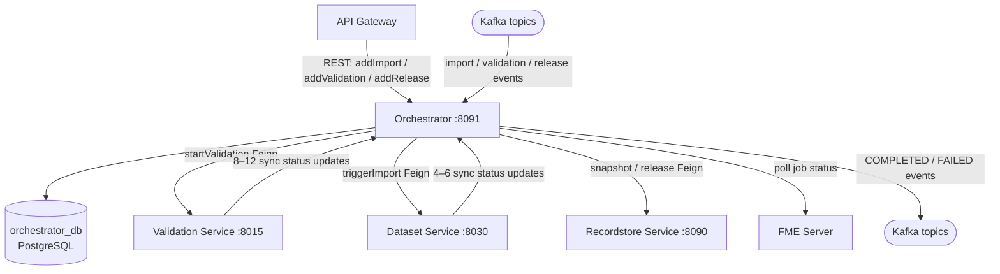

# Orchestrator Service (:8091)

## Overview

The Orchestrator is the central job scheduler and lifecycle manager for all long-running operations in Reportnet3. Its core responsibility is straightforward: when a user triggers an import, validation, release, or export, the Orchestrator decides whether that work can start now, queues it if not, hands it off to the right service when it can, and then watches over it until it finishes — retrying or canceling if something goes wrong along the way.

Crucially, the Orchestrator does not process any data itself. It holds no dataset logic, no validation rules, no file parsing. Its job is purely coordination: knowing what needs to run, when it can run, who should run it, and what to tell the rest of the system when it's done.

## Flow overview



---

## Domain Model

Everything in the Orchestrator revolves around three entities stored in PostgreSQL.

A **Job** is the central record. It captures the type of work (import, validation, release, etc.), the current status, which dataflow/dataset/provider it relates to, who created it, and a flexible parameters map for type-specific data such as file paths, table schemas, or FME job IDs. The `jobInfo` field acts as a running log of errors or warnings that accumulate as the job progresses.

A **JobProcess** is a linking record that connects a Job to the one or more process IDs that a downstream service (typically Recordstore or Validation) creates when it starts executing the work. This link is what allows the Orchestrator to later query "how are all the tasks for this job doing?" without knowing the internal details of the process.

**JobHistory** is an append-only audit trail. Every time a Job's status changes, a snapshot is written to history. This means the full lifecycle of any job — who created it, when it queued, when it started, how long it took, what went wrong — is always recoverable.

Jobs move through a well-defined lifecycle:

```
QUEUED  →  IN_PROGRESS  →  FINISHED
                        →  FAILED
                        →  CANCELED / CANCELED_BY_ADMIN
        →  REFUSED  (never started — rejected at creation time)
```

The eight job types are: `IMPORT`, `VALIDATION`, `RELEASE`, `ETL_IMPORT`, `DELETE`, `EXPORT`, `FILE_EXPORT`, and `COPY_TO_EU_DATASET`.

---

## How Jobs Are Created

Other services (or the API Gateway on behalf of a user) call the Orchestrator's REST API to request work. Before accepting a job, the Orchestrator runs an eligibility check — it looks at what is already running and queued for the same dataflow/dataset/provider combination and decides whether the new job conflicts with anything in flight. If there's a conflict, the job is returned immediately as `REFUSED` and the caller receives a notification. If it's safe to proceed, the job is written to the database as `QUEUED`.

The creation endpoints follow a consistent pattern:

| Job type | Endpoint |
|---|---|
| Import (file or FME) | `POST /jobs/addImport/{datasetId}` |
| ETL import | `POST /jobs/addEtlImport/{datasetId}` |
| Validation | `PUT /jobs/addValidationJob/{datasetId}` |
| Release | `POST /jobs/addRelease/dataflow/{dataflowId}/dataProvider/{dataProviderId}/release` |
| Delete dataset data | `POST /jobs/addDeleteData/{datasetId}` |
| Copy to EU dataset | `POST /jobs/addCopyToEUDataset/populateData/dataflow/{dataflowId}` |
| File export | `POST /jobs/addFileExport/{datasetId}` |

---

## How Jobs Are Executed

The Orchestrator uses a background scheduler (`JobForExecutingQueuedJobs`) that fires every minute. Each run picks up all `QUEUED` jobs and, for each one, checks whether it can actually start — primarily by counting how many jobs of the same type are already `IN_PROGRESS` and comparing that against a configured maximum. These limits are set per job type in Consul KV:

- `scheduling.inProgress.import.maximum.jobs`
- `scheduling.inProgress.validation.maximum.jobs`
- `scheduling.inProgress.release.maximum.jobs`
- `scheduling.inProgress.copyToEUDataset.maximum.jobs`
- `scheduling.inProgress.export.maximum.jobs`

If the slot is available, the job moves to `IN_PROGRESS` and the Orchestrator makes a Feign call to the appropriate service to kick off the actual work. That service then creates its own internal processes and tasks, and registers them back with the Orchestrator via `POST /jobProcess/saveJobProcess`. From that point on, the Orchestrator can track progress by polling the Recordstore service for task statuses.

---

## Relationships with Other Services

The Orchestrator is the hub that touches almost every other backend service, but always as the initiator — it calls out, it does not get called back directly (except by FME).

**Dataset Service** is called to trigger validation runs and ETL exports, and to read or update dataset metadata and status.

**Dataset Snapshot Service** handles the heavy lifting of release operations. The Orchestrator calls it to create release snapshots across all reporting datasets and, once they are complete, to release the associated locks.

**EU Dataset Service** is called when a copy-to-EU-dataset job runs, to populate the EU dataset from the data collection.

**Dataflow Service** is consulted when a job is being set up — to retrieve the dataflow name, check whether it is a big-data dataflow, or look up the data provider group.

**Recordstore / Process Service** is the source of truth for task-level progress. The Orchestrator polls it continuously to find out whether the tasks belonging to a job have finished, failed, or are stuck.

**Representative Service** is used when a user triggers a "validate as provider" flow, to verify that the supplied provider code is valid for the given dataflow.

**User Management Service** is called by scheduled jobs that need an admin-level token to interact with other services on behalf of the system rather than a human user.

**Collaboration Service** receives automated messages from the Orchestrator in certain workflows — for example, posting a feedback message when a release completes.

---

## Notifications via Kafka

When a job reaches a terminal state, the Orchestrator publishes a Kafka event. These events drive two things: real-time UI notifications (via the Communication Service's WebSocket bridge) and any further processing that downstream services need to do once a job is complete.

The Orchestrator is a **producer only** — it fires and forgets these events and does not consume any Kafka topics itself.

The full set of events covers every outcome for every job type:

- **Import:** completed (design dataset), completed (reporting dataset), canceled, restart completed, restart failed, long-running timeout, FME failure, FME no-file-returned
- **Validation:** finished, canceled, refused, validate-as-provider refused
- **Release:** completed, canceled, refused, silent release completed, silent release failed
- **EU Dataset:** copy refused, copy canceled

Silent release events are a special case — they carry no user-facing notification, so the UI stays quiet while the system still processes the outcome internally.

---

## Fault Tolerance and Recovery

One of the Orchestrator's most important roles is dealing with jobs and tasks that get stuck. Distributed systems fail in partial and unpredictable ways — a service might crash after creating a process but before registering it, a task might hang indefinitely, or FME might never call back. The Orchestrator has 16 additional scheduled jobs beyond the main execution loop, each targeting a specific failure mode:

**Jobs that never produced work** — if an import, validation, or release job has been `IN_PROGRESS` for too long without any associated processes or tasks appearing, dedicated schedulers detect this and cancel the job cleanly.

**Tasks that are stuck or delayed** — separate schedulers watch for validation tasks or release tasks that have been running too long and either restart them or escalate to cancellation.

**FME polling** — since FME is an external system that the Orchestrator cannot receive events from reliably, a dedicated scheduler polls the FME Server periodically to check whether FME import jobs have completed. If FME does call back via `POST /jobs/private/updateFmeCallbackJobParameter`, that is also handled — but the polling loop ensures nothing falls through the cracks if the callback never arrives.

**Restart logic** — import jobs that time out are not simply failed; a restart scheduler attempts to re-run them up to a configurable number of times before giving up and publishing a failure event.

**Housekeeping** — finished jobs are cleaned up after a retention period, expired Redis locks are purged, and Iceberg tables whose editing lock has expired are cleaned up.

---

## Core Process Flows

### Generic Job Lifecycle

When any job is created, it passes through this sequence:

1. A REST caller requests a job — the Orchestrator checks eligibility and either refuses it immediately or writes it as `QUEUED`.
2. Every minute, the execution scheduler picks up queued jobs and checks whether a slot is free within the concurrency limits.
3. When a slot opens, the job moves to `IN_PROGRESS` and the Orchestrator calls the target service via Feign.
4. The target service creates processes and tasks, then registers them back via `/jobProcess/saveJobProcess`.
5. Finalisation schedulers periodically poll the Recordstore service for task statuses on all in-progress jobs.
6. Once all tasks finish, the job is marked `FINISHED` and a Kafka event is published.
7. Eventually the cleanup scheduler removes the job from the active table after the retention period expires (the history record remains).

### Validation Flow

A user triggers dataset validation. The Orchestrator queues a `VALIDATION` job. When the scheduler picks it up, it calls `ValidationService.validateDataSetData()` via Feign, passing the dataset ID and context. The Validation Service internally creates a process with individual validation-rule tasks, then registers the process with the Orchestrator. The finalisation scheduler watches those tasks; when the last one completes, the Orchestrator marks the job finished and publishes `VALIDATION_FINISHED_EVENT`, which the Communication Service delivers to the user's browser as a real-time notification.

If the user cancels mid-run, the Orchestrator updates the job to `CANCELED` and publishes `VALIDATION_CANCELED_EVENT`. If the system refused the job at creation time (e.g. a validation is already running on that dataset), the caller immediately receives `VALIDATION_REFUSED_EVENT`.

### Release Flow

A release is more complex because it spans multiple datasets and involves snapshot creation. The Orchestrator queues a `RELEASE` job, and when the scheduler picks it up it calls `DataSetSnapshotService.createReleaseSnapshots()`. The snapshot service creates a process per dataset and registers them all with the Orchestrator.

The release finalisation scheduler runs every 30 minutes — deliberately slower than the 1-minute loop because releases are longer-running and touch more data. When all snapshots are confirmed complete, the Orchestrator calls `releaseLocksFromReleaseDatasets()` to free any editing locks that were held during the release, then publishes `RELEASE_COMPLETED_EVENT`.

For silent releases (automated releases with no user notification), the same flow runs but `SILENT_RELEASE_COMPLETED_EVENT` is published instead, which the Communication Service ignores.

---

## Priority algorithm and known limitations

Under normal operating conditions the Orchestrator successfully completes approximately 97% of submitted jobs. The remaining failures are typically caused by transient downstream service errors, Kafka delivery issues, or data that fails validation prerequisites before a job can begin. The restart scheduler recovers a proportion of these.

The job execution scheduler applies a priority algorithm before deciding which queued job to run next. The two main inputs are: the dataflow's current status (DESIGN-phase dataflows are treated as low priority) and the reporting deadline (the closer the deadline, the higher the priority). This is intended to ensure that near-deadline submissions are processed first during busy periods.

In practice the algorithm creates a predictable problem: data providers learn to submit near the deadline to get high priority, which concentrates load at exactly the worst time — when the system is already under peak stress from other providers doing the same thing. The scheduler also does not deduplicate: a user who triggers multiple identical validation jobs in quick succession will queue them all. Neither queue position nor expected wait time is surfaced to the user, so reporters have no way to judge whether their submission is being processed.

The concurrency limits (`scheduling.inProgress.*.maximum.jobs` keys in Consul) are hard-coded caps that serve as artificial bottlenecks. There is no dynamic adjustment based on actual system load, and no Kubernetes autoscaling is triggered by queue depth.

The Orchestrator was originally synchronous — every operation blocked its thread until the downstream service responded, making the Orchestrator a single point of failure. The team moved to an event-driven SAGA-like pattern, with Kafka driving coordination and the Orchestrator acting as the monitor and fallback. This evolution is visible in the code: older code paths still make synchronous Feign calls where newer patterns use Kafka commands. Downstream services make a significant number of synchronous calls back to the Orchestrator during long-running operations — the Dataset Service makes 4–6 synchronous calls per import job and the Validation Service makes 8–12 synchronous calls per validation, updating job status at each step. These create cascading delays and a single point of failure risk for the services calling in. The planned direction is to replace those calls with Kafka events published by the worker and consumed by the Orchestrator.

---

### FME Import Flow

FME imports are unusual because FME is an external system that starts its own job independently. When FME kicks off an import it registers a job with the Orchestrator immediately as `IN_PROGRESS` (with the FME job ID stored on the job record). From that point the Orchestrator takes two approaches in parallel: a polling scheduler checks the FME Server periodically for status updates, and it also listens for a callback from FME via `POST /jobs/private/updateFmeCallbackJobParameter`.

If the import succeeds, `IMPORT_REPORTING_COMPLETED_EVENT` is published. If FME reports failure or returns no file, the corresponding failure event is published and the user is notified. If FME goes silent and neither a callback nor a successful poll result arrives within the maximum allowed duration, the restart scheduler attempts to re-run the job before ultimately failing it with `LONG_RUNNING_IMPORT_FAILED_EVENT`.
