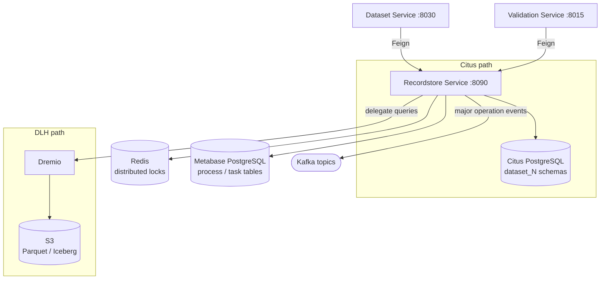

# Recordstore service

The Recordstore Service is the physical storage engine for Reportnet 3 dataset data. Where the Dataset Service owns the schema definition (field names, types, validation rules — stored in MongoDB) and the Dataflow Service owns the organisational metadata (who reports, by when, to what obligation), the Recordstore Service owns the actual reported values. It creates and manages one PostgreSQL schema per dataset, tracks every long-running data operation as a `Process` and `Task`, and handles the snapshot mechanism by which data is frozen for official release.

The service currently maintains two fundamentally different storage paths. The traditional path stores data in a Citus-distributed PostgreSQL cluster, one schema per dataset, with data exported to CSV files for snapshots. The new path stores data as Parquet files in object storage (S3) and makes them queryable through Dremio, a data lakehouse engine. Whether a given dataflow uses the old or new path is controlled by the `bigData` flag on the `dataflow` row. This document covers both paths and calls out where their behaviour diverges. The Parquet/Dremio path is the direction of travel; the Citus path exists for dataflows created before the migration was introduced.

The service runs on port 8090.

## Flow overview



---

## Domain model

### Dataset schemas

The core concept in the Recordstore Service is that every dataset is a PostgreSQL schema. When dataset ID 42 is created, the service creates a schema named `dataset_42` and populates it with a fixed set of tables. There is no shared data table; the schema boundary is also the isolation boundary between datasets.

Every dataset schema contains the same thirteen tables, created from the SQL template in `datasetInitCommands.txt`:

| Table | Purpose |
|---|---|
| `DATASET_VALUE` | Single row; root anchor for the dataset, holds the schema design ID reference and the `view_updated` flag |
| `TABLE_VALUE` | One row per logical table in the schema; holds the table schema ID and the dataset ID FK |
| `RECORD_VALUE` | One row per data record; holds the schema record ID, the parent `TABLE_VALUE`, the partition ID, the reporting country code, and the sort position |
| `FIELD_VALUE` | One row per field in a record; holds the schema field ID, the raw string value, the field type, geometry data, and a geometry error flag |
| `ATTACHMENT_VALUE` | Binary file attachments linked to a `FIELD_VALUE`; content is stored as `BYTEA` |
| `VALIDATION` | One row per QC rule violation; holds the rule ID, error level, message, entity type, and date |
| `DATASET_VALIDATION` | Join between a validation violation and the dataset |
| `TABLE_VALIDATION` | Join between a validation violation and a table |
| `RECORD_VALIDATION` | Join between a validation violation and a record |
| `FIELD_VALIDATION` | Join between a validation violation and a field |
| `TEMP_ETLEXPORT` | Temporary holding table used during ETL exports; rows are written here, read back, and deleted |

All FK columns have indexes. `VALIDATION.level_error` and `FIELD_VALUE.geometry` are also indexed because they appear in frequent filter clauses.

The schema also contains three helper functions (`is_numeric()`, `is_double()`, `is_date()`) and eight sequences used to generate IDs for the main tables.

### EEAProcess and Task

Long-running operations are tracked in two tables: `process` and `task`, which live in the main Metabase database (not inside dataset schemas). These tables were created by Flyway migrations V65 and V66 respectively.

`EEAProcess` represents a top-level operation. Its key fields:

| Field | Type | Notes |
|---|---|---|
| `processId` | String | UUID assigned at the start of the operation; used as the correlation key across services |
| `datasetId` | Long | The dataset being acted on |
| `dataflowId` | Long | The parent dataflow |
| `processType` | `ProcessTypeEnum` | What kind of operation this is (see below) |
| `status` | `ProcessStatusEnum` | `IN_QUEUE`, `IN_PROGRESS`, `FINISHED`, or `CANCELED` |
| `user` | String | Username who initiated the process |
| `queuedDate` / `processStartingDate` / `processFinishingDate` | Date | Timestamps for each status transition |
| `priority` | int | 1–100; higher means executed earlier in the queue |
| `released` | boolean | Whether the associated data has been released |

`ProcessTypeEnum` values: `VALIDATION`, `IMPORT`, `RELEASE`, `RELEASE_SNAPSHOT`, `COPY_TO_EU_DATASET`, `RESTORE_REPORTING_DATASET`, `RESTORE_DESIGN_DATASET`, `COPY_REFERENCE_DATASET`, `FILE_EXPORT`, `EXPORT_QC`, `EXPORT_HISTORIC_RELEASES`.

`Task` represents a sub-unit of work within a process — typically a file chunk in a large import or an individual step in a release. Its `json` column stores arbitrary metadata as a JSON string; the most important field it carries is `splitFileName`, which identifies which file chunk a task is processing. The `pod` column records which Kubernetes pod is executing the task, which is useful when diagnosing stuck tasks.

`ProcessStatusEnum` is shared between both entities: `IN_QUEUE`, `IN_PROGRESS`, `FINISHED`, `CANCELED`.

---

## How it works

### The two storage paths

Every significant code path in the Recordstore Service branches on whether the dataflow is flagged as `bigData`. The service determines this by calling `DataFlowControllerZuul.isBigDataflow()` at the start of operations such as snapshot creation. The result decides which physical storage and transport mechanism is used.

**Citus path (traditional, `bigData=false`).** Data lives in the `dataset_{id}` PostgreSQL schemas on a Citus-distributed cluster. Snapshots are created by running `COPY` commands that export the five core tables to CSV files stored at `pathSnapshot` on the local filesystem. Restoration reads those CSV files back using `COPY FROM`. This path is well understood and operationally stable, but it does not scale well to large datasets because COPY is I/O-bound and restoration requires holding locks for the duration.

**Parquet path (new, `bigData=true`).** Data lives in Parquet files in S3-compatible object storage. The schema naming convention is preserved (`dataset_{id}`) but the data is stored as columnar Parquet files organised by table. Snapshots are created by copying the Parquet files from the provider path to a snapshot path in S3 — a metadata operation, not a data export. Queries are served by Dremio, which reads directly from S3 via its JDBC interface. This path scales horizontally and allows the data to be queried by analytical tools without any ETL.

The `bigData` flag is set per dataflow, not per dataset. All datasets within a dataflow use the same path.

### Schema creation

When a new dataset is created (called from the Dataset Service after a dataflow's reporting datasets are provisioned), the Recordstore Service receives a `POST /recordstore/private/dataset/create/{datasetName}` request. For the Citus path, it reads `datasetInitCommands.txt`, executes the SQL batch against the new schema, and grants permissions to the database users listed in the `dataset.users` configuration property. For the big-data path, this step is a no-op from the SQL perspective — the Parquet directory structure is created when data first arrives.

For data collection creation (multiple datasets at once), the endpoint is `PUT /recordstore/private/dataset/create/dataCollection/{dataflowId}`. The body is a map of dataset ID to schema design ID. The service loops through the map and, for each entry on the Citus path, executes the schema initialisation SQL and then publishes a `CONNECTION_CREATED_EVENT` Kafka event to notify downstream services that the schema is ready. After creation, a second endpoint (`PUT /recordstore/private/dataset/create/dataCollection/finish/{datasetId}`) must be called to distribute the tables in the Citus cluster using `create_reference_table()`. The validation tables are distributed as reference tables so that every Citus worker has a full copy — this is necessary because validation queries join across them.

### Materialized views

Each dataset schema has a materialized view that joins `TABLE_VALUE`, `RECORD_VALUE`, and `FIELD_VALUE` into a denormalised shape suitable for data export and UI queries. The view is created or updated via Kafka: a `CREATE_UPDATE_VIEW_EVENT` message triggers `CreateUpdateViewCommand`, which hands off to `ViewHelper`. `ViewHelper` maintains an internal queue (a `processesList`) and an `ExecutorService` sized by `recordstore.tasks.parallelism`. If a view creation is already in progress for a dataset, the new request is queued behind it — the executor re-runs when the first completes.

The view can be created as a standard view or a materialized view (controlled by the `isMaterialized` parameter). Materialized views are faster to query but must be refreshed explicitly; `PUT /recordstore/private/refreshMaterializedView` triggers an async refresh. The Dataset Service calls this after a successful import to ensure the export view reflects the new data.

### Snapshots (Citus path)

A snapshot is a point-in-time copy of a dataset's data, used for official releases. On the Citus path, `createDataSnapshot()` determines the snapshot type (SNAPSHOT, COLLECTION, or SCHEMA), then runs `COPY` commands to write five CSV files per dataset:

```
snapshot_{id}_dataset.csv       -- DATASET_VALUE rows
snapshot_{id}_table.csv         -- TABLE_VALUE rows
snapshot_{id}_record.csv        -- RECORD_VALUE rows
snapshot_{id}_field.csv         -- FIELD_VALUE rows (largest file)
snapshot_{id}_attachment.csv    -- ATTACHMENT_VALUE rows
```

For COLLECTION-type snapshots (copying a reporting dataset into a data collection or EU dataset), records are filtered by the provider codes belonging to the target collection. For normal release snapshots, records are filtered by the dataset's `partition_id`. For reference dataset prefilling, all records are included.

The service waits up to 30 seconds for the attachment file to appear before proceeding — a pragmatic timeout that accommodates slow I/O on large attachment datasets.

After all files are written, the service publishes a success Kafka event. If any step fails, it publishes `ADD_DATASET_SNAPSHOT_FAILED_EVENT` and releases the lock.

### Snapshots (Parquet path)

On the Parquet path, snapshot creation is a copy operation in S3. The service uses `S3PathResolver` to determine the source and destination paths and calls `s3Helper.copyFiles()` to move the Parquet files from the provider's working path to the snapshot path. No data is transformed; the operation is fast regardless of dataset size. Attachments are handled separately and copied in the same way.

The snapshot paths follow a convention managed by `S3PathResolver`:
- Provider data: `S3_PROVIDER_PATH`
- Release snapshot: `S3_PROVIDER_SNAPSHOT_PATH`
- EU dataset snapshot: `S3_EU_SNAPSHOT_PATH`
- Table-level snapshot: `S3_SNAPSHOT_TABLE_NAME_SNAPSHOT_PATH`
- Validation output: `S3_SNAPSHOT_TABLE_NAME_VALIDATE_DC_PATH`

### Snapshot restoration

Restoration runs asynchronously in a thread pool sized by `snapshot.task.parallelism`. The Dataset Service calls `POST /recordstore/dataset/{datasetId}/snapshot/restore`, and the Recordstore Service queues the work via `SnapshotHelper`. The dataset status is set to `RESTORING_SNAPSHOT` before the work starts. The restoration sequence is: delete the current data in the target schema, then import from the snapshot files using `COPY FROM` (Citus) or copy the Parquet files back to the provider path (S3).

For large datasets, restoration is split into chunks: `POST /recordstore/restoreSpecificFileSnapshotData` restores a specific range of rows (`startingNumber` to `endingNumber`) from a named file. This allows the Orchestrator to parallelise restoration across multiple pods. The `recoverCheck` endpoint (`GET /recordstore/recoverCheck`) can be called after chunked restoration to verify that the expected number of rows arrived.

---

## Process and task management

The `ProcessControllerImpl` exposes the process table as a first-class API, not just internal plumbing. The admin-facing `GET /process` endpoint returns a paginated, filterable view of all running and completed processes. Operators can filter by status, dataflow, user, and date range, and sort by any of these fields.

`POST /process/private/updateProcess` is called by other services (primarily the Orchestrator) to advance a process through its lifecycle. The method handles state transitions: when status changes to `IN_PROGRESS`, it sets `processStartingDate`; when status changes to `FINISHED` or `CANCELED`, it sets `processFinishingDate`. If `dataflowId=-1L` is passed, the service looks it up from the dataset metabase.

`GET /process/private/listProcessesExceedingTime` is used by the Orchestrator's health monitoring to find processes that have been running longer than expected. It is hard-coded to check `VALIDATION` and `RELEASE` process types.

`GET /process/private/findCanceledTasksByProcessIds` returns the tasks that were canceled during a process, with their rule codes and error levels extracted from the `task.json` field. This is used to show the operator which validation rules were still running when a validation was canceled.

---

## Relationships with other services

**Dataset Service.** The Dataset Service is the primary caller of schema creation and deletion endpoints. When a new dataset is provisioned, the Dataset Service calls the Recordstore Service to create the physical schema. The Dataset Service also calls `GET /recordstore/private/connection` to obtain the JDBC connection details for a dataset schema — it uses these details to connect directly to the dataset schema for bulk data operations.

**Orchestrator Service.** The Orchestrator coordinates the release workflow and calls the Recordstore Service to create snapshots (`POST .../snapshot/create`), restore snapshots, and distribute data to EU datasets. It also monitors in-progress release tasks via `GET /recordstore/findReleaseTasksInProgress/{timeInMinutes}` to detect stuck operations and intervene.

**Dataflow Service.** The Recordstore Service calls `DataFlowControllerZuul.isBigDataflow()` at the start of snapshot operations to decide which storage path to use. This is the primary reason the service depends on the Dataflow Service.

**Validation Service.** After a materialized view is refreshed, the Recordstore Service can publish a `VALIDATE_MANUAL_QC_COMMAND` event to trigger a validation run. The Validation Service publishes `UPDATE_MATERIALIZED_VIEW_EVENT` Kafka messages to request view refreshes after validation completes.

**Document Service.** For DESIGN dataset schema snapshots, the Recordstore Service calls the Document Service to retrieve any schema documentation files that should be included in the snapshot. It waits for the file to become available before proceeding.

**User Management Service.** Indirectly, through the standard JWT security layer — no direct Feign calls for business logic.

---

## Process flows

### Creating a dataset schema (Citus path)

```
1. Dataset Service: POST /recordstore/private/dataset/create/{datasetName}
2. RecordStore: read datasetInitCommands.txt
3. Execute SQL batch in new schema dataset_{id}:
   - CREATE TABLE dataset_value, table_value, record_value, field_value, attachment_value
   - CREATE TABLE validation, dataset_validation, table_validation, record_validation, field_validation
   - CREATE TABLE temp_etlexport
   - CREATE SEQUENCE ×8
   - CREATE INDEX ×N
   - CREATE FUNCTION is_numeric(), is_double(), is_date()
4. GRANT privileges to dataset.users
→ Kafka: CONNECTION_CREATED_EVENT
```

### Creating a release snapshot (Citus path)

```
1. Orchestrator: POST /recordstore/dataset/{datasetId}/snapshot/create
   (params: idSnapshot, idPartitionDataset, dateRelease)
2. RecordStore: call DataFlowControllerZuul.isBigDataflow() → false
3. Acquire CREATE_SNAPSHOT lock
4. Run COPY commands:
   COPY dataset_value TO 'snapshot_{id}_dataset.csv'
   COPY table_value TO 'snapshot_{id}_table.csv'
   COPY record_value WHERE partition_id = {partitionId} TO 'snapshot_{id}_record.csv'
   COPY field_value (joined via record) TO 'snapshot_{id}_field.csv'
   COPY attachment_value (joined) TO 'snapshot_{id}_attachment.csv'
5. Wait up to 30s for attachment file
→ Kafka: snapshot success event
6. Release lock
```

### Creating a release snapshot (Parquet path)

```
1. Orchestrator: POST /recordstore/dataset/{datasetId}/snapshot/create
   (params: idSnapshot, idPartitionDataset, dateRelease)
2. RecordStore: call DataFlowControllerZuul.isBigDataflow() → true
3. Acquire CREATE_SNAPSHOT lock
4. S3PathResolver: resolve source and destination paths
5. s3Helper.copyFiles(providerPath → snapshotPath) for each table
6. s3Helper.copyFiles() for attachments
→ Kafka: snapshot success event
7. Release lock
```

### Restoring a snapshot

```
1. Orchestrator: POST /recordstore/dataset/{datasetId}/snapshot/restore
   (params: idSnapshot, partitionId, typeDataset, isSchemaSnapshot, deleteData)
2. RecordStore: set dataset status to RESTORING_SNAPSHOT
3. SnapshotHelper: queue restoration task in thread pool
4. (For Citus): DELETE existing records; COPY FROM snapshot CSV files
   (For Parquet): s3Helper.copyFiles(snapshotPath → providerPath)
5. Update process status to FINISHED
→ Release lock
```

### Materialized view creation

```
1. Any service: publishes CREATE_UPDATE_VIEW_EVENT (Kafka)
2. CommandKafkaReceiver → CreateUpdateViewCommand
3. ViewHelper.insertViewProcess(datasetId, isMaterialized)
4. If 1 process queued: broadcast INSERT_VIEW_PROCCES_EVENT to all RecordStore instances
5. ExecutorService executes SQL CREATE MATERIALIZED VIEW
6. On completion: broadcast FINISH_VIEW_PROCCES_EVENT
7. If 2nd request arrived while first ran: execute again
→ Dataset Service and Validation Service notified via FINISH_VIEW_PROCCES_EVENT
```

---

## Configuration and limits

```yaml
server:
  port: 8090
spring:
  application:
    name: recordstore
  datasource:
    url: <PostgreSQL JDBC URL>
    username: <main schema user>
    password: <password>
    dataset:
      username: <dataset schema user>   # Used for per-dataset schema access
      password: <password>

pathSnapshot: <local path>             # Citus: where snapshot CSV files are written
pathSnapshotDisabled: <local path>     # Citus: where released snapshots are moved

dataset.users: <comma-separated list>  # DB users that receive GRANT on new schemas

snapshot.bufferSize: <bytes>           # I/O buffer size for COPY operations
snapshot.task.parallelism: <n>         # Thread pool size for concurrent restorations
recordstore.tasks.parallelism: <n>     # Thread pool size for view creation jobs

dataset.creation.notification.ms: 2000 # Delay (ms) before publishing CONNECTION_CREATED_EVENT
batchDistributeDataset: <n>            # Citus: batch size for table distribution

# Dremio (bigData path only)
dremio.url: <JDBC URL>
dremio.username: <user>
dremio.password: <password>
dremio.driver-class-name: <class>

# S3 (bigData path only)
# S3 credentials and bucket configuration via @EnableS3Configuration
```

**Process priority.** Valid range is 1–100. The queue query (`findNextValidationProcess`) uses priority to order which waiting processes execute next. There is no starvation prevention — a constant stream of high-priority processes will block lower-priority ones indefinitely.

**Snapshot file locality.** On the Citus path, snapshot files are written to `pathSnapshot` on the local pod filesystem. If the pod is replaced, existing snapshots survive only if `pathSnapshot` is on a persistent volume. Operators must ensure the snapshot path is mounted on shared storage, or snapshot restoration will fail on a different pod than the one that created the file.

**Parallelism tradeoffs.** `snapshot.task.parallelism` controls concurrent restorations. Raising this speeds up recovery after a release but increases load on the Citus cluster. `recordstore.tasks.parallelism` controls view creation; view creation is CPU-light but SQL-intensive, so a large pool will queue connections rather than speed up the work if the database is the bottleneck.

**Stuck task detection.** `GET /process/private/listProcessesExceedingTime` reports processes in `IN_PROGRESS` status beyond a time threshold. The Orchestrator calls this on a schedule. If a pod crashes mid-operation, the process remains `IN_PROGRESS` indefinitely; operators must call `POST /process/private/updateProcess` to advance it to `CANCELED` so the queue can proceed.

---

## Citus operational characteristics

The Citus-distributed PostgreSQL cluster performs well on `SELECT` but is significantly slower on `INSERT` and `UPDATE`. This matters most during large imports, where every row is inserted individually with no bulk operation, and during validation result writes, where each error produces multiple rows across four validation tables. Operators occasionally observe updates silently failing — the write appears to succeed from the application's perspective but the record is not changed — which requires manual investigation to diagnose and correct.

The lock mechanism (`lock` table in the Metabase DB) is used to prevent concurrent conflicting operations, but locks are not always released correctly. If a user closes their browser mid-edit or a service pod crashes during an import, the lock row may remain permanently until an operator removes it. Unreleased locks block all subsequent imports or edits on the affected dataset.

---

## Migration from Citus to Dremio

The `bigData` flag on the dataflow is the sole control determining which storage path is used. Setting `bigData=true` for a dataflow causes all subsequent snapshot, restore, and export operations to use the Parquet/S3/Dremio path. Existing data in the Citus schemas is not automatically migrated; the transition must be managed at the dataflow level, typically by creating a fresh data collection under the new flag.

The Parquet path removes several constraints of the Citus path: there are no `COPY` file size limits, no local filesystem dependency for snapshots, no lock contention during large exports, and the data is directly accessible to analytical queries in Dremio without any ETL step. The validation output (QC results) is also stored as Parquet under `S3_SNAPSHOT_TABLE_NAME_VALIDATE_DC_PATH` and streamed as CSV via `GET /recordstore/downloadValidation/{snapshotId}`.

The Citus-specific distribution step (the `finish/{datasetId}` endpoint and `datasetDistributeCitus.txt`) has no equivalent in the Parquet path. For new dataflows created with `bigData=true`, schema creation at the PostgreSQL level is skipped entirely.
