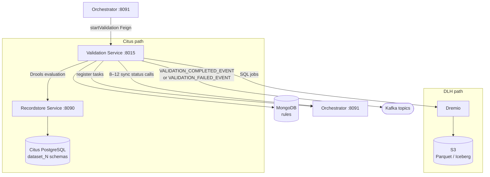

# Validation Service (:8015)

## Overview

The Validation Service is the quality control engine for Reportnet3. Its job is to take a set of rules defined by a dataflow designer and evaluate them against a dataset's data, producing a structured list of failures that reporters and reviewers can inspect and act on. It has no knowledge of what the data means — that belongs to the dataflow configuration — but it is deeply aware of *how* to evaluate rules, how to store and retrieve results efficiently, and how to coordinate that work across large datasets.

The service runs two fundamentally different execution paths depending on how the dataset's data is stored. For standard datasets backed by PostgreSQL it compiles rules into a Drools rule engine and evaluates them in memory against fetched records. For big-data datasets backed by S3 and Dremio it translates rules into SQL or parameterised function calls that execute directly against the data lake. Both paths produce the same output: structured validation results that the Dataset Service and the UI can query and display.

The Validation Service does not own dataset data and it does not make decisions about what happens after validation finishes. It executes rules, records results, and signals completion. What the system does with those results — whether a dataset can be released, whether a reporter is notified — is the responsibility of the Orchestrator and downstream consumers.

## Flow overview



---

## Domain model

### Rule storage — MongoDB

Rules are the central artefact the Validation Service works with. They live in MongoDB, not PostgreSQL, because they are schema documents with variable structure rather than relational records. Each dataset schema has a `RulesSchema` document that contains its full list of rules.

A `Rule` document captures everything needed to evaluate a single quality check:

- **Identity**: `ruleId` (MongoDB ObjectId), `shortCode` (the human-readable QC code shown in the UI, e.g. `FT-001`), `ruleName`, `description`.
- **Scope**: `type` (EntityTypeEnum) — whether the rule fires at the `FIELD`, `RECORD`, `TABLE`, or `DATASET` level.
- **Condition**: `whenCondition` — the expression, method name, or SQL fragment that defines when the rule fails. For Drools-evaluated rules this is a Java-like boolean expression. For data lake rules it is a method name (e.g. `isfieldFK`) or SQL text.
- **Outcome**: `thenCondition` — a two-element list containing the error message and the severity level (`ERROR`, `WARNING`, or `INFO`).
- **Flags**: `enabled` (whether the rule is active), `verified` (whether the rule has passed SQL syntax checks), `automatic` (whether the rule was generated by the system rather than written by a designer).
- **Links**: `referenceId` (the field or table schema element this rule applies to), `uniqueConstraintId`, `integrityConstraintId` (for constraint-type rules that reference a separately stored constraint definition).
- **SQL specifics**: `sqlSentence` (the SQL body for table-level SQL rules), `sqlCost` (the query plan cost estimate, used to order expensive rules), `sqlError` (custom error message for SQL failures).
- **Expression specifics**: `expressionText` (the parsed representation of a record-level expression rule).

Alongside the rules collection, MongoDB also holds `UniqueConstraint` and `IntegritySchema` documents. These describe multi-field uniqueness constraints and cross-table referential integrity relationships. Rules that enforce these constraints hold a reference to these documents rather than duplicating the constraint definition inline.

Rule changes are audited. Every modification to a rule writes an `Audit` entry and a `RuleHistoricInfo` record, giving a full change history.

### Validation results — PostgreSQL

When rules fire and failures are found, the results are written to PostgreSQL in four separate tables corresponding to the four validation scopes. `FieldValidation` records which field in which record triggered which rule. `RecordValidation` records record-level failures. `TableValidation` records table-level failures. `DatasetValidation` records dataset-level failures. Each carries the rule ID, the error message, the severity level, and the short code.

For big-data datasets, validation results are written to S3 as Parquet files instead of PostgreSQL. The `_validate` folder structure in S3 is described in [dremio_s3.md](dremio_s3.md).

### Task tracking — PostgreSQL metabase

The Validation Service breaks each validation run into discrete tasks and tracks them individually in a `task` table in the metabase database. Each task represents a batch of work — a batch of field validations, a batch of record validations, or the execution of a single SQL rule. Tasks have a status (`IN_QUEUE`, `IN_PROGRESS`, `FINISHED`, `ERROR`, `CANCELED`) and a type (`FIELD_VALIDATION`, `RECORD_VALIDATION`, `TABLE_VALIDATION`, `DATASET_VALIDATION`, `SQL_VALIDATION`). The Orchestrator polls these tasks to determine whether a validation job has completed.

---

## Rule types

Rules fall into two broad categories: automatic rules that the system generates when a schema is designed, and custom rules that a dataflow designer writes manually.

### Automatic rules

Automatic rules are created by the system whenever a schema element is added or changed. They cannot be deleted by users, though their severity level can be adjusted. There are seven automatic rule types:

| Type | Short code | What it checks |
|---|---|---|
| `FIELD_TYPE` | FT | Value matches the declared data type for the field |
| `FIELD_SQL_TYPE` | FT | Type check implemented as a Dremio SQL function for data lake datasets |
| `FIELD_CARDINALITY` | FC | Required fields are not blank |
| `TABLE_COMPLETNESS` | TO | Table is not empty (at least one row exists) |
| `FIELD_LINK` | TC | Foreign key: field value exists in the referenced primary key column |
| `TABLE_UNIQUENESS` | TU | Unique constraint: the declared field combination has no duplicate values |
| `MANDATORY_TABLE` | TB | Table marked as mandatory must contain data |

The `FIELD_TYPE` rules depend on the declared data type of the field. The following types are supported: `BOOLEAN`, `TEXT`, `NUMBER_INTEGER`, `NUMBER_DECIMAL`, `DATE` (yyyy-MM-dd), `DATETIME`, `URL`, `EMAIL`, `PHONE`, `CODELIST`, `MULTISELECT_CODELIST`, `POINT`, `POLYGON`, `LINESTRING`, `MULTIPOLYGON`, `GEOJSON`. Text fields have no type rule because any string value is valid.

### Custom rules

Custom rules are written by dataflow designers in the Rules management UI. They can target any scope level:

**Field-level rules** apply to a single field on each record. The `whenCondition` is a boolean expression that references the field value. When the condition evaluates to false, the record's field is flagged.

**Record-level rules** apply to a whole record and can express relationships between fields. They are built from operators: `recordIfThen` (if field A has a value then field B must also have a value), `recordAnd`, `recordOr`, `fieldAnd`, `fieldOr`. These operators are stored as a tree structure in `expressionText` and evaluated at runtime.

**Table-level SQL rules** are the most powerful custom rules. A designer writes a SQL `SELECT` statement whose result set contains the `record_id` values of failing rows. The rule fires against the entire table. There is a built-in protection layer: the SQL is validated before saving to prevent injection — the keywords `DELETE`, `INSERT`, `DROP`, `UPDATE`, and `TRUNCATE` are forbidden, as are SQL comments, and the query must not reference tables outside the authorised dataset schemas.

SQL expressions can include the placeholder ``, which is substituted at validation time with the data provider's country code. This allows a single shared SQL rule to express country-specific conditions without branching logic.

**Dataset-level rules** apply across the whole dataset and are typically used for cross-table checks.

---

## How validation works — PostgreSQL path

When a dataset is backed by PostgreSQL, validation uses the Drools rule engine.

The process begins when the Orchestrator calls `PUT /validation/private/executeValidation/{datasetId}`, passing the dataset ID and a process ID. The `ValidationHelper` takes over from here as the internal coordinator.

`ValidationHelper` first loads the dataset's schema from MongoDB to understand its tables and fields. It then calls `KieBaseManager.reloadRules()`, which reads all enabled and verified rules for the schema from MongoDB and compiles them into a Drools `KieBase`. The compilation uses a Velocity template (`templateRules.drl`) that generates one Drools rule per validation rule. Each generated rule has a `when` clause built from the rule's `whenCondition` and a `then` clause that calls `ValidationRuleDrools.fillValidation()` to record the failure.

Validation is then dispatched through Kafka in batches. For each table, the service publishes `COMMAND_VALIDATE_FIELD`, `COMMAND_VALIDATE_RECORD`, `COMMAND_VALIDATE_TABLE`, and `COMMAND_VALIDATE_DATASET` messages to the command topic. Each message is handled by a dedicated command class that fetches a batch of records from PostgreSQL, inserts them into a Drools `KieSession`, fires the rules, and writes any failures to the validation tables.

The batch sizes are configurable: `validation.fieldBatchSize` controls how many records are processed per field validation batch, and `validation.recordBatchSize` controls the record batch size. A configurable thread pool (`validation.tasks.parallelism`) limits how many batches run concurrently.

SQL rules execute separately. They run as raw SQL queries against the PostgreSQL dataset schema, and the result set of each query gives the `record_id` values that failed. These run at the table validation stage.

When all tasks for all tables complete, the process is marked `FINISHED` and a `VALIDATION_FINISHED_EVENT` is published to Kafka, which the Orchestrator and Communication Service pick up to close the job and notify the user.

---

## How validation works — data lake path

For big-data datasets stored in S3 and queried via Dremio, the execution path is different in mechanics but produces equivalent results.

The trigger is the same — the Orchestrator calls the validation endpoint — but `ValidationHelper` detects from the dataflow metadata that this is a big-data dataflow and routes to `executeValidationDL()`. An `S3PathResolver` is constructed to build the correct Dremio virtual paths for the dataset's tables.

Rules are still loaded from MongoDB, but instead of compiling to Drools, each rule is dispatched as a Kafka command to one of three specialised executors depending on its type.

**`DremioSqlRulesExecuteServiceImpl`** handles SQL rules and constraint rules. For SQL rules it wraps the designer's query in a `SELECT record_id FROM (...)` and submits it to Dremio via the REST API as an asynchronous job. It polls until the job completes, retrieves the failing `record_id` values, and writes the results as a Parquet file into the `validation/` folder in S3. Foreign key checks (`isfieldFK`) and unique constraint checks (`isUniqueConstraint`) are also handled here — they are translated into specific SQL JOIN or GROUP BY patterns and executed the same way.

**`DremioNonSqlRulesExecuteServiceImpl`** handles field-level type and format checks. Rather than SQL, it queries the field's column from Dremio using JDBC, applies the validation function to each value in Java (codelist membership, geometry validity, EPSG/SRID checks, multiselect codelist), and writes failing `record_id` values to S3 as Parquet.

**`DremioExpressionRulesExecuteServiceImpl`** handles record-level expression rules. It fetches records from Dremio, evaluates the `recordIfThen`, `fieldAnd`, `fieldOr` and similar operators in Java, and writes failures to S3.

All three executors write to the same Parquet schema — `pk`, `record_id`, `validation_level`, `validation_area`, `message`, `table_name`, `field_name`, `qc_code`, `id_rule` — so the results loading layer is the same regardless of which executor produced them.

Results are retrieved by `LoadValidationsHelperDL`, which queries the `_validate` Parquet files from S3 via Dremio SQL, groups failures by QC code, and applies whatever filters and pagination the UI has requested.

---

## How rules are managed

The Validation Service also provides the full rule lifecycle API used by the dataflow design UI.

When a designer adds a field to a schema, the Dataset Service calls `PUT /rules/private/createAutomaticRule` and the Validation Service generates the appropriate automatic rules (`FIELD_TYPE`, `FIELD_CARDINALITY`) for that field's declared data type. If the field is declared as a foreign key, a `FIELD_LINK` rule is also generated, referencing the target primary key. If a unique constraint is defined on a set of fields, a `TABLE_UNIQUENESS` rule is created.

Custom rules are created via `PUT /rules/createNewRule`. SQL rules go through a validation step before they can be activated: `POST /rules/validateSqlRule` checks the SQL for forbidden keywords, tests it against Dremio with an `EXPLAIN PLAN` to get a cost estimate (stored as `sqlCost`), and marks the rule as `verified` once it passes. Unverified rules do not execute during validation runs.

A designer can test a SQL rule interactively via `POST /rules/runSqlRule`, which executes the rule with a limit of 100 rows and returns sample results immediately. `POST /rules/evaluateSqlRule` returns the query cost without running the full query.

Rules can be exported and imported as CSV via `POST /rules/exportQC/{datasetId}` and `POST /rules/importRulesSchema`, which is useful when setting up a new dataflow based on an existing one. The `POST /rules/private/copyRulesSchema` endpoint performs an in-system copy of an entire rule schema between datasets.

---

## Relationships with other services

The Validation Service is one of the most connected services in the system because validation touches every other domain.

The **Orchestrator** triggers validation runs and monitors task completion. It calls `PUT /validation/private/executeValidation/{datasetId}` and polls `/private/findTasksByProcessId` and `/private/findTasksCountByProcessIdAndStatusIn` to track progress. The Validation Service publishes `VALIDATION_FINISHED_EVENT` to Kafka when a run completes, which the Orchestrator uses to close the job.

The **Dataset Service** is called to check whether a dataset is in Iceberg format (which is incompatible with automated validation), and to retrieve editing status and schema metadata.

The **Dataset Schema Service** (part of the Dataset Service) provides the schema definitions — field types, table names, codelist values, unique constraints — that the Validation Service uses to build its rules and evaluate them.

The **Dataflow Service** is consulted to determine whether a dataflow is big-data, which determines which execution path to take.

The **Recordstore Service** is called during PostgreSQL-path validation to fetch records in batches. For big-data datasets, Dremio takes this role directly.

The **Process/Recordstore Service** receives process and task status updates throughout the validation run, so the Orchestrator's monitoring calls have accurate state to read.

The **User Management Service** and **Notification Controller** are called at the end of a run to send the user a completion notification.

The **Redis Lock Controller** is used to hold a lock on the dataset during validation, preventing a concurrent release from starting while validation is in progress.

---

## Validation process flows

### Standard validation run (PostgreSQL)

```
Orchestrator calls PUT /validation/private/executeValidation/{datasetId}
  → ValidationHelper loads schema from MongoDB
  → KieBaseManager compiles active rules into Drools KieBase
  → Process created in Recordstore, tasks queued
  → For each table:
      → COMMAND_VALIDATE_FIELD published to Kafka (batched)
          → Drools KieSession fires field-level rules on each batch
          → Failures written to field_validation in PostgreSQL
      → COMMAND_VALIDATE_RECORD published to Kafka (batched)
          → Drools KieSession fires record-level expression rules
          → Failures written to record_validation
      → COMMAND_VALIDATE_TABLE published to Kafka
          → SQL rules execute against PostgreSQL schema
          → isfieldFK / isUniqueConstraint run against data
          → Failures written to table_validation
      → COMMAND_VALIDATE_DATASET published to Kafka
          → Dataset-scope rules fire
  → All tasks FINISHED → Process marked FINISHED
  → VALIDATION_FINISHED_EVENT published to Kafka
  → Orchestrator closes job, user notified
```

### Data lake validation run (Dremio)

```
Orchestrator calls PUT /validation/private/executeValidation/{datasetId}
  → ValidationHelper detects big-data dataflow
  → S3PathResolver built for dataset's Dremio paths
  → Rules loaded from MongoDB
  → For each rule:
      → SQL rules      → DremioSqlRulesExecuteServiceImpl
                          → SQL submitted to Dremio REST API
                          → Job polled to completion
                          → Failing record_ids written to S3 _validate/ as Parquet
      → Field rules    → DremioNonSqlRulesExecuteServiceImpl
                          → Column data fetched via Dremio JDBC
                          → Validation function applied in Java
                          → Failures written to S3 as Parquet
      → Expression     → DremioExpressionRulesExecuteServiceImpl
        rules             → Records fetched via Dremio JDBC
                          → Expression tree evaluated in Java
                          → Failures written to S3 as Parquet
  → All tasks FINISHED → Process marked FINISHED
  → VALIDATION_FINISHED_EVENT published to Kafka
```

### Results retrieval

When the UI requests validation results, the flow depends on the storage path:

For PostgreSQL datasets, `LoadValidationsHelper` queries the `FieldValidation`, `RecordValidation`, `TableValidation`, and `DatasetValidation` tables with the requested filters (error level, entity type, table name, field value, QC code) and returns a paginated, sorted result set.

For data lake datasets, `LoadValidationsHelperDL` queries the `_validate` Parquet files in S3 via Dremio SQL. It groups results by QC code to produce the summary view, and can filter and sort across the full validation result set using Dremio's SQL engine.

---

## Operational characteristics

In production, a validation run against a non-trivial dataset takes 5–10 minutes. The Validation Service is the heaviest consumer of compute in the system — it consistently uses more CPU and memory than the Dataset Service during active runs.

The PostgreSQL path has a known N+1 query problem: schema definitions (field types, codelist values, table structure) are fetched per-schema from MongoDB rather than in bulk, and Metabase lookups are done individually per schema element. For datasets with many tables or complex rule sets, this produces hundreds of small queries where a few bulk queries would suffice.

The Drools rule engine (PostgreSQL path) is being phased out. The stated replacement direction is native Java evaluation for type and expression rules, which is what the data lake path already does. The transition is incremental; Drools remains active for all existing Citus-backed dataflows.

**Canceled validation tasks.** Individual validation tasks can be canceled without failing the overall job. When this happens, the affected rules are not evaluated and their results are absent from the error report. The three documented causes are: data incompatibility (the dataset contains values the SQL rule cannot process), rule complexity (the rule expression is too expensive to evaluate), and missing reference data (a codelist or cross-dataset reference the rule depends on is absent). Canceled tasks are surfaced in the job monitoring UI. Critically, if any canceled task has severity `BLOCKER`, the release step will be blocked — the release cannot proceed until the underlying issue is resolved and validation is re-run successfully.

---

## Configuration

| Property | Purpose |
|---|---|
| `validation.fieldBatchSize` | Records per batch in field validation (PostgreSQL path) |
| `validation.recordBatchSize` | Records per batch in record validation (PostgreSQL path) |
| `validation.tasks.parallelism` | Max concurrent validation tasks in the thread pool |
| `validation.priority.days` | Age thresholds (space-separated days) used to assign priority to validation jobs |
| `validation.maximumErrors` | Maximum number of errors stored per rule before results are truncated; typically configured at 1,000 |
| `validation.split.parquet` | Whether to split large validation result Parquet files |
| `exportDataDelimiter` | Delimiter for CSV validation export (default `,`) |
| `validationExportPathFile` | Local filesystem path for CSV export staging |
| `dremio.jobPolling.numberOfRetries` | How many times to poll a Dremio SQL job before giving up |
