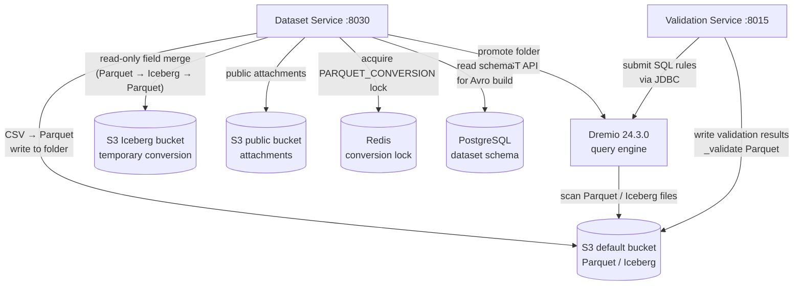

# Dremio and S3 — Data Lake Storage

## Overview

The data lake is the primary storage layer for all actual dataset content in Reportnet3. Every dataset submitted by a data provider — every field value, every row, every attachment — lives here as files in S3-compatible object storage. PostgreSQL holds the metadata about datasets (schemas, rules, ownership, status), but the data itself is in S3.

Dremio sits on top of S3 and acts as the query engine. It scans the S3 folder hierarchy and exposes each table folder as a virtual dataset, which the Dataset Service and Validation Service then query using standard SQL over JDBC or Dremio's REST API. This means application code can run SQL against reporter-submitted data without pulling raw files into memory, and validation rules written as SQL expressions execute directly against the data lake.

This is not a traditional data warehouse. The storage model is file-based: new data arrives as Parquet files dropped into the right S3 folder, Dremio notices them (via a process called promotion), and from that point the data is queryable. Deleting or replacing data means replacing the files in the folder and refreshing Dremio's metadata.

## Flow overview



---

## S3 Buckets

There are three S3 buckets in the system.

The **default (private) bucket** holds all live dataset data: Parquet files for every table in every dataset, validation result files, import staging files, attachments, snapshots, and exports. This is the main operational store and the one Dremio queries.

The **Iceberg bucket** is a temporary workspace used only during a specific operation: when a dataset has read-only fields and a reporter imports data with the "replace" option. Because replacing all data would overwrite those protected fields, the system temporarily converts the Parquet table to an Iceberg table in this bucket, performs a selective merge (new editable data combined with the preserved read-only field values), and converts back to Parquet before the result is released. Once the conversion cycle is complete this bucket holds no permanent data.

The **public bucket** stores files uploaded through the front end — file attachments associated with dataset fields — that need to be accessible without authentication for download purposes.

---

## S3 Folder Structure

Every folder path in S3 is built from a combination of IDs that reflect the Reportnet3 domain hierarchy. IDs are zero-padded to seven characters and prefixed to indicate their type:

```
df-0000001    dataflow
dp-0000042    data provider
ds-0000999    dataset
dc-0000005    data collection
eu-0000003    EU dataset
snap-0000012  snapshot
```

The complete folder hierarchy varies by dataset type. The structure for each type is described below using concrete examples.

### Reporting and design datasets

These are the core operational datasets submitted by data providers.

```
df-0000001/
└── dp-0000042/
    └── ds-0000999/
        ├── current/
        │   ├── tableName/               ← live data (Parquet files)
        │   ├── tableName_validate/      ← validation results (Parquet files)
        │   ├── import/
        │   │   └── tableName/           ← CSV files staged before conversion
        │   ├── provider_import/         ← raw file submitted by provider
        │   ├── exported/
        │   │   └── tableName/           ← prefilled data exported for download
        │   ├── attachments/
        │   │   └── tableName/
        │   │       └── providerCode/    ← file attachments per provider
        │   └── validation/
        │       └── ruleId/              ← per-rule validation output (Parquet)
        └── snapshots/
            └── snap-0000012/
                ├── tableName/           ← snapshot data (Parquet files)
                └── validation/          ← snapshot validation results
```

### Data collections

Data collections aggregate reporting data from multiple providers. Their tables live under a `collections/` prefix rather than a provider/dataset path, because at collection level the data is merged across all providers.

```
df-0000001/
└── collections/
    └── dc-0000005/
        └── current/
            ├── tableName/               ← merged collection data (Parquet)
            ├── tableName_validate/      ← validation results
            ├── attachments/
            │   └── tableName/
            │       └── providerCode/
            ├── validation/
            └── export/                  ← exported collection files
```

### EU datasets

EU datasets are the official consolidated datasets derived from data collections. They follow the same `collections/` prefix but without a `current/` subdirectory — the table folders sit directly under the EU dataset identifier.

```
df-0000001/
└── collections/
    └── eu-0000003/
        ├── tableName/                   ← EU dataset data (Parquet)
        ├── tableName_validate/          ← validation results
        └── attachments/
```

### Reference datasets

Reference datasets contain controlled vocabularies and lookup values that validation rules reference. They are stored under a `reference/` prefix directly beneath the dataflow, because reference data belongs to the dataflow rather than to any particular provider.

```
df-0000001/
└── reference/
    └── tableName/                       ← reference data (Parquet)
```

### Preparation datasets

Preparation is a special mode where a dataset is worked on in an isolated workspace before being promoted to the live `current/` path. The preparation code acts as a workspace identifier, allowing multiple preparation copies to coexist.

```
df-0000001/
└── dp-0000042/
    └── ds-0000999/
        └── preparation/
            └── {preparationCode}/
                ├── tableName/
                ├── tableName_validate/
                ├── import/
                │   └── tableName/
                ├── provider_import/
                ├── attachments/
                │   └── tableName/
                └── validation/
```

---

## Parquet Files — Data Tables

Every table in a dataset is stored as one or more Parquet files in its named folder. The files are produced by the CSV-to-Parquet conversion pipeline when a data provider imports data. Large files are split at a configurable line count (controlled by `dremio.parquetConverter.custom.maxCsvLinesPerFile`) so that individual Parquet files stay at a manageable size.

Each Parquet file contains the dataset's schema-defined fields — whatever columns the dataflow designer configured for that table — plus two system columns that are added automatically during import:

| System column | Purpose |
|---|---|
| `record_id` | A UUID assigned to each row at import time. Used as the stable identifier for all downstream operations — validation results reference it, queries filter by it, and the UI uses it to navigate to specific records. |
| `data_provider_code` | The code of the data provider who submitted this row. At collection level this allows rows from different providers to coexist in the same table while remaining distinguishable. |

The schema-defined field columns hold the actual reported values as strings. Reportnet3 does not enforce column types at the Parquet level — all values are stored as strings and type validation is performed by the Validation Service at query time using Dremio SQL casts.

The actual content of these fields — the environmental data submitted by EU member states — is not visible in application code. The code defines the infrastructure for reading and writing files, but the data itself is whatever reporters upload. A typical dataset might contain hundreds of thousands of rows across multiple tables, with columns representing anything from air quality measurements to waste management statistics.

---

## Parquet Files — Validation Results

Each data table has a corresponding validation table stored in the `tableName_validate/` folder. Validation results are written here by the Validation Service after rules execute, and the Dataset Service reads them to display errors in the UI.

The validation Parquet schema is fixed across all datasets:

| Column | What it holds |
|---|---|
| `record_id` | The record that failed validation — matches `record_id` in the data table |
| `id_rule` | The identifier of the validation rule that triggered |
| `validation_level` | Severity: `ERROR`, `WARNING`, or `INFO` |
| `validation_area` | Scope: `FIELD`, `RECORD`, or `TABLE` |
| `table_name` | Which table the failure belongs to |
| `field_name` | Which field failed (null for table-level rules) |
| `message` | Human-readable description of the failure |
| `qc_code` | The short quality code identifier shown in the UI |
| `pk` | The primary key value used to group related failures |

There is also a `validation/` subfolder that holds per-rule output from individual validation executions, organised by rule ID.

---

## Editing patterns

Data in the lake is immutable once written as Parquet. Three patterns exist for modifying data, each suited to a different scope of change.

**Delete and re-import.** For bulk corrections, the data provider deletes the existing content and imports a replacement file. The delete removes the existing Parquet files from S3, and the import pipeline writes a fresh set. This is the simplest and most reliable path; it imposes no constraints on what was changed.

**Spot editing via Iceberg conversion.** For single-record changes through the UI, the system converts the relevant Parquet table to an Iceberg table (which supports row-level updates), applies the change, then converts back to Parquet. This round-trip — Parquet → Iceberg → Parquet — is slow for large tables and is intended only for isolated corrections.

**Webform editing via Citus and Iceberg.** Webforms are a specialised UI mode where fields from several tables are bundled into a single form. Edits are applied as atomic per-field updates. The backing store for webform editing is a combination of the Citus PostgreSQL cluster (for transaction isolation) and Iceberg (for persisting per-field changes to the lake). High concurrency on webforms — multiple users editing the same form simultaneously — can cause many small updates and creates a risk of data loss if concurrent sessions collide.

Locks are used during all editing operations, but locks are not always released correctly if a user closes their browser mid-session. Unreleased locks can block subsequent imports or edits until an operator manually clears them.

---

## Iceberg Tables

Iceberg tables appear only as an intermediate format during one specific operation. When a reporting dataset has fields marked as read-only and a data provider imports new data with "replace" mode, the system must preserve the values in those protected fields while replacing everything else. Parquet files are immutable once written, so a direct in-place merge is not possible.

The solution is a three-step conversion: the live Parquet table is converted to an Iceberg table in the Iceberg bucket (which supports row-level updates), the selective merge is performed — new editable field values written, read-only field values copied from the original — and the Iceberg table is then converted back to Parquet in the default bucket. Once this cycle completes, the Iceberg table is discarded.

A Redis lock (`LockEnum.PARQUET_CONVERSION`) is held throughout this process. The Dremio auto-promotion service checks for this lock before promoting a table, preventing Dremio from seeing a partially-written table during conversion.

---

## How Dremio Exposes the S3 Data

Dremio scans the S3 bucket and builds a folder tree matching the S3 hierarchy. By default a folder is just a container — Dremio knows it exists but cannot query it. To make a folder queryable it must be *promoted* to a Dremio dataset. Promotion tells Dremio what format the files are in (Parquet or CSV) and registers the folder as a virtual table.

The `DremioHelperService` handles all promotion operations. When a new Parquet table lands in S3, `DremioAutoPromotionService` checks whether the folder is already promoted and, if not, calls `promoteFolderOrFile()`. Before doing so it verifies that no conflicting jobs (import, delete, validation, ETL import) are active for that dataset and that no Iceberg conversion lock is held — promoting a folder mid-write would expose corrupt data.

Dremio refers to virtual datasets using dot-notation paths that mirror the S3 folder hierarchy. The same structure that exists as nested folders in S3 is navigated as a dot-separated identifier in SQL:

```
S3 path:      df-0000001/dp-0000042/ds-0000999/current/tableName/
Dremio path:  ."df-0000001"."dp-0000042"."ds-0000999"."current"."tableName"
```

Reference dataset:
```
S3 path:      df-0000001/reference/tableName/
Dremio path:  ."df-0000001"."reference"."tableName"
```

Data collection table:
```
S3 path:      df-0000001/collections/dc-0000005/current/tableName/
Dremio path:  ."df-0000001"."collections"."dc-0000005"."current"."tableName"
```

---

## How Validation Queries Use Dremio

The Validation Service executes three kinds of rules against data lake tables.

**SQL rules** are validation expressions written directly as SQL by the dataflow designer. The service wraps each expression in a query that returns the `record_id` values of failing rows:

```sql
SELECT record_id FROM (<designer-supplied SQL>)
```

The list of returned `record_id` values is then written into the validation result Parquet file for the affected table.

**Foreign key rules** check that values in one table's field exist as primary key values in another table. The query joins the FK table against the PK table and returns any FK rows with no matching PK:

```sql
SELECT fk.record_id
FROM ."df-X"."dp-X"."ds-X"."current"."fkTable" fk
WHERE fk.foreignKeyField IS NOT NULL
  AND fk.foreignKeyField NOT IN (
    SELECT pk.primaryKeyField
    FROM ."df-X"."reference"."pkTable" pk
  )
```

When the FK field can hold multiple semicolon-separated values (a common pattern in environmental reporting), the query is expanded to split and test each value individually.

**Unique constraint rules** identify duplicate values within a field:

```sql
WITH duplicates AS (
  SELECT fieldName FROM ."df-X"."dp-X"."ds-X"."current"."tableName"
  GROUP BY fieldName HAVING count(*) > 1
)
SELECT t.record_id
FROM ."df-X"."dp-X"."ds-X"."current"."tableName" t
WHERE t.fieldName IN (SELECT fieldName FROM duplicates)
```

Once all validation rules have executed, the aggregated results are queried from the `_validate` table to produce the summary statistics shown in the UI — grouped by rule, table, field, and quality code, with a count of affected records per group.

---

## Data Import Pipeline

When a data provider submits a file, it lands first as a CSV in the `import/tableName/` staging folder in S3. The Dataset Service then runs the CSV-to-Parquet conversion pipeline:

1. The CSV is read with charset auto-detection to handle files from different national systems.
2. Two columns are added to every row: a generated UUID for `record_id` and the provider's code for `data_provider_code`.
3. An Avro schema is built from the dataset table definition held in PostgreSQL.
4. The rows are written to Parquet using the Avro schema. If the file exceeds the configured line threshold it is split into multiple Parquet files.
5. The resulting Parquet files are uploaded to the `tableName/` data folder in S3.
6. Dremio's metadata for that folder is refreshed so the new records become queryable immediately.

Spatial fields (geometry stored as GeoJSON or WKB) are handled separately during this pipeline, as they require additional encoding steps before being written to Parquet.

Dremio's standard SQL function set is extended with custom geospatial user-defined functions based on PostGIS, deployed via the `dremio-udf-gis` library. These functions are available to validation SQL rules and query expressions, giving designers the same geospatial vocabulary they would have in PostgreSQL. The `ST_SRID()` function is one Reportnet-specific addition — it returns the spatial reference identifier for geometry objects. Only SELECT-level functions are exposed; DDL operations (CREATE TABLE, CREATE VIEW) are not permitted in validation SQL.

---

## Infrastructure topology

Dremio and S3 run in separate Kubernetes clusters and communicate over a shared virtual network. The plan is to move them into the same cluster under different namespaces, though this is contested — Dremio's resource appetite means isolation is operationally safer. Dremio 24.3.0 is the version currently deployed. S3 is provided by a NetApp module in the EEA infrastructure (not AWS S3, though the API is compatible).

Dremio is optimised for querying large datasets, particularly analytics over many records. Measured against production-scale Reportnet3 datasets, Dremio delivers approximately 10x faster read times compared to equivalent Citus queries. Citus is preferred when data must be edited interactively (small updates, webforms). The practical split is: use Dremio for import/export and validation queries on big-data dataflows; use Citus for any flow that requires in-place editing at the record level.

---

## Known operational gaps

The `DremioConfiguration` bean uses `DriverManagerDataSource`, which creates a new JDBC connection for each query rather than pooling connections. Each Dremio query therefore incurs a full TCP connection handshake and authentication round-trip before any SQL executes. Under heavy validation or import load this adds measurable latency per query. The fix is to replace `DriverManagerDataSource` with a connection-pool-backed `DataSource` (e.g. HikariCP).

---

## Configuration Reference

| Consul KV key | Purpose |
|---|---|
| `amazon.s3.endpoint` | S3-compatible endpoint (MinIO or AWS) |
| `amazon.s3.accessKey` / `secretKey` | Private bucket credentials |
| `s3.default.bucket.name` / `.path` | Default bucket name and S3 root path |
| `s3.iceberg.bucket.name` / `.path` | Iceberg bucket name and path |
| `s3.default.public.bucket.name` / `.path` | Public bucket for attachments |
| `dremio.url` | Dremio JDBC connection URL |
| `dremio.username` / `.password` | Dremio credentials |
| `dremio.jobPolling.numberOfRetries` | How many times to poll before giving up on a Dremio SQL job |
| `dremio.promote.numberOfRetries` | Retry attempts for folder promotion |
| `dremio.parquetConverter.custom` | Enable the custom CSV-to-Parquet converter |
| `dremio.parquetConverter.custom.maxCsvLinesPerFile` | Row threshold for splitting large CSV imports |
