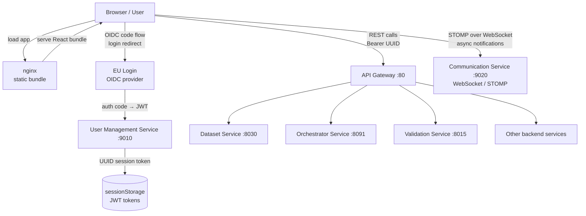

# Browser / React SPA (frontend-service)

The frontend-service is a single-page application that serves as the sole user interface for the Reportnet 3 platform. It provides every screen a reporter, custodian, or administrator ever sees — from browsing public dataflows without logging in, through designing dataset schemas and managing quality-control rules, to monitoring import and validation jobs in real time. The SPA does not contain any business logic beyond presentation and form handling; all decisions about data validity, workflow status, and access control live in the backend microservices.

## Flow overview



---

## Tech stack

The application is built with React 16 and bootstrapped via Create React App (`react-scripts`). It uses React Router v6 for client-side routing, Recoil for a small amount of atom-based global state, and React Query for server-state caching. The PrimeReact 4 component library provides the base data-table, calendar, dropdown, and tab components, which the application wraps with its own thin adapters. Font Awesome icons are used throughout via `@fortawesome/react-fontawesome`. Geographic visualisation uses Leaflet with ESRI plugins and proj4 for coordinate projection. Dashboards use Chart.js 2. Dates and times are handled by Day.js with the UTC and timezone plugins. The application is styled with CSS Modules and SCSS. At runtime it is served as a static bundle by nginx, with SPA routing handled by `try_files $uri /index.html`.

---

## Domain model

The `src/entities/` directory holds plain JavaScript classes that mirror the server-side domain objects. They are instantiated by the Service layer after each API call to give the rest of the application consistent, typed objects.

| Entity | What it represents |
|---|---|
| `User` | Authenticated user — holds JWT roles, context roles, name, email, and token expiry time |
| `Dataflow` | A reporting campaign. Carries status, type, datasets, representatives, obligations, and release configuration |
| `Dataset` | A reporter's submission for one schema within a dataflow |
| `DataCollection` | The custodian-side aggregated view of all reporters' data for one schema |
| `EUDataset` | A further aggregated EU-level dataset derived from a data collection |
| `ReferenceDataflow` | A special dataflow that holds shared lookup tables consumed by other dataflows |
| `DatasetTable` / `DatasetTableField` / `DatasetTableRecord` | The schema and data model for a dataset |
| `Validation` | A quality-control rule (QC rule) — has a type (field, row, table, dataset), level (warning, error, blocker), SQL expression, and metadata |
| `Snapshot` | A point-in-time copy of a dataset used for releases and rollbacks |
| `Representative` | A data-provider assigned to a dataflow (country, company, or organisation depending on dataflow type) |
| `Obligation` | A reference to a reporting obligation in the ROD (Reporting Obligations Database) |
| `Feedback` | A message thread between reporter and custodian within a dataflow |
| `SystemNotification` | A platform-wide banner notice managed by admins |
| `Integration` | An FME or external-system integration attached to a dataset schema |
| `UniqueConstraint` | A uniqueness rule spanning one or more fields in a table schema |

---

## How it works

### Bootstrapping and providers

`App.js` is the root component. It wraps the entire application in a stack of React context providers, from outermost to innermost:

```
QueryClientProvider         — React Query cache
  RecoilRoot                — Recoil atoms
    ResourcesProvider       — i18n message strings and user presets
      NotificationProvider  — notification queue state
        UserProvider        — authenticated user state
          ThemeProvider     — light/dark theme and header collapse
            ValidationProvider — QC-rule modal state
              LeftSideBarProvider — sidebar button models and joyride steps
                LoadingProvider   — global loading overlay
                  BreadCrumbProvider — breadcrumb trail
                    ActionsProvider    — cross-component action callbacks
```

Each provider is backed by a `useReducer` and exposes a context value that combines the current state with action functions. Views import the context they need via `useContext`; there is no central Redux store.

`ResourcesProvider` loads `messages.en.json` (all UI labels) and `userPresets.json` at startup and makes them available globally through `ResourcesContext`. All user-visible text is looked up from this object by key rather than hardcoded in components.

`UserProvider` manages the authenticated user. On login it calls `SystemNotificationService.all()` to load any active system banners. On logout it clears all notifications and resets user state to the default (unauthenticated) values. User preferences such as timezone, date format, rows-per-page, and visual theme are stored on this context and kept in session storage.

`ThemeProvider` switches between light and dark themes by setting CSS custom properties on `document.body` and toggling a `.light` or `.dark` class. The colour values come from `theme.config.json`.

### Authentication

The application supports two login paths. The normal path is EU Login (OIDC code flow). When a user clicks "EU Login" on the public frontpage, the browser is redirected to the EU Login service. After consent, EU Login redirects back to `/eulogin` with an auth code in the URL hash. The `EULogin` component reads this code, calls `UserService.login(code)`, receives a JWT access token and refresh token, stores both in `sessionStorage`, and navigates to `/dataflows`. A second path, `ReportnetLogin`, accepts a username and password directly; it exists for development and testing environments.

`interceptors.js` registers two global Axios interceptors. The request interceptor reads the access token from session storage and adds it as a `Bearer` header on every outgoing request. The response interceptor handles 401 errors by attempting a silent token refresh before retrying the original request. If the refresh also fails, it shows a session-expired dialog. 403 responses redirect the browser to `/dataflows/error/notAllowed`.

`UserService` additionally sets a proactive timer (`setRefreshTokenTimeout`) on every successful token acquisition, so the access token is refreshed before it expires rather than waiting for a 401.

### Routing and page structure

`App.js` defines all routes. Public routes (accessible without authentication) are rendered directly. Private routes are wrapped in `PrivateRoute`, which checks whether the user is logged in and redirects to the public frontpage if not.

The main layout shell for authenticated pages is `MainLayout`. It renders a fixed `Header`, a `LeftSideBar`, a `Footer`, an `EuFooter`, a `NotificationsList` panel, and a `SystemNotificationsList` panel. The `Header` contains the EEA logo, breadcrumb trail, and a cookie-consent banner that can collapse. `MainLayout` also calls the `useSocket` hook to establish the WebSocket connection on first render.

### Real-time notifications via WebSocket

`useSocket` (in `MainLayout`) opens a STOMP connection to `window.env.WEBSOCKET_URL`. It attaches the access token in the STOMP connection headers on each connect attempt (so token refreshes are picked up on reconnect). On connect it subscribes to two destinations:

```
/user/queue/notifications       — per-user event notifications
/user/queue/systemnotifications — system-wide notices
```

Every incoming message contains a `type` string and a `content` payload. The message is handed to `NotificationContext.add()`, which looks up the notification schema in `notifications.json` to determine whether the notification should be shown as a toast, stored silently, or used to trigger a UI state change elsewhere. `useCheckNotifications` is a hook used by dataset and dataflow views to watch for specific notification types (for example `IMPORT_REPORTING_COMPLETED_EVENT`) and refresh their data or clear a loading spinner when the event arrives.

### API communication

`HTTPRequester` is a thin wrapper around Axios that reads the backend base URL from `window.env.REACT_APP_BACKEND` and provides `get`, `post`, `update`, `delete`, `download`, `postWithFiles`, and `putWithFiles` methods. Every Repository file imports `HTTPRequester` and composes its URLs using the `getUrl` utility (which substitutes named placeholders such as `{:datasetId}` from a config object). The Repository files contain no logic beyond the HTTP call itself. The Service files import the corresponding Repository and transform the response into entity instances or derived structures.

### Permission checking

Permissions are checked in two ways. Global access roles (such as `ADMIN`) are stored on the user object as `accessRole`. Entity-specific roles (such as `DATAFLOW-123-DATA_CUSTODIAN`) are stored as `contextRoles`, a list of strings. `UserContext.hasPermission(permissions)` checks the global role list. `UserContext.hasContextAccessPermission(entity, entityID, allowedPermissions)` checks whether the user holds any of the allowed permissions for a specific entity instance. Admin users bypass entity-level checks unless the `dataflowCustodian` flag is set.

---

## Views

### Dataflows (`/dataflows`)

The home screen after login. It fetches all dataflows the user can access and organises them into tabs: Reporting, Business, Citizen Science, and Reference. Each list entry is rendered either as a card or as a table row, toggled by a user preference. A filter bar allows searching by name, status, obligation, and other attributes.

Admins see four additional tabs: Control Statuses (overview of all import/validation/release jobs), Jobs Statuses, Validations Statuses, and a management area for national coordinators, webform configurations, and provider organisations.

Custodians and stewards can create new dataflows from this screen. Each dataflow type gets its own creation dialog (`ManageDataflow`, `ManageBusinessDataflow`, `ManageReferenceDataflow`).

### Dataflow (`/dataflow/:dataflowId`)

The workspace for a single dataflow. The view differs significantly depending on the user's role.

Custodians see their design datasets as a grid of "big buttons" — one per dataset schema — plus sections for data collections, EU datasets, test datasets, and reference datasets. From here they can trigger releases, manage lead reporters, configure integrations, generate API keys, and download copies of all submissions.

Reporters see only their own datasets. They navigate from here to the dataset editing view.

The view polls `useCheckNotifications` for completion events from imports, validations, and releases to refresh its state without requiring a manual page reload.

### DatasetDesigner (`/dataflow/:dataflowId/datasetSchema/:datasetId`)

The schema design view, available to custodians. They use it to create tables and fields within a dataset schema, configure field types (text, number, date, URL, attachment, geometry, codelist, link, multi-select codelist), and set field-level constraints. The left sidebar offers tabs for the data view, a QC-rule list, unique constraints, integrations, and webform configuration.

The `TabsDesigner` component inside this view renders a draggable list of tables; within each table, fields are also reorderable by drag. The `Validations` component opens a dedicated QC rule editor with a SQL expression builder. `ValidationContext` manages the open/close state of this editor across the component tree.

### Dataset (`/dataflow/:dataflowId/dataset/:datasetId`)

The reporting dataset view, used by reporters to view and edit their data. It renders `TabsSchema`, which shows one tab per table in the schema. Each tab hosts a `DataViewer` component.

When a dataset is configured with a webform, the view shows a `TabularSwitch` allowing the reporter to toggle between the grid view (`DataViewer`) and the structured form view (`Webforms`).

The view exposes a toolbar with buttons to import data (from CSV, Excel, or via FME integration), export data, run validation, view validation errors (`ShowValidationsList`), manage snapshots, and delete all data.

### DataViewer

`DataViewer` is the most complex shared component in the application. It is used by `Dataset`, `DatasetDesigner`, `DataCollection`, and `EUDataset`. It renders a server-side paginated data grid backed by `DataTable` (a PrimeReact `DataTable` wrapper). Key features:

- Server-side sorting and pagination, with filter parameters sent to the dataset API.
- Inline cell editing for datasets with write permissions. Edits are saved field-by-field on blur.
- Validation error highlighting: rows and cells coloured by the highest severity error level (info, warning, error, blocker).
- A context menu on right-click with row-level actions (edit, delete, add QC rule for this row).
- Attachment fields rendered as download links; geometry fields rendered as a button that opens the `Map` dialog.
- A "paste" mode for bulk insertion of clipboard data.

### DataCollection (`/dataflow/:dataflowId/dataCollection/:datasetId`)

A read-only aggregated view of all reporters' submitted data for one schema. Custodians use it to inspect combined data across all countries (or companies, depending on dataflow type). It reuses `TabsSchema` and `DataViewer`. The toolbar has export and alignment-check actions.

### EUDataset (`/dataflow/:dataflowId/euDataset/:datasetId`)

Similar to DataCollection, but for the EU-level aggregated dataset. It has no editing capability. The toolbar offers export and validation-error review.

### DataflowDashboards (`/dataflow/:dataflowId/dashboards`)

Two dashboards rendered using Chart.js:

- `DatasetValidationDashboard` shows validation error counts per country and per table/field, coloured by error level.
- `ReleasedDatasetsDashboard` shows which reporters have released and the release timestamps.

### DataflowHelp (`/dataflow/:dataflowId/documents`)

A tabbed view with three sections: Documents (file uploads managed by `DocumentService`), Web Links (`WebLinkService`), and Dataset Schemas (downloadable schema definitions). Reporters use this to find supporting documents and links provided by the custodian.

### Feedback (`/dataflow/:dataflowId/feedback/:representativeId`)

A message thread between the reporter and the custodian for a specific dataflow. Messages support file attachments. The left pane shows a list of reporters (for custodians) or is omitted (for reporters). `FeedbackService` backs the message loading, creation, and attachment download.

### ReferenceDataflow (`/referenceDataflow/:referenceDataflowId`)

A simplified workspace for dataflows that contain only reference datasets. It shows the reference dataset list, referencing dataflows (those that import from this reference dataflow), and controls for sharing rights and generating API keys.

### Webforms (`/dataflow/:dataflowId/dataset/:datasetId` — webform mode)

When a dataset schema has a webform configuration attached, the dataset view offers a `Webforms` component as an alternative to the raw data grid. Four webform types exist:

- `TableWebform` — a form view that maps directly to the underlying table structure.
- `PaMsWebform` — a Policies and Measures webform with a specific hierarchical layout for climate policy reporting.
- `QuestionAnswerWebform` — a form structured as a sequence of questions and answers.
- `EntitiesWebform` — a form that groups fields by entity.

The active webform is selected by name in `WebformService`, which loads the configuration and passes it to the chosen component.

The webform components depend on a modified version of Node.js that was customised specifically for Reportnet3. This divergence from the upstream Node.js runtime makes it difficult to update the Node.js version — any upgrade requires validating that the Reportnet3-specific modifications are still compatible, which has caused the frontend to trail significantly behind current Node.js releases.

### Settings (`/settings`)

User preferences: date format, time zone, 12/24h clock, list vs. card view in Dataflows, notification sound, push notifications, logout confirmation, and avatar image (uploaded as base64). Changes are saved to the backend via `UserService.updateConfiguration`.

### Public views (`/public/...`)

`PublicFrontpage`, `PublicDataflows`, `PublicCountries`, `PublicCountryInformation`, and `PublicDataflowInformation` are unauthenticated views. They use `PublicLayout` instead of `MainLayout`. They expose released dataset information, country-by-country reporting status, and downloadable files for dataflows that have `showPublicInfo` enabled.

---

## Relationships with other backend services

The SPA communicates exclusively with the API Gateway. It never calls backend microservices directly. All URLs in `src/repositories/config/` are relative paths that `HTTPRequester` prefixes with `window.env.REACT_APP_BACKEND`.

| Backend surface | How the SPA uses it |
|---|---|
| User Management Service (`/user/...`) | Login, logout, token refresh, user attribute storage and retrieval |
| Dataflow Service (`/dataflow/...`) | CRUD for dataflows and their metadata |
| Dataset Service (`/dataset/...`, `/dataschema/...`, `/datasetmetabase/...`) | All dataset data reading, writing, import, export, schema design, statistics |
| Validation Service (`/rules/...`, `/validation/...`) | Creating, updating, and running QC rules; listing validation errors |
| Orchestrator Service (`/orchestrator/...`) | Triggering import and validation jobs; querying job status |
| Document Container Service (`/document/...`) | Uploading and downloading documents and feedback attachments |
| Rod Service (`/rod/...`) | Looking up reporting obligations |
| Reference Dataflow Service (`/referenceDataflow/...`) | Managing reference dataflows and datasets |
| Integration Service (`/integration/...`) | Configuring FME and external integrations on schemas |
| Snapshot Service (via Dataset/Dataflow services) | Creating, restoring, and listing snapshots |
| System Notification Service (`/systemNotification/...`) | Loading active platform banners on login |
| WebSocket endpoint | Receiving async completion events via STOMP over WebSocket |
| FME Server | The SPA constructs a direct link to FME job summaries using the `routes.FME` URL template |

---

## Key process flows

### Login and session initialisation

```
User clicks "EU Login"
  → browser redirects to EU Login service
  → EU Login redirects to /eulogin?code=...
  → EULogin component calls UserService.login(code)
    → UserRepository.login(code) POST /user/generateTokenByCode
    → receives accessToken, refreshToken, roles, groups
    → UserRepository.getUserInfo() GET /user/getUserByUserId
    → constructs User entity
    → stores tokens in sessionStorage
    → schedules proactive token refresh timer
  → UserContext.onLogin(user) called
    → SystemNotificationService.all() loads banners
    → user state set, rendering unlocks private routes
  → navigate to /dataflows
  → MainLayout mounts, useSocket establishes WebSocket
```

### Import and async completion

```
Reporter clicks "Import" in Dataset view
  → CustomFileUpload sends file to /dataset/v2/importFileData/:datasetId
  → API returns 200 (job accepted)
  → spinner shown, UI waits on notification
  → backend publishes IMPORT_REPORTING_COMPLETED_EVENT to WebSocket
  → useSocket receives message, calls notificationContext.add()
  → NotificationContext dispatches ADD + NEW_NOTIFICATION_ADDED
  → useCheckNotifications in Dataset view fires callback
  → spinner cleared, data table refreshed
```

### Validation rule creation

```
User opens QC rule editor (from QCList or from a cell in DataViewer)
  → ValidationContext.onOpenModal() dispatched
  → isVisible = true
  → Validations / QCList renders modal with rule form
  → user fills in level, type, expression, description
  → ValidationService.create() calls /rules endpoint
  → on success, QCList refreshes its rule list
  → ValidationContext.onCloseModal() dispatched
  → modal closes
```

### Dataset release

```
Custodian clicks "Release" in Dataflow view
  → DataflowService.release() POST /dataflow/:dataflowId/release
  → Orchestrator queues release job
  → Dataflow view shows spinner
  → backend publishes RELEASE_COMPLETED_EVENT
  → useCheckNotifications fires, spinner cleared, dataflow refreshed
  → new HistoricRelease entry appears in DataflowDashboards
```

---

## Configuration and runtime environment

At container start, `generate_config_js.sh` writes a `window.env` object into the static HTML before nginx serves it. This is how runtime configuration reaches the built bundle without requiring a rebuild.

| Variable | Purpose |
|---|---|
| `REACT_APP_BACKEND` | Base URL for all API calls (used by `HTTPRequester`) |
| `WEBSOCKET_URL` | WebSocket endpoint for STOMP connection |
| `EULOGIN_URL` | URL of the EU Login service (used by the public frontpage to construct the login redirect) |
| `REACT_APP_EULOGIN` | Keycloak/EU Login realm URL for token introspection |
| `DOCUMENTATION_FOLDER` | URL prefix for documentation assets served alongside the SPA |

The application also reads a number of values from `src/conf/`:

- `notifications.json` — defines every notification type, its lifetime, and whether it navigates the user on click.
- `permissions.json` — defines role keys and entity prefix strings.
- `dataflowType.json` — per-type label keys that let a single component render the right column header for country code, company code, or organisation code depending on context.
- `fieldType.json` — all supported dataset field types and their display metadata.
- `validation.config.json` — limits and configuration for the QC rule editor.
- `theme.config.json` — CSS custom property values for light and dark themes.
