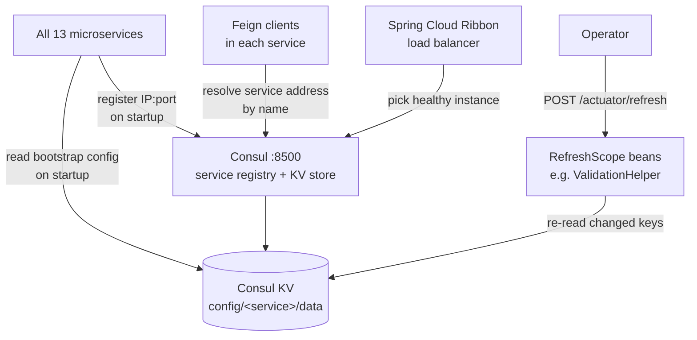

# Consul — service discovery and configuration

Consul plays two distinct and equally important roles in the Reportnet3 platform. As a service registry, it is the mechanism by which services find each other at runtime: every service registers its IP address and port with Consul on startup, and Feign clients resolve service addresses dynamically by querying Consul rather than using hardcoded hostnames. As a configuration store, it holds almost all runtime configuration for every service in the platform — database credentials, integration parameters, scheduling thresholds, Keycloak settings, and file paths — centralised in a single key-value store rather than distributed across packaged config files.

The consequence of this design is that no running service carries its own configuration. An instance that starts without being able to reach Consul will fail at startup because it cannot load the properties it needs to wire its beans. When configuration is changed in Consul, selected beans can pick up the new values without a restart. This makes Consul a critical piece of infrastructure whose availability is prerequisite to the availability of the whole platform.

## Flow overview



---

## How services connect to Consul

Each service has a `bootstrap.yml` file at the root of its `resources` folder. Spring Boot loads this file before the main application context, which means Consul connectivity is established before any Spring beans are created. This ordering is intentional: the application context needs the properties from Consul in order to initialise its own components, so the Consul connection must be ready first.

A representative `bootstrap.yml` looks like this:

```yaml
spring:
  cloud:
    consul:
      discovery:
        preferIpAddress: true
        instanceId: ${spring.application.name}:${random.value}
        deregister: true
      config:
        name: dataset
      host: ${CONSUL_HOST:localhost}
      port: ${CONSUL_PORT:8500}
```

The `host` and `port` values fall back to `localhost:8500` for local development but are overridden by the `CONSUL_HOST` and `CONSUL_PORT` environment variables when running in containers, without requiring a rebuild of the JAR.

`preferIpAddress: true` tells Consul to register the service's IP address rather than its hostname. This avoids DNS resolution failures in containerised deployments where hostnames may not be resolvable across network boundaries.

`deregister: true` tells Consul to remove the service registration when the instance shuts down gracefully. This keeps the registry clean and prevents other services from attempting to route requests to an instance that is no longer running.

---

## Service discovery

All thirteen services register themselves with Consul on startup using `@EnableDiscoveryClient`. The registered entry includes the service name (from `spring.application.name`), IP address, port, and health check URL. Consul periodically checks the health endpoint; instances that fail health checks are removed from the pool of available instances.

Feign clients in the platform are defined against logical service names — for example, `DataSetControllerZuul` targets the service named `dataset`. When a Feign call is made, Spring Cloud's Ribbon load balancer queries Consul for all healthy instances registered under that name and picks one. The caller never needs to know the IP address or port of any specific instance, only the service name. This is what allows the system to scale horizontally: adding a second instance of the Dataset Service requires no configuration changes anywhere else.

### The instance ID as a workload ownership token

Each registered instance gets a unique ID following the pattern `{spring.application.name}:{random.value}`, where `{random.value}` is a UUID generated fresh each time the service starts. This random suffix is what allows multiple instances of the same service to coexist in the registry — they all share the same application name but have distinct IDs.

Beyond its role in discovery, this instance ID is reused by several services to track ownership of in-progress work:

- The **Validation Scheduler** (`ValidationScheduler`) injects its instance ID via `@Value("${spring.cloud.consul.discovery.instanceId}")` and stores it in the `pod` column of validation process tasks. When the scheduler scans for stale tasks, it can distinguish tasks owned by itself from tasks owned by other instances — and handle them appropriately.
- The **Import Task Scheduler** (`ImportFileTasksScheduler`) does the same for import tasks.
- The **Recordstore Service** (`JdbcRecordStoreServiceImpl`) stamps its instance ID onto recordstore tasks when it begins processing them.
- The **Redis cache configuration** (`CacheClientSecurityConfiguration`) uses the instance ID as the Redis client name, allowing Redis monitoring to identify which service instance holds which connections.

This dual use of the Consul instance ID — both as a discovery identifier and as a workload-ownership token — is a deliberate design pattern that threads through the multi-instance scheduling logic of the platform.

---

## Configuration store

The `spring-cloud-starter-consul-config` dependency (pulled via the parent POM alongside `spring-cloud-starter-consul-discovery`) enables Spring Cloud's Consul Config integration. At startup, after the Consul connection is established, the service reads all key-value pairs from its designated KV path and makes them available to the Spring context as standard `@Value`-injectable properties.

### KV path structure

Spring Cloud Consul reads configuration from the path `config/{name}/data` by default, where `{name}` comes from the `spring.cloud.consul.config.name` property in `bootstrap.yml`. The services and their configuration namespaces are:

| Service | Application name | Consul config name | KV path |
|---|---|---|---|
| API Gateway | `apiGateway` | `apiGateway` | `config/apiGateway/` |
| Dataset Service | `dataset` | `dataset` | `config/dataset/` |
| Dataflow Service | `dataflow` | `dataflow` | `config/dataflow/` |
| Validation Service | `validation` | `validation` | `config/validation/` |
| Recordstore Service | `recordstore` | `recordstore` | `config/recordstore/` |
| Orchestrator Service | `orchestrator` | `orchestrator` | `config/orchestrator/` |
| User Management Service | `ums` | `ums` | `config/ums/` |
| Communication Service | `communication` | `communication` | `config/communication/` |
| Collaboration Service | `collaboration` | `collaboration` | `config/collaboration/` |
| Document Container Service | `document` | `document` | `config/document/` |
| Index Search Service | `indexsearch` | `indexsearch` | `config/indexsearch/` |
| Inspire Harvester | `inspire-harvester` | _(default: app name)_ | `config/inspire-harvester/` |
| ROD Service | `rod` | _(default: app name)_ | `config/rod/` |

The Inspire Harvester and ROD Service do not set an explicit `spring.cloud.consul.config.name`, so Spring Cloud Consul falls back to using the `spring.application.name` as the config name. The behaviour is functionally identical; the explicit property is just a style choice.

Spring Cloud Consul also reads a shared `config/application/` path that applies to all services. Operators can place settings that are common to every service — for example, shared database credentials or platform-wide feature flags — under that path so they do not need to be duplicated across service-specific namespaces.

### What lives in Consul KV

The platform stores almost all runtime configuration in Consul rather than in packaged YAML files. The properties are grouped below by concern.

**Keycloak and authentication**

The User Management Service reads all Keycloak connectivity parameters from Consul. This includes the server host, realm name, OAuth2 client ID and secret, admin credentials, admin token TTL, and the maximum number of users returned per API call. Other services that validate JWTs read the public key and realm name directly. Centralising these in Consul means that Keycloak configuration changes — realm renames, secret rotations — are applied by updating one KV entry rather than redeploying all services.

```
eea.keycloak.host
eea.keycloak.realmName
eea.keycloak.clientId
eea.keycloak.secret
eea.keycloak.publicKey
eea.keycloak.admin.user
eea.keycloak.admin.password
eea.keycloak.admin.token.expiration
eea.keycloak.listUsersMax
```

**Scheduling and concurrency limits** (Orchestrator Service)

All maximum-concurrency and timeout values for the Orchestrator's job scheduler come from Consul. This allows operators to tune throughput without code changes. The keys control how many import, validation, release, export, and copy jobs may run simultaneously, and how long a job may be in-progress or queued before the Orchestrator decides it has stalled and attempts a restart.

```
scheduling.inProgress.validation.maximum.jobs
scheduling.inProgress.import.maximum.jobs
scheduling.inProgress.release.maximum.jobs
scheduling.inProgress.export.maximum.jobs
scheduling.inProgress.copyToEUDataset.maximum.jobs
scheduling.inProgress.validation.task.max.time
scheduling.inProgress.import.task.max.ms.fail
scheduling.inProgress.import.task.max.ms.restart
scheduling.inProgress.import.fme.jobs.without.callback.max.time
scheduling.inProgress.release.task.max.time
scheduling.jobForDeletingSoftDeletedDataflows.numberOfMonths
(and several more fine-grained timeout keys)
```

**Validation** (Validation Service)

Batch sizes and parallelism for the validation engine are Consul-controlled, making it possible to tune validation performance in response to observed load without a deployment. The instance priority key (`validation.instance.priority`) allows one validation instance to be designated for high-priority jobs while others handle the queue.

```
validation.fieldBatchSize
validation.recordBatchSize
validation.tasks.parallelism
validation.priority.days
validation.instance.priority
validation.maximumErrors
```

**Dataset import and export**

Import batch sizes, file paths, and data delimiters are all externalised.

```
dataset.import.batchRecordSave
dataset.fieldMaxLength
importPath
loadDataDelimiter
exportDataDelimiter
exportDLPath
```

**S3 and Dremio** (big-data path)

S3 credentials and endpoint, and all Dremio JDBC and REST API parameters, come from Consul. This includes job polling retry counts and the Parquet conversion thresholds that control when a large CSV is split into multiple files.

```
amazon.s3.endpoint
amazon.s3.accessKey
amazon.s3.secretKey
dremio.url
dremio.username
dremio.password
dremio.jobPolling.numberOfRetries
dremio.promote.numberOfRetries
dremio.parquetConverter.custom.maxCsvLinesPerFile
```

**Elasticsearch** (Index Search Service)

```
elasticsearch.host
elasticsearch.port
```

**User Management**

```
umsExportPathFile
exportDataDelimiter
eea.ums.authorization.key
```

**ROD integration**

```
rod.url
```

---

## Dynamic configuration reloading

Four classes across the platform are annotated with `@RefreshScope`:

- `ValidationHelper` (Validation Service) — reads batch sizes, parallelism, and priority scheduling parameters
- `FileExportFactory` (Dataset Service) — reads the export delimiter
- `ViewHelper` (Recordstore Service) — reads view configuration
- `CitusJob` (Recordstore Service) — reads database job parameters

A `@RefreshScope` bean is a Spring proxy that is destroyed and recreated on the next method call after a refresh event is triggered. When a Consul KV value is updated and an operator calls `POST /actuator/refresh` on an instance, all `@RefreshScope` beans on that instance are invalidated. The next time any code calls a method on one of those beans, Spring creates a fresh instance of it, reads the current property values from Consul, and the new configuration takes effect without a restart.

There is no automatic watch on Consul KV — the platform does not poll for changes or subscribe to Consul events. The refresh is entirely manual. To propagate a configuration change across all instances of a service, `POST /actuator/refresh` must be called on each instance separately.

---

## Spring Cloud version

The platform uses Spring Cloud `Greenwich.RELEASE`, the 2019 generation of the Spring Cloud release train. Greenwich aligns with Spring Boot 2.1.x and reached end-of-life in November 2020. The Consul integration classes it provides (`ConsulDiscoveryClient`, `ConsulPropertySourceLocator`, `Ribbon` load balancer) reflect this vintage: Ribbon has since been replaced by Spring Cloud LoadBalancer in later releases, and the configuration loading mechanism differs from the current Spring Cloud Consul 4.x API.

This is relevant context for anyone working on upgrades: migrating to a later Spring Boot version would require updating the Consul integration layer alongside it.

---

## Security

No Consul ACL tokens or authentication methods are configured in any `bootstrap.yml` or application properties. The platform assumes Consul runs in an isolated, trusted network where any service on the network can read and write to the KV store and register as a service. ACL enforcement, if required, would need to be applied at the Consul server level and tokens injected as environment variables; the application code has no ACL-awareness.

---

## Deployment

Every service's Dockerfile is generic — it copies the JAR and sets the JVM entrypoint but contains no Consul-specific configuration. The Consul server address is injected at runtime via the `CONSUL_HOST` and `CONSUL_PORT` environment variables. This means the same JAR can connect to a local Consul instance in development and to the production Consul cluster in deployment without any code or packaging changes.
