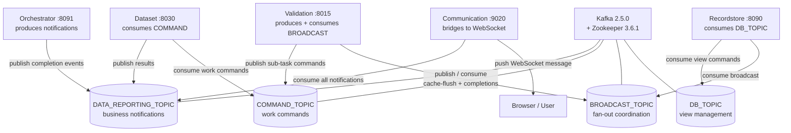

# Kafka Message Bus

## Overview

Kafka is the nervous system of Reportnet3. Every long-running operation in the platform — importing a file, running validation, creating a release, copying data to a EU dataset — produces one or more Kafka events when it starts, progresses, or finishes. These events drive two things simultaneously: they carry commands between services that need to execute work asynchronously, and they trigger real-time browser notifications so users know the status of their operations without polling.

The decision to use Kafka rather than direct synchronous calls for long-running work was a deliberate one. A validation run across a large dataset can take minutes. A release spanning dozens of reporting datasets can take much longer. If a service called another synchronously and waited for the result, it would hold an HTTP thread open for the full duration, consume a Hystrix circuit-breaker slot, and create a tight coupling that makes partial failure difficult to handle. Kafka decouples the initiating service from the executing service: the Orchestrator triggers work by publishing a command event and moves on; the service that does the work publishes a completion event when it is done; any interested party can consume that event in its own time.

The bus carries three distinct kinds of traffic: **notification events** that tell users (or the Orchestrator) that something completed or failed, **command events** that instruct a service to start a specific piece of work, and **broadcast events** that coordinate internal state across multiple instances of the same service. These map to three separate Kafka topics.

## Flow overview



---

## Topics

The platform uses four Kafka topics. Each has a clearly scoped purpose, and services are careful about which topic they publish to and consume from.

**`DATA_REPORTING_TOPIC`** carries all business event notifications — completions, failures, refusals, and status changes for every operation type. It is the largest and most active topic. The Communication Service subscribes to this topic and bridges matching events to connected browsers via WebSocket. Most producing services write only to this topic.

**`COMMAND_TOPIC`** carries commands — instructions from one service telling another to start a specific unit of work. Validation commands are the clearest example: the Orchestrator calls the Validation Service via Feign to start a validation run, and the Validation Service then publishes individual validation commands to this topic for each sub-task (validate this dataset, validate this table, validate this record). The Dataset and Recordstore services consume these commands and execute the work. This allows the validation pipeline to break a large validation job into fine-grained parallel tasks without the Validation Service needing to call each consumer directly.

**`BROADCAST_TOPIC`** carries coordination events that every running instance of a service needs to receive simultaneously. The primary use case is the `COMMAND_CLEAN_KYEBASE` event, which instructs all Validation Service instances to flush their Drools rule cache (KieBase) — something that must happen on every pod after a rule change, not just one. Validation result aggregation events (`COMMAND_VALIDATED_DATASET_COMPLETED`, `COMMAND_VALIDATED_TABLE_COMPLETED`, etc.) also travel on this topic so that the Validation Service instance that is tracking overall progress can hear results regardless of which instance executed the sub-task.

**`DB_TOPIC`** is a dedicated topic consumed only by the Recordstore Service. Database view management commands — create view, insert view process, delete view process, finish view process, refresh materialised view — travel here rather than on `COMMAND_TOPIC`, keeping database-layer operations isolated from the main command bus.

---

## Event envelope

Every message on every topic is an instance of `EEAEventVO`, a thin wrapper that carries the event type and an untyped data map:

```java
public class EEAEventVO {
    private EventType eventType;
    private Map<String, Object> data;
}
```

The `data` map is the payload and varies by event type. Common keys across most events are `dataset_id` (or `datasetId`), `dataflowId`, `user`, and `token`. The `user` and `token` fields are automatically populated from the Spring Security context by `KafkaSender` before the message is sent, so the consuming service can reconstruct the security context and make further authorised Feign calls on behalf of the original user.

For events that produce a user-facing notification, the data map also contains a nested `notification` map. `KafkaSenderUtils.releaseNotificableKafkaEvent()` builds this map using `NotificableEventFactory`, which assembles the fields the browser notification needs — dataflow name, dataset name, data provider, record counts, and so on. The Communication Service extracts this nested map and forwards it to the browser.

The serialisation is JSON throughout. The producer factory uses `JsonSerializer<EEAEventVO>` without embedded type information. The consumer factory uses `JsonDeserializer<EEAEventVO>` trusting only the `org.eea.kafka.domain` package. All messages are produced and consumed within Kafka transactions — the producer factory configures `ACKS_CONFIG=all`, idempotence, and a per-service transactional ID prefix (`{groupId}_{UUID}`), and consumers read with `isolation.level=read_committed`.

---

## Producer and consumer map

Each service uses `spring.application.name` as its Kafka consumer group ID, so each service forms its own independent consumer group.

| Service | Produces to | Consumes from |
|---|---|---|
| Orchestrator (:8091) | DATA_REPORTING_TOPIC | — |
| Dataset (:8030) | DATA_REPORTING_TOPIC | COMMAND_TOPIC |
| Validation (:8015) | DATA_REPORTING_TOPIC, BROADCAST_TOPIC | COMMAND_TOPIC, BROADCAST_TOPIC |
| Recordstore (:8090) | DATA_REPORTING_TOPIC | DB_TOPIC, BROADCAST_TOPIC |
| Communication (:9020) | — (WebSocket) | DATA_REPORTING_TOPIC |
| Collaboration (:9060) | DATA_REPORTING_TOPIC | — |
| Document Container (:9040) | DATA_REPORTING_TOPIC | — |
| Dataflow (:8020) | DATA_REPORTING_TOPIC | — |
| User Management (:9010) | DATA_REPORTING_TOPIC | — |

---

## Command pattern: how COMMAND_TOPIC works

The command topic implements a fan-out execution model for the validation pipeline. When a validation job starts, the Validation Service does not run all checks itself. Instead, it breaks the work into typed sub-commands and publishes each to `COMMAND_TOPIC`. The Dataset Service and Recordstore Service consume these commands and execute the corresponding operations. When each operation finishes, the executing service publishes a `COMMAND_VALIDATED_*_COMPLETED` event to `BROADCAST_TOPIC`. The Validation Service consumes these completion events from BROADCAST_TOPIC and uses them to track aggregate progress across the full validation job.

This indirection — Validation publishes commands, others execute them and publish back — is what makes fine-grained parallelism possible. Multiple Validation Service instances can publish many commands simultaneously. Multiple Dataset Service instances can consume and execute those commands in parallel. No direct coupling exists between the Validation Service and the instances doing the work.

The same pattern applies to data lake validation. `COMMAND_VALIDATE_DL`, `COMMAND_VALIDATE_DL_WITH_SQL`, and `COMMAND_VALIDATE_EXPRESSION_DL` are the S3/Dremio equivalents of the relational validation commands.

The command pattern also drives other multi-step operations: file import (`COMMAND_IMPORT_CSV_FILE_CHUNK_TO_DATASET`, `COMMAND_FINALIZE_CSV_FILE_IMPORT_TO_DATASET`), field propagation, and Iceberg/Parquet format conversions.

---

## The WebSocket bridge

The Communication Service's sole Kafka responsibility is consuming `DATA_REPORTING_TOPIC` and forwarding events to connected browsers. It listens to the topic via `DefaultKafkaReceiver` (shared infrastructure from `common-utitlities`), routes each event to a `SendNotificationCommand`, which calls `NotificationService.send()`. That method uses Spring's `SimpMessagingTemplate` to push the notification to the correct user's WebSocket session:

```
/user/queue/notifications        ← per-user targeted notifications
/user/queue/systemnotifications  ← broadcast notifications
```

The browser connects to the WebSocket endpoint at `/communication/reportnet-websocket` using STOMP. When a backend service publishes an event like `IMPORT_REPORTING_COMPLETED_EVENT`, the Communication Service consumes it within milliseconds and pushes a `Notification` object — containing the event type and the nested notification map — to the relevant user's queue. This is why the browser does not need to poll for job status; it receives a push message as soon as the event arrives on the topic.

Not every `DATA_REPORTING_TOPIC` event produces a browser notification. The `notification` key must be present in the event's data map for the Communication Service to dispatch to WebSocket. Events without a `notification` entry — such as internal coordination or lock events — are consumed and handled by other command implementations within the consuming service.

---

## Partition strategy

`KafkaSender` implements a deliberate partitioning policy to control whether messages of the same type are ordered or can be processed in parallel.

For `DATA_REPORTING_TOPIC` events, most event types have `sorted=true`. The sender computes the partition as `hash(eventType.getKey()) % numPartitions`. This ensures that all events of the same type land on the same partition and are therefore consumed in order. Where ordering matters — for example, all VALIDATION_FINISHED events for a given context — this prevents a later completion from being processed before an earlier one.

For `COMMAND_TOPIC` and `BROADCAST_TOPIC` events, the sender uses a random partition (`sorted=false`). Commands are independent: two separate `COMMAND_VALIDATE_DATASET` messages for different datasets have no ordering relationship, so spreading them across partitions allows parallel consumption without head-of-line blocking.

Each event type has a unique string key constant (e.g. `validation_finished_key`, `import_reporting_completed_event`) that is set as the Kafka message key. This key is also what the `EEAEventCommandFactory` uses on the consumer side to look up the right `AbstractEEAEventHandlerCommand` implementation for the incoming event.

---

## Command routing on the consumer side

The command infrastructure in `common-utitlities` handles the consumer-side routing. `DefaultKafkaReceiver` listens to `DATA_REPORTING_TOPIC` and passes each message to `EEAEventHandlerImpl`. That handler uses `EEAEventCommandFactoryImpl` to look up a registered command implementation for the event type, restores the Spring Security context from the event's `user` and `token` fields, then executes the command.

Each service registers its own command implementations at startup via `@PostConstruct`. A service only registers handlers for event types it cares about — unrecognised event types are silently ignored. This means that adding a new consumer for an existing event type requires no changes to the producing service; the new consumer simply registers a handler.

The Validation Service uses a second `KafkaListenerContainerFactory` — `broadcastContainerFactory` — for its BROADCAST_TOPIC listener, with a separate `ConsumerFactory` configuration. This keeps the broadcast consumer group independent of the command consumer group so that every Validation Service instance receives every broadcast event.

---

## Event types

The `EventType` enum in `common-utitlities` defines all valid event types. They fall into three groups matching the three topics.

### DATA_REPORTING_TOPIC events

These are the notification events that flow from services to the Communication Service (and browser). They cover every operation outcome across the platform.

**Import operations:**
`IMPORT_REPORTING_COMPLETED_EVENT`, `IMPORT_REPORTING_FAILED_EVENT`, `IMPORT_REPORTING_DATASET_DATA_FAILED_EVENT`, `IMPORT_REPORTING_FAILED_NAMEFILE_EVENT`, `IMPORT_REPORTING_REFUSED_EVENT`, `IMPORT_DESIGN_COMPLETED_EVENT`, `IMPORT_DESIGN_FAILED_EVENT`, `IMPORT_DESIGN_DATASET_DATA_FAILED_EVENT`, `IMPORT_DESIGN_FAILED_NAMEFILE_EVENT`, `IMPORT_DESIGN_FAILED_NO_HEADERS_MATCHING_EVENT`, `IMPORT_REPORTING_FAILED_NO_HEADERS_MATCHING_EVENT`, `IMPORT_RESTART_COMPLETED_EVENT`, `IMPORT_RESTART_FAILED_EVENT`, `IMPORT_CANCELED_EVENT`, `IMPORT_DATASET_SCHEMA_COMPLETED_EVENT`, `IMPORT_DATASET_SCHEMA_FAILED_EVENT`, `IMPORT_DATASET_SCHEMA_FAILED_ILLEGAL_CHARS_EVENT`, `IMPORT_FIELD_SCHEMA_COMPLETED_EVENT`, `IMPORT_FIELD_SCHEMA_FAILED_EVENT`, `IMPORT_FIELD_SCHEMA_FAILED_ILLEGAL_CHARS_EVENT`, `IMPORT_FAILED_EVENT_ICEBERG_EXISTS`, `LONG_RUNNING_IMPORT_FAILED_EVENT`

**Import warnings and errors:**
`IMPORT_NAMEFILE_WARNING_EVENT`, `IMPORT_EMPTY_FILES_WARNING_EVENT`, `IMPORT_EMPTY_FILES_ERROR_EVENT`, `IMPORT_FILENAME_CONTAINS_NON_LATIN_CHARACTERS_ERROR_EVENT`, `IMPORT_FIXED_NUM_WITHOUT_REPLACE_DATA_ERROR_EVENT`, `IMPORT_FIXED_NUM_WITHOUT_REPLACE_DATA_WARNING_EVENT`, `IMPORT_WRONG_NUM_OF_RECORDS_ERROR_EVENT`, `IMPORT_WRONG_NUM_OF_RECORDS_WARNING_EVENT`, `IMPORT_ONLY_READ_ONLY_FIELDS_ERROR_EVENT`, `IMPORT_ONLY_READ_ONLY_FIELDS_WARNING_EVENT`, `IMPORT_READ_ONLY_TABLES_ERROR_EVENT`, `IMPORT_READ_ONLY_TABLES_WARNING_EVENT`, `IMPORT_MISMATCH_OF_DATA_WARNING_EVENT`, `IMPORT_MULTILINE_TEXT_CHAR_LIMIT_WARNING_EVENT`, `IMPORT_WRONG_HEADERS_ERROR_EVENT`, `IMPORT_WRONG_HEADERS_WARNING_EVENT`, `IMPORT_FIELD_SIZE_EXCEEDS_LIMIT_WARNING_EVENT`, `PREFILLED_TABLE_HAS_NO_DATA_ERROR`

**External import (FME and other systems):**
`EXTERNAL_IMPORT_REPORTING_COMPLETED_EVENT`, `EXTERNAL_IMPORT_REPORTING_FAILED_EVENT`, `EXTERNAL_IMPORT_DESIGN_COMPLETED_EVENT`, `EXTERNAL_IMPORT_DESIGN_FAILED_EVENT`, `EXTERNAL_IMPORT_REPORTING_FROM_OTHER_SYSTEM_COMPLETED_EVENT`, `EXTERNAL_IMPORT_REPORTING_FROM_OTHER_SYSTEM_FAILED_EVENT`, `EXTERNAL_IMPORT_DESIGN_FROM_OTHER_SYSTEM_COMPLETED_EVENT`, `EXTERNAL_IMPORT_DESIGN_FROM_OTHER_SYSTEM_FAILED_EVENT`, `FME_IMPORT_JOB_FAILED_EVENT`, `FME_IMPORT_JOB_FAILED_EVENT_NO_FILE_RETURNED`, `CALL_FME_PROCESS_FAILED_EVENT`, `CONTINUE_FME_PROCESS_EVENT`

**Export operations:**
`EXTERNAL_EXPORT_REPORTING_COMPLETED_EVENT`, `EXTERNAL_EXPORT_REPORTING_FAILED_EVENT`, `EXTERNAL_EXPORT_DESIGN_COMPLETED_EVENT`, `EXTERNAL_EXPORT_DESIGN_FAILED_EVENT`, `EXTERNAL_EXPORT_EUDATASET_COMPLETED_EVENT`, `EXTERNAL_EXPORT_EUDATASET_FAILED_EVENT`, `EXPORT_DATASET_COMPLETED_EVENT`, `EXPORT_DATASET_FAILED_EVENT`, `EXPORT_QC_COMPLETED_EVENT`, `EXPORT_QC_FAILED_EVENT`, `EXPORT_HISTORIC_RELEASES_COMPLETED_EVENT`, `EXPORT_HISTORIC_RELEASES_FAILED_EVENT`, `EXPORT_SCHEMA_INFORMATION_COMPLETED_EVENT`, `EXPORT_SCHEMA_INFORMATION_FAILED_EVENT`, `EXPORT_DEFINITION_COMPLETED_EVENT`, `EXPORT_TABLE_DATA_COMPLETED_EVENT`, `EXPORT_TABLE_DATA_FAILED_EVENT`, `EXPORT_USERS_BY_COUNTRY_COMPLETED_EVENT`, `EXPORT_USERS_BY_COUNTRY_FAILED_EVENT`, `EXPORT_FILE_START_EVENT`, `DOWNLOAD_VALIDATIONS_COMPLETED_EVENT`, `DOWNLOAD_VALIDATIONS_FAILED_EVENT`, `DOWNLOAD_IMPORTED_FILE_STARTED_EVENT`, `DOWNLOAD_IMPORTED_FILE_FINISHED_EVENT`, `DOWNLOAD_IMPORTED_FILE_ERROR_EVENT`, `DOWNLOAD_GEOMETRY_COMPLETED_EVENT`, `DOWNLOAD_GEOMETRY_FAILED_EVENT`

**Validation:**
`VALIDATION_FINISHED_EVENT`, `VALIDATION_RELEASE_FINISHED_EVENT`, `VALIDATION_REFUSED_EVENT`, `VALIDATION_CANCELED_EVENT`, `VALIDATION_FAILED_ICEBERG_EXISTS_EVENT`, `VALIDATION_FAILED_SYSTEM_ERROR_EVENT`, `VALIDATION_FAILED_ILLEGAL_CHARACTER_EVENT`, `VALIDATION_FAILED_DATASET_LOCKED_FOR_EDITING_EXISTS_EVENT`, `FINISHED_VALIDATION_WITH_CANCELED_TASKS`, `VALIDATE_AS_PROVIDER_REFUSED_EVENT`, `VALIDATE_RULES_COMPLETED_EVENT`, `VALIDATE_ALL_RULES_COMPLETED_EVENT`, `VALIDATE_RULES_ERROR_EVENT`, `DISABLE_RULES_ERROR_EVENT`, `DISABLE_NAMES_TYPES_RULES_ERROR_EVENT`, `INVALIDATED_QC_RULE_EVENT`, `VALIDATED_QC_RULE_EVENT`, `VALIDATE_REPORTERS_COMPLETED_EVENT`, `VALIDATE_REPORTERS_FAILED_EVENT`, `VALIDATE_LEAD_REPORTERS_COMPLETED_EVENT`, `VALIDATE_LEAD_REPORTERS_FAILED_EVENT`, `VALIDATE_ALL_REPORTERS_COMPLETED_EVENT`, `VALIDATE_ALL_REPORTERS_FAILED_EVENT`, `DREMIO_ENDPOINT_ERROR_RESPONSE`

**Release:**
`RELEASE_COMPLETED_EVENT`, `RELEASE_CANCELED_EVENT`, `RELEASE_REFUSED_EVENT`, `RELEASE_FAILED_EVENT`, `RELEASE_BLOCKED_EVENT`, `RELEASE_BLOCKERS_FAILED_EVENT`, `RELEASE_PROVIDER_COMPLETED_EVENT`, `RELEASE_ONEBYONE_COMPLETED_EVENT`, `RELEASE_FAILED_ICEBERG_EXISTS_EVENT`, `RELEASE_FAILED_DATASET_LOCKED_FOR_EDITING_EXISTS_EVENT`, `SILENT_RELEASE_COMPLETED_EVENT`, `SILENT_RELEASE_FAILED_EVENT`

**Snapshots:**
`ADD_DATASET_SNAPSHOT_COMPLETED_EVENT`, `ADD_DATASET_SNAPSHOT_FAILED_EVENT`, `ADD_DATACOLLECTION_SNAPSHOT_COMPLETED_EVENT`, `ADD_DATASET_SCHEMA_SNAPSHOT_COMPLETED_EVENT`, `ADD_DATASET_SCHEMA_SNAPSHOT_FAILED_EVENT`, `RESTORE_DATASET_SNAPSHOT_COMPLETED_EVENT`, `RESTORE_DATASET_SNAPSHOT_FAILED_EVENT`, `RESTORE_DATACOLLECTION_SNAPSHOT_COMPLETED_EVENT`, `RESTORE_DATASET_SCHEMA_SNAPSHOT_COMPLETED_EVENT`, `RESTORE_DATASET_SCHEMA_SNAPSHOT_FAILED_EVENT`, `COPY_REFERENCE_DATASET_SNAPSHOT_COMPLETED_EVENT`, `RESTORE_PREFILLING_REFERENCE_SNAPSHOT_COMPLETED_EVENT`, `SNAPSHOT_DATE_CHANGE_FAIL_EVENT`

**Data collections:**
`ADD_DATACOLLECTION_COMPLETED_EVENT`, `ADD_DATACOLLECTION_FAILED_EVENT`, `ADD_DATACOLLECTION_FAILED_EVENT_ICEBERG_EXISTS`, `ADD_DATACOLLECTION_FAILED_EVENT_DATASET_LOCKED_FOR_EDITING_EXISTS`, `UPDATE_DATACOLLECTION_COMPLETED_EVENT`, `UPDATE_DATACOLLECTION_FAILED_EVENT`, `DATACOLLECTION_NATIONAL_COORDINATOR_EVENT`, `COPY_DATA_TO_EUDATASET_COMPLETED_EVENT`, `COPY_DATA_TO_EUDATASET_FAILED_EVENT`, `COPY_DATA_TO_EUDATASET_REFUSED_EVENT`, `COPY_DATA_TO_EUDATASET_CANCELED_EVENT`

**Dataset schema and design:**
`COPY_DATASET_SCHEMA_COMPLETED_EVENT`, `COPY_DATASET_SCHEMA_FAILED_EVENT`, `COPY_DATASET_SCHEMA_FAILED_ILLEGAL_CHARS_EVENT`, `COPY_DATASET_SCHEMA_NOT_FOUND_EVENT`, `DELETE_DATASET_SCHEMA_COMPLETED_EVENT`, `DELETE_TABLE_SCHEMA_COMPLETED_EVENT`, `SORT_FIELD_DESIGN_FAILED_EVENT`, `SORT_FIELD_FAILED_EVENT`

**Record and field operations:**
`RECORD_UPDATED_COMPLETED_EVENT`, `RECORD_CREATED_COMPLETED_EVENT`, `RECORD_DELETED_COMPLETED_EVENT`, `INSERT_RECORDS_MULTI_TABLES_COMPLETED`, `INSERT_RECORDS_MULTI_TABLES_FAILED`, `DELETE_TABLE_COMPLETED_EVENT`, `DELETE_DATASET_DATA_COMPLETED_EVENT`, `FIELD_UPDATED_COMPLETED_EVENT`, `DATA_DELETE_TO_REPLACE_COMPLETED_EVENT`, `EMPTY_TABLE_EVENT`

**Documents:**
`UPLOAD_DOCUMENT_COMPLETED_EVENT`, `UPLOAD_DOCUMENT_FAILED_EVENT`, `DELETE_DOCUMENT_COMPLETED_EVENT`, `DELETE_DOCUMENT_FAILED_EVENT`, `UPDATED_DOCUMENT_COMPLETED_EVENT`

**Dataflow lifecycle:**
`DELETE_DATAFLOW_COMPLETED_EVENT`, `DELETE_DATAFLOW_FAILED_EVENT`, `REFERENCE_DATAFLOW_PROCESSED_EVENT`, `REFERENCE_DATAFLOW_PROCESS_FAILED_EVENT`, `NO_PK_REFERENCE_DATAFLOW_ERROR_EVENT`

**Editing locks (Iceberg/Parquet):**
`DATASET_ENABLE_EDITING_COMPLETED_EVENT`, `DATASET_ENABLE_EDITING_FAILED_EVENT`, `DATASET_ENABLE_EDITING_FAILED_ACTIVE_EDITING_BY_OTHER_USER_EVENT`, `DATASET_DISABLE_EDITING_COMPLETED_EVENT`, `DATASET_DISABLE_EDITING_FAILED_EVENT`, `DATASET_DISABLE_EDITING_FAILED_ACTIVE_EDITING_BY_OTHER_USER_EVENT`, `ICEBERG_TO_PARQUET_CONVERSION_COMPLETED_EVENT`, `ICEBERG_TO_PARQUET_CONVERSION_FAILED_EVENT`, `ICEBERG_TO_PARQUET_FAILED_ACTIVE_JOBS_EVENT`, `ICEBERG_TO_PARQUET_FAILED_ACTIVE_EDITING_BY_OTHER_USER`, `PARQUET_TO_ICEBERG_CONVERSION_COMPLETED_EVENT`, `PARQUET_TO_ICEBERG_CONVERSION_FAILED_EVENT`, `PARQUET_TO_ICEBERG_FAILED_ACTIVE_JOBS_EVENT`, `PARQUET_TO_ICEBERG_FAILED_ACTIVE_EDITING_BY_OTHER_USER`, `ANOTHER_CONVERSION_IS_RUNNING_FAILED_EVENT`

**National coordinators:**
`ADDING_NATIONAL_COORDINATOR_FINISHED_EVENT`, `DELETING_NATIONAL_COORDINATOR_FINISHED_EVENT`, `ADDING_NATIONAL_COORDINATOR_FAILED_EVENT`, `DELETING_NATIONAL_COORDINATOR_FAILED_EVENT`, `NATIONAL_COORDINATOR_ADDING_PROCESS_STARTED_EVENT`, `NATIONAL_COORDINATOR_DELETING_PROCESS_STARTED_EVENT`, `NATIONAL_COORDINATOR_ANOTHER_PROCESS_IN_PROGRESS_EVENT`

**Preparation datasets:**
`PREPARATION_DATASET_CREATION_COMPLETED_EVENT`, `PREPARATION_DATASET_CREATION_STARTED_EVENT`, `PREPARATION_DATASET_CREATION_FAILED_EVENT`, `PREPARATION_DATASET_CREATION_HAS_EMPTY_QUEUE_EVENT`, `ANOTHER_PREPARATION_DATASET_CREATION_IS_RUNNING_FAILED_EVENT`

**Views and materialised views:**
`CREATED_QUERY_VIEWS_EVENT`, `CREATE_UPDATE_VIEW_EVENT`, `FINISH_VIEW_PROCCES_EVENT`, `UPDATE_MATERIALIZED_VIEW_EVENT`, `REFRESH_MATERIALIZED_VIEW_EVENT`

**Collaboration and notifications:**
`RECEIVED_MESSAGE`, `UPDATED_DATASET_STATUS`, `CONNECTION_CREATED_EVENT`, `WEBSOCKET_NOTIFICATION`

**Locks:**
`LOCK_METHOD`, `LOCK_ENTITY`, `UNLOCK_METHOD`, `UNLOCK_ENTITY`

**Miscellaneous:**
`SPREAD_DATA_EVENT`, `CREATE_UPDATE_RULE_EVENT`, `VALIDATE_MANUAL_QC_COMMAND`, `NO_ENABLED_SYSTEM_NOTIFICATIONS`, `EMAIL_NOT_FOUND_ERROR`

### COMMAND_TOPIC events

These are commands published to instruct a consuming service to execute a specific unit of work:

| Event type | What it triggers |
|---|---|
| `COMMAND_EXECUTE_VALIDATION` | Start a full validation run for a dataset |
| `COMMAND_VALIDATE_DATASET` | Validate a single dataset (relational) |
| `COMMAND_VALIDATE_TABLE` | Validate a single table |
| `COMMAND_VALIDATE_RECORD` | Validate a single record |
| `COMMAND_VALIDATE_FIELD` | Validate a single field |
| `COMMAND_VALIDATE_DL` | Validate a data lake dataset |
| `COMMAND_VALIDATE_DL_WITH_SQL` | Validate a data lake dataset using SQL rules |
| `COMMAND_VALIDATE_EXPRESSION_DL` | Validate a data lake dataset using an expression rule |
| `COMMAND_VALIDATE_EMPTY_RULE` | Check an empty-table rule |
| `COMMAND_IMPORT_CSV_FILE_CHUNK_TO_DATASET` | Import a chunk of a CSV file |
| `COMMAND_IMPORT_EXCEL_FILE_TO_DATASET` | Import an Excel file |
| `COMMAND_FINALIZE_CSV_FILE_IMPORT_TO_DATASET` | Finalise a CSV import after all chunks are processed |
| `COMMAND_EXECUTE_NEW_DESIGN_FIELD_PROPAGATION` | Start field propagation for a new design field |
| `COMMAND_NEW_DESIGN_FIELD_PROPAGATION` | Execute one step of field propagation |
| `COMMAND_ICEBERG_TO_PARQUET_CONVERSION` | Convert an Iceberg table to Parquet |
| `COMMAND_PARQUET_TO_ICEBERG_CONVERSION` | Convert Parquet files to an Iceberg table |

### BROADCAST_TOPIC events

These are published by the Validation Service and consumed by all instances of the Validation Service simultaneously:

| Event type | Purpose |
|---|---|
| `COMMAND_CLEAN_KYEBASE` | Flush the Drools KieBase rule cache on all Validation Service instances |
| `COMMAND_VALIDATED_DATASET_COMPLETED` | A dataset-level validation sub-task has finished |
| `COMMAND_VALIDATED_TABLE_COMPLETED` | A table-level validation sub-task has finished |
| `COMMAND_VALIDATED_RECORD_COMPLETED` | A record-level validation sub-task has finished |
| `COMMAND_VALIDATED_FIELD_COMPLETED` | A field-level validation sub-task has finished |
| `COMMAND_VALIDATED_DL_COMPLETED` | A data lake validation sub-task has finished |
| `COMMAND_VALIDATED_DL_WITH_SQL_COMPLETED` | A data lake SQL validation sub-task has finished |
| `COMMAND_VALIDATED_EXPRESSION_DL_COMPLETED` | A data lake expression validation sub-task has finished |
| `COMMAND_VALIDATED_EMPTY_RULE_COMPLETED` | An empty-rule validation sub-task has finished |
| `INSERT_VIEW_PROCCES_EVENT` | A view process has been inserted (consumed by Recordstore) |
| `DELETE_VIEW_PROCCES_EVENT` | A view process has been deleted (consumed by Recordstore) |

---

## Configuration

All Kafka configuration is centralised in `KafkaConfiguration` in `common-utitlities` and applied to every service that includes it as a dependency.

| Property | Value / notes |
|---|---|
| `kafka.bootstrapAddress` | Injected from environment / Consul KV — not hardcoded |
| Consumer group ID | `${spring.application.name}` — the service name; each service forms its own independent group |
| Producer acks | `all` — waits for all in-sync replicas to acknowledge |
| Idempotence | Enabled — prevents duplicate messages on retry |
| Transactional ID | `{groupId}_{randomUUID}` — per-service-instance transaction scope |
| Key serialiser | `StringSerializer` |
| Value serialiser | `JsonSerializer<EEAEventVO>` (no embedded type info) |
| Consumer isolation level | `read_committed` — only reads messages from committed transactions |
| Auto-commit | Enabled |
| Trusted deserialisation packages | `org.eea.kafka.domain` |
| Retries | `3` on the producer |

---

## Operational characteristics

Kafka 2.5.0 with Zookeeper 3.6.1 is the version running in the sandbox environment and is representative of the deployed version. No Kafka resource limits are configured in the Kubernetes cluster. This is deliberate: setting memory or CPU limits on Kafka pods has been observed to cause cascading restarts during traffic spikes, so the cluster relies on node-level capacity rather than pod-level quotas. The tradeoff is that Kafka can consume unbounded resources during peak load but does not restart under pressure.

Zookeeper is currently used for Kafka cluster coordination. The plan is to migrate to KRaft (Kafka's built-in Raft consensus, which removes the Zookeeper dependency) when Kafka is upgraded to a more recent version.

---

## Notable design choices

**Security context travels with the message.** Because `KafkaSender` automatically embeds the current user's `user` identifier and `token` into every outgoing message, a consuming service can reconstruct a valid security context on the other side. This means Feign calls made inside a Kafka consumer — for example, a Dataset Service consumer calling the Validation Service — carry the original user's identity rather than an anonymous or system identity. The downside is that if a token expires between publish and consume (which matters for long-queued messages), the consuming handler will fail any authorisation check that depends on it.

**Notifiable vs non-notifiable events.** Two publishing methods exist in `KafkaSenderUtils`: `releaseKafkaEvent()` publishes a bare event with no notification map, and `releaseNotificableKafkaEvent()` builds the full notification map and also saves a persistent notification record in the Communication Service before publishing. The persistent record means the user sees the notification even if their browser was not connected at the moment the event was published.

**Silent release is a first-class concept.** `SILENT_RELEASE_COMPLETED_EVENT` and `SILENT_RELEASE_FAILED_EVENT` exist specifically so that automated releases can produce events without triggering browser notifications. The Communication Service is configured to ignore these event types for WebSocket dispatch. Other services that need to react to release completion (such as post-release data processing) can still consume these events normally.

**Drools cache invalidation uses broadcast.** When an administrator changes a validation rule, the Drools KieBase compiled from that rule must be flushed on every running Validation Service instance — not just one. The BROADCAST_TOPIC with its fan-out consumer group model makes this possible. Any service that needs a similar "invalidate all instances" mechanism would follow the same pattern.
