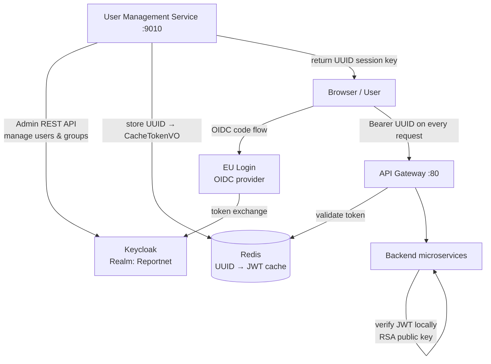

# Keycloak authentication and authorisation

Keycloak is the single identity provider for Reportnet 3. It is responsible for two distinct concerns: authenticating users (verifying who they are) and serving as the authorisation store (recording what each user is permitted to do). Every human login, every API key resolution, and every access-control decision ultimately traces back to Keycloak. The system uses a single Keycloak realm named `Reportnet` and a single client named `reportnet`.

Keycloak is not queried on every API call. Instead, the User Management Service acts as the sole integration point, calling Keycloak's Admin REST API to manage users and groups. Other services receive a JWT on the initial request; they verify it locally using the realm's RSA public key and extract authorisation information from its claims. This means Keycloak is not in the hot path for normal request processing.

## Flow overview



---

## What is stored in Keycloak

Keycloak holds three categories of data for Reportnet 3: user accounts, access groups, and user attributes (including API keys).

**User accounts.** Each user has a Keycloak account identified by a UUID (`userId`). The account holds an email address and a username (`preferredUsername`). The User Management Service looks users up by email using `GET /auth/admin/realms/{realm}/users?email={email}`. The maximum number of users returned in a single listing call is controlled by `eea.keycloak.listUsersMax` (default 1000).

**Access groups.** Access rights are modelled entirely as Keycloak group membership. Each group represents one permission on one resource: its name encodes the resource type, the resource ID, and the security role. The naming convention is:

```
{ResourceType}-{resourceId}-{SecurityRole}
```

For example, `Dataflow-42-DATA_STEWARD` means "DATA_STEWARD access on dataflow 42". The resource types are: `Dataflow`, `Dataset`, `Dataschema`, `DataCollection`, `EUDataset`, `TestDataset`, `ReferenceDataset`, and `Provider`. The `Provider` type uses the role `NATIONAL_COORDINATOR` and represents country-level coordination rights.

The security roles are defined in `SecurityRoleEnum`: `DATA_STEWARD`, `DATA_CUSTODIAN`, `STEWARD_SUPPORT`, `DATA_OBSERVER`, `DATA_REQUESTER`, `LEAD_REPORTER`, `REPORTER_READ`, `REPORTER_WRITE`, `EDITOR_READ`, `EDITOR_WRITE`, `REPORTER_PARTITIONED`, `NATIONAL_COORDINATOR`, and `ADMIN`.

This design means that granting or revoking access is a matter of adding or removing a user from a group. No application-level permission table exists; Keycloak is the authoritative source. When a user's JWT is issued, Keycloak embeds their group memberships as a custom `user_groups` claim, which carries their full set of permissions into every service without further Keycloak calls.

**User attributes (API keys).** Keycloak user attributes are used to store API keys. Each API key is stored as a string entry in the user's attribute list, formatted as:

```
{apiKeyValue},{dataflowId},{dataProvider}
```

The three values are comma-separated within a single attribute string. The User Management Service reads these attributes when authenticating an API key request, parses the string, and resolves the user's identity and the scope of the key from its components.

---

## Authentication flows

Three authentication mechanisms are supported, each handled by a dedicated Spring Security filter. The filters run in order on every request.

### Bearer JWT (normal user authentication)

This is the standard flow for human users. The filter class is `JwtAuthenticationFilter`.

The `Authorization` header carries the string `Bearer {token}`, but the token is not a raw Keycloak JWT — it is a UUID session key. On every request, `JwtTokenProvider.retrieveAccessToken()` looks up the UUID in Redis and retrieves the real Keycloak JWT stored there. The JWT is then verified locally by `JwtTokenProvider.parseToken()` using Keycloak's RSA public key; no Keycloak call is made. The filter extracts the user's roles, user ID, and username from the verified JWT's claims, and populates the Spring `SecurityContext`.

The fallback in `retrieveAccessToken()` means that if the UUID is not found in Redis (expired, or not a UUID), the input is treated as a raw JWT and verified directly. This allows service-to-service calls and testing scenarios to pass a real JWT without going through the Redis layer.

`JwtAuthenticationFilter` also handles inter-service Feign calls. When a microservice calls another via Feign, it propagates the caller's identity using `FeignInvocationUser` and `FeignInvocationUserId` headers. The filter checks for these headers and reconstructs the `SecurityContext` from them, allowing the receiving service to act on behalf of the originating user.

### API key authentication

This is the flow for programmatic access. The filter class is `ApiKeyAuthenticationFilter`.

The `Authorization` header carries `ApiKey {key}`. The filter calls the User Management Service via Feign (`authenticateUserByApiKey`). The User Management Service searches Keycloak for the user whose attribute list contains the key, parses the `{apiKeyValue},{dataflowId},{dataProvider}` string, and returns the user's identity and the scope of the key. The result is cached in Redis under the `api_key` cache (see the Redis documentation) to avoid a Keycloak Admin API call on every request.

### External JWT authentication

This flow supports trusted external systems that send their own JWT. The filter class is `ExternalJwtAuthenticationFilter`.

The `Authorization` header carries `JWT {externalToken}`. The filter calls `JwtTokenProvider.retrieveUserEmail()`, which parses the external JWT without signature verification and extracts the `email` claim. It then calls the User Management Service via Feign (`authenticateUserByEmail`) to look up the Keycloak user with that email and return their internal identity. This flow is intended for integrations where the external system is already trusted at the network level and signature verification is not required.

---

## Authorisation model

Inside each service, access control is enforced via Spring Security's method-level security (`@PreAuthorize`). The roles in the `SecurityContext` follow the format:

```
ROLE_{ResourceType}-{resourceId}-{SecurityRole}
```

For example: `ROLE_Dataflow-42-DATA_STEWARD`. This format is produced by `ObjectAccessRoleEnum.getAccessRole(Long idEntity)`, which substitutes the entity ID into the pattern string.

`@PreAuthorize` expressions check whether the current user holds the required role for the specific resource ID being accessed. Because the `user_groups` JWT claim is mapped directly to these Spring Security roles, the check is purely local — no Keycloak call is made during request handling.

The `ResourceGroupEnum` defines all valid resource-type/role combinations. Not all combinations exist: `Provider` resources only use `NATIONAL_COORDINATOR`; not every role applies to every resource type.

---

## Token lifecycle

The full lifecycle of a user session spans Keycloak, Redis, and the security filters.

```
1. Client → User Management Service:  POST /user/login  (username, password)
2. User Management Service → Keycloak: POST /auth/realms/Reportnet/protocol/openid-connect/token
3. Keycloak → User Management Service: {access_token, refresh_token, refresh_expires_in}
4. User Management Service → Redis:    SET {uuid} {CacheTokenVO}  TTL = refresh_expires_in
5. User Management Service → Client:   return uuid

6. Client → Any Service:              Authorization: Bearer {uuid}
7. JwtAuthenticationFilter → Redis:   GET {uuid}  → CacheTokenVO.accessToken (real JWT)
8. JwtTokenProvider.parseToken():     verify JWT signature with Keycloak RSA public key
9. SecurityContext populated with user roles, userId, preferredUsername
```

Token refresh follows the same path: the client sends the UUID to the refresh endpoint, the User Management Service calls `POST /auth/realms/Reportnet/protocol/openid-connect/token` with the stored refresh token, and the new tokens overwrite the old entry in Redis under the same UUID.

The TTL of the Redis entry is set to `refresh_expires_in`, not `expires_in`. This means a user's session in Redis outlives the access token's validity. The access token in `CacheTokenVO` may be expired before the Redis entry is evicted, but the JWT signature check in `parseToken()` will reject it if it has expired. In practice this matters for token refresh flows where the client refreshes using the UUID before the Redis TTL elapses.

---

## Admin token management

Every call the User Management Service makes to the Keycloak Admin REST API requires an admin bearer token. `TokenMonitor` manages this token in memory.

At startup (`@PostConstruct`), `TokenMonitor.init()` authenticates with the admin credentials (`eea.keycloak.admin.user`, `eea.keycloak.admin.password`) using a password grant and stores the resulting access token and refresh token.

On every subsequent admin API call, code calls `TokenMonitor.getToken()`. The method checks how long ago the token was last obtained. If the elapsed time exceeds `eea.keycloak.admin.token.expiration` (default 3 000 000 ms, approximately 50 minutes), it attempts a token refresh using the stored refresh token. If the refresh fails (e.g. the refresh token itself has expired), it falls back to a full password re-authentication. The method is `synchronized` to prevent multiple threads from refreshing the token simultaneously.

This design means the admin token is not refreshed proactively on a timer — it is refreshed lazily, on the first `getToken()` call after the threshold has been exceeded. If the User Management Service is under low load and no admin calls are made for a long period, the token may expire before the next refresh attempt, and the fallback password grant will be triggered.

---

## Keycloak Admin REST API operations

All calls below use the admin token from `TokenMonitor`. The realm is `Reportnet` throughout.

**User management:**

| Operation | Endpoint |
|---|---|
| List up to `listUsersMax` users | `GET /auth/admin/realms/{realm}/users?max={n}` |
| Find user by email | `GET /auth/admin/realms/{realm}/users?email={email}` |
| Get user's realm roles | `GET /auth/admin/realms/{realm}/users/{userId}/role-mappings/realm/composite` |

**Group management:**

| Operation | Endpoint |
|---|---|
| List all groups | `GET /auth/admin/realms/{realm}/groups` |
| Search groups by name | `GET /auth/admin/realms/{realm}/groups?search={param}` |
| Get group members | `GET /auth/admin/realms/{realm}/groups/{groupId}/members` |
| Create group | `POST /auth/admin/realms/{realm}/groups/` |
| Delete group | `DELETE /auth/admin/realms/{realm}/groups/{groupId}` |
| Add user to group | `PUT /auth/admin/realms/{realm}/users/{userId}/groups/{groupId}` |
| Remove user from group | `DELETE /auth/admin/realms/{realm}/users/{userId}/groups/{groupId}` |

**Authentication and permission checking:**

| Operation | Endpoint |
|---|---|
| Admin password grant / user login | `POST /auth/realms/{realm}/protocol/openid-connect/token` |
| Token refresh | `POST /auth/realms/{realm}/protocol/openid-connect/token` (grant_type=refresh_token) |
| Logout | `POST /auth/realms/{realm}/protocol/openid-connect/logout` |
| Evaluate permission policy | `POST /auth/admin/realms/{realm}/clients/{clientInternalId}/authz/resource-server/policy/evaluate` |
| Find client internal ID | `GET /auth/admin/realms/{realm}/clients/` (filtered by `clientId=reportnet`) |
| List resource set | `GET /auth/realms/{realm}/authz/protection/resource_set` |

The permission evaluation endpoint is used to check whether a user has a specific access scope on a resource. It requires the client's internal UUID (not the client ID string `reportnet`), which is fetched once and cached.

---

## Performance characteristics and known limitations

The group-per-resource model scales poorly. Each dataflow has one Keycloak group per dataset per role. A modest dataflow with 3 datasets × 4 roles × 10 data providers results in 120 group operations on data collection creation, and each of those operations calls `GET /auth/admin/realms/{realm}/groups` — which loads all groups in the realm — to locate the target group by name. With 1,000+ groups in the realm, this means a single data collection creation can load over 120,000 group objects unnecessarily, using search rather than direct lookup.

Users with membership in many groups — helpdesk staff, observers, and national coordinators — experience noticeably slow login. The bottleneck is not Keycloak's group retrieval itself; the Keycloak response arrives quickly. The cost is in parsing and filtering the large `user_groups` JWT claim inside each service on the first request.

Stale groups accumulate because no automated cleanup is practised. Groups created for deleted dataflows or removed datasets remain in Keycloak indefinitely, growing the total group count over time.

Upgrading Keycloak to a recent version is a known goal, but because the Keycloak Admin REST API has changed across versions, the upgrade requires a refactor of the User Management Service. The current integration uses the REST API rather than the Keycloak Admin SDK; switching to the SDK would also reduce overhead.

Spring Boot caching is enabled at the application level but no `@Cacheable` annotations are applied to specific Keycloak lookup methods, so the configuration has no practical effect. The most impactful caching targets would be group lookups (called on every user group operation) and API key resolution (called on every API key request).

The medium-to-long-term direction is to replace Keycloak with Microsoft Entra ID (Azure AD) via OAuth2, delegating authorisation (group/role management) to an updated User Management Service while keeping Keycloak only for legacy authentication flows during the transition. An alternative shorter-term proposal is to keep Keycloak only for authentication and move all authorisation logic — permission checking, group management — into the User Management Service backed by a small, cacheable permissions store.

---

## Distributed lock for national coordinator operations

Creating or deleting a national coordinator involves several Keycloak group operations that must not run concurrently for the same country. The User Management Service acquires a Redis lock keyed `NATIONAL_COORDINATOR_{countryCode}` before starting these operations, and releases it on completion. This prevents duplicate group creation or inconsistent permission state if two requests arrive simultaneously. See the Redis documentation for the lock mechanics.

---

## Configuration properties

```yaml
eea:
  keycloak:
    host: <host:port>                   # Keycloak server address
    realmName: Reportnet                # Keycloak realm
    clientId: reportnet                 # Client ID within the realm
    admin:
      user: <username>                  # Admin service account username
      password: <password>              # Admin service account password
      token:
        expiration: 3000000             # ms before admin token is refreshed (≈ 50 min)
    listUsersMax: 1000                  # Maximum users returned by the list-users call
```

The admin credentials (`eea.keycloak.admin.user`, `eea.keycloak.admin.password`) must belong to a Keycloak account with sufficient realm-admin privileges to create/delete groups and manage user group memberships. The `reportnet_admin` account is the configured default in development environments.
