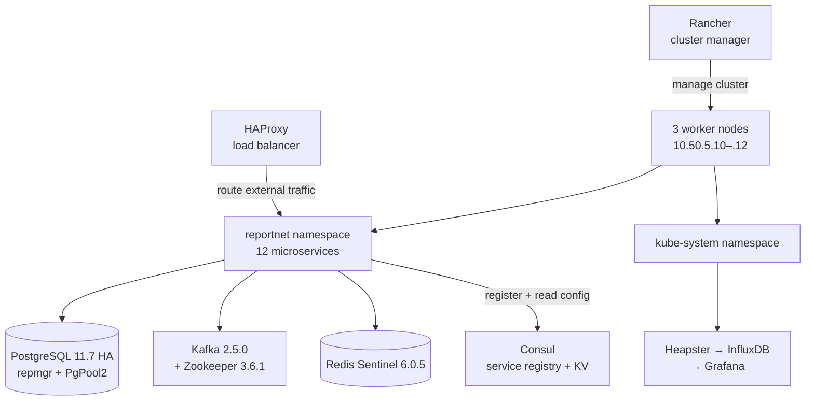

# Kubernetes deployment

Reportnet3 runs on a Rancher-managed Kubernetes cluster hosted in the EEA's private data zone (`pdmz.eea`). This document describes the deployment topology, workload organisation, and infrastructure services as observed in the sandbox environment (`rn3sandbox`). The sandbox is production-shaped — it runs the same twelve microservices, the same database HA stack, and the same monitoring infrastructure — so its configuration is representative of how production works, though instance counts and storage sizes differ.

## Flow overview

---

## Cluster topology

The cluster uses three worker nodes, all KVM virtual machines in the `10.50.5.0/24` private address range. Each node provides 8 vCPU and approximately 23.4 GB of RAM, with a 110-pod capacity.

| Node | Internal IP |
|---|---|
| kvm-rn3stg-01.pdmz.eea | 10.50.5.10 |
| kvm-rn3stg-02.pdmz.eea | 10.50.5.11 |
| kvm-rn3stg-03.pdmz.eea | 10.50.5.12 |

All three nodes are in a single failure domain (`Region1 / FailureDomain1`). There is no rack-level or availability-zone isolation; a single infrastructure failure can affect the full cluster. This is acceptable for the sandbox but would need addressing before a production cluster could be considered highly available at the infrastructure level.

The cluster runs Kubernetes `v1.12.7-rancher1` on Ubuntu 16.04.1 LTS with Docker 17.9.1. Rancher's overlay networking manages pod-to-pod communication; HAProxy handles load balancing at the node level.

---

## Namespaces

The cluster is split into two namespaces:

- **`kube-system`** — Kubernetes infrastructure components: cluster DNS (`kube-dns`), the Kubernetes dashboard, Helm's Tiller, and the Heapster monitoring stack.
- **`reportnet`** — all Reportnet3 application workloads: every microservice, the PostgreSQL cluster, Kafka, Redis, and their configuration.

---

## Application workloads

All Reportnet3 services run as Kubernetes Deployments in the `reportnet` namespace, versioned together under a single image tag per release (e.g. `v3.4-SANDBOX`). In the sandbox each service runs a single replica; production environments typically run multiple replicas for resilience.

Service images are published to both DockerHub (`eeacms/` organisation) and GitHub Container Registry. The two registries are kept in sync as a redundancy measure to reduce exposure to DockerHub pull-rate limits and outages. Individual dataset files handled by the platform range from under 1 GB to over 100 GB, and individual datasets can contain up to 20 million records. This variance directly influences memory requirements for the Dataset Service, Validation Service, and Dremio query workers.

| Service | Image | Approx image size |
|---|---|---|
| api-gateway | `eeacms/api-gateway` | 545 MB |
| dataflow-service | `eeacms/dataflow-service` | 563 MB |
| dataset-service | `eeacms/dataset-service` | 611 MB |
| validation-service | `eeacms/validation-service` | 621 MB |
| orchestrator-service | `eeacms/orchestrator-service` | 558 MB |
| communication-service | `eeacms/communication-service` | 557 MB |
| document-container-service | `eeacms/document-container-service` | 560 MB |
| rod-service | `eeacms/rod-service` | 548 MB |
| user-management-service | `eeacms/user-management-service` | 547 MB |
| collaboration-service | `eeacms/collaboration-service` | — |
| recordstore-service | `eeacms/recordstore-service` | — |
| reportnet-frontend-service | `eeacms/reportnet-frontend-service` | — |

No Kubernetes resource requests or limits are configured on any of these Deployments. Pods are free to consume whatever CPU and memory the node has available. This is a known operational gap: Kubernetes cannot autoscale correctly without resource requests, and pods can be killed by the node's OOM killer during spikes without producing Java-level error messages. The Validation Service in particular consumes more resources than other services during active runs and is the most likely source of node pressure.

---

## PostgreSQL cluster

The database layer uses a three-node PostgreSQL 11.7 cluster managed by `repmgr` for streaming replication and automatic failover, fronted by PgPool2 for connection pooling and load balancing.

**StatefulSet:** Three pods, each running a PostgreSQL 11.7 instance alongside a Prometheus exporter sidecar. Each pod is backed by a 20 GiB `ReadWriteOnce` PersistentVolumeClaim on the `database` storage class, giving 60 GiB of total cluster storage capacity across the three replicas.

**Repmgr** handles streaming replication between the primary and the two standbys, and promotes a standby automatically if the primary fails. Pods address each other directly via the `rn3-pg-helm-postgresql-headless` headless service, which provides individual pod DNS entries.

**PgPool2** (three replicas) sits between the application services and the PostgreSQL StatefulSet. It provides connection pooling, read query load balancing across all three nodes, and write-traffic failover routing after a repmgr promotion event.

Credentials are stored in Kubernetes Secrets: `rn3-pg-helm-postgresql` (PostgreSQL superuser and replication user), `rn3-pg-helm-pgpool` (PgPool admin), and `pg-secret` (application-facing credentials).

---

## Kafka and Redis

Kafka runs version 2.5.0 (`bitnami/kafka:2.5.0-debian-10-r91`) with Zookeeper 3.6.1 (`bitnami/zookeeper:3.6.1-debian-10-r74`) for cluster coordination. A Kafka Exporter sidecar exposes cluster metrics on port 9308 for Prometheus scraping.

No resource limits are configured on Kafka pods. This is intentional: applying CPU or memory limits to Kafka in this environment has caused cascading restarts during traffic spikes, so the cluster relies on node-level capacity instead.

Zookeeper will be dropped when Kafka is upgraded to use KRaft (Kafka's built-in Raft consensus). That upgrade is planned but not yet scheduled.

Redis Sentinel runs version 6.0.5 (`bitnami/redis-sentinel:6.0.5-debian-10-r28`), accompanied by a Redis Exporter for metrics. Redis is used for distributed locking and session/API-key caching. See [redis.md](redis.md) for the locking model and cache configuration.

---

## Monitoring

The sandbox cluster uses the Heapster-based monitoring stack that was standard for Kubernetes 1.12. Heapster collects kubelet resource metrics and writes them to InfluxDB; Grafana reads InfluxDB for visualisation. All three components run in `kube-system` with ephemeral storage (`emptyDir`), so metric history is lost on pod restart.

| Component | Port | Cluster IP |
|---|---|---|
| Heapster | 80 → 8082 | 10.43.82.9 |
| InfluxDB | 8086 | 10.43.183.226 |
| Grafana | 80 → 3000 | 10.43.139.156 |

In production, Graylog and Sentry (EEA-managed instances) are used for centralised log aggregation and error notification respectively. Grafana boards exist for application-level metrics but visibility into per-pod resource consumption is limited by the absence of Kubernetes resource limits.

---

## Helm and deployment

Services were originally deployed via Helm 2, with Tiller (`rancher/tiller:v2.11.0`) running in `kube-system`. Each microservice has its own Helm chart, and there is a separate chart per service to inject environment variables into Consul. This produces significant chart duplication and a complex deployment process — a known maintainability challenge. The planned improvement is to consolidate to two charts: one for all Reportnet3 services and one for infrastructure dependencies.

---

## Known operational gaps

The cluster configuration as documented reveals several gaps that affect scalability and reliability:

- No Kubernetes resource requests or limits on service pods — autoscaling and fair scheduling are not possible without them.
- Single failure domain — no zone or rack isolation; one infrastructure event can take the full cluster.
- Ephemeral monitoring storage — metric history is lost on Heapster/InfluxDB pod restart.
- No Ingress controller visible — external traffic routing depends on infrastructure external to the cluster.
- Heapster monitoring stack is deprecated since Kubernetes 1.13 — the production monitoring story relies on external Graylog/Sentry rather than cluster-native tooling.
- DNS resolution failures are a known cause of inter-service communication failures; transient DNS errors in the cluster have caused Feign client failures and Kafka consumer disconnects that require pod restarts to recover.
