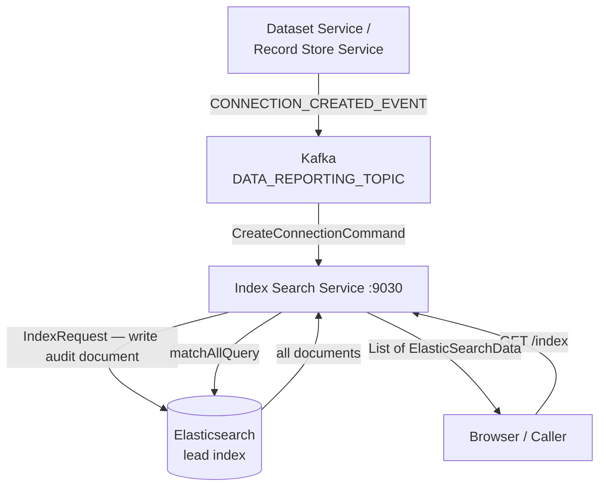

# Elasticsearch — Index Search Service (:9030)

## Overview

The Index Search Service is the only component in Reportnet3 that uses Elasticsearch. Its intended purpose was to provide a searchable activity log — tracking which users connected to which datasets, with metadata about their roles, organisations, and the events that occurred — so that reporters and administrators could search across platform activity. In its current state the implementation is incomplete. Only one event type is indexed, the stored document is sparsely populated, and the only available query is a scan of all documents with no filtering. The service exists as an early skeleton rather than a functioning feature.

Understanding this gap is important before working with or extending the service, so this document describes both what is there today and what the original design appears to have intended.

## Flow overview



---

## What is stored

There is a single Elasticsearch index named `lead`. Each document in the index represents a connection event — specifically, the creation of a PostgreSQL schema connection for a new dataset.

A document has the following structure:

```
id                   UUID generated at indexing time
registerUserName     Username of the person who triggered the event
entityEvent
  entityName         The dataset ID
  eventType          Always "CONNECTION_CREATED_EVENT"
  entityURL          The JDBC connection string + "/" + schema name
```

Everything else defined in the document model — `elasticUser`, `elasticCrossoverFilter`, `roleName`, `organizationName`, `registerUserAuthorization`, `registerUserURL` — is declared in the `ElasticSearchData` class but is never populated. These fields are always null in every document stored.

---

## How documents get written

The only write path into Elasticsearch is the `CreateConnectionCommand` Kafka consumer. It listens on the `DATA_REPORTING_TOPIC` topic for events of type `CONNECTION_CREATED_EVENT`. This event is published by the Dataset Service when it creates a new PostgreSQL schema for a dataset.

When the event arrives, `CreateConnectionCommand.execute()` extracts the `ConnectionDataVO` and the `dataset_id` from the event payload, builds a sparse `ElasticSearchData` object with just the three populated fields described above, and sends it to Elasticsearch via `IndexRequest` using the `RestHighLevelClient`.

No other events are consumed. No other write operations exist.

---

## How documents are read

`IndexSearchServiceImpl` exposes two operations:

`findAll()` issues a `matchAllQuery` against the `lead` index and returns every document. There is no filtering, no field-level search, no pagination, and no sorting. The entire index is returned on every call.

`deleteProfileDocument(String id)` deletes a single document by its UUID.

`executeMacros()` is an empty method stub that does nothing.

The REST API surface exposed by `IndexSearchControllerImpl` maps these directly:

| Method | Path | What it does |
|---|---|---|
| GET | `/index` | Returns all documents via `matchAllQuery` |
| DELETE | `/index/{id}` | Deletes document by UUID |
| GET | `/index/macros` | Calls the empty `executeMacros()` stub |

---

## What was intended

The `ElasticSearchData` model contains fields that point clearly to a broader design. `elasticUser` would have tracked user IDs and a favourite flag. `elasticCrossoverFilter` would have held references to dataflows, datasets, data collections, and organisations — enabling cross-entity filtering. `roleName` and `organizationName` would have made it possible to filter activity by who was responsible for what.

The `IndexSearchServiceImpl` source file contains a large block of commented-out code that was adapted from an Elasticsearch tutorial, including references to an `Employee` class (the original tutorial entity), methods for `findById`, `updateProfile`, `searchByTechnology`, `findProfileByName`, and `searchByTechnology`. None of these exist in the working code. The presence of the `Employee` class name in comments confirms the code was never fully replaced with domain-specific implementations.

The architecture diagram also shows `IDX → Feign → DS` (Index Search calling the Dataset Service) and `IDX → PG` (Index Search reading PostgreSQL directly). Neither of these connections is implemented. The Feign client to the Dataset Service and any PostgreSQL repository are not present in the current codebase.

The intended flow appears to have been: consume multiple event types from Kafka, enrich each event with metadata fetched from the Dataset Service and PostgreSQL, store richly populated documents, and serve filtered searches that would let users find activity by dataflow, dataset, organisation, or user. None of that enrichment or filtering was built.

---

## Technical details

The service uses the `RestHighLevelClient` from `elasticsearch-rest-high-level-client` version 7.3.2. It does not use Spring Data Elasticsearch — all index operations are issued directly through the client using `IndexRequest`, `SearchRequest`, and `DeleteRequest`.

The connection is configured via two properties injected at startup:

| Property | Purpose |
|---|---|
| `elasticsearch.host` | Hostname of the Elasticsearch node |
| `elasticsearch.port` | Port of the Elasticsearch node |

Authentication is wired in the `ElasticSearchClientConfiguration` class using `BasicCredentialsProvider`, but the credentials are currently set to empty strings. The index `lead` is not created by application code — it must be created externally or will be auto-created by Elasticsearch on first write with default settings.

---

## Relationship with other services

The Index Search Service receives events from the Kafka `DATA_REPORTING_TOPIC` topic. The Dataset Service publishes `CONNECTION_CREATED_EVENT` to this topic when it creates a dataset connection. No other service calls the Index Search Service or depends on it. The `GET /index` endpoint is not consumed by the frontend or any other backend service in the current codebase.

The service registers with Consul for discovery and pulls its configuration from Consul KV on startup, consistent with the rest of the platform.

---

## Summary assessment

The Elasticsearch integration is a partially implemented feature. One event type is successfully indexed with minimal document content, and those documents can be retrieved in bulk. The infrastructure is in place — the Kafka consumer, the Elasticsearch client, the REST controller — but the document model is mostly empty, the query capability is effectively absent, and the enrichment pipeline that would have made the index useful was never built. Any meaningful extension of this service would need to start with populating the document fields, consuming additional event types, and replacing the `matchAllQuery` with parameterised search logic.
