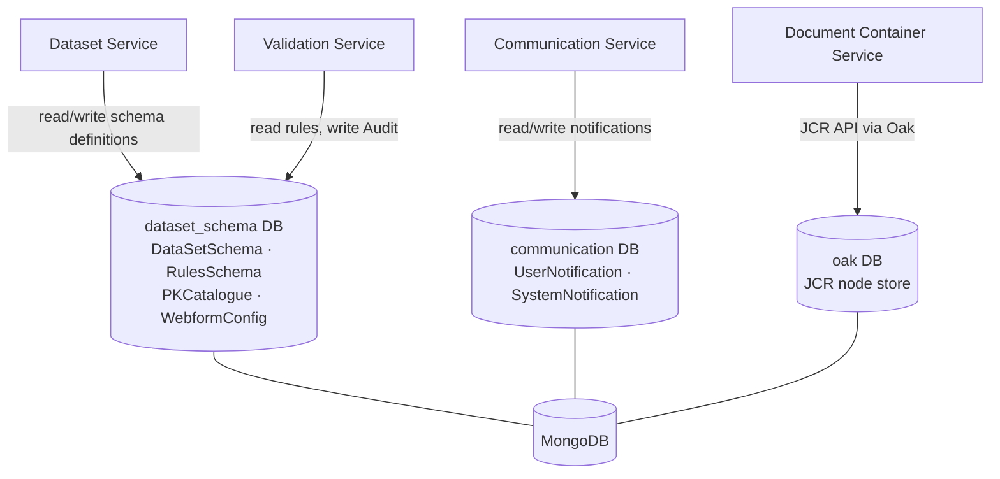

# MongoDB

Reportnet 3 uses MongoDB as a schema store and notification store alongside its primary relational database (PostgreSQL). It holds metadata that describes the structure of datasets — what tables, records and fields exist and what rules apply to them — rather than the dataset records themselves. It also stores user and system notifications, and acts as the backing store for the JCR content repository used by the Document Container Service.

MongoDB is accessed by three microservices: the Dataset Service, the Validation Service, and the Communication Service. The Document Container Service uses MongoDB indirectly through Apache Jackrabbit Oak's `MongoDocumentNodeStoreBuilder`.

## Flow overview



---

## Connection and configuration

All services read their connection configuration from Consul KV under the `config/application/` and `config/document/` namespaces. The values in Consul support environment-variable substitution so that they can be overridden at deployment time.

| Consul key | Default value | Purpose |
|---|---|---|
| `mongodb.hosts` | `localhost:27017` | Comma-separated host:port list passed as a MongoDB URI |
| `mongodb.primary.host` | `localhost` | Host used by the Document Container Service (Oak) |
| `mongodb.primary.port` | `27017` | Port used by the Document Container Service (Oak) |
| `mongodb.primary.username` | `root` | Credential used by Oak |
| `mongodb.primary.password` | `root` | Credential used by Oak |
| `mongodb.hibernate.ddl-auto` | `validate` | Controls schema validation mode at startup |
| `nameOakCollection` | `oak` | MongoDB collection name used as the Oak node store |
| `oakUser` | `admin` | JCR session user for Oak |

The relevant environment variables are `MONGO_HOSTS`, `MONGO_DB_HOST`, `MONGO_DB_PORT`, `MONGO_DB_USERNAME`, `MONGO_DB_PASSWORD`, and `MONGO_DB_DEFAULT_COLLECTION`.

Each service that uses Spring Data MongoDB extends `AbstractMongoConfiguration`, builds a `MongoClient` from `mongodb://` + `mongodb.hosts`, and declares its own logical database name. Transactions are enabled on all three via `MongoTransactionManager`.

---

## Databases

| Database | Used by |
|---|---|
| `dataset_schema` | Dataset Service, Validation Service |
| `communication` | Communication Service |
| `oak` (configurable) | Document Container Service (via Apache Jackrabbit Oak) |

---

## Collections in `dataset_schema`

This database holds the schema definitions for all dataflows: what tables exist, what fields those tables have, what validation rules apply, and ancillary catalogue data for primary-key references and unique constraints.

### `DataSetSchema`

The top-level schema document for a single dataset. One document per dataset schema. It references tables by embedding a list of `TableSchema` objects.

```json
{
  "_id": ObjectId,
  "idDataFlow": Long,
  "description": String,
  "availableInPublic": Boolean,
  "referenceDataset": Boolean,
  "webform": {
    "name": String,
    "type": String
  },
  "tableSchemas": [ /* embedded TableSchema objects */ ]
}
```

`idDataFlow` is indexed (non-unique) to allow lookups by dataflow. `availableInPublic` controls whether the schema is visible in the public portal. `referenceDataset` marks schemas that are used as shared reference data rather than as reporting datasets. `webform` is an optional embedded object that names the custom webform renderer assigned to this dataset.

### `TableSchema` (embedded in `DataSetSchema`)

Describes a single table within a dataset. Never stored as a top-level document; always embedded inside the parent `DataSetSchema`.

```json
{
  "_id": ObjectId,
  "nameTableSchema": String,
  "description": String,
  "idDataSet": ObjectId,
  "readOnly": Boolean,
  "toPrefill": Boolean,
  "notEmpty": Boolean,
  "fixedNumber": Boolean,
  "dataAreManuallyEditable": Boolean,
  "recordSchema": { /* embedded RecordSchema */ }
}
```

`toPrefill` indicates that the table should be pre-populated from a reference dataset before data collection. `fixedNumber` means the table must always have the same number of rows. `notEmpty` enforces that at least one row must exist.

### `RecordSchema` (embedded in `TableSchema`)

Describes the row structure of a table. Embedded inside `TableSchema`.

```json
{
  "_id": ObjectId,
  "nameSchema": String,
  "idTableSchema": ObjectId,
  "fieldSchemas": [ /* embedded FieldSchema objects */ ]
}
```

### `FieldSchema` (embedded in `RecordSchema`)

Describes a single column within a record. Embedded inside `RecordSchema`.

```json
{
  "_id": ObjectId,
  "headerName": String,
  "description": String,
  "idRecord": ObjectId,
  "typeData": String,
  "codelistItems": [String],
  "required": Boolean,
  "pk": Boolean,
  "pkReferenced": Boolean,
  "pkMustBeUsed": Boolean,
  "pkHasMultipleValues": Boolean,
  "readOnly": Boolean,
  "ignoreCaseInLinks": Boolean,
  "validExtensions": [String],
  "maxSize": Float,
  "referencedField": { /* embedded ReferencedFieldSchema */ }
}
```

`typeData` is one of the `DataType` enum values: `TEXT`, `TEXTAREA`, `LONG_TEXT`, `NUMBER_INTEGER`, `NUMBER_DECIMAL`, `DATE`, `DATETIME`, `BOOLEAN`, `POINT`, `LINESTRING`, `POLYGON`, `MULTIPOINT`, `MULTILINESTRING`, `MULTIPOLYGON`, `GEOMETRYCOLLECTION`, `CODELIST`, `MULTISELECT_CODELIST`, `LINK`, `EXTERNAL_LINK`, `URL`, `PHONE`, `EMAIL`, `ATTACHMENT`.

`pk` marks the field as a primary key. When `pk` is true, `pkMustBeUsed` controls whether other datasets must link to this field, and `pkHasMultipleValues` allows comma-separated values in a single cell. `codelistItems` is used for `CODELIST` and `MULTISELECT_CODELIST` fields. `validExtensions` and `maxSize` are used for `ATTACHMENT` fields. `ignoreCaseInLinks` applies to `LINK` and `EXTERNAL_LINK` fields.

### `ReferencedFieldSchema` (embedded in `FieldSchema`)

Present only when a field is a foreign-key link (`typeData` = `LINK` or `EXTERNAL_LINK`). Points to the primary-key field in another schema.

```json
{
  "idDatasetSchema": ObjectId,
  "idPk": ObjectId,
  "labelId": ObjectId,
  "linkedConditionalFieldId": ObjectId,
  "masterConditionalFieldId": ObjectId,
  "dataflowId": Long,
  "tableSchemaName": String,
  "fieldSchemaName": String
}
```

`idDatasetSchema` and `idPk` identify the target field. `labelId` is the field used as the display label when rendering a dropdown. `linkedConditionalFieldId` and `masterConditionalFieldId` support conditional dropdowns where the options in one field depend on the selected value of another.

### `RulesSchema`

Holds all validation rules for one dataset schema. One document per dataset schema.

```json
{
  "_id": ObjectId,
  "idDatasetSchema": ObjectId,
  "automaticQCsDefaultLevelError": "CORRECT" | "WARNING" | "ERROR" | "INFO" | "BLOCKER",
  "rules": [ /* embedded Rule objects */ ]
}
```

`automaticQCsDefaultLevelError` defaults to `ERROR` and controls the severity assigned to system-generated QC rules.

### `Rule` (embedded in `RulesSchema`)

One validation rule. Embedded inside `RulesSchema`.

```json
{
  "_id": ObjectId,
  "referenceId": ObjectId,
  "referenceFieldSchemaPKId": ObjectId,
  "ruleName": String,
  "description": String,
  "shortCode": String,
  "automatic": Boolean,
  "enabled": Boolean,
  "verified": Boolean,
  "activationGroup": String,
  "type": "TABLE" | "DATASET" | "FIELD" | "RECORD",
  "whenCondition": String,
  "thenCondition": [String, String],
  "automaticType": "FIELD_TYPE" | "FIELD_SQL_TYPE" | "FIELD_CARDINALITY" | "TABLE_COMPLETNESS" | "FIELD_LINK" | "TABLE_UNIQUENESS" | "MANDATORY_TABLE",
  "uniqueConstraintId": ObjectId,
  "integrityConstraintId": ObjectId,
  "sqlSentence": String,
  "sqlError": String,
  "sqlCost": Double,
  "expressionText": String,
  "hasHistoric": Boolean
}
```

`referenceId` links the rule to the schema entity it validates (a field, record, table, or dataset `_id`). `type` declares which entity level the rule applies to. `whenCondition` is a Drools/expression-language condition string; `thenCondition` is a two-element list where the first element is the error message and the second is the severity level. `sqlSentence` is used for SQL-based rules; `sqlCost` is the estimated query cost stored after analysis. `automatic` distinguishes system-generated rules (created when a field is marked required, typed, or linked) from user-defined rules. `automaticType` narrows the kind of automatic rule. `hasHistoric` indicates that an audit trail exists for this rule in the `Audit` collection.

### `UniqueConstraintsCatalogue`

Stores multi-field unique constraint definitions for tables. Referenced by the `TABLE_UNIQUENESS` automatic rule type.

```json
{
  "_id": ObjectId,
  "datasetSchemaId": ObjectId,
  "tableSchemaId": ObjectId,
  "fieldSchemaIds": [ObjectId]
}
```

`fieldSchemaIds` is the ordered list of fields whose combined values must be unique within the table.

### `PKCatalogue`

A catalogue of primary-key fields and which field schemas reference them as foreign keys. Used to enforce referential integrity and to propagate changes when a PK field is modified.

```json
{
  "_id": ObjectId,
  "referencedBy": [ObjectId]
}
```

`_id` holds the `idPk` of the primary-key field. `referencedBy` is the list of field schema `_id` values that declare a `referencedField` pointing to this PK.

### `DataflowReferenced`

Tracks which dataflows are referenced by other dataflows via cross-dataflow field links. Used to prevent a dataflow from being deleted while another dataflow links to it.

```json
{
  "_id": Long,
  "referencedByDataflow": [Long]
}
```

`_id` is the `dataflowId` of the referenced dataflow. `referencedByDataflow` is the list of dataflow IDs that hold a link field pointing into that dataflow.

### `WebformConfig`

Stores the JSON configuration for custom webform renderers. One document per named webform.

```json
{
  "_id": ObjectId,
  "idReferenced": Long,
  "name": String,
  "file": { /* arbitrary JSON object */ }
}
```

`file` is an unstructured `Map<String, Object>` that holds the full webform JSON — its structure is defined by the front-end rendering engine, not by the backend.

### `WebformConfigHistory`

An append-only version history for `WebformConfig`. Each time a webform configuration is updated, a snapshot is written here.

```json
{
  "_id": ObjectId,
  "idReferenced": Long,
  "name": String,
  "idWebformConfigSchema": ObjectId,
  "version": Long,
  "createdAt": ISODate,
  "file": { /* arbitrary JSON object */ }
}
```

`idWebformConfigSchema` links back to the live `WebformConfig` document. `version` is a monotonically increasing sequence number managed by the `WebformConfigHistoryCounters` counter document.

### `WebformConfigHistoryCounters`

A single counter document per named entity, used to generate sequential version numbers for `WebformConfigHistory`. Follows the standard MongoDB counter pattern.

```json
{
  "_id": String,
  "seq": Long
}
```

### `RuleSequence`

A per-dataset-schema counter used to assign sequential short codes to validation rules. One document per dataset schema.

```json
{
  "_id": ObjectId,
  "datasetSchemaId": ObjectId,
  "seq": Long
}
```

---

## Collections in `communication`

This database stores user-facing notifications generated by background jobs and system-wide banner messages.

### `UserNotification`

One document per notification event delivered to a user. Written by background job completion events; read when the user opens the notification panel.

```json
{
  "_id": ObjectId,
  "userId": String,
  "eventType": String,
  "insertDate": ISODate,
  "dataflowId": Long,
  "dataflowName": String,
  "providerId": Long,
  "dataProviderName": String,
  "datasetId": Long,
  "datasetName": String,
  "typeStatus": String,
  "type": String,
  "tableSchemaName": String,
  "fileName": String,
  "nonLatinCharacters": String,
  "preparationCode": String,
  "preparationDatasetMessagePart": String,
  "shortCode": String,
  "invalidRules": Long,
  "disabledRules": Long,
  "datasetStatus": String,
  "recordLines": String,
  "tableName": String,
  "fieldName": String,
  "error": String,
  "customContent": { "key": "value" }
}
```

Most fields are optional and are populated only when relevant to the specific `eventType`. `customContent` is a free-form string map for event types that carry extra context not captured by the fixed fields.

### `SystemNotification`

Stores platform-wide banner messages shown to all users. Managed by administrators.

```json
{
  "_id": ObjectId,
  "message": String,
  "enabled": Boolean,
  "level": "SUCCESS" | "INFO" | "ERROR"
}
```

`enabled` controls whether the banner is currently shown. Multiple documents can exist but only enabled ones are displayed.

---

## Collections in `oak` (Document Container Service)

The Document Container Service uses Apache Jackrabbit Oak backed by `MongoDocumentNodeStoreBuilder`. Oak manages its own internal collection structure within the configured MongoDB database; the collection name is set by the `nameOakCollection` Consul key (default `oak`). The structure of these collections is internal to Oak and is not managed by Reportnet code. Oak stores JCR nodes as MongoDB documents and uses a separate blob store for binary content. The Reportnet application interacts with this store only through the JCR API.

---

## Collections in `dataset_schema` — validation audit

### `Audit`

Stores the change history for validation rules, written by the Validation Service whenever a rule's metadata, expression, or enabled status is changed.

```json
{
  "_id": ObjectId,
  "datasetId": Long,
  "historic": [
    {
      "_id": ObjectId,
      "ruleId": ObjectId,
      "user": String,
      "timestamp": ISODate,
      "metadata": Boolean,
      "expression": Boolean,
      "status": Boolean,
      "ruleBefore": String
    }
  ]
}
```

One `Audit` document per dataset. Each element of `historic` records a single change event. `metadata`, `expression`, and `status` are flags indicating which aspect of the rule changed. `ruleBefore` is a serialised snapshot of the rule state before the change.

### `IntegritySchema`

Stores cross-table referential integrity constraints. One document per integrity rule. Referenced by `Rule.integrityConstraintId` when a rule enforces that values in one table match values in another.

```json
{
  "_id": ObjectId,
  "originDatasetSchemaId": ObjectId,
  "referencedDatasetSchemaId": ObjectId,
  "originFields": [ObjectId],
  "referencedFields": [ObjectId],
  "isDoubleReferenced": Boolean,
  "ruleId": ObjectId
}
```

`originFields` and `referencedFields` are parallel arrays of field schema `_id` values forming the join condition. `isDoubleReferenced` means the constraint is enforced in both directions. `ruleId` back-references the `Rule` that owns this constraint.

---

## Relationships with other services

The Dataset Service owns schema creation and modification. It writes to `DataSetSchema`, `RulesSchema`, `UniqueConstraintsCatalogue`, `PKCatalogue`, `DataflowReferenced`, and the `WebformConfig` collections. The Validation Service reads these same collections to execute QC rules and writes to `Audit` and `IntegritySchema`. Both services connect to the same `dataset_schema` database and share the same MongoDB host. The Communication Service is independent and maintains its own `communication` database. The Document Container Service uses the same MongoDB host but its `oak` database is managed entirely by the Oak library.
