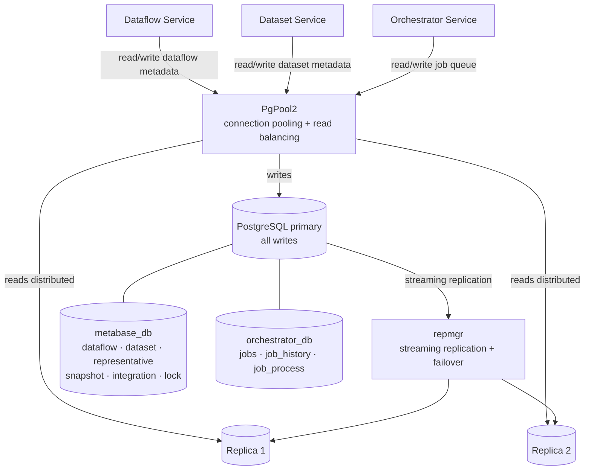

# PostgreSQL database schema

Reportnet 3 uses two separate PostgreSQL databases. The **Metabase DB** is the shared relational store for the platform: it holds metadata about dataflows, datasets, representatives, integrations, processes, and everything that connects those concepts together. The **Orchestrator DB** is a smaller, isolated store owned exclusively by the Orchestrator Service; it manages the job queue and job history so that scheduling decisions are not entangled with the rest of the data model. Neither database stores the actual submitted data — that lives in per-dataset PostgreSQL schemas managed by the Record Store Service, with schema definitions held in MongoDB.

The deployed version is PostgreSQL 11.7, running in a three-node cluster managed by `repmgr` for streaming replication and automatic failover. PgPool2 fronts the cluster to provide connection pooling and load balancing of read queries across all three nodes. Each node is backed by a 20 GiB persistent volume. See [kubernetes.md](../Infrastructure/kubernetes.md) for the full infrastructure layout.

Column details and relationships are derived from the Flyway migration scripts under `database/src/main/resources/db/migration/` and from the JPA entity classes across the service modules.

## Flow overview



---

## Metabase DB — overview

The Metabase DB organises everything around two root concepts: the **dataflow** and the **dataset**. A dataflow is a reporting obligation — it defines who must report, by when, and under what rules. A dataset is a container of actual data; there are several subtypes depending on the role the dataset plays in a reporting cycle. Almost every table in the Metabase DB is either a direct attribute of a dataflow (documents, weblinks, contributors) or a subtype and extension of a dataset (snapshots, partitions, statistics).

### Dataset inheritance

The `dataset` table is the parent of a JPA JOINED inheritance hierarchy. Every dataset subtype has its own table whose `id` column is both the primary key and a foreign key back to `dataset.id`. This means a single dataset record is always readable from the `dataset` table, and the subtype-specific columns are fetched by joining to the child table. The subtypes and their roles in a reporting cycle are:

```
dataset  (base)
├── design_dataset       — schema template authored by EEA
├── reporting_dataset    — submission by a data provider
├── data_collection      — aggregated view of all reporting datasets
├── eu_dataset           — consolidated European-level dataset
├── reference_dataset    — shared lookup data reused across dataflows
├── test_dataset         — sandbox for testing a schema before going live
├── snapshot             — frozen copy of a reporting dataset at a point in time
└── snapshot_schema      — frozen copy of a design dataset's schema
```

`snapshot` and `snapshot_schema` are unusual members of this hierarchy: they are not independent dataset types in the business sense, but they inherit from `dataset` because JPA's joined inheritance gives each one a `dataset` row, which provides common metadata columns (name, status, schema ID) without duplication.

---

## Metabase DB — tables

### `dataflow`

A dataflow represents one reporting obligation. It ties together a legal or policy requirement — identified by an `obligation_id` from the external ROD (Reporting Obligations Database) — with the set of countries or organisations that must report, the datasets they submit, and the rules under which those datasets are validated and released. Every other entity in the Metabase DB either belongs to a dataflow or belongs to a dataset that belongs to a dataflow.

Created by migration `V1__Init_Metabase_BD.sql`. Significant later changes: `obligation_id` added in V10; `type` added in V37; `fme_user_id` and `dataprovider_group_id` added in V40, FK constraint on `fme_user_id` removed in V42; soft-delete columns added in V73; `official_reporting` in V84.

| Column | Type | Notes |
|---|---|---|
| `id` | bigserial | Primary key |
| `name` | varchar(255) | Display name shown in the UI |
| `description` | varchar(255) | |
| `creation_date` | timestamp | |
| `deadline_date` | timestamp | Reporting deadline for data providers |
| `status` | varchar | `TypeStatusEnum`: DESIGN, DRAFT, OPEN, … |
| `obligation_id` | int4 | ID of the reporting obligation in the ROD external system |
| `manual_acceptance` | bool | When true, technical acceptance of submitted datasets must be triggered by hand rather than automatically |
| `releasable` | bool | Whether datasets in this dataflow are permitted to be released to the data collection |
| `show_public_info` | bool | Exposes a public-facing summary of the dataflow on the portal |
| `type` | varchar | `TypeDataflowEnum`: REPORTING, REFERENCE, BUSINESS, CITIZEN_SCIENCE |
| `dataprovider_group_id` | int8 | Logical link to `data_provider_group.id`; determines which set of countries/organisations can participate |
| `fme_user_id` | int8 | FME Server user account used for integrations; FK constraint removed in V42 but column retained |
| `automatic_reporting_deletion` | bool | When true, reporting datasets are automatically deleted after a successful release |
| `big_data` | bool | Signals that this dataflow uses Iceberg-backed big-data storage rather than standard per-dataset schemas |
| `is_deleted` | bool | Soft-delete flag; rows are never hard-deleted |
| `deleted_at` | timestamp | Timestamp of the soft deletion |
| `snc_data` | bool | Marks data subject to SNC (sensitive national context) handling rules |
| `official_reporting` | bool | Distinguishes official regulated reporting obligations from informal or test dataflows |

A dataflow owns its contributors, documents, weblinks, representatives, and integrations; deleting a dataflow cascades to all of them. It has a one-to-one relationship with `submission_agreement` (the legal text governing the submission) and with `release_receipt` (the customisable note on the release PDF).

---

### `dataset`

The base table for all dataset types. It holds the columns that are meaningful regardless of subtype: the name, the dataflow it belongs to, the MongoDB schema ID that describes its structure, the data provider responsible for it, and its current status in the reporting lifecycle.

`dataset_schema` stores a MongoDB ObjectId, not a schema definition. The actual field and table definitions live in MongoDB; this column is the bridge between the relational metadata and the document store.

Created by `V1__Init_Metabase_BD.sql`. Key later changes: `releasing` moved here from `representative` in V25; `public_file_name` in V31; `dataset_running_status` in V64; `date_status_changed` in V76.

| Column | Type | Notes |
|---|---|---|
| `id` | bigserial | Primary key |
| `dataset_name` | varchar(255) | Display name |
| `dataflowid` | int8 | Logical FK to `dataflow.id`; no database constraint, enforced by the application |
| `date_creation` | timestamp | |
| `visibility` | varchar(255) | Controls who can see the dataset |
| `url_connection` | varchar(255) | Internal JDBC-style connection string to the per-dataset schema database |
| `status` | varchar(255) | `DatasetStatusEnum`: PENDING, DRAFT, TECHNICALLY_ACCEPTED, … |
| `dataset_schema` | varchar(255) | MongoDB ObjectId of the schema document that defines this dataset's tables and fields |
| `data_provider_id` | int8 | Logical FK to `data_provider.id`; the entity responsible for this dataset's content |
| `releasing` | bool | Set to true while a snapshot release operation is in progress, to prevent concurrent releases |
| `public_file_name` | varchar | Filename used when the dataset is exported for the public portal |
| `dataset_running_status` | varchar(255) | `DatasetRunningStatusEnum`: reflects transient states such as RESTORING_SNAPSHOT |
| `date_status_changed` | timestamp | Records when `status` last changed; used as the technical acceptance date |

---

### `data_collection`

A data collection is the target to which reporting datasets are released. When a reporter releases their snapshot, its data is copied into the data collection. EEA staff work with the data collection to review submissions before copying them onward into the EU dataset.

Created by `V1__Init_Metabase_BD.sql`.

| Column | Type | Notes |
|---|---|---|
| `id` | bigserial | PK + FK → `dataset.id` ON DELETE CASCADE |
| `due_date` | timestamp | The reporting deadline; data providers are expected to release their snapshots before this date |

---

### `design_dataset`

EEA staff author design datasets to define the schema — the tables, fields, validation rules, and field types — that data providers must follow when submitting. A design dataset is the template; reporting datasets and data collections are its instances.

Created by `V1__Init_Metabase_BD.sql`.

| Column | Type | Notes |
|---|---|---|
| `id` | serial | PK + FK → `dataset.id` ON DELETE CASCADE |
| `type` | varchar(255) | Present from V1; not actively used in the current codebase |

---

### `eu_dataset`

The EU dataset is populated from the data collection once EEA is satisfied with the submitted data. It represents the authoritative European-level view of a reporting cycle. There is typically one EU dataset per reporting dataflow.

Created by `V1__Init_Metabase_BD.sql`. Migration V15 dropped the `visible` and `name` columns that were redundant with the base `dataset` table.

| Column | Type | Notes |
|---|---|---|
| `id` | bigserial | PK + FK → `dataset.id` ON DELETE CASCADE |

---

### `reporting_dataset`

Each data provider that participates in a dataflow gets one reporting dataset per data collection. This is where they upload, validate, and eventually release their data. The reporting dataset is the workhorse of the submission process.

Created by `V1__Init_Metabase_BD.sql`.

| Column | Type | Notes |
|---|---|---|
| `id` | bigserial | PK + FK → `dataset.id` ON DELETE CASCADE |

Reporting datasets own their snapshots via a one-to-many relationship to the `snapshot` table (joined on `snapshot.reporting_dataset_id`).

---

### `reference_dataset`

Reference datasets contain lookup data — code lists, vocabularies, spatial boundaries — that can be reused across multiple dataflows without being re-entered. They are not owned by a single reporter and are typically managed by EEA.

Created by migration `V36__create_reference_dataset.sql`. The `updatable` column was added in V38.

| Column | Type | Notes |
|---|---|---|
| `id` | bigserial | PK + FK → `dataset.id` |
| `updatable` | bool | When true, the reference data can be modified by users; when false it is read-only |

---

### `test_dataset`

Test datasets exist so that EEA staff and schema designers can validate a new schema configuration before exposing it to reporters. They behave like reporting datasets but are excluded from reporting workflows.

Created by migration `V34__create_test_dataset.sql`.

| Column | Type | Notes |
|---|---|---|
| `id` | bigserial | PK + FK → `dataset.id` |

---

### `snapshot`

A snapshot is a frozen copy of a reporting dataset taken at a specific moment. Reporters create snapshots before a release so that there is a recoverable state if the release fails. When a snapshot is released, its data is propagated first to the data collection (`dc_released`) and later to the EU dataset (`eu_released`).

A snapshot also participates in the `dataset` inheritance hierarchy, meaning it has a corresponding `dataset` row that carries common metadata. The `reporting_dataset_id` column is a separate, logical reference back to the reporting dataset that was snapshotted — these are two distinct relationships.

Created by `V1__Init_Metabase_BD.sql`. Key later changes: `date_released` and `blocked` added in V4; `blocked` removed in V24; `dc_released` renamed from `release` in V18; `eu_released` added in V18; `automatic` in V20; `restrict_from_public` in V53; `enabled` in V63; `job_id` in V77.

| Column | Type | Notes |
|---|---|---|
| `id` | bigserial | PK + FK → `dataset.id` |
| `description` | varchar(255) | User-supplied description of what this snapshot captures |
| `reporting_dataset_id` | int8 | Logical FK to `dataset.id`; identifies the reporting dataset that was snapshotted |
| `datacollection_id` | int8 | FK → `data_collection.id`; set when this snapshot has been released to a data collection |
| `dc_released` | bool | True once the snapshot has been released to the data collection (renamed from `release` in V18) |
| `eu_released` | bool | True once the snapshot data has been propagated to the EU dataset |
| `date_released` | timestamp | When the release was completed |
| `automatic` | bool | True if the snapshot was created automatically by the system rather than manually by the reporter |
| `restrict_from_public` | bool | Prevents this snapshot's data from appearing on the public portal even after release |
| `enabled` | bool | Disabled snapshots are hidden from release selection; used to soft-retire old snapshots |
| `job_id` | int8 | Logical FK to `jobs.id` in the Orchestrator DB; links this snapshot to the job that created it |

---

### `snapshot_schema`

A snapshot schema captures the state of a design dataset's schema (its tables, fields, and validation rules in MongoDB) at a particular point in time. It allows the system to restore a schema configuration and to track which schema version was active during a given reporting cycle.

Created by `V1__Init_Metabase_BD.sql`.

| Column | Type | Notes |
|---|---|---|
| `id` | bigserial | PK + FK → `dataset.id` |
| `description` | varchar(255) | |
| `design_dataset_id` | int8 | FK → `design_dataset.id` (via `dataset.id`); the design dataset whose schema was snapshotted |

---

### `representative`

A representative is the join between a dataflow and a data provider: it says "this data provider participates in this dataflow". When a country is added to a dataflow, a `representative` row is created. That row is then associated with one or more lead reporters who are the actual users responsible for the submission.

The `user_id` and `user_mail` columns are legacy fields from an earlier model where a representative had a single user; they are superseded by `representative_leadreporter` and are no longer written to.

Created by `V1__Init_Metabase_BD.sql`. Key later changes: `receipt_downloaded` and `receipt_outdated` added in V3; `has_datasets` in V8; primary key constraint added in V28; `restrict_from_public` in V30.

| Column | Type | Notes |
|---|---|---|
| `id` | int8 | Primary key |
| `dataflow_id` | int8 | FK → `dataflow.id` ON DELETE CASCADE |
| `data_provider_id` | int8 | FK → `data_provider.id` |
| `user_id` | varchar(255) | Legacy Keycloak user ID; superseded by `representative_leadreporter` |
| `user_mail` | varchar(255) | Legacy email; superseded by `representative_leadreporter` |
| `receipt_downloaded` | bool | Tracks whether the data provider has downloaded their release receipt after the most recent release |
| `receipt_outdated` | bool | Set to true when the receipt is stale (e.g. after a new release); prompts the provider to re-download |
| `has_datasets` | bool | False until reporting datasets have been provisioned for this representative |
| `restrict_from_public` | bool | Prevents all data from this representative being shown on the public portal, regardless of dataset settings |

---

### `representative_leadreporter`

Each representative can have multiple lead reporters — the individuals who are authorised to log in and manage the submission. This table replaced the earlier `representative_user` / `user` tables (dropped in V32), which could only associate one user per representative.

Created by migration `V32__modify_representative_tables.sql`. `invalid` flag added in V54.

| Column | Type | Notes |
|---|---|---|
| `id` | int8 | Primary key (sequence `leadreporter_id_seq`) |
| `representative_id` | int8 | FK → `representative.id` ON DELETE CASCADE |
| `email` | varchar | Lead reporter's email address, used to match their Keycloak account |
| `invalid` | bool | Set to true when the email cannot be resolved to a Keycloak account; prevents access provisioning |

---

### `data_provider`

Data providers are the countries or organisations that appear as options when building a dataflow. They are loaded from an external reference (typically the ROD system or a managed list), not created by end users. Each provider belongs to a group, and the group determines which dataflows the provider is eligible to participate in.

Created by `V1__Init_Metabase_BD.sql`. The `type` column was dropped in V41 when the `group_id` FK to `data_provider_group` was introduced; the unique constraint on `(type, code)` was automatically removed with it.

| Column | Type | Notes |
|---|---|---|
| `id` | int8 | Primary key |
| `label` | varchar(255) | Display name, e.g. "Austria" or "European Environment Agency" |
| `code` | varchar | Short code, typically an ISO country code or custom identifier |
| `group_id` | int8 | FK → `data_provider_group.id`; determines which group this provider belongs to |

---

### `data_provider_group`

Groups cluster data providers by type (country, organisation, etc.) so that a dataflow can be configured for a specific set of reporters — e.g. "all EU member states" — without listing each provider individually.

Created by migration `V39__create_data_provider_group_table.sql`.

| Column | Type | Notes |
|---|---|---|
| `id` | int8 | Primary key |
| `name` | varchar(255) | Group display name, e.g. "EU Member States" |
| `type` | varchar(255) | `TypeDataProviderEnum`: COUNTRY, ORGANISATION, … |

---

### `contributor`

Contributors are users granted access to a dataflow in a non-reporting capacity — typically EEA staff or editors who can view and manage the dataflow without being a data provider. They are distinct from representatives, who represent a specific country or organisation.

Created by `V1__Init_Metabase_BD.sql`.

| Column | Type | Notes |
|---|---|---|
| `id` | bigserial | Primary key |
| `email` | varchar(255) | |
| `user_id` | varchar(255) | Keycloak user ID |
| `dataflow_id` | serial | FK → `dataflow.id` ON DELETE CASCADE |

---

### `document`

Documents are file attachments associated with a dataflow — guidance notes, templates, legal texts, or any supporting material that reporters need. Small files are stored in the Document Service; large files are routed to big-data (object) storage when `big_data` is true.

Created by `V1__Init_Metabase_BD.sql`. `big_data` column added in V72.

| Column | Type | Notes |
|---|---|---|
| `id` | bigserial | Primary key |
| `name` | varchar(255) | File name |
| `language` | varchar(255) | Language of the document |
| `description` | varchar(255) | |
| `dataflow_id` | serial | FK → `dataflow.id` ON DELETE CASCADE |
| `size` | int8 | File size in bytes |
| `date` | timestamp | Upload date |
| `is_public` | bool | Makes the document visible on the public portal without authentication |
| `big_data` | bool | When true, the file is stored in the big-data object store rather than the Document Service |

---

### `weblink`

Weblinks are URLs attached to a dataflow to point reporters towards external resources — legislation, reporting guidelines, reference portals. They are displayed alongside documents in the dataflow's help section.

Created by `V1__Init_Metabase_BD.sql`. `is_public` added in V47.

| Column | Type | Notes |
|---|---|---|
| `id` | bigserial | Primary key |
| `description` | varchar(255) | Display text for the link |
| `url` | varchar(255) | Target URL |
| `dataflow_id` | serial | FK → `dataflow.id` ON DELETE CASCADE |
| `is_public` | bool | Makes the link visible on the public portal |

---

### `submission_agreement`

The submission agreement holds the formal name and description of the legal or procedural basis under which reporters are submitting data. There is at most one per dataflow. It is displayed to reporters during the submission process as context for their obligations.

Created by `V1__Init_Metabase_BD.sql`.

| Column | Type | Notes |
|---|---|---|
| `id` | bigserial | Primary key |
| `name` | varchar(255) | Agreement title |
| `description` | varchar(255) | Full description of the agreement |
| `dataflow_id` | serial | FK → `dataflow.id`; unique per dataflow |

---

### `integration`

Integrations configure connections to external processing systems — primarily FME Server — that can import or export data for a dataflow. Each integration specifies which tool to use and what operation to perform; the parameters for that operation are stored separately in `integration_operation_parameters`.

Created by migration `V14__Create_Integration.sql`.

| Column | Type | Notes |
|---|---|---|
| `id` | bigserial | Primary key |
| `dataflow_id` | int8 | FK → `dataflow.id` ON DELETE CASCADE |
| `name` | varchar(255) | Display name |
| `description` | varchar(255) | |
| `tool` | varchar(255) | Integration tool identifier, e.g. `FME` |
| `operation` | varchar(255) | `IntegrationOperationTypeEnum`: IMPORT, EXPORT, … |

---

### `integration_operation_parameters`

Stores the key/value parameters needed to execute an integration operation. Parameters are split into two subtypes via a JPA single-table inheritance discriminator: `INTERNAL` parameters are used by Reportnet 3 itself (e.g. dataset ID, schema mapping), while `EXTERNAL` parameters are passed directly to the external tool (e.g. FME workspace name, server URL).

Created by `V14__Create_Integration.sql`.

| Column | Type | Notes |
|---|---|---|
| `id` | bigserial | Primary key |
| `parameter_type` | varchar(255) | Discriminator column: `INTERNAL` or `EXTERNAL` |
| `integration_id` | int8 | FK → `integration.id` ON DELETE CASCADE |
| `parameter` | varchar(255) | Parameter key name |
| `value` | varchar(255) | Parameter value |

---

### `fme_jobs`

Tracks individual FME Server job executions so that their progress and outcomes can be monitored. When an FME-backed integration runs, a row is inserted here with the FME-assigned `job_id`; the status is updated as the job progresses.

Created by migration `V16__Create_FME_Persistance.sql` (original table structure); rebuilt with a proper primary key in `V17__Alter_FME_Jobs.sql`.

| Column | Type | Notes |
|---|---|---|
| `id` | bigserial | Primary key |
| `job_id` | int8 | The job identifier returned by FME Server |
| `dataset_id` | int8 | Logical FK to `dataset.id`; the dataset being processed |
| `dataflow_id` | int8 | Logical FK to `dataflow.id` |
| `provider_id` | int8 | Data provider associated with this job |
| `file_name` | varchar | Name of the file being imported or exported |
| `user_name` | varchar | User who triggered the integration |
| `operation` | varchar | `IntegrationOperationTypeEnum` |
| `status` | varchar | `FMEJobstatus`: IN_PROGRESS, COMPLETED, FAILED, … |

---

### `fme_user`

Stores the credentials Reportnet 3 uses to authenticate against FME Server. In practice there is typically one row per environment. Credentials are stored in plaintext in the database and should be managed via environment-specific configuration.

Created by migration `V40__Create_FME_User.sql`.

| Column | Type | Notes |
|---|---|---|
| `id` | bigserial | Primary key |
| `user_name` | varchar | FME Server username (NOT NULL) |
| `password` | varchar | FME Server password (NOT NULL; not hashed) |

---

### `message`

Messages form the collaboration thread between EEA and a data provider within a specific dataflow. The `direction` flag distinguishes which party sent the message. `automatic` messages are generated by the system (e.g. when a release is completed); `type` provides a finer-grained classification used by the UI.

The `file_size` column and big-data support were added after an earlier `message_attachment` table was dropped (V50); attachments are now stored externally and referenced by size metadata only.

Created by migration `V19__Create_Message.sql`. Key later changes: `type` in V44; `automatic` in V48; `file_size` in V49; `big_data` in V72.

| Column | Type | Notes |
|---|---|---|
| `id` | bigserial | Primary key |
| `dataflow_id` | int8 | FK → `dataflow.id` ON DELETE CASCADE |
| `provider_id` | int8 | FK → `data_provider.id` ON DELETE CASCADE |
| `content` | varchar | Message text (NOT NULL) |
| `date` | timestamp | Send time (NOT NULL); indexed for chronological queries |
| `direction` | boolean | `true` = EEA → provider; `false` = provider → EEA |
| `read` | boolean | Whether the recipient has read this message |
| `user_name` | varchar | Display name of the sender |
| `type` | text | `MessageTypeEnum`: USER, SYSTEM, … |
| `automatic` | bool | True for system-generated notifications; false for user-authored messages |
| `file_size` | text | Size of any externally-stored file attachment |
| `big_data` | bool | True when the associated file is stored in big-data object storage |

---

### `foreign_relations`

Reportnet 3 supports cross-dataset field references in schema definitions — a field in one dataset can be declared as a foreign key pointing to a field in another. This table records those relationships so the Validation Service can enforce referential integrity during validation runs.

Created by migration `V6__Foreing_Relations.sql`.

| Column | Type | Notes |
|---|---|---|
| `id` | bigserial | Primary key |
| `dataset_id_origin` | int8 | FK → `dataset.id` ON DELETE CASCADE; the dataset containing the FK field |
| `dataset_id_destination` | int8 | FK → `dataset.id` ON DELETE CASCADE; the dataset containing the referenced PK field |
| `id_pk` | varchar(255) | MongoDB field schema ID of the primary key field in the destination dataset |
| `id_fk_origin` | varchar | MongoDB field schema ID of the foreign key field in the origin dataset |

---

### `partition_dataset`

Each user who accesses a dataset is assigned a partition row. Partitions are used by the Record Store Service to scope data access — queries for a given user are run against their partition rather than the full dataset. A dataset typically has one partition per registered user.

Created by `V1__Init_Metabase_BD.sql`.

| Column | Type | Notes |
|---|---|---|
| `id` | bigserial | Primary key |
| `id_dataset` | serial | FK → `dataset.id` ON DELETE CASCADE |
| `user_name` | varchar(255) | Username of the partition owner |

---

### `statistics`

After each validation run, the Validation Service writes summary statistics here — record counts, error counts, completeness ratios — so the UI can show dataset quality at a glance without re-querying the full data. A row with a null `id_table_schema` is a dataset-level aggregate; rows with a non-null value are table-level breakdowns.

Created by `V1__Init_Metabase_BD.sql`.

| Column | Type | Notes |
|---|---|---|
| `id` | bigserial | Primary key |
| `id_dataset` | int8 | Logical FK to `dataset.id`; no database constraint |
| `id_table_schema` | text | MongoDB table schema ID; null means the statistic applies to the dataset as a whole |
| `stat_name` | text | Statistic identifier, e.g. `RECORDS_WITH_ERRORS`, `TOTAL_RECORDS` |
| `value` | text | Computed statistic value |

---

### `lock`

The Lock Service uses this table to implement distributed, application-level locks that prevent concurrent conflicting operations — for example, two simultaneous release attempts on the same dataset. The `id` is a hash of the `lock_criteria`, so inserting a duplicate triggers a primary key violation that the application uses as a signal that the lock is already held.

Created by `V1__Init_Metabase_BD.sql`.

| Column | Type | Notes |
|---|---|---|
| `id` | int4 | Primary key; computed as a hash of `lock_criteria` |
| `create_date` | timestamp | When the lock was acquired |
| `created_by` | varchar | Identity of the user or service that holds the lock |
| `lock_type` | int4 | Integer discriminator for the type of operation being locked |
| `lock_criteria` | bytea | Serialised Java map of the criteria that define the lock scope (e.g. dataset ID + operation type) |

---

### `changes_eudataset`

During a release cycle, when reporting data is copied from a data collection to the EU dataset, this table records which providers had data changes. It allows the system to track partial propagation and retry only the providers with outstanding changes.

Created by migration `V67__changes_between_dc_and_eu.sql`.

| Column | Type | Notes |
|---|---|---|
| `id` | bigserial | Primary key |
| `datacollection` | int8 | Logical FK to `data_collection.id` |
| `provider` | varchar | Data provider code identifying the provider with pending changes |

---

### `webform`

Certain dataset schemas can be rendered using a specialised webform UI rather than the default grid view. This table is a registry of available webform configurations that schema designers can assign to datasets. The `value` field is the key used by the frontend to load the correct renderer.

Created by migration `V51__create_table_webforms.sql`. `label` renamed from `name` in V52; `value` added in V52; `type` in V62.

| Column | Type | Notes |
|---|---|---|
| `id` | bigserial | Primary key |
| `label` | varchar(255) | Display name shown in the schema designer's dropdown |
| `value` | varchar(255) | Internal identifier used by the frontend to select the correct webform component |
| `type` | text | `WebformTypeEnum`: TABLE, SINGLE_TABLE, … — controls the rendering mode |

---

### `temp_user`

When a user is invited to a dataflow but has not yet registered a Keycloak account, a record is held here. Once they register, the application processes the pending invitation and the row can be removed. `data_provider_id` is set for invitations where the user is being added as a reporter for a specific provider.

Created by migration `V55__create_table_temp_user.sql`. Column renames in V56.

| Column | Type | Notes |
|---|---|---|
| `id` | serial | Primary key |
| `email` | varchar | Invitee's email address (NOT NULL) |
| `user_type` | varchar | The role the invitee will be granted on registration (NOT NULL) |
| `dataflow_id` | int8 | The dataflow the invitation is for |
| `data_provider_id` | int8 | The data provider the invitee will represent; null for non-reporter roles |
| `registered` | timestamp | When the invitation was created |

---

### `process`

Reportnet 3 performs many operations asynchronously — validating a large dataset, importing a file, restoring a snapshot. Each such operation creates a `process` row so its progress can be tracked and displayed. The `process_id` string (rather than the integer `id`) is used as the join key with `task` and with the Orchestrator DB, because it is generated before the row is inserted and is shared across services.

Created by migration `V65__create_table_process.sql`. `priority` added in V66; `released` in V68; `version` in V69.

| Column | Type | Notes |
|---|---|---|
| `id` | bigserial | Primary key |
| `dataset_id` | int8 | Logical FK to `dataset.id`; the dataset being operated on |
| `dataflow_id` | int8 | Logical FK to `dataflow.id` |
| `process_type` | varchar | `ProcessTypeEnum`: VALIDATION, IMPORT, EXPORT, … |
| `username` | varchar | User who triggered the operation |
| `process_id` | varchar | UUID string shared across `task`, `job_process`, and log records; indexed |
| `status` | varchar | `ProcessStatusEnum`: IN_QUEUE, IN_PROGRESS, FINISHED, CANCELED |
| `date_start` | timestamp | |
| `date_finish` | timestamp | |
| `queued_date` | timestamp | When the process entered the queue, before a worker picked it up |
| `priority` | int4 | Scheduling priority (default 50); lower values are processed first |
| `released` | bool | True when this process is executing as part of a release operation |
| `version` | int4 | JPA `@Version` field for optimistic locking; prevents concurrent status updates |

---

### `task`

A process is broken into one or more tasks, each executed by a Kubernetes pod. The `pod` column records which pod ran the task, which is useful for diagnosing failures. Like `process`, tasks use a `version` column for optimistic locking. The `json` field carries the serialised input parameters that the pod needs to execute the task.

Created by migration `V66__add_column_priority_and_create_task.sql`.

| Column | Type | Notes |
|---|---|---|
| `id` | bigserial | Primary key |
| `process_id` | varchar | Matches `process.process_id`; string join, no FK constraint; indexed |
| `status` | varchar | `ProcessStatusEnum` |
| `task_type` | varchar | `TaskType` enum; distinguishes the kind of work this task performs |
| `create_date` | timestamp | |
| `date_start` | timestamp | When a pod began executing the task |
| `date_finish` | timestamp | |
| `json` | varchar | Serialised task parameters passed to the executing pod |
| `version` | int4 | JPA `@Version` field for optimistic locking |
| `pod` | varchar | Kubernetes pod hostname that ran this task |

---

### `dataset_table`

When a dataflow uses Iceberg storage, each table within a dataset must have a corresponding Iceberg table created in the object store. This table tracks that creation status, one row per dataset–table-schema pair. It also records a user-level edit lock: when a user begins editing table data, `editing_username` is set and `edit_lock_expires_at` prevents other users from concurrently editing the same table.

Created by migration `V71__CreateDatasetTableTable.sql`. `editing_username` added in v79; `edit_lock_expires_at` in V83.

| Column | Type | Notes |
|---|---|---|
| `id` | int8 | Primary key (sequence `dataset_table_id_seq`) |
| `dataset_id` | int8 | Logical FK to `dataset.id`; indexed |
| `dataset_schema_id` | varchar(255) | MongoDB dataset schema ObjectId |
| `table_schema_id` | varchar(255) | MongoDB table schema ObjectId; indexed |
| `is_iceberg_table_created` | bool | False until the Iceberg table has been physically provisioned |
| `editing_username` | varchar(255) | Username of the user currently holding the edit lock; null when not locked |
| `edit_lock_expires_at` | timestamp | When the edit lock automatically expires, allowing other users to edit |

---

### `release_receipt`

When a data provider releases their snapshot, they receive a PDF receipt as confirmation. This table holds a custom note that EEA can configure per dataflow; the note is included in every receipt generated for that dataflow. There is at most one row per dataflow.

Created by migration `V74__Add_User_Text_To_Receipt.sql`.

| Column | Type | Notes |
|---|---|---|
| `id` | bigserial | Primary key |
| `dataflow_id` | int8 | FK → `dataflow.id` ON DELETE CASCADE; unique constraint enforces one-to-one |
| `note` | text | Custom text to include in release receipt PDFs for this dataflow |
| `updated_at` | timestamp | Updated automatically on every insert and update via JPA lifecycle hooks |

---

### `preparation_dataset`

Before reporting datasets are formally created for a dataflow, the system can hold a provisional list of intended datasets in this table. Each row describes a dataset that should be created for a given provider, identified by `code`. Once the actual dataset is provisioned, `is_created` is set to true.

Created by migration `V85_AddPreparationDatasetTable.sql`.

| Column | Type | Notes |
|---|---|---|
| `id` | bigint | Primary key (sequence `preparation_dataset_id_seq`) |
| `dataset_name` | varchar(255) | Intended dataset name (NOT NULL) |
| `is_created` | bool | False until the corresponding `reporting_dataset` has been provisioned |
| `code` | varchar(255) | Data provider code used to match this entry to a `data_provider` (NOT NULL) |
| `dataflow_id` | int8 | Logical FK to `dataflow.id` (NOT NULL); indexed |
| `data_provider_id` | int8 | Logical FK to `data_provider.id` (NOT NULL); indexed |

---

## Orchestrator DB

The Orchestrator Service uses a dedicated database so that job scheduling is isolated from the Metabase DB. This separation means a heavy validation queue cannot affect the responsiveness of the metadata APIs, and it lets the Orchestrator be deployed and scaled independently. The Orchestrator DB holds three tables: the active job queue, a complete history of job state transitions, and a mapping from jobs to the processes they spawn.

---

### `jobs`

The central job queue. Each row is one unit of work — a validation, a release, an import, or an export. The Orchestrator dequeues jobs in priority order, checks eligibility rules (e.g. no two releases for the same dataflow concurrently), and dispatches them to the appropriate service.

Created by migration `V1__Create_Job_And_Job_history_Persistance.sql`. `release`, `dataflow_id`, `provider_id`, `dataset_id` added in V2; `preparation_code` in V4.

| Column | Type | Notes |
|---|---|---|
| `id` | int8 | Primary key |
| `job_type` | varchar | Type of job: VALIDATION, RELEASE, IMPORT, EXPORT, … (NOT NULL) |
| `job_status` | varchar | Current status (NOT NULL) |
| `date_added` | timestamp | When the job was submitted (NOT NULL) |
| `date_status_changed` | timestamp | When the status last changed (NOT NULL) |
| `parameters` | varchar | JSON-encoded input parameters specific to the job type |
| `creator_username` | varchar | User who requested the job |
| `release` | bool | True for jobs that are part of a release operation; used in eligibility checks |
| `dataflow_id` | int8 | Logical FK to `dataflow.id` in the Metabase DB |
| `provider_id` | int8 | Logical FK to `data_provider.id` in the Metabase DB |
| `dataset_id` | int8 | Logical FK to `dataset.id` in the Metabase DB |
| `preparation_code` | varchar(255) | Provider code for jobs that involve preparation datasets |

---

### `job_history`

Every time a job's status changes, a new row is appended here. This gives a complete audit trail of a job's lifecycle — when it was queued, when it started, when it finished or failed. The history table mirrors the structure of `jobs` and is never updated, only inserted into.

Created by `V1__Create_Job_And_Job_history_Persistance.sql`. Same structural changes as `jobs` in V2.

| Column | Type | Notes |
|---|---|---|
| `id` | int8 | Primary key |
| `job_id` | int8 | Logical FK to `jobs.id` |
| `job_type` | varchar | Copied from the job at the time of the transition (NOT NULL) |
| `job_status` | varchar | The status that was recorded at this point in time (NOT NULL) |
| `date_added` | timestamp | When the job was originally created (NOT NULL) |
| `date_status_changed` | timestamp | When this particular transition occurred (NOT NULL) |
| `parameters` | varchar | Job parameters at the time of the transition |
| `creator_username` | varchar | |
| `release` | bool | |
| `dataflow_id` | int8 | |
| `provider_id` | int8 | |
| `dataset_id` | int8 | |

---

### `job_process`

When a job is dispatched, it typically triggers one or more asynchronous processes in the Metabase DB. This table records the mapping so the Orchestrator can track whether all processes spawned by a job have completed before marking the job as finished.

Created by migration `V3__Create_Job_Process_Persistence.sql`.

| Column | Type | Notes |
|---|---|---|
| `id` | int8 | Primary key |
| `job_id` | int8 | FK → `jobs.id` |
| `process_id` | varchar | Matches `process.process_id` in the Metabase DB; no enforced FK across databases |

---

## Cross-database relationships

The Orchestrator DB and the Metabase DB do not share a database connection and have no enforced foreign key constraints between them. Consistency is maintained by the application: when the Orchestrator dispatches a job, it writes to `job_process` and the target service writes a matching `process` row using the same `process_id` string.

| Orchestrator DB column | Metabase DB column | Meaning |
|---|---|---|
| `jobs.dataflow_id` | `dataflow.id` | Job operates on this dataflow |
| `jobs.dataset_id` | `dataset.id` | Job operates on this dataset |
| `jobs.provider_id` | `data_provider.id` | Job is scoped to this provider |
| `job_process.process_id` | `process.process_id` | Job spawned this process |
| — | `snapshot.job_id` → `jobs.id` | Snapshot was created by this job |

---

## Dropped tables

These tables existed in earlier migrations and have since been removed.

| Table | Removed in | Reason |
|---|---|---|
| `codelist_category`, `codelist`, `codelist_item` | V7 | Codelist system was simplified; codelists moved to MongoDB schema definitions |
| `user_request`, `dataflow_user_request` | V35 | Feature removed |
| `representative_user`, `user` | V32 | Replaced by `representative_leadreporter`, which supports multiple lead reporters per representative |
| `message_attachment` | V50 | Attachment handling moved to external storage; `message.file_size` retains the size metadata |

---

## Indexes

The indexes below were added explicitly by migrations and are the ones most likely to affect query plans.

| Table | Index name | Columns | Purpose |
|---|---|---|---|
| `snapshot` | `INDX_ISRELEASED` | `dc_released` | Filtering unreleased snapshots |
| `snapshot` | `INDX_REPORTING_DS_ID`, `snapshot_reporting_dataset_id_idx` | `reporting_dataset_id` | Looking up snapshots for a reporting dataset |
| `statistics` | `statistics_id_dataset_idx` | `id_dataset` | Fetching statistics by dataset |
| `message` | `message_date_idx` | `date` | Chronological message queries |
| `process` | `process_process_id_idx` | `process_id` | Joining with `task` and `job_process` by process ID string |
| `process` | `process_dataflow_dataset_status_idx` | `dataflow_id, dataset_id, status` | Checking for active processes before job dispatch |
| `task` | `task_process_id_idx` | `process_id` | Looking up tasks by process |
| `dataset` | `dataset_dataflowid_idx` | `dataflowid` | Fetching all datasets for a dataflow |
| `dataset_table` | `dataset_table_dataset_id` | `dataset_id` | Fetching tables for a dataset |
| `dataset_table` | `dataset_table_schema_id` | `table_schema_id` | Lookup by MongoDB table schema ID |
| `preparation_dataset` | `idx_prep_ds_dataflow` | `dataflow_id` | |
| `preparation_dataset` | `idx_prep_ds_provider` | `data_provider_id` | |

---

## Citus per-dataset schemas

Each dataset on the traditional (non-big-data) path is a PostgreSQL schema within the Citus-distributed cluster. The schema is named `dataset_{id}` and contains eleven tables:

| Table | Purpose |
|---|---|
| `dataset_value_{id}` | Single root row; anchor for the dataset; holds the MongoDB schema ID reference |
| `table_value_{id}` | One row per logical table; holds the table schema ID and FK to `dataset_value` |
| `record_value_{id}` | One row per data record; holds the record schema ID, parent table FK, partition ID, and `data_provider_code` |
| `field_value_{id}` | One row per field in a record; holds the value as `text`, the field schema ID, geometry data, and `data_position` |
| `attachment_value_{id}` | Binary file attachments linked to a `field_value`; content stored as `BYTEA` |
| `validation_{id}` | One row per QC rule violation; holds rule ID, error level, message, entity type, and date |
| `dataset_validation_{id}` | Join between a validation violation and the dataset |
| `table_validation_{id}` | Join between a validation violation and a table |
| `record_validation_{id}` | Join between a validation violation and a record |
| `field_validation_{id}` | Join between a validation violation and a field |
| `temp_etlexport_{id}` | Temporary table used during ETL exports; written, read back, and deleted per operation |

All field values are stored as `text` regardless of their declared schema type. The Citus cluster does not enforce field types; Reportnet3 accepts any string from a data provider and relies on validation rules to flag type violations after import. This is a deliberate design choice to avoid rejecting submissions with minor formatting differences, and it means type coercions are computed at validation time by converting string values to their declared types.

A materialised view reconstructs the original tabular shape of the data by joining `table_value`, `record_value`, and `field_value`, with each field pivoted out as a named column via per-schema subqueries. This view is used for exports and UI data display.

The Citus cluster is fast for `SELECT` queries but significantly slower for `INSERT` and `UPDATE`. Validation results are stored directly in the `validation` and `*_validation` tables within the same dataset schema, coupling result storage to data storage. This means a dataset with many validation errors occupies substantially more storage than its raw data would suggest.

---

## Design notes

**MongoDB split.** The columns `dataset_schema`, `id_table_schema`, `dataset_schema_id`, and `table_schema_id` are MongoDB ObjectIds. The relational database holds lifecycle state and relationships; the structural schema definitions (tables, fields, validation rules) live in MongoDB. This split was a deliberate architectural choice to allow flexible schema evolution without relational migrations.

**Soft delete on dataflow.** Dataflows are never hard-deleted. `is_deleted` and `deleted_at` are set instead. This preserves audit history and allows recovery, at the cost of requiring all dataflow queries to filter on `is_deleted = false`.

**Cascade delete on dataset subtypes.** Deleting a `dataflow` cascades to `contributor`, `document`, `weblink`, `representative`, `integration`, `submission_agreement`, `release_receipt`, and `message`. Deleting a `dataset` cascades to its subtype row and to `partition_dataset` and `foreign_relations`. `snapshot` rows do not cascade-delete when the parent `dataset` is deleted by default; snapshots are managed explicitly.

**Optimistic locking.** `process` and `task` both carry a `version` column managed by JPA's `@Version` annotation. This prevents two workers from concurrently updating the same row's status and creating a race condition.

**No FK from dataset to dataflow.** The `dataset.dataflowid` column has no database-level foreign key constraint. This was an early design decision that was never corrected; referential integrity here is enforced by the application.

**Missing indexes on high-traffic columns.** Several columns used in frequent queries have no index, resulting in full table scans (O(n) instead of O(log n)). The three highest-impact gaps identified are:
- `dataset_metabase.dataflow_id` — every dataflow-to-dataset lookup performs a sequential scan of the full table.
- `snapshot.report_dataset_id` — listing, updating, and finding released snapshots all require full table scans.
- `process` table — a composite index on `(dataflow_id, dataset_id, status)` is missing; finding the next process to run, checking completion status, and filtering by status all cause multiple full scans with expensive joins.

Adding B-tree indexes on these columns is identified as a high-impact, low-effort improvement.
