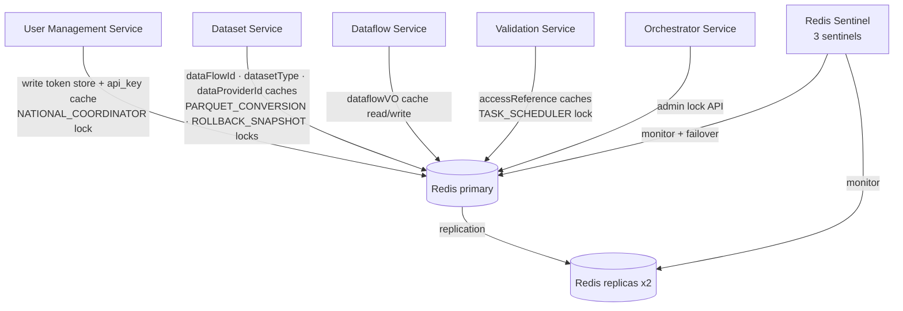

# Redis and Redis Sentinel

Redis serves two distinct purposes in Reportnet 3: it is the backend for the Spring Cache abstraction (caching database query results and external API responses), and it is the shared store for distributed locks and token session data. The same Redis cluster handles all three concerns; there is no data-type or keyspace separation between them beyond key naming conventions.

In deployed environments Redis runs in Sentinel mode for high availability. Locally (Spring profile `local`) a standalone Redis instance is used instead. The client library is Jedis, not Lettuce.

## Flow overview



---

## Connection configuration

The shared connection factory is defined in `CacheClientSecurityConfiguration` (`common-utitlities`). It creates a Jedis connection factory based on the active Spring profile.

For the `local` profile:

```java
new JedisConnectionFactory(
    new RedisStandaloneConfiguration(redisHost, redisPort),
    JedisClientConfiguration.builder().usePooling().poolConfig(poolConfig)
        .and().clientName(serviceInstanceId).build())
```

For every other profile (production, dev, test):

```java
new JedisConnectionFactory(
    new RedisSentinelConfiguration(redisMasterSentinel, sentinelNodes),
    JedisClientConfiguration.builder().usePooling().poolConfig(poolConfig)
        .and().clientName(serviceInstanceId).build())
```

`serviceInstanceId` is set to `spring.cloud.consul.discovery.instanceId`, so each microservice replica identifies itself to Redis by its Consul instance ID. This makes it possible to see which pods hold connections in Redis's `CLIENT LIST` output.

**Required configuration properties:**

```yaml
spring:
  redis:
    host: <host>                       # local profile only
    port: <port>                       # local profile only
    sentinel:
      master: <master-name>            # non-local profiles
      nodes: <host1:port,host2:port,…> # non-local profiles
    jedis:
      pool:
        max-active: <n>
        max-idle: <n>
        min-idle: <n>
        min-evitable-idle-time: <ms>
        max-wait: <ms>
  health:
    redis:
      check:
        frequency: <ms>
```

The pool is configured with `testOnBorrow`, `testOnReturn`, and `testWhileIdle` all set to true. This means Jedis validates connections before handing them out, which catches stale connections after Sentinel failovers at the cost of one PING per borrow.

**Services that connect to Redis:**

| Service | Caching | Distributed locks | Token store |
|---|---|---|---|
| User Management Service | `api_key` | `NATIONAL_COORDINATOR` | write |
| Dataset Service | `dataFlowId`, `datasetType`, `dataProviderId`, `datasetSchemaByDatasetId`, `referencedDatasetId` | `PARQUET_CONVERSION`, `PREPARATION_DATASET_CREATION`, `ROLLBACK_SNAPSHOT` | read |
| Dataflow Service | `dataflowVO` | — | read |
| Validation Service | `accessReferenceEntity`, `accessEntityByDataflowType` | `TASK_SCHEDULER`, reads `PARQUET_CONVERSION` | read |
| Orchestrator Service | — | admin API only | read |
| ROD Service | `rod_*` caches | — | read |

Every service reads from the token store on every authenticated request (see token store section below).

---

## RedisTemplate instances

Two `RedisTemplate` instances share the same `JedisConnectionFactory`.

**`securityRedisTemplate`** (`RedisTemplate<String, CacheTokenVO>`) — declared in `CacheClientSecurityConfiguration`. Uses `StringRedisSerializer` for keys and `Jackson2JsonRedisSerializer<CacheTokenVO>` for values. Used exclusively for token storage (writes by User Management Service, reads by all services on every request).

**`StringRedisTemplate`** (Spring Boot auto-configured, `RedisTemplate<String, String>`) — uses `StringRedisSerializer` for both keys and values. Used by `RedisLockServiceImpl` for distributed locks. Services opt into this by annotating their `@SpringBootApplication` class with `@EnableRedisLock`, which imports `RedisConfiguration`, which component-scans `org.eea.lock.redis` and registers `RedisLockServiceImpl`.

The Spring Cache abstraction (`@Cacheable`, `@CacheEvict`) uses the auto-configured `RedisCacheManager`, which serialises cache values with Java's default serialisation (`JdkSerializationRedisSerializer`). These entries are stored as opaque binary values under Spring's default cache key format.

---

## Token store

The token store is the most frequently-accessed Redis data. It implements a level of indirection between the client and the real Keycloak JWT token.

**How it works.** When a user logs in through the User Management Service, `KeycloakSecurityProviderInterfaceService.addTokenInfoToCache()` stores the Keycloak token data in Redis under a randomly-generated UUID key:

```java
String key = UUID.randomUUID().toString();
securityRedisTemplate.opsForValue().set(key, cacheTokenVO, cacheExpireIn, TimeUnit.SECONDS);
return key;   // this UUID is returned to the client as their "access token"
```

The client receives the UUID, not the real JWT. On every subsequent API call the client presents the UUID in the `Authorization` header. `JwtTokenProvider.retrieveAccessToken()` looks it up:

```java
CacheTokenVO result = securityRedisTemplate.opsForValue().get(keyToken);
return (result != null) ? result.getAccessToken() : keyToken;
```

If found, the real JWT is returned for signature verification. If not found (expired or unknown key), the method falls back to treating the input as the JWT itself — which allows direct JWT use for service-to-service or API key flows.

**Redis data structure:** String (key → JSON value)

**Key format:** UUID v4, e.g. `550e8400-e29b-41d4-a716-446655440000`

**Value format:** JSON-serialised `CacheTokenVO`:
```json
{
  "accessToken": "<keycloak JWT>",
  "refreshToken": "<keycloak refresh JWT>",
  "expiration": <seconds>
}
```

**TTL:** Set to `tokenInfo.getRefreshExpiresIn()` (the Keycloak refresh token lifetime, typically much longer than the access token lifetime). The session is valid in Redis for the full refresh token period.

The token is written at three points in `KeycloakSecurityProviderInterfaceService`: on password-based login, on API key authentication, and on token refresh.

---

## Distributed locks

The distributed lock mechanism prevents concurrent execution of operations that must not overlap across multiple service replicas. All locks use a Redis String with a TTL. Acquisition uses `SETNX`-style atomicity (`setIfAbsent`); release verifies the stored value matches the caller's value before deleting, which prevents a late lock from being released by a later holder.

```java
// acquire
Boolean success = redisTemplate.opsForValue()
    .setIfAbsent(lockKey, value, expireTimeInMillis, TimeUnit.MILLISECONDS);

// release (only if this caller still holds it)
String stored = redisTemplate.opsForValue().get(lockKey);
if (value.equals(stored)) {
    redisTemplate.delete(lockKey);
}
```

The lock value is an operation-specific string that identifies the holder. For some locks (e.g. `PREPARATION_DATASET_CREATION`) a UUID is appended to make the value unique per attempt; for others (e.g. `NATIONAL_COORDINATOR`) it is a fixed `LockSignature` enum value.

**Lock key patterns and their purposes:**

| Key pattern | TTL | Acquirer | Purpose |
|---|---|---|---|
| `NATIONAL_COORDINATOR_{countryCode}` | 600 000 ms | User Management Service | Serialises create/delete national coordinator operations per country code. Without this, concurrent requests could create duplicate Keycloak groups or leave permissions in an inconsistent state. |
| `TASK_SCHEDULER_{taskId}` | 600 000 ms | Validation Service (`ValidationScheduler`) | Prevents two Validation Service replicas from picking up and executing the same pending validation task simultaneously. The scheduler polls for in-queue tasks; the lock ensures only one pod proceeds for each `task.id`. |
| `PARQUET_CONVERSION_{datasetId}` | variable | Dataset Service, Validation Service | Guards Parquet/Iceberg table conversion for a specific dataset. Multiple places acquire and release this lock (import completion, Dremio auto-promotion, big-data export). The Validation Service reads the lock list before starting a big-data validation to wait until conversion is complete. |
| `PREPARATION_DATASET_CREATION_{dataflowId}_{providerId}` | configurable (`prepSetCreationExpirationTimeMs`) | Dataset Service | Prevents concurrent creation of preparation datasets for the same dataflow + provider combination. Value includes a UUID so each attempt has a unique identity. |
| `ROLLBACK_SNAPSHOT_{jobId}_{dataflowId}_{providerId}` | 60 000 ms | Dataset Service (`ResolveSnapshotTableImpl`) | Prevents concurrent snapshot rollback for the same job. Short TTL (60 s) since rollback is expected to complete quickly. |

The `listActiveLocks(pattern)` method scans Redis using the `SCAN` command with the given pattern (count hint 100 per iteration). This is used in two ways: by `PreparationDatasetServiceImpl` to check whether a lock is already held before attempting acquisition, and by the admin API to inspect the current lock state.

**Redis data structure:** String (key → string value)

---

## Admin API

The Orchestrator Service exposes a REST API for inspecting and manually managing Redis locks. All endpoints require the `ADMIN` role.

| Method | Path | Description |
|---|---|---|
| `GET` | `/redis/getActiveRedisLocksByKey?lockKeyPrefix=<prefix>` | Returns all active locks whose keys match the prefix (or all locks if prefix is omitted). Returns `Map<String, String>` of key → value. |
| `DELETE` | `/redis/releaseLock?lockKey=<key>&lockValue=<value>` | Releases a specific lock if the stored value matches `lockValue`. |
| `POST` | `/redis/createLock?lockKey=<key>&lockValue=<value>&expirationMs=<ms>` | Manually acquires a lock. Returns `true` if successful, `false` if already held. |

The Feign client interface (`RedisLockControllerZuul`) allows other services to call these endpoints internally if needed.

---

## Spring Cache entries

The following caches are managed by the Spring Cache abstraction (`@Cacheable` / `@CacheEvict`) backed by Redis via the auto-configured `RedisCacheManager`. Values are serialised using Java serialisation. Keys follow Spring's default key generation (typically the method argument values).

### `dataflowVO`

Caches `DataFlowVO` objects keyed by dataflow ID. This is the most frequently evicted cache: it is invalidated on any mutation of the dataflow row, including status changes, public-info toggles, soft deletes, provider group reassignments, and direct updates.

- **Populated by:** `DataflowServiceImpl.getMetabaseById(Long id)`
- **Evicted by:** `DataflowServiceImpl.updateDataFlow()`, `updateDataFlowStatus()`, and seven `DataflowRepository` mutation methods (`deleteNativeDataflow`, `deleteById`, `softDelete`, `reverseSoftDelete`, `updatePublicStatus`, `updateAutomaticReportingDeletion`, `updateDataProviderGroupId`)
- **Cache key:** dataflow ID (Long)

### `dataFlowId`

Caches the dataflow ID for a given dataset ID. Used heavily inside request chains where a dataset ID is known but the parent dataflow ID is needed.

- **Populated by:** `DatasetServiceImpl.getDataFlowIdById(Long datasetId)`
- **Evicted by:** `DatasetServiceImpl.deleteDataSchema()`, `DatasetMetabaseServiceImpl.deleteDesignDataset()`
- **Cache key:** dataset ID (Long)

### `datasetSchemaByDatasetId`

Caches the MongoDB schema ObjectId for a dataset. Avoids a database round-trip every time the schema is resolved.

- **Populated by:** `DatasetMetabaseServiceImpl.findDatasetSchemaIdById(long datasetId)`
- **Evicted by:** `DatasetMetabaseServiceImpl.deleteDesignDataset()`
- **Cache key:** dataset ID (long)

### `datasetType`

Caches the `DatasetTypeEnum` (REPORTING, DESIGN, EU, COLLECTION, REFERENCE, TEST) for a dataset. This is looked up on nearly every access-control check.

- **Populated by:** `DatasetServiceImpl.getDatasetType(Long datasetId)` and `DatasetMetabaseServiceImpl.getDatasetType(Long datasetId)` — both methods are annotated, so either service call can warm the cache
- **Cache key:** dataset ID (Long)

### `dataProviderId`

Caches the data provider ID for a dataset.

- **Populated by:** `DatasetServiceImpl.getDataProviderIdById(Long datasetId)`
- **Cache key:** dataset ID (Long)

### `referencedDatasetId`

Caches the destination dataset ID for a foreign-key field reference (used during cross-dataset validation to find the dataset that holds the primary key).

- **Populated by:** `DatasetServiceImpl.getReferencedDatasetId(Long datasetId, String idPk)`
- **Cache key:** Spring default (both arguments combined)

### `accessReferenceEntity`

Caches the result of checking whether an entity belongs to a reference dataflow in DRAFT status. Called on every request that touches reference data.

- **Populated by:** `EntityAccessService.isReferenceDataflowDraft(EntityClassEnum entity, Long entityId)`
- **Cache key:** Spring default

### `accessEntityByDataflowType`

Caches the result of checking whether an entity belongs to a dataflow of a specific type (e.g. REFERENCE, BUSINESS). Used to gate access-control decisions.

- **Populated by:** `EntityAccessService.isDataflowType(TypeDataflowEnum, EntityClassEnum, Long)`
- **Cache key:** Spring default

### `api_key`

Caches the Keycloak user data resolved from an API key. Prevents a Keycloak API call on every request authenticated via API key.

- **Populated by:** `KeycloakSecurityProviderInterfaceService.authenticateApiKey(String apiKey)`
- **Cache key:** the API key string

### `paginated_dataflows_with_national_coordinators`

Caches paginated dataflow list results for the national coordinator view. This query is expensive and the result set changes infrequently.

- **Populated by:** `DataflowControllerImpl` paginated query method

### ROD reference caches

The ROD Service caches responses from the external ROD (Reporting Obligations Database) API. These caches have no explicit eviction; they survive until the service restarts or Redis is flushed.

| Cache name | Content |
|---|---|
| `rod_obligation_cache` | Full list of reporting obligations |
| `rod_single_obligation_cache` | Individual obligation by ID |
| `rod_country_cache` | Country reference list |
| `rod_issue_cache` | Issue/topic reference list |
| `rod_client_cache` | Client/organisation reference list |

---

## Health monitoring

`EEARedisHealthIndicator` extends Spring Boot's standard `RedisHealthIndicator` with frequency throttling. When the Spring Actuator health endpoint is called, it checks whether more than `spring.health.redis.check.frequency` milliseconds have elapsed since the last actual Redis ping. If not, the cached health result is returned. If the threshold has passed, a real PING is issued and the result is stored for the next interval.

This prevents Redis from being hammered by health check calls during liveness/readiness probe loops in Kubernetes.

---

## Design notes

**Why Sentinel instead of a cluster.** Redis Sentinel provides automatic failover (monitor → elect new master → redirect clients) without data sharding. For Reportnet 3's workload — predominantly small key/value operations with no need to distribute data across nodes — Sentinel is simpler to operate than Redis Cluster and sufficient for the throughput.

**Why the token indirection pattern.** Storing a UUID instead of the JWT on the client side means that token revocation is possible: deleting the Redis key immediately invalidates all requests using that session, without waiting for the JWT's natural expiry. The actual JWT never leaves the server boundary after login.

**No TTL on Spring Cache entries.** The `@Cacheable` caches do not set an explicit TTL. They rely entirely on `@CacheEvict` calls to stay consistent. If a replica crashes before evicting, or if a mutation bypasses the annotated method, stale data will persist until the service restarts. The ROD caches are particularly long-lived since there is no eviction path at all.

**`PARQUET_CONVERSION` lock is acquired in multiple places.** The Dataset Service acquires it in `DatasetTableServiceImpl` and `BigDataDatasetServiceImpl`; the Validation Service reads the lock list in `LoadValidationsHelperDL` to block validation while conversion is in progress. There is no single owner of this lock — it is released in at least four different catch/finally blocks in `BigDataDatasetServiceImpl`. Operators should use the admin API to inspect and manually release this lock if a service pod crashes mid-conversion and the TTL has not yet expired.
