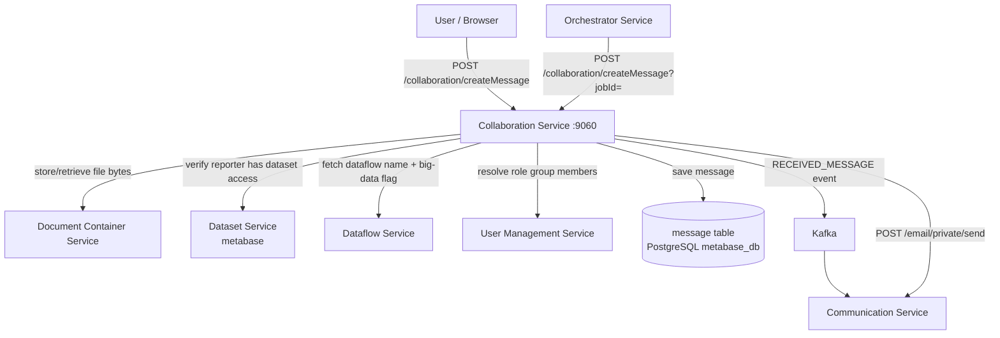

# Collaboration Service (:9060)

## Overview

The Collaboration Service is the technical feedback channel between data reporters and the dataflow custodians or stewards who manage a reporting obligation. Its purpose is to let these two parties exchange messages — and file attachments — within the context of a specific dataflow and data provider, without having to use external email as the primary medium.

The service is deliberately simple in scope. It stores messages, controls who can see and write them based on the sender's role, notifies the right recipients when a new message arrives, and sends a parallel email so that recipients are informed even when they are not logged into the platform. It does not make decisions about the reporting process itself; it only facilitates the conversation around it.

## Flow overview

---

## Domain model

There is a single entity: `Message`. Every message belongs to a specific `dataflowId` and `providerId` combination, forming a conversation thread between the team responsible for a reporting obligation and the specific data provider engaged in it.

The most important field on the entity is `direction`. This is a boolean that records which side of the conversation created the message: `true` means the message was written by the reporter side (lead reporter, reporter read, or reporter write roles), and `false` means it was written by the custodian or steward side. The direction flag is set automatically at creation time based on the sender's role — the user never sets it explicitly. The UI uses it to render the conversation with messages on the correct left or right side of the thread, and the access control logic uses it to determine which messages each party is allowed to mark as read.

The `type` field distinguishes between `TEXT` messages and `ATTACHMENT` messages. For attachments, the `content` field holds the file name rather than message text, and `fileSize` holds the byte count as a string. The actual file bytes are stored in the Document Service, not in the Collaboration Service's own database.

The `automatic` flag marks messages that were generated by the system rather than typed by a human — for example, automated notifications from the Orchestrator posted as messages in the thread. The `read` flag tracks whether the recipient has seen the message. Unread message counts are visible in the platform UI.

| Field | Type | What it represents |
|---|---|---|
| `id` | Long | Auto-generated primary key |
| `dataflowId` | Long | The reporting obligation this message belongs to |
| `providerId` | Long | The data provider this message concerns |
| `content` | String | Message text, or file name for attachments |
| `date` | Date | When the message was created |
| `direction` | boolean | `true` = reporter → custodian; `false` = custodian → reporter |
| `read` | boolean | Whether the recipient has read the message |
| `userName` | String | Who created the message |
| `type` | MessageTypeEnum | `TEXT` or `ATTACHMENT` |
| `automatic` | boolean | Whether the message was system-generated |
| `fileSize` | String | Byte count for attachment messages |
| `isBigData` | Boolean | Whether the parent dataflow is a big-data dataflow |

All messages are stored in a single `message` table in PostgreSQL. There is no separate thread or conversation entity — the dataflow and provider ID together implicitly define the thread.

---

## How it works

### Writing a message

When a user sends a text message, the service first resolves who is writing it. If the request comes from the platform UI the username is taken from the JWT in the security context. If the request arrives with a `jobId` parameter — used when the Orchestrator triggers an automated message — the service fetches the job's owner from the Job Service, generates an admin token, and temporarily switches the security context to that user's roles. This means automated messages appear in the thread under the correct user's name rather than under a generic system account.

Once the sender is established, `authorizeAndGetDirection()` determines whether the user has a reporter role or a custodian/steward role for this dataflow. Reporters must also have a dataset-level role for at least one of the datasets belonging to the given provider, confirming that they genuinely have access to that provider's data. If neither reporter nor custodian roles are found, the request is rejected with a `403 MESSAGING_AUTHORIZATION_FAILED`. If access is confirmed the direction flag is set and the message is saved.

If the message text exceeds the configured maximum length it is silently truncated before saving. The maximum length is controlled by the `spring.health.db.check.frequency` property — a property name inherited from a shared configuration key that is semantically mismatched with its purpose here. This is a known quirk in the configuration.

After saving, two asynchronous tasks are fired: a Kafka event that delivers an in-app notification, and an email sent to all relevant recipients. Both run on a separate thread pool so the HTTP response returns immediately without waiting for notifications to be dispatched.

### Writing an attachment

Attachment handling follows the same authorisation path but then diverges. The file bytes are uploaded to the Document Service via Feign, keyed by dataflow ID, message ID, and file name. The `Message` entity stores only the file name in its `content` field — the actual bytes live entirely in the Document Service. If the upload to the Document Service fails, the message entity is rolled back (the method is transactional).

The service also checks whether the dataflow is flagged as big-data. If it is, `isBigData` is set to `true` on the message. This flag is used by downstream consumers to apply any special handling needed for big-data contexts.

Comma characters are stripped from uploaded file names before storage. This prevents issues with file name parsing in downstream CSV-based processing.

### Reading messages

`findMessages()` returns a page of 50 messages sorted by date descending, filtered by the optional `read` parameter. It does not filter by direction — both sides of the conversation are returned in the same list so the UI can render a complete chronological thread. The caller is responsible for rendering messages from each direction in the appropriate visual position.

The total message count is returned alongside the page so the UI can calculate how many pages remain without issuing a separate count query.

When fetching attachment messages the service enriches the response with a `MessageAttachmentVO` that includes the file extension extracted from the name, the size, and the original name. The binary bytes are not included in the paginated list response — they are fetched separately via the `getMessageAttachment` endpoint, which streams the file from the Document Service directly to the caller.

### Marking messages as read

The update endpoint accepts a list of message IDs and a read flag. Before applying any update the service validates that the caller is authorised to modify every message in the list. The authorisation check is directional: custodians and stewards can only mark reporter messages (direction `true`) as read; reporters can only mark custodian messages (direction `false`) as read, and only for their own provider's messages. If any message in the list falls outside what the caller can touch, the entire request is rejected.

### Deleting a message

When a message is deleted, if the message type is `ATTACHMENT` the service first calls the Document Service to delete the stored file, then deletes the entity. Both steps are transactional together.

---

## Notification model

Every message creation triggers two independent notification paths, both asynchronous.

**In-app notification via Kafka** — The service publishes a `RECEIVED_MESSAGE` event (or `UPDATED_DATASET_STATUS` if called from the `notifyNewMessages` private endpoint). The Communication Service consumes these events and delivers them to connected browsers over WebSocket, so the recipient sees a notification badge update without polling.

**Email notification** — The service determines the recipient email addresses by role, formats an email using the `TECH_ACCEPT_MESSAGE` template, and dispatches it via the Email Controller. The email subject is `Technical feedback - {provider label} - {dataflow name}` and the body includes the dataflow name, the timestamp formatted in the Europe/Paris timezone, and the message content.

The recipient set for both notification types is computed by the same logic in `CollaborationServiceHelper.buildUserAndEmailSets()`:

- If the sender is a reporter (direction `true`): notify all users in the `DATAFLOW_CUSTODIAN` and `DATAFLOW_STEWARD` Keycloak groups for the dataflow.
- If the sender is a custodian or steward (direction `false`): look up all dataset IDs belonging to the provider within the dataflow, then notify all users in `DATASET_LEAD_REPORTER`, `DATASET_REPORTER_READ`, and `DATASET_REPORTER_WRITE` groups for those datasets.

This means a custodian's message notifies only the reporters for that specific provider's datasets — not reporters for other providers in the same dataflow.

Email notifications can be suppressed by passing `emailNotification=false` on the create message endpoint. This is used by automated flows that generate messages programmatically and want to avoid sending an email for every system action.

---

## Relationships with other services

The **Document Service** stores and retrieves all file attachments. The Collaboration Service has no local file storage — it holds only the file name as a pointer.

The **Dataset Metabase Service** is called to validate that a reporter has access to at least one dataset under the given provider, and to look up which dataset IDs belong to a provider when computing notification recipients.

The **Dataflow Service** is called to fetch the dataflow name for notifications and email subjects, and to check whether the dataflow is a big-data dataflow when attaching files.

The **User Management Service** is called to look up the members of Keycloak role groups (custodians, stewards, reporters) so the service knows who to notify. It is also called to generate an admin token when the service needs to perform a security context switch for job-triggered messages.

The **Job Service** is called when a `jobId` is present on a create-message request, to fetch the job's owner and perform the context switch.

The **Representative Service** is called to resolve the human-readable label of a data provider, used in the email subject line.

The **Email Controller** (Communication Service) receives the assembled `EmailVO` and dispatches the actual SMTP message.

The **Orchestrator** calls the private `POST /collaboration/createMessage` endpoint to post automated messages into threads — for example, when a release or validation event generates a feedback message that should appear in the technical feedback thread.

---

## Access control

Every public endpoint is protected with Spring Security role checks. The roles that may access the collaboration endpoints are: `DATAFLOW_STEWARD`, `DATAFLOW_CUSTODIAN`, `DATAFLOW_STEWARD_SUPPORT`, `DATAFLOW_LEAD_REPORTER`, `DATAFLOW_REPORTER_READ`, `DATAFLOW_REPORTER_WRITE`, and `ADMIN`.

Beyond the endpoint-level role check, the service enforces a second layer of authorisation inside the service itself via `authorizeAndGetDirection()`. This checks that the user's role is valid for the specific dataflow and provider combination being accessed — not just that they have a collaboration role in general. A reporter for dataflow A cannot write to dataflow B's thread even if both dataflows are open for reporting.

The `direction` flag that emerges from this check is the authoritative record of who created each message. It cannot be spoofed by the caller — it is always derived from the sender's actual role at creation time.

---

## API summary

| Method | Path | Purpose |
|---|---|---|
| POST | `/collaboration/createMessage/dataflow/{dataflowId}` | Send a text message |
| POST | `/collaboration/createMessage/dataflow/{dataflowId}/attachment` | Upload a file attachment |
| PUT | `/collaboration/updateMessageReadStatus/dataflow/{dataflowId}` | Mark messages as read or unread |
| DELETE | `/collaboration/deleteMessage/dataflow/{dataflowId}` | Delete a message (and its file if an attachment) |
| GET | `/collaboration/findMessages/dataflow/{dataflowId}` | Retrieve paginated message thread |
| GET | `/collaboration/findMessages/dataflow/{dataflowId}/getMessageAttachment` | Download an attachment file |
| GET | `/collaboration/private/notifyNewMessages` | Trigger notifications (called by other services) |
| GET | `/collaboration/private/getMessageById/{messageId}` | Fetch a single message by ID |
| PUT | `/collaboration/private/setBigData/{messageId}` | Set the big-data flag on a message |

---

## Configuration

| Property | Purpose |
|---|---|
| `spring.health.db.check.frequency` | Maximum message text length before truncation (property name is misleading — this is a shared config key repurposed here) |
| `spring.servlet.multipart.max-file-size` | Maximum file size for attachment uploads |
| `spring.servlet.multipart.max-request-size` | Maximum total request size for multipart uploads |
| `eea.keycloak.admin.user` / `admin.password` | Admin credentials used to generate tokens for security context switching on job-triggered messages |
