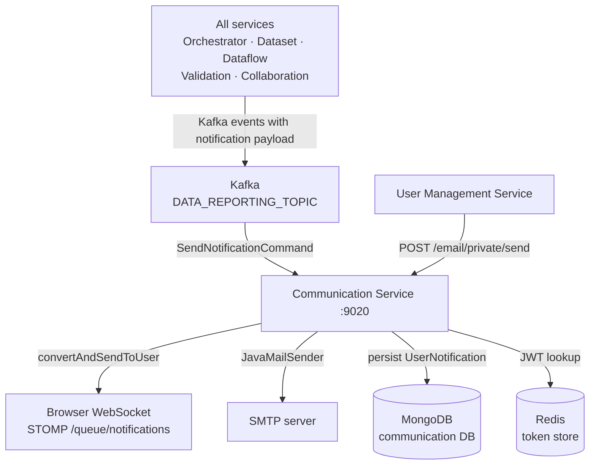

# Communication Support Service

The Communication Support Service is the notification backbone of Reportnet 3. It delivers real-time in-app notifications to browser clients via WebSocket and sends email through SMTP. Every other service in the platform treats it as a passive recipient: they publish Kafka events describing what happened, and the Communication Service decides whether a connected user's browser should be told about it immediately. The service also stores every notification it creates in MongoDB so that users who were not connected at the time can retrieve them later.

The service does not initiate actions. It does not call other services for business logic. Its sole job is to relay information from the event bus to human users through whatever channel is appropriate.

The service runs on port 9020 and stores data in a MongoDB database named `communication`.

## Flow overview



---

## Domain model

### User notifications

A user notification is a record of something that happened in the platform that a specific user needs to know about. Each notification is persisted as a document in the `UserNotification` MongoDB collection. The schema is intentionally denormalised: rather than storing a reference to a dataflow ID and joining at query time, the document carries the dataflow name, dataset name, provider name, and any other context that was available when the notification was created. This means the notification remains meaningful even if the underlying objects are renamed or deleted.

| Field | Notes |
|---|---|
| `userId` | The Keycloak username of the recipient |
| `eventType` | String representation of the Kafka event type (e.g. `VALIDATION_FINISHED_EVENT`) |
| `insertDate` | When the notification was stored |
| `dataflowId` / `dataflowName` | The dataflow involved, if any |
| `datasetId` / `datasetName` | The dataset involved, if any |
| `providerId` / `dataProviderName` | The data provider involved, if any |
| `typeStatus` | Dataflow status at the time of the event |
| `datasetStatus` | Dataset status at the time of the event |
| `fileName` | File name, for import/export events |
| `error` | Error message, for failure events |
| `invalidRules` / `disabledRules` | Counts of validation rule problems |
| `tableName` / `fieldName` | For field-level validation events |
| `recordLines` | Which lines in the data were affected |
| `customContent` | A `Map<String, String>` for any extra key-value context not covered by the fixed fields |
| `shortCode` | Short code identifier for validation rules |
| `preparationCode` / `preparationDatasetMessagePart` | Context for preparation dataset workflows |
| `nonLatinCharacters` | Comma-separated non-Latin characters found during import |

The `customContent` map exists as an escape hatch. When a service publishes an event with data that does not fit any of the named fields, it puts the extra data there. This avoids schema changes for every new event type.

### System notifications

System notifications are administrator-broadcast messages displayed to all authenticated users simultaneously — maintenance windows, service alerts, or platform-wide announcements. They are stored in the `SystemNotification` MongoDB collection with three fields: `message` (capped at 300 characters), `enabled` (whether it is currently displayed), and `level` (`SUCCESS`, `INFO`, or `ERROR`).

The `enabled` flag is used as a soft delete mechanism. An administrator can create a system notification, then disable it without losing the record. When the last enabled system notification is disabled or deleted, the service broadcasts a `NO_ENABLED_SYSTEM_NOTIFICATIONS` event to all connected clients so the UI can remove the banner immediately.

---

## How it works

### In-app notifications via WebSocket

The service embeds a STOMP/WebSocket broker at the endpoint `/communication/reportnet-websocket`. Browser clients connect to this endpoint on startup, authenticating by passing their session token as a STOMP header named `token`. The `WebsocketChannelInterceptor` intercepts every STOMP CONNECT frame, validates the token using the shared `JwtTokenProvider`, extracts the username, and registers a `StompPrincipal` for the session. If validation fails, the interceptor sends a STOMP ERROR frame and closes the connection.

Once connected, the browser subscribes to two queues:
- `/user/queue/notifications` — user-specific notifications
- `/user/queue/systemnotifications` — system-wide broadcast messages

User-specific messages are delivered via `SimpMessagingTemplate.convertAndSendToUser()`. Spring's STOMP broker resolves the username to the specific socket session and delivers the message only to that user's connected clients. This means a user logged in on two browsers simultaneously will receive the notification on both.

The `Notification` object sent over the WebSocket contains an `EventType` (the Kafka event type that triggered it) and a `Map<String, Object>` of arbitrary content. The browser's frontend interprets the event type to decide how to render the notification.

### Consuming Kafka events

`SendNotificationCommand` is registered as a handler for every event on the Kafka `DATA_REPORTING_TOPIC`. When an event arrives, it inspects the event's data map for a key named `"notification"`. If that key is present, the value is a nested map of notification data and the outer map contains a `"user"` key identifying the recipient. The command strips the `"user"` key, packs the rest into a `Notification` object, and calls `NotificationServiceImpl.send()` to deliver it via WebSocket.

This design means the Communication Service has no knowledge of specific event types. Any service that wants to send a real-time notification publishes a Kafka event carrying a `notification` map. The shape of that map is the caller's responsibility. The Communication Service forwards it verbatim to the browser. It is the frontend's responsibility to know what to display for each event type.

Not all Kafka events carry a `notification` key. Events that only drive backend state changes (e.g. triggering another service) pass through `SendNotificationCommand` without any action.

### Persisting user notifications

User notifications can be created via two routes. The first is the REST endpoint `POST /notification/createUserNotification`, called by other services via Feign when they want to store a notification that the user can retrieve later. The second is `POST /notification/private/createUserNotification`, an unauthenticated internal endpoint that accepts a raw `eventType` string and a `UserNotificationContentVO`, which the service wraps and stores. In both cases, `insertDate` is set at storage time, and the `userId` is taken either from the notification content or from the JWT security context.

There is no automatic linkage between the Kafka-triggered WebSocket delivery and the MongoDB persistence. Delivering a notification in real time via WebSocket does not automatically store it. The two mechanisms are independent. If a service wants a notification to be both real-time and persistent, it must publish the Kafka event (for WebSocket delivery) and also call the REST endpoint (for persistence).

### Retrieving notifications

`GET /notification/findUserNotifications` returns a paginated list of the authenticated user's stored notifications, sorted newest-first by `insertDate`. The response includes a `totalRecords` count so the frontend can render a page navigator. There is no filtering by event type — all of a user's notifications are returned in reverse chronological order.

`GET /notification/findSystemNotifications` behaves differently based on the caller's role: administrators see all system notifications including disabled ones; non-administrators see only enabled ones. The `GET /notification/checkAnySystemNotificationEnabled` endpoint provides a fast boolean check without fetching the full list, used by the frontend to decide whether to render the system notification banner at all.

### Email

Email is sent synchronously via `JavaMailSender` over SMTP. The `POST /email/private/send` endpoint accepts an `EmailVO` containing recipients (`to`, `cc`, `bcc`), a subject, and a plain-text body. There is no HTML support and no template engine — callers are responsible for composing the message text. The endpoint is a private (unauthenticated) path, intended for internal service calls only.

If `spring.mail.active` is set to `false`, the service logs the suppression and returns without error. This allows mail to be disabled in non-production environments without changing caller behaviour.

Email delivery is not queued. The `send()` call blocks until the SMTP server accepts the message. If the SMTP server is slow or unreachable, the HTTP call to `/email/private/send` will block for the duration of the timeout. There is no retry mechanism. Measured SMTP call durations range from 130 ms to 600 ms. Because multiple services call this endpoint synchronously as part of their main business logic, email latency accumulates into user-visible response times on any operation that triggers a notification.

---

## Relationships with other services

Every service that produces user-facing events is a caller of the Communication Service, either via Kafka (for real-time notifications) or via Feign (`NotificationControllerZuul` for persistent storage). The Communication Service itself makes no outbound Feign calls — it is a pure sink.

**Orchestrator Service.** Publishes Kafka events for job completion, failure, and status changes. These events carry `notification` payloads so that release and import completions reach the user in real time.

**Dataset Service.** Publishes events for import completion and failure, validation results, and schema exports. Also calls `POST /notification/private/createUserNotification` via Feign when it needs a notification stored for later retrieval.

**Dataflow Service.** Publishes events for dataflow deletion, reporter validation, and schema export completion.

**Validation Service.** Publishes `VALIDATION_FINISHED_EVENT` and related events after rule execution completes.

**User Management Service.** Calls the email endpoint to send invitation and lead-reporter validation emails. It composes the full message text before calling.

**All services.** Any service can call `NotificationControllerZuul` via Feign to store a user notification. The call pattern is standardised in the common Feign client interface and does not require the calling service to know anything about MongoDB.

---

## Process flows

### Real-time notification delivery

```
1. Any service: publish Kafka event to DATA_REPORTING_TOPIC
   data = { "notification": { "key": "value", ... }, "user": "username", ... }
2. Communication Service: SendNotificationCommand.execute(EEAEventVO)
3. Check eeaEventVO.getData().containsKey("notification") → true
4. Extract notification map, remove "user" key
5. NotificationServiceImpl.send(user, eventType, notificationMap)
6. Pack in Notification(type, content)
7. SimpMessagingTemplate.convertAndSendToUser(user, "/queue/notifications", notification)
8. STOMP broker routes to user's connected WebSocket session(s)
9. Browser receives and renders notification
```

### Creating and broadcasting a system notification

```
1. Admin: POST /notification/createSystemNotification  (body: SystemNotificationVO)
2. Validate ADMIN role
3. Truncate message to 300 characters
4. Save SystemNotification to MongoDB
5. SimpMessagingTemplate.convertAndSendToUser("*", "/queue/systemnotifications", systemNotificationVO)
6. All connected clients receive and display the banner
```

### Disabling/deleting a system notification

```
1. Admin: DELETE /notification/deleteSystemNotification/{id}
2. Set enabled=false (soft delete) in MongoDB
3. Check existsByEnabledTrue() → false
4. SimpMessagingTemplate send NO_ENABLED_SYSTEM_NOTIFICATIONS event to all clients
5. All browsers remove the system notification banner
```

### WebSocket connection authentication

```
1. Browser: STOMP CONNECT  headers: { token: "UUID-session-key" }
2. WebsocketChannelInterceptor.preSend()
3. JwtTokenProvider.retrieveToken(token) → looks up UUID in Redis → returns real JWT
4. Extract preferredUsername from JWT
5. Set StompPrincipal(username) on message accessor
6. Connection established; session associated with username

On failure:
3b. VerificationException thrown
4b. Interceptor sends STOMP ERROR frame: "Token validation failed"
5b. Connection closed
```

---

## Configuration

```yaml
server:
  port: 9020

spring:
  application:
    name: communication

  # MongoDB
  data:
    mongodb:
      uri: mongodb://${mongodb.hosts}
      # Database: "communication" (hard-coded in UserNotificationConfiguration)

  # Email
  mail:
    active: <true|false>              # Master switch; false disables all email sending
    host: <smtp-host>
    port: <smtp-port>
    username: <smtp-username>
    password: <smtp-password>
    from: <sender-address>
    properties:
      mail.smtp.auth: true
      mail.smtp.starttls.enable: true
```

**`spring.mail.active`.** This is the most important operational flag. When false, email calls succeed silently without sending anything. In non-production environments this prevents accidental email delivery to real addresses during testing.

**MongoDB collection growth.** User notifications are never automatically deleted. Over time the `UserNotification` collection will grow without bound. There is no built-in TTL or archival mechanism; operators must manage collection size at the database level if storage becomes a concern.

**WebSocket broker.** The service uses Spring's in-memory STOMP broker. This means WebSocket state is local to each pod — a user connected to pod A will not receive messages published on pod B. In a multi-replica deployment, this is only safe if the load balancer uses sticky sessions or if a Redis-backed broker is introduced. The current configuration assumes a single active instance or a sticky-session setup.
