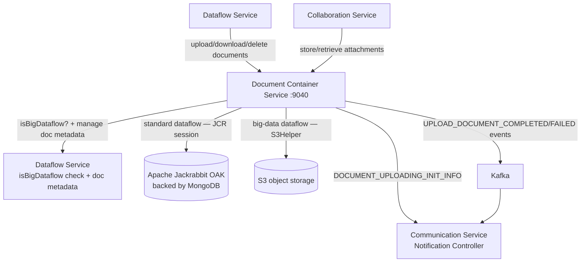

# Document Container Service (:9040)

## Overview

The Document Container Service is the file storage layer for Reportnet3. It stores and retrieves binary files on behalf of the rest of the platform — supporting documents that dataflow custodians attach to a reporting obligation, JSON schema snapshots that record the state of a dataset design at a point in time, and file attachments exchanged in the technical feedback thread between reporters and custodians.

The service deliberately owns only the file bytes. Metadata about documents — their name, description, language, whether they are public, when they were uploaded — lives in the Dataflow Service's metabase database. The Document Container holds a pointer to that metadata (a document ID) and uses it as the file's storage key, but it does not duplicate the metadata locally.

The storage backend is not fixed. The service routes between two completely different backends at runtime depending on whether the parent dataflow is flagged as big-data. Standard dataflows use Apache Jackrabbit OAK, a content repository backed by MongoDB. Big-data dataflows use S3 object storage. The caller has no awareness of which backend is in use — the same API endpoints serve both, and the routing decision is made transparently inside the service.

## Flow overview



---

## Storage backends

### Apache Jackrabbit OAK (standard dataflows)

OAK is a content repository that implements the Java Content Repository (JCR) standard. It provides a hierarchical node tree — similar in concept to a filesystem — backed by MongoDB as its document store. File content is stored as `Binary` properties on JCR nodes, and the MongoDB collection that holds all OAK data is configured by the `nameOakCollection` Consul KV entry.

Every file operation opens a new JCR `Session` authenticated with the configured `oakUser` credentials, performs the operation, saves the session, and closes it. OAK sessions are not pooled — each request acquires and releases its own session.

The node tree is structured as follows:

```
Root
├── {dataflowId}/
│   └── {documentId}          ← nt:file node, named by numeric document ID
│       └── jcr:content       ← nt:resource node
│           ├── jcr:data      ← Binary (actual file bytes)
│           ├── jcr:mimeType  ← content type string
│           └── jcr:lastModified
├── snapshotSchema/
│   └── {designDatasetId}/
│       └── {fileName}        ← schema JSON snapshots
└── collaboration/
    └── dataflow/
        └── {dataflowId}/
            └── {messageId}_{fileName}  ← feedback thread attachments
```

After every delete operation the service runs a two-phase garbage collection cycle. OAK stores binary data separately from node metadata, so removing a node does not immediately free the binary blobs it references. The service first runs version garbage collection, then a mark-sweep pass (`MarkSweepGarbageCollector`) that identifies unreferenced blobs and removes them from MongoDB. This collection is triggered on-demand after each delete rather than on a schedule.

### S3 (big-data dataflows)

For big-data dataflows, files are stored in S3-compatible object storage. The service stages uploaded files to a local temporary directory (configured by `importPath`) before streaming them to S3, and cleans up the local file afterwards. Downloads retrieve bytes directly from S3 via the `S3Helper`.

The S3 path structure follows the same conventions described in [dremio_s3.md](dremio_s3.md), using two separate path constants:

- Supporting documents land under `S3_SUPPORTING_DOCUMENTS_FILE_PATH/{dataflowId}/document_{id}_{originalFileName}`
- Collaboration attachments land under `S3_TECHNICAL_ACCEPTANCE_FILE_PATH/{dataflowId}/message_{messageId}_{fileName}` (with provider ID embedded in the path resolver)

Schema snapshots are not routed to S3 — they always go through OAK regardless of the dataflow type, because they are associated with design datasets rather than with any dataflow.

### The routing decision

Every time a caller uploads, downloads, or deletes a dataflow document or collaboration attachment, the service calls `DataFlowControllerZuul.isBigDataflow()` to determine which backend to use. This Feign call adds one round-trip to every file operation. The `isBigData` flag on the `DocumentVO` also carries this information once a document has been created, so retrieval operations can use the stored flag rather than making a fresh dataflow call.

---

## Document types

Three distinct document categories are stored, each with a different storage path, access pattern, and purpose.

### Dataflow support documents

These are files that a dataflow custodian or steward uploads as reference material for a reporting obligation — guidance documents, templates, legal references, or anything else reporters need access to while submitting data. They are associated with a dataflow, carry full metadata (name, description, language, public flag), and can be listed, downloaded, updated, and deleted through the standard document endpoints.

The `isPublic` flag on a document controls whether it is accessible without authentication. Public documents can be fetched via `GET /document/public/{documentId}` with no JWT token required. Non-public documents require the caller to hold an appropriate dataflow role.

When a document is cloned as part of duplicating a dataflow, the service copies both the metadata record (creating a new entry in the metabase) and the file itself (copying the binary in OAK or using S3 server-side copy).

### Schema snapshots

When a dataset design is snapshotted — preserving the exact schema definition at a point in time — the Dataflow Service calls the Document Container to store the snapshot JSON. These are not end-user documents; they are internal platform artefacts. They are stored under `/snapshotSchema/{designDatasetId}/` in OAK and retrieved by file name, not by a numeric document ID. They have no associated metadata record in the metabase and no public access option.

### Collaboration attachments

When a user uploads a file attachment in the technical feedback thread, the Collaboration Service calls the Document Container's private API to store it. The attachment is keyed by the combination of the dataflow ID and the message ID, with the original file name appended. Retrieval and deletion are similarly keyed — there is no numeric document ID for attachments; the message ID serves that purpose.

For big-data dataflows, collaboration attachments also carry a provider ID, which is used to build the correct S3 path. The Document Container calls `CollaborationControllerZuul.getMessage()` to retrieve this provider ID when it is not supplied directly in the request.

---

## How file operations work

### Uploading

All file write operations are asynchronous. The HTTP response returns before the file has reached its storage destination. Before returning, the service sends a `DOCUMENT_UPLOADING_INIT_INFO` notification to the user via the Notification Controller, signalling that the upload has started. The async task then stores the file and publishes either `UPLOAD_DOCUMENT_COMPLETED_EVENT` or `UPLOAD_DOCUMENT_FAILED_EVENT` to Kafka. The Communication Service delivers these events to the user's browser as real-time notifications.

For dataflow documents, the service first inserts a metadata record into the Dataflow Service to get a numeric document ID, then uses that ID as the file's node name in OAK (or embeds it in the S3 object key). This ensures the ID is known before storage begins and means the file can always be found by ID without scanning.

Files must have an extension. A file with no extension is rejected before any storage attempt.

### Downloading

Downloads are synchronous. The service fetches the file bytes from OAK or S3 and streams them back in the HTTP response with `Content-Type: application/octet-stream`. For OAK, the content type is read from the `jcr:mimeType` property stored alongside the binary. Collaboration document downloads have a 65-second Hystrix timeout because these files can be large and the OAK read path involves MongoDB round-trips.

### Updating

A document update can replace the file, update the metadata, or both. If a new file is provided, the old file is deleted from storage first and a new one is written under the same document ID. If only metadata changes (description, language, public flag), no storage operation occurs — only the metabase record is updated via `DataFlowDocumentControllerZuul.updateDocument()`.

### Deleting

Deletion is asynchronous, following the same notification pattern as upload. For OAK storage, deletion runs garbage collection after removing the node. For S3, the object is deleted directly. If the `deleteMetabase` parameter is `true` (the default), the metadata record in the Dataflow Service is also removed.

---

## Relationships with other services

The **Dataflow Service** is the primary dependency. The Document Container calls it for two distinct purposes: to manage document metadata via `DataFlowDocumentControllerZuul` (insert, update, delete, list, fetch by ID), and to check whether a dataflow is big-data via `DataFlowControllerZuul.isBigDataflow()`. Every file operation touches the Dataflow Service at least once.

The **Collaboration Service** is called when handling collaboration attachments for big-data dataflows. The Document Container calls `CollaborationControllerZuul.getMessage()` to retrieve the provider ID associated with a message, because that ID is required to build the correct S3 path.

The **Notification Controller** receives calls at the start of uploads and deletes to send the user an in-progress notification. This is a synchronous Feign call that happens before the async file operation begins.

The **Communication Service** (via Kafka) receives completion and failure events after async operations finish, and delivers them to the browser as real-time notifications.

The **S3 storage layer** (shared with the Dataset Service and Validation Service) handles all big-data file operations. The Document Container uses the same `S3Helper` and path resolver infrastructure described in [dremio_s3.md](dremio_s3.md).

---

## API summary

| Method | Path | Purpose | Async |
|---|---|---|---|
| POST | `/document/v1/upload/{dataflowId}` | Upload support document | Yes |
| GET | `/document/v1/{documentId}/dataflow/{dataflowId}` | Download support document | No |
| DELETE | `/document/v1/{documentId}/dataflow/{dataflowId}` | Delete support document | Yes |
| PUT | `/document/v1/update/{idDocument}/dataflow/{dataflowId}` | Update document or metadata | No |
| GET | `/document/v1/dataflow/{dataflowId}` | List all documents for a dataflow | No |
| GET | `/document/public/{documentId}` | Download a public document (no auth) | No |
| POST | `/document/private/upload/{designDatasetId}/snapshot` | Store a schema snapshot | Yes |
| GET | `/document/private/{idDesignDataset}/snapshot` | Retrieve a schema snapshot | No |
| DELETE | `/document/private/{idDesignDataset}/snapshot` | Delete a schema snapshot | Yes |
| POST | `/document/private/upload/{dataflowId}/collaborationattachment` | Store a feedback attachment | Yes |
| GET | `/document/private/{dataflowId}/collaborationattachment` | Retrieve a feedback attachment | No |
| DELETE | `/document/private/{dataflowId}/collaborationattachment` | Delete a feedback attachment | Yes |
| POST | `/document/private/cloneAllDocuments` | Clone all documents to another dataflow | No |

Private endpoints have no role guard — access is controlled by network policy. Public endpoints are open with no token. All remaining endpoints require a dataflow-level role; write operations require custodian or steward roles, read operations accept a wider set including reporter roles.

---

## File naming in storage

Because the service stores files under internal keys rather than original names, there is a mapping worth understanding when investigating what lives in OAK or S3.

| Document type | Storage backend | Key / path |
|---|---|---|
| Dataflow support document | OAK | `/{dataflowId}/{documentId}` — numeric ID, no filename |
| Dataflow support document | S3 | `…/{dataflowId}/document_{id}_{originalFileName}` |
| Schema snapshot | OAK | `/snapshotSchema/{designDatasetId}/{fileName}` — original name preserved |
| Collaboration attachment | OAK | `/collaboration/dataflow/{dataflowId}/{messageId}_{fileName}` |
| Collaboration attachment | S3 | `…/message_{messageId}_{fileName}` |

The original file name is never the primary key for dataflow documents — the numeric document ID is. The original name is preserved only in the metabase and in S3 object keys (as a suffix for readability). In OAK, dataflow document nodes are named by their numeric ID, so there is no way to identify a file by name alone when browsing the OAK tree.

---

## Configuration

| Property | Purpose |
|---|---|
| `nameOakCollection` | MongoDB collection name used by OAK for its node store |
| `mongodb.hosts` / `mongodb.primary.port` | MongoDB connection for OAK backend |
| `oakUser` | Username for JCR session login |
| `targetDirectory` | Working directory used by OAK garbage collector |
| `importPath` | Local staging directory for big-data uploads before S3 transfer |
| `spring.servlet.multipart.max-file-size` | Maximum size of an individual uploaded file |
| `spring.servlet.multipart.max-request-size` | Maximum total multipart request size |
