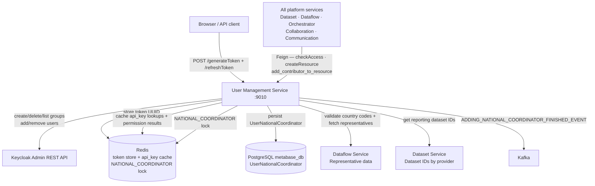

# User Management Service

The User Management Service (UMS) is the authorisation and identity gateway for the entire Reportnet3 platform. It sits between the application and Keycloak, translating the platform's resource-based permission model into Keycloak group memberships and back. When any service needs to know whether a user may act on a resource, it calls the UMS; when a dataflow is created or a dataset provisioned, the caller creates corresponding Keycloak groups through the UMS. The service does not have its own user store — every identity lives in Keycloak, and the UMS is the only service that talks directly to the Keycloak Admin REST API.

The UMS also handles token issuance for the initial browser login and API key authentication for programmatic access, making it the single point of entry for all authentication flows in addition to authorisation queries.

## Flow overview



---

## The authorisation model

Reportnet3 uses Keycloak groups as its authorisation model. There is no separate permissions table or ACL — a user's rights on a resource are determined entirely by which Keycloak groups they belong to.

Every group name follows the pattern `<ResourceType>-<ResourceId>-<RoleName>`. When code needs to check whether a user is a data steward on dataset 42, it looks for the user in the group `Dataset-42-DATA_STEWARD`. The `ResourceGroupEnum` class encodes all valid combinations, and its `getGroupName(id)` method generates the correctly formatted string.

The resource types that have Keycloak groups are: `Dataflow`, `Dataset`, `Dataschema`, `DataCollection`, `EUDataset`, `TestDataset`, `ReferenceDataset`, and `Provider`. Every dataset type in the platform has its own family of groups because different dataset types carry different role sets. For example, `ReferenceDataset` does not have a `REPORTER_WRITE` group because reference datasets are not reporter-submitted.

The security roles defined across the platform are:

| Role | Purpose |
|---|---|
| `DATA_CUSTODIAN` | Full administrative control over a resource |
| `DATA_STEWARD` | Configuration and review access |
| `STEWARD_SUPPORT` | Assists stewards; read-heavy access |
| `DATA_OBSERVER` | Read-only view of a resource |
| `DATA_REQUESTER` | Limited read access to request data |
| `LEAD_REPORTER` | Leads data submission for a country |
| `REPORTER_READ` | Read the reporting dataset only |
| `REPORTER_WRITE` | Submit data to the reporting dataset |
| `EDITOR_READ` | Read the dataflow schema design |
| `EDITOR_WRITE` | Modify the dataflow schema design |
| `NATIONAL_COORDINATOR` | Cross-country coordinator role (see below) |
| `ADMIN` | Platform-wide superuser |

When a user authenticates, Keycloak embeds their group memberships in the JWT. Other services decode the token and extract the groups to derive what the user may do. The UMS can also answer permission queries directly via the `GET /user/checkAccess` endpoint, and returns a structured list of the user's current resource grants via `GET /user/resources`.

---

## Domain model

The UMS does not define JPA entities — it has no database of its own. Its domain model lives in Keycloak and in the shared `common-interfaces` module.

**`ResourceGroupEnum`** — the authoritative list of all group name patterns. Each entry is a format string such as `"Dataset-%s-DATA_STEWARD"`. The enum's `getGroupName(Long id)` method substitutes the resource ID to produce the actual group name. The static factory method `fromResourceTypeAndSecurityRole(ResourceTypeEnum, SecurityRoleEnum)` performs the reverse lookup: given a resource type and role, it returns the matching enum value.

**`SecurityRoleEnum`** — the thirteen platform roles listed above. Used throughout the codebase as a safe alternative to bare strings when checking or assigning roles.

**`ResourceTypeEnum`** — the set of resource types: `DATAFLOW`, `DATASET`, `DATASCHEMA`, `DATA_COLLECTION`, `EUDATASET`, `TEST_DATASET`, `REFERENCE_DATASET`, `PROVIDER`.

**`ResourceInfoVO`** — the wire representation of a Keycloak group, carrying `resourceId`, `resourceTypeEnum`, `securityRoleEnum`, and optional `attributes`. Passed to the resource management endpoints when creating or querying groups.

**`ResourceAccessVO`** — the result type when querying what groups a user belongs to. Carries `resource` (the resource ID), `resourceType`, and `securityRole`. The UMS builds this by parsing the group name back into its constituent parts.

**`ResourceAssignationVO`** — combines an email address, a resource ID, and a `ResourceGroupEnum` value. Used for bulk add/remove operations that assign a list of users to a list of groups atomically with rollback.

**`UserNationalCoordinator`** — a JPA entity stored in the platform's PostgreSQL metabase. Tracks national coordinator assignments independently of the Keycloak group. Only the UMS writes to this table; it mirrors the group state to allow reporting queries without calling Keycloak.

---

## How it works

### Token issuance and refresh

The UMS exposes three token endpoints at `/user`: `POST /generateToken` for password-based login, `POST /generateTokenByCode` for OAuth2 authorisation-code flow, and `POST /refreshToken` for refresh. In each case the UMS calls the Keycloak token endpoint directly and returns the resulting access and refresh tokens to the caller. The tokens are standard JWTs issued by Keycloak; the UMS does not sign or modify them.

### Maintaining the admin token

The UMS needs a long-lived Keycloak admin session to make Admin REST API calls on behalf of the application. `TokenMonitor` is a thread-safe Spring component that holds the current admin access token. Its `getToken()` method is `synchronized` and compares the current time against `lastUpdateTime + tokenExpirationTime` before returning the token. If the token has expired, it first tries to refresh using the stored refresh token, and falls back to a full admin credential login if the refresh fails. The expiration window is pulled from Consul KV under the key `eea.keycloak.admin.token.expiration`. All calls from `KeycloakConnectorServiceImpl` into the Keycloak Admin API retrieve the current admin token through this monitor.

### Creating resources

When a dataflow, dataset, or other resource is provisioned, the caller invokes `POST /resource/create` (single group) or `POST /resource/createList` (batch). The UMS translates each `ResourceInfoVO` into a Keycloak group name using `ResourceGroupEnum`, sets the group's path to `/<groupName>`, and calls the Keycloak Admin Groups API to create it. Group attributes can be passed along in the `ResourceInfoVO` to embed arbitrary metadata in Keycloak.

Deleting a resource follows the same pattern in reverse. The `DELETE /resource/delete_by_dataset_id` endpoint accepts a list of dataset IDs and deletes every group whose name contains any of those IDs, which covers all roles for all dataset types associated with those datasets in a single call.

### Assigning users to resources

The `PUT /user/add_contributor_to_resource` endpoint assigns a user by email to a Keycloak group identified by `ResourceGroupEnum` and resource ID. The UMS resolves the email to a Keycloak user ID using the in-memory user cache. If the user is not found in the cache, the cache is invalidated and rebuilt from Keycloak before trying again. Once the user ID is resolved, the UMS calls the Keycloak Admin Users API to add the user to the group.

Bulk assignments use `ResourceAssignationVO` lists. The `addContributorsToUserGroup` method processes assignments one at a time, collecting the resolved `UserRepresentation` objects as it goes. If any single assignment fails, it rolls back all preceding assignments in the batch by removing the already-added users from their groups before re-throwing the exception.

### In-memory user cache

`KeycloakSecurityProviderInterfaceService` maintains a `List<UserRepresentation>` that is populated at startup by calling `keycloakConnectorService.getUsers()`. The list is held in memory and protected by `synchronized` blocks. When a user is not found by email during a group assignment, the list is cleared and reloaded from Keycloak. The Keycloak `listUsersMax` configuration key (from Consul) caps how many users are returned in a single call; this matters in large deployments where the user population exceeds the default page size.

### Access checking

`GET /user/checkAccess` verifies whether the authenticated user has a specific access role on a given resource. The Spring Security context already holds the user's authorities from the JWT, so this endpoint performs an in-memory check against the current `Authentication` object rather than calling Keycloak again. Other services call this endpoint through a Feign client when they need to enforce access control outside their own Spring Security annotations.

### API key authentication

`POST /user/createApiKey` generates a UUID and stores it as a Keycloak user attribute scoped to a `dataflowId_dataProviderId` pair. The attribute key is the scope string and the value is the UUID. `POST /user/authenticateByApiKey/{apiKey}` scans the Keycloak user store for a user whose attributes contain the given API key value, then issues a full token for that user using admin impersonation. This path is used by automated systems that cannot participate in an OAuth2 browser flow.

---

## National coordinator flow

A national coordinator is a user who holds oversight rights over all reporting datasets belonging to all data providers for a specific country within a given dataflow. Because a country may have dozens of reporting datasets, assigning a national coordinator requires creating and populating multiple Keycloak groups atomically.

The `UserNationalCoordinatorServiceImpl.createNationalCoordinator` method is `@Async` and protected by a Redis distributed lock keyed `NATIONAL_COORDINATOR_<countryCode>` to prevent concurrent modifications for the same country.

The creation flow proceeds as follows:

```
1. Validate email format
2. Look up user in Keycloak to verify the account exists
3. Call RepresentativeControllerZuul.findDataProvidersByCode to verify the country code is valid
4. Acquire Redis lock on NATIONAL_COORDINATOR_<countryCode>
5. Create Keycloak group Provider-<countryCode>-NATIONAL_COORDINATOR
6. Add user to that group
7. Call DataSetMetabaseControllerZuul.findReportingDataSetByProviderIds to get all datasets for those providers
8. For each dataset, create Dataset-<datasetId>-NATIONAL_COORDINATOR group
9. Add user to each dataset group
10. Also add user to the Dataflow-<dataflowId>-NATIONAL_COORDINATOR group
11. Persist a UserNationalCoordinator record in the metabase database
12. Release Redis lock
13. Publish ADDING_NATIONAL_COORDINATOR_FINISHED_EVENT to Kafka
```

Deletion follows the same path in reverse, removing the user from all groups, deleting the groups, removing the metabase record, and publishing `DELETING_NATIONAL_COORDINATOR_FINISHED_EVENT`.

If the country code is not found or the user account does not exist in Keycloak, the operation publishes a failure event (such as `EMAIL_NOT_FOUND_NATIONAL_COORDINATOR_EVENT`) instead and returns without making any changes.

---

## User role queries and export

`UserRoleServiceImpl` handles queries that aggregate user-role information across a whole dataflow. `getUserRolesByDataflow(dataflowId)` calls the Keycloak Admin API for each role group associated with the dataflow — custodian, steward, observer, editor-read, editor-write, steward-support, lead-reporter, reporter-read, and reporter-write — and collects the users from each group into a `List<UserRoleVO>`. Lead reporters are joined to their country by fetching the representative list from the Dataflow Service and matching data provider IDs.

`getUserRolesByDataflowCountry(dataflowId, dataProviderId)` narrows the same query to a single country by first resolving the dataflowId + dataProviderId pair to a specific dataset ID via `DataSetMetabaseControllerZuul.getDatasetIdsByDataflowIdAndDataProviderId`, then looking up groups for that dataset. The set of roles returned depends on whether the requesting user is a custodian, steward, or similar privileged role; reporters only see their own lead reporter, reporter-read, and reporter-write groups.

`exportUsersByCountry(dataflowId)` builds a CSV file of all user roles for all countries in the dataflow. The CSV path and delimiter come from Consul KV (`umsExportPathFile`, `exportDataDelimiter`). Once the file is written, the method publishes `EXPORT_USERS_BY_COUNTRY_COMPLETED_EVENT` to Kafka so the Communication Service delivers a notification to the requesting user. On failure it publishes `EXPORT_USERS_BY_COUNTRY_FAILED_EVENT`.

---

## Bulk user import

`BackupManagmentServiceImpl` supports a one-off migration use case: importing users in bulk from an Excel spreadsheet (.xlsx). The spreadsheet is expected to have columns for username, first name, last name, email, and a comma-separated list of group names. The service reads the workbook using Apache POI, creates each user in Keycloak one at a time with a default temporary password of `1234`, and then adds each user to the specified groups and assigns the `LEAD_REPORTER` realm role. This is clearly an administrative bootstrap tool rather than a production flow — the hardcoded default password and `emailVerified: false` confirm it is intended for controlled data migration scenarios only.

---

## Relationships with other services

The UMS is called by almost every other service in the platform through the `UserManagementControllerZuul` and `ResourceManagementControllerZuul` Feign client interfaces from `common-interfaces`.

| Caller | Purpose |
|---|---|
| API Gateway | Token validation on every inbound request |
| Dataset Service | Create and delete resource groups when datasets are provisioned or deleted |
| Dataflow Service | Create dataflow-level groups; check user access on dataflow operations |
| Collaboration Service | Resolve user identities for comments and feedback |
| Communication Service | Look up user email when dispatching notifications |
| Orchestrator Service | Authorisation checks for job submission |

The UMS itself calls outward to two services:

- **Dataflow Service** (`RepresentativeControllerZuul`) — to validate country codes and to retrieve the list of data providers and representatives for a dataflow when setting up national coordinator groups.
- **Dataset Service** (`DataSetMetabaseControllerZuul`) — to get the reporting dataset IDs associated with a data provider, needed when expanding a national coordinator assignment across all relevant datasets.

---

## Process flows

### Provisioning a new dataflow

When the Dataflow Service creates a new dataflow, it calls `POST /resource/createList` with a `ResourceInfoVO` for each role group that should exist for that dataflow: custodian, steward, steward-support, observer, editor-read, editor-write, lead-reporter, reporter-read, reporter-write, and national-coordinator. Each becomes a Keycloak group named `Dataflow-<id>-<ROLE>`. The Dataflow Service then calls `PUT /user/add_user_to_resource` to self-assign the creating user to the custodian group.

### Checking access during a request

When a service endpoint is annotated with a method security expression like `hasRole('DATAFLOW-42-DATA_CUSTODIAN')`, Spring Security extracts the user's groups from the JWT directly — no call to the UMS is needed at runtime. The UMS endpoint `GET /user/checkAccess` is used in cases where the authorisation check is programmatic rather than declarative (for example, when the resource ID is only known at runtime and cannot be embedded in a static annotation).

### Self-assignment to a resource

A user with the right to request access calls `PUT /user/add_user_to_resource`, which uses the authenticated user's own identity from the security context. This is how users accept a data reporter role invitation — the platform sends them a link, and clicking it triggers this endpoint on their behalf.

---

## Configuration

All configuration is pulled from Consul KV at startup under the `ums` application name.

| Key | Purpose |
|---|---|
| `eea.keycloak.host` | Keycloak server base URL |
| `eea.keycloak.realmName` | Keycloak realm name |
| `eea.keycloak.clientId` | OAuth2 client ID for token issuance |
| `eea.keycloak.secret` | OAuth2 client secret |
| `eea.keycloak.admin.user` | Keycloak admin username for Admin REST API |
| `eea.keycloak.admin.password` | Keycloak admin password |
| `eea.keycloak.admin.token.expiration` | Milliseconds before the admin token is considered expired and refreshed |
| `eea.keycloak.listUsersMax` | Maximum number of users returned in a single `getUsers` call |
| `umsExportPathFile` | Filesystem path where user export CSV files are written |
| `exportDataDelimiter` | Column delimiter for CSV exports |
| `eea.ums.authorization.key` | A static secret key that allows the `GET /nationalCoordinator/{countryCode}` endpoint to be called without ADMIN role (used by automated systems) |

The service runs on port `9010` and registers with Consul under the application name `ums`. It enables Redis distributed locking (`@EnableRedisLock`), Spring Cache (`@EnableCaching`), and Hystrix circuit breaking (`@EnableCircuitBreaker`).
