# EEA Reportnet3 — Architecture Overview

Reportnet3 is the EEA's platform for collecting, validating, and publishing environmental data reported by EU member states. Data reporters submit datasets through a browser-based interface; the platform validates that data against configurable rules, manages the release of validated data into official data collections, and exposes the results to downstream systems and the public.

The backend is built as a set of Spring Boot microservices communicating over a mix of synchronous REST calls (via OpenFeign) and asynchronous Kafka messages. All services register with Consul for discovery and pull their configuration from Consul KV at startup. Every request from outside the system passes through a single API Gateway that validates the JWT token before routing.

---

## System Structure

The diagram below shows how the services relate to each other. The colour groupings reflect functional responsibility rather than deployment topology.

The **API Gateway** is the only entry point for external traffic. The browser communicates with it over HTTPS for REST calls, and separately over WebSocket for real-time notifications. FME Server, an external ETL platform used for large file imports, also calls back through the gateway.

The **Orchestrator** sits directly behind the gateway and acts as the coordinator for all long-running work — imports, validations, releases, and exports. It queues jobs, manages concurrency, delegates to the core services, and monitors progress until each job finishes. It does not process data; it manages the lifecycle of work that others do. See [orchestrator.md](CoreDomain/orchestrator.md) for a full description.

The **core domain services** — Dataflow, Dataset, Validation, and Recordstore — handle the actual business logic. Dataflow manages the reporting workflows and their configuration. Dataset owns the data and its metadata. Validation executes quality rules against datasets. Recordstore manages the low-level persistence of dataset records and their associated processes and tasks.

The **support services** handle cross-cutting concerns: User Management integrates with Keycloak for authentication and role-based access; Communication bridges Kafka events to the browser over WebSocket; Collaboration manages threaded feedback between reporters and reviewers; Document Container stores file attachments; Index Search provides full-text search over dataset content.

The **integration services** connect to external systems: the Inspire Harvester pulls spatial metadata from Inspire endpoints and feeds it into the platform, while the ROD Service synchronises with the EEA's Reporting Obligations Database to keep dataflow obligations up to date.

The **data lake** layer supports big-data datasets that are too large for the relational store. Files are written to S3 as Parquet, CSV, or Iceberg tables and then promoted into Dremio, which exposes them as queryable virtual datasets. The Dataset and Validation services query Dremio directly via JDBC for data retrieval and via its REST API for job submission and file promotion.

```mermaid
flowchart TD
    %% ── Tier 1 · External ────────────────────────────────────────────────
    Browser["Browser / React SPA"]
    FME["FME Server\n(external)"]
    KC["Keycloak\nOAuth2 / JWT"]
    ROD_EXT["ROD System\n(external)"]

    %% ── Tier 2 · API Gateway ─────────────────────────────────────────────
    GW["API Gateway  :8010\nNetflix Zuul  •  JWT validation"]

    %% ── Tier 3 · Orchestrator ────────────────────────────────────────────
    ORC["Orchestrator Service  :8091\nJob & Workflow Coordinator"]

    %% ── Tier 4 · Core Domain ─────────────────────────────────────────────
    subgraph core["Core Domain  (orchestrated by Orchestrator Service)"]
        direction LR
        DF["Dataflow\n:8020"]
        DS["Dataset\n:8030"]
        VS["Validation\n:8015"]
        RS["Recordstore\n:8090"]
    end

    %% ── Tier 5 · Kafka async bus ─────────────────────────────────────────
    subgraph kafka["Kafka Message Bus  :9092"]
        direction LR
        K_DATA["DATA_REPORTING_TOPIC\nproducers: ORC · DS · VS · RS · DF · COLLAB · DOC · UMS\nconsumer: COMM"]
        K_CMD["COMMAND_TOPIC\nproducers: VS · DS\nconsumers: DS · VS · RS"]
        K_BROAD["BROADCAST_TOPIC\nproducer: VS\nconsumers: VS · RS"]
        K_DB["DB_TOPIC\nconsumer: RS"]
    end

    %% ── Tier 3 (right) · Support & Integration ───────────────────────────
    subgraph support["Support Services"]
        direction TB
        UMS["User Management\n:9010"]
        COMM["Communication\n:9020  WebSocket/STOMP"]
        COLLAB["Collaboration\n:9060"]
        DOC["Document Container\n:9040"]
        IDX["Index Search\n:9030"]
    end

    subgraph integ["Integration Services"]
        direction TB
        IH["Inspire Harvester\n:8050"]
        ROD["ROD Service\n:9050"]
    end

    %% ── Tier 6 · Persistence ─────────────────────────────────────────────
    subgraph persist["Persistence"]
        direction LR
        PG[("PostgreSQL + PostGIS\nschema-per-dataset")]
        MONGO[("MongoDB\n:27017")]
        ES[("Elasticsearch\n:9200")]
        REDIS[("Redis Sentinel\ncache")]
    end

    %% ── Tier 7 · Data Lake ───────────────────────────────────────────────
    subgraph datalake["Data Lake  (big-data / datalake datasets)"]
        direction LR
        S3[("S3 Object Store\nParquet · CSV · Iceberg")]
        DREMIO["Dremio\nData Lakehouse Engine\nREST API + JDBC"]
    end

    %% ── Infrastructure note ──────────────────────────────────────────────
    CONSUL["Consul  :8500\nService discovery + Config KV\nUsed by all services"]

    %% ── Flows ─────────────────────────────────────────────────────────────

    %% clients → gateway
    Browser -->|HTTPS / REST| GW
    Browser <-->|WebSocket / STOMP| COMM
    FME -->|REST callback| GW
    GW -->|validate JWT| KC

    %% gateway routes
    GW -->|"core workflow\nrequests"| ORC
    GW -->|support routes| support
    GW -->|integration routes| integ

    %% orchestrator → core (hub & spoke), orchestrator polls FME directly
    ORC -->|trigger| DF
    ORC -->|trigger| DS
    ORC -->|trigger| VS
    ORC -->|trigger| RS
    ORC -->|poll status| FME

    %% core service Feign calls (key ones only)
    DF <-->|Feign| DS
    DS -->|Feign| VS
    DF -->|Feign| FME
    DF -->|Feign| ROD

    %% kafka async flows — COMMAND_TOPIC: internal pipeline (validation tasks, import chunks, field propagation)
    VS & DS -->|publish commands| K_CMD
    K_CMD -->|consume| DS & VS & RS

    %% kafka async flows — BROADCAST_TOPIC: intra-service coordination (Drools cache flush, validation completion)
    VS -->|publish| K_BROAD
    K_BROAD -->|consume| VS & RS

    %% kafka async flows — DB_TOPIC: recordstore view management
    K_DB -->|consume| RS

    %% kafka async flows — DATA_REPORTING_TOPIC: all completion/failure events → Communication → WebSocket
    ORC & DS & VS & RS & DF & COLLAB & DOC & UMS -->|publish events| K_DATA
    K_DATA -->|consume| COMM

    %% support inter-service calls
    COLLAB -->|Feign| UMS
    UMS -->|email API| COMM
    IDX -->|Feign| DS
    UMS -->|user & roles| KC
    ROD -->|REST| ROD_EXT

    %% Inspire Harvester calls back through the gateway after each harvest
    IH -->|REST callback| GW

    %% persistence
    DF & DS & VS & RS & ORC --> PG
    DS & VS & COMM & DOC --> MONGO
    IDX --> ES
    COLLAB --> PG
    DS & VS & UMS -.->|cache| REDIS

    %% data lake flows
    DS & VS & RS -->|"JDBC + REST API\n(SQL queries / validation)"| DREMIO
    DS -->|"promote / demote\nParquet · CSV · Iceberg"| DREMIO
    DREMIO <-->|"query files"| S3
    DS & RS -->|"write Parquet / CSV"| S3

    %% infrastructure (single consolidated arrow)
    GW & ORC & DF & DS & VS & RS -.->|"registry + config"| CONSUL
    UMS & COMM & COLLAB & DOC & IDX & IH & ROD -.->|"registry + config"| CONSUL

    %% ── Styles ────────────────────────────────────────────────────────────
    classDef gateway  fill:#f4a261,stroke:#e76f51,color:#000
    classDef orch     fill:#e63946,stroke:#9d0208,color:#fff
    classDef core     fill:#457b9d,stroke:#1d3557,color:#fff
    classDef support  fill:#2a9d8f,stroke:#264653,color:#fff
    classDef intg     fill:#e9c46a,stroke:#c77c00,color:#000
    classDef kafka    fill:#023047,stroke:#219ebc,color:#fff
    classDef db       fill:#264653,stroke:#1d3557,color:#fff
    classDef lake     fill:#5a189a,stroke:#3c096c,color:#fff
    classDef infra    fill:#6d6875,stroke:#4a4e69,color:#fff
    classDef ext      fill:#adb5bd,stroke:#6c757d,color:#000

    class GW gateway
    class ORC orch
    class DF,DS,VS,RS core
    class UMS,COMM,COLLAB,DOC,IDX support
    class IH,ROD intg
    class K_DATA,K_CMD,K_BROAD,K_DB kafka
    class PG,MONGO,ES,REDIS db
    class S3,DREMIO lake
    class CONSUL infra
    class Browser,FME,KC,ROD_EXT ext
```

---

## Key Technology Decisions

### Single entry point via API Gateway

All external traffic — browser requests, FME callbacks, and any other API consumers — enters through the Netflix Zuul gateway on port 8010. The gateway is responsible for validating the JWT token against Keycloak before the request touches any backend service. This means individual services do not need to implement token validation themselves, and access control is enforced consistently at one layer.

### Orchestrator as workflow coordinator

Rather than having services trigger each other directly, long-running operations (imports, validations, releases, exports) are mediated by the Orchestrator. Services request work by calling the Orchestrator; the Orchestrator queues it, enforces concurrency limits, delegates to the right service when a slot is available, and tracks the job to completion. This keeps the core services focused on their domain logic and gives the system a single place to manage job state, retries, and failure recovery.

### Synchronous calls via OpenFeign, asynchronous via Kafka

Service-to-service calls that need an immediate response use OpenFeign with Ribbon load balancing and a Hystrix circuit breaker. Calls that represent events — "this job completed", "this dataset changed" — are published to Kafka topics and consumed asynchronously. This split keeps synchronous dependencies to a minimum: the Validation Service, for example, does not need to know which services care about its results; it publishes to a topic and the interested parties consume in their own time.

### Consul for discovery and configuration

Every service registers itself with Consul on startup and pulls all its runtime configuration from Consul KV. This means configuration is centralised and can be changed without redeploying services. It also means the gateway and Feign clients can resolve service addresses dynamically rather than relying on hardcoded hostnames.

### PostgreSQL as the primary store, MongoDB for documents and blobs

Structured domain data — dataflows, datasets, validation rules, users, jobs — lives in PostgreSQL. The Dataset Service uses a schema-per-dataset model so that each dataset's records are isolated and can be managed independently. MongoDB is used for unstructured or semi-structured content: dataset field values stored as documents, file attachments, and notification records, where a rigid relational schema would be impractical.

### S3 and Dremio for big-data datasets

For datasets that are too large for PostgreSQL, the platform writes data files (Parquet, CSV, or Iceberg tables) to S3 and promotes them into Dremio. Dremio acts as a query layer on top of S3, allowing the Dataset and Validation services to run SQL against the data lake using JDBC — the same interface they use for relational data — without pulling raw files into memory. Validation rules for big-data datasets are compiled into SQL jobs submitted to Dremio via its REST API and polled for completion.

### Redis for distributed locking and caching

Redis Sentinel is used for two purposes: short-lived distributed locks that prevent concurrent operations on the same dataset (for example, preventing two imports from running simultaneously), and caching of frequently read data such as user permissions and dataset metadata.

### Real-time notifications via WebSocket

When a long-running job completes or fails, the user needs to know immediately without polling. The Communication Service subscribes to Kafka topics and forwards relevant events to connected browsers over a WebSocket/STOMP connection. This means any backend service can trigger a user-facing notification simply by publishing the right Kafka event — it has no dependency on the Communication Service directly.

### Technology migration status

Several components are in transition:

**Citus → Dremio/S3.** New dataflows are created with the `bigData` flag, routing all data to S3/Parquet/Dremio. Older dataflows remain on Citus. The long-term direction is full migration away from Citus; Citus is preferred only when interactive row-level editing is required.

**Drools → native Java.** The Drools rule engine is used on the Citus path for field, record, and table validation. For data lake datasets, validation is implemented with native Java and Dremio SQL. Drools is being phased out; the native implementation is the stated replacement.

**Hystrix circuit breaker.** The Hystrix circuit breaker configured around Feign calls is being phased off. Its presence in the codebase reflects its historical role as a reliability boundary; the plan is to remove it as services are updated.

**Zipkin distributed tracing.** Zipkin was used for distributed request tracing but is mostly phased out. Graylog and Sentry are the active centralised logging and error notification systems.

**Keycloak → Microsoft Entra ID.** The medium-to-long-term plan is to replace Keycloak with Microsoft Entra ID (OAuth2), delegating authorisation management to the User Management Service. Keycloak's group-per-resource model does not scale well to the current number of dataflows and users.

**Zookeeper.** Currently used for Kafka cluster coordination. Will be removed when Kafka is upgraded to use KRaft for consensus.

---

## Non-functional requirements

The stated NFRs for Reportnet3 are:

| NFR | Target | Current status |
|---|---|---|
| Availability | 99% uptime (24/7) | Generally met under normal load; manual intervention sometimes needed when a job fails |
| Performance | 98th percentile response ≤ 300 ms | Not met for import and validation operations, which take 5–10 minutes |
| Scalability | Horizontal scalability without code changes | Partially met; microservice architecture supports it but Orchestrator concurrency caps are hard-coded |
| Security | OWASP best practices throughout | Spring Boot security frameworks present; Keycloak RBAC; active security hotspots in SonarQube not yet addressed |
| Accessibility | WCAG 2.0 Level A | Not measured or enforced as part of the CI pipeline |

## Technology versions and EOL status

The platform currently runs on:

- **Java 11** — long-term support but no longer in active development; upgrade to Java 21 or 25 recommended for reduced memory footprint and improved container awareness.
- **Node.js 16** — End-of-Life as of September 2023; upgrade to Node.js 22 recommended.
- **Maven 3** — functional but outdated; upgrade to Maven 4 for faster builds.
- **Kafka 2.5.0** — released 2020; Zookeeper dependency prevents upgrading until KRaft migration is complete.
- **Keycloak** — current version not documented; all major Keycloak upgrades are blocked until the User Management Service refactor is complete due to API changes.

Other major dependency versions are in the Kubernetes cluster dump; see [kubernetes.md](Infrastructure/kubernetes.md).

## Testing

SonarQube reports **41.8% code coverage** from unit tests. The target set by Deloitte's assessment is 80%. Key testing gaps:

- **No integration tests** — there are no automated tests covering interactions between services; an end-to-end import-to-snapshot test does not exist.
- **No load tests** — it is unclear from the codebase what traffic volume individual services are designed for; there are no nightly performance regression tests.
- **SonarQube has no quality gate** — scans run on every build but failures do not block merges; issues accumulate without being addressed.
- **Tests are not part of the CI pipeline gate** — test results are produced but do not prevent deployment if they fail.

---

## Key Data Flows

### Validation

When a user requests dataset validation, the request reaches the Orchestrator, which queues a validation job and — when a concurrency slot is free — calls the Validation Service. The Validation Service loads the dataset's rules, creates a process with individual tasks (one per rule group), and registers that process back with the Orchestrator. The Orchestrator then monitors task completion by polling the Recordstore. When all tasks finish, the Orchestrator publishes a completion event to Kafka, which the Communication Service delivers to the user's browser as a real-time notification.

For big-data datasets, the Validation Service submits SQL jobs to Dremio rather than querying PostgreSQL. Dremio executes the rules against the Parquet or Iceberg files in S3 and returns grouped results, which are then written back to the dataset's validation records.

### Release

A release is the process of snapshotting a reporting dataset and moving it into the official data collection. It is more involved than validation because it must coordinate snapshots across all datasets belonging to a data provider within a dataflow. The Orchestrator calls the Dataset Snapshot Service, which creates individual snapshot processes for each dataset and registers them with the Orchestrator. Once all snapshots complete, the Orchestrator releases the editing locks that were held during the release and publishes the completion event. Silent releases follow the same path but suppress user-facing notifications, allowing automated releases to run without disturbing reporters.

### FME import

FME Server is an external ETL platform used to import large or complex file formats. When FME starts an import it registers a job with the Orchestrator immediately as in-progress. The Orchestrator then watches the job from two angles: a polling scheduler checks FME's status API periodically, and the Orchestrator also accepts a direct callback from FME when the job finishes. If neither a callback nor a successful poll arrives within the allowed duration, the Orchestrator attempts a restart before ultimately marking the job failed.

### Real-time notifications

Any backend service can deliver a notification to a connected user by publishing a Kafka event with the appropriate event type and user identifier. The Communication Service consumes these events and forwards them to the browser over an established WebSocket connection. The browser does not need to poll for job status — it receives a push message as soon as the relevant event is published.

### Permission checks

Every service that needs to verify a user's permissions makes a synchronous Feign call to the User Management Service, which in turn queries Keycloak for the user's groups and roles. The result is cached in Redis to avoid hitting Keycloak on every request.

### Inspire harvest

The Inspire Harvester runs as a scheduled job, pulling spatial dataset metadata from external Inspire endpoints. Once harvested, it calls back through the API Gateway into the Dataset and Dataflow Services to create or update the corresponding records in the platform.

---

## REST API

All external traffic enters through the API Gateway, which routes requests to the appropriate microservice using Consul-based service discovery. Every inbound request must carry a valid JWT as a `Bearer` token in the `Authorization` header; the gateway validates it against Keycloak before forwarding. Requests to paths containing `/private/` are blocked at the gateway and are only reachable by microservices calling each other directly via Feign. The Orchestrator's job management endpoints (`/jobs/**`, `/jobHistory/**`, `/jobProcess/**`) are not registered in the gateway at all, making them strictly internal.

The API does not follow a single versioning strategy. Where features evolved, versioned prefixes (`/v1/`, `/v2/`, `/v3/`) were added while the unversioned form was kept for backward compatibility. The most significant progressions are on the ETL export and file import paths.

Two authentication methods are available. Browser-based clients obtain a JWT from Keycloak via the OAuth2 code flow or username/password grant, then carry it as a `Bearer` token on every request. Programmatic clients — principally FME Server and external scripts — can use API keys instead. An API key is a UUID scoped to a specific dataflow and data provider; the `ApiKeyAuthenticationFilter` in every service intercepts the `Authorization: ApiKey <uuid>` header and resolves it to a user identity without a separate login step. API key authentication grants only reporter-level access on the bound dataflow, so a leaked key cannot be used to perform custodian or administrative operations.

- [REST API overview](API.md) — public and private endpoint surface; gateway routing and the full endpoint reference organised by domain
- [API key authentication](api_key.md) — UUID-based personal tokens for programmatic access; key generation, Keycloak attribute storage, request format, group restriction to reporter roles, FME Server integration pattern, and cache invalidation limitation

## Frontend

- [Browser / React SPA](Frontend/browser_react.md) — React 16 SPA; EU Login OIDC flow, real-time WebSocket notifications, provider/context architecture, all views from the public frontpage to dataset editing and QC rule design

## Infrastructure

- [Kubernetes deployment](Infrastructure/kubernetes.md) — cluster topology, workload organisation, PostgreSQL HA stack (repmgr + PgPool2), Kafka and Redis versions, monitoring stack, known operational gaps
- [Consul](Infrastructure/consul.md) — service discovery and KV configuration store; bootstrap mechanism, per-service config namespaces, instance ID as workload-ownership token, dynamic reload via @RefreshScope
- [Kafka message bus](Infrastructure/kafka.md) — four topics, 173+ event types, producer/consumer map, command pattern, WebSocket bridge, partition strategy, full event type reference
- [Keycloak](Infrastructure/keycloak.md) — single identity provider; realm and client configuration, JWT structure, Admin API usage, performance limitations of the group-per-resource model, Entra ID migration direction

## Core domain services

- [Orchestrator Service](CoreDomain/orchestrator.md) — job lifecycle, scheduling, Feign relationships, Kafka events, process flows
- [Dataflow Service](CoreDomain/dataflow.md) — central organising layer; dataflow lifecycle from design to publication, representatives, obligations, data collection and EU dataset creation, release coordination
- [Dataset Service](CoreDomain/dataset.md) — dataset types, schema model, import/export, snapshot/release flow, big-data (Dremio/S3) path, Kafka events, multi-tenancy
- [Validation Service](CoreDomain/validation.md) — rule types, Drools and Dremio execution paths, rule lifecycle, process and task model, results retrieval
- [Recordstore Service](CoreDomain/recordstore.md) — physical storage engine for dataset data; dual Citus/PostgreSQL and Parquet/S3 storage paths, process and task tracking, snapshot mechanism

## Support services

- [User Management Service](SupportServices/usermanagement.md) — Keycloak integration, resource group RBAC model, national coordinator flow, user role queries; API key management is implemented here — see [api_key.md](api_key.md) for the full authentication flow
- [Communication Service](SupportServices/communication.md) — real-time notification backbone; Kafka consumer to WebSocket/STOMP bridge, email dispatch, MongoDB notification store
- [Collaboration Service](SupportServices/collaboration.md) — technical feedback messaging, direction model, role-based access, notification and email dispatch
- [Document Container Service](SupportServices/document_container.md) — binary file storage for dataflow documents, schema snapshots, and collaboration attachments; dual OAK/S3 backend; async upload and delete with Kafka notifications
- [Index Search Service](SupportServices/indexsearch.md) — incomplete prototype backed by Elasticsearch; only live behaviour is a Kafka consumer writing dataset-connection audit events to the lead index

## Integration services

- [FME Server](IntegrationServices/FMEServer.md) — external ETL platform used for complex imports and exports; workspace execution via REST API, async job tracking, webhook and polling fallback
- [Integration Service](IntegrationServices/IntegrationService.md) — manages the configuration and execution of FME-backed import, export, and EU-dataset push operations; factory-pattern design for future tool support
- [ROD Service](IntegrationServices/rod_service.md) — proxy to the external Reporting Obligations Database; obligation, client, country, and issue data; how the Dataflow Service uses it

## Data lake

- [Dremio and S3](DataLake/dremio_s3.md) — S3 folder structure, Parquet and Iceberg schemas, Dremio promotion, validation queries, import pipeline

## Persistence

- [PostgreSQL](Persistence/postgresql_db.md) — relational schema for dataflows, datasets, jobs, users, and reporting
- [MongoDB](Persistence/mongodb.md) — schema store, validation rules, webform configs, notifications, and Oak document store
- [Elasticsearch](Persistence/elasticsearch.md) — index structure and current usage within the Index Search Service
- [Redis](Persistence/redis.md) — distributed locking, Spring Cache, and Sentinel high-availability configuration
