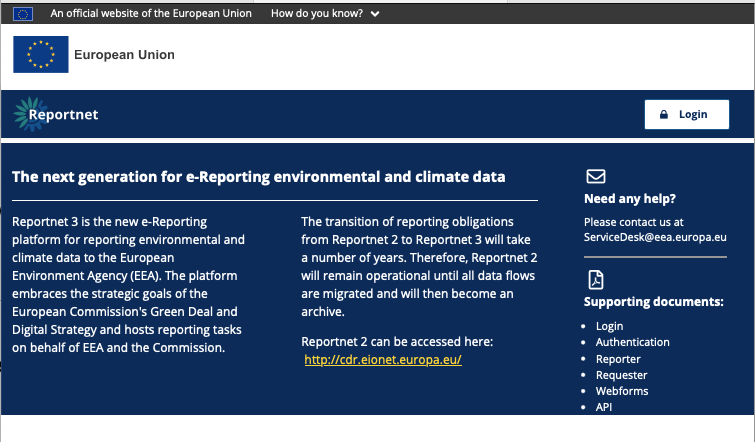
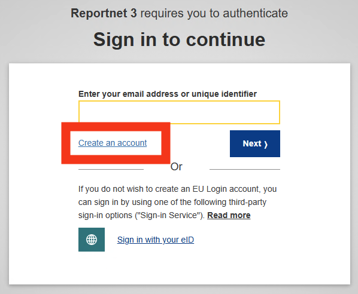
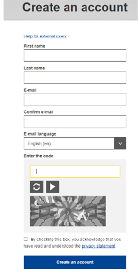
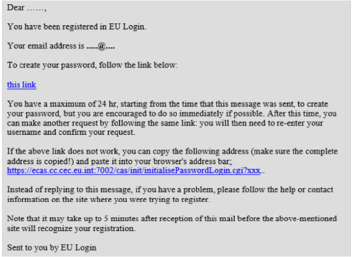

# Create an EU-Login account
EU Login is the entry gate to sign in to the Reportnet 3 platform as well as different European Commission services and/or other systems. EU Login verifies your identity and allows recovering your personal settings, history and access rights in a secure way.

Go towards the login page by clicking on the “login” button.

Click on the “**Create an account** ” link on the EU Login sign-in page.

### Fill in the provided form with your personal details:

  * First name– Your first name cannot be empty and can contain letters in any alphabet;
  * Last name– Your last name cannot be empty and can contain letters in any alphabet;
  * E-mail– An e-mail address that you have access to;
  * Confirm e-mail– Type your e-mail address again to make sure it is correct;
  * E-mail language– The language used when EU Login sends you e-mails
regardless of the language used in the interface. It guarantees that you are able to understand these e-mails even if they were triggered mistakenly. EU Login only sends you e-mails for validating your identity or for notifying you about security events affecting your account;
  * Enter the code– By entering the letter and numbers in the picture, you
demonstrate that you are a human being who is legitimately creating an account. If the code is too difficult to read, click on the button with two arrows to generate a new one;
  * Check the privacy statement by clicking on the link and tick the box to accept the conditions;
  * Click on “Create an account” to proceed.

  *

If the form is correctly filled in, an **e-mail is sent to the address you provided** in order to verify that you have
access to it. If you cannot find the e-mail, check your spam or junk folder. **Click the link** in the e-mail or copy/paste it in the address bar of your browser.

You are invited to select a password and to confirm it to make sure you did not mistype it.
Your new password must contain at least 10 characters and a combination of:

  * upper case letters,
  * lower case letters,
  * numbers and
  * special characters

The E-mail field is prefilled and cannot be changed. It should contain the e-mail address you provided previously. Type your password again in the “**Confirm new password** ” and click on “**Submit** “.

You now have an EU Login account and can proceed with the login for Reportnet 3 from the home page

As this is the first time you will login in to the Reportnet 3 platform, there are some additional steps to follow (next
section) after you have been authenticated.
