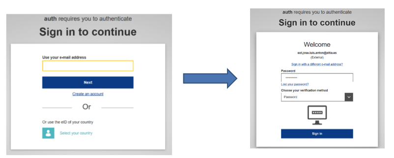

# Login to Reportnet
User authentication is handled through the EU Login. Therefore, you must have an active EU Login account before you can be granted access to Reportnet 3.

## Navigate to Reportnet 3 and click on “Login” button on the top right.

You will be redirected to authenticate using EU login

Follow the instruction on EU Login. Remember to select the second level of authentication in the next form.

After a successful login, you will be redirected back to Reportnet 3. At this point, you are logged in. Reportnet will then take you to the Dataflows page, where you can view all the dataflows you are contributing to. Please note that in your initial login, you might see an empty page. Please contact the relevant support address for update of the permissions.

## How to log off

  1. On any page, click on the power button in the top right or bottom left of the screen
  2. By default, you will be asked to confirm you wish to log off, however this can be
turned off in your global settings or in the same pop-up window by clicking “Do not
ask me again”.
