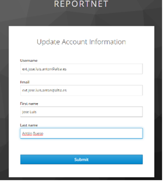
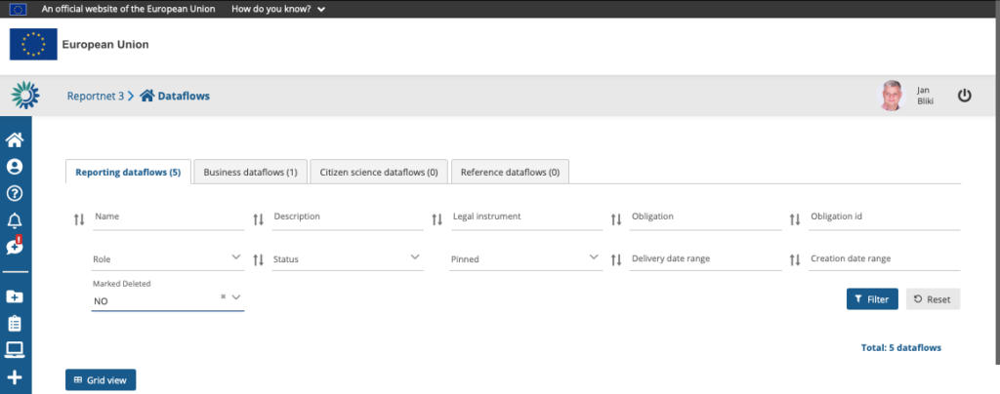

# Link my EU-login
If this is your first login to Reportnet 3, after you have been authenticated by EU login, you will be asked to fill a form. **Username** should just be your email address.

You are now logged in

However, you will not see any dataflows when you first login. Either, an email will be send when the reporting is open or if reporting is already open, please inform the support addresses that you have logged in.
