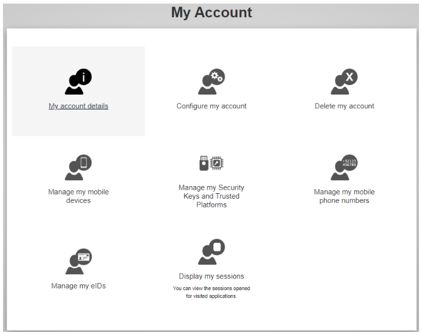
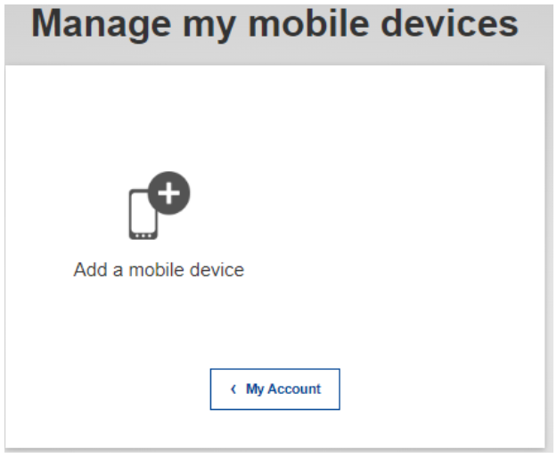
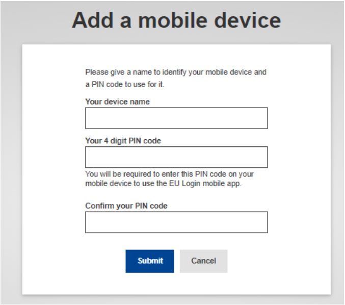
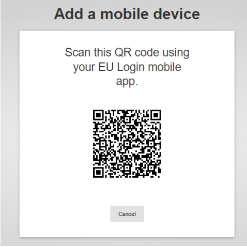

# About Multi Factor Authentication (MFA)
To protect your data and access, we implemented Multi-Factor Authentication (MFA). This guide will walk you through the
simple steps to set up MFA on your EU login account. Reportnet 3 only accept MFA authentication as from 2025.

Multi-Factor Authentication adds an extra layer of security by requiring two forms of identification before accessing your account. This means that even if someone knows your password, they will need a second form of verification to log in.

**Please note** that  _EU Login_ is an application developed and managed by the **European Commission** , and **Reportnet 3** uses this service for user authentication when accessing the platform.

This means that **setting up your EU Login account and authentication is a self-service process**. If you encounter any issues during setup, we kindly ask you to consult the official **documentation and FAQs** , which provide clear and comprehensive guidance for troubleshooting.

As we do not have administrative access to the EU Login system, our support team is unable to make changes or resolve authentication issues directly. We can only **forward you these support pages** , but ultimately, the setup must be completed by the reporter. Please find the guidance documents on EU-login you can follow.

  * [Frequently Asked Questions on External self-registered account for EU Login](https://trusted-digital-identity.europa.eu/eu-login-help/external-self-registered-account-faq_en)
  * [Extended Guideline for setting up the MFA for the EU Login](https://webgate.ec.europa.eu/cas/manuals/EU_Login_Tutorial.pdf)

## How to set up MFA for EU login

EU Login supports a variety of verification methods. This guide will walk you through the most popular method:

**The authentication can be set out via this link or updated:**

  * <https://webgate.ec.europa.eu/cas/userdata/myAccount.cgi>

### Authentication via EU Login Mobile App

On your mobile device, go to the App Store / Play Store and install the **EU Login Mobile app**.
(Please make sure to accept all notifications, as the enrolment process will be blocked if the app does not have the required permissions.)

On your computer, navigate to **My Account**. Log in with your EU Login e-mail address and password. You will access to this page:

Click on “**Manage my mobile devices** ” then on “**Add a mobile device** “.

Enter a device name (your preference), choose a PIN code to be used in this application and click on “Submit” .

A QR code will be generated based on your input. You will need to scan this QR code
with the EU Login Mobile app to complete the enrolment. Leave this screen on and get
your mobile device.

On your mobile device, start the EU Login Mobile app.
Tap on “**Initialize** “, then “**Next** “.

Aim the built-in QR code scanner to the QR code on your computer’s screen.
When the device detects the QR code, it will automatically read it.

Enter the **personal PIN code** you created in step 4 and tap on “**Next** “.
When your PIN code has been verified, tap on “**OK** “

A push **notification will be sent** to your device to confirm the enrolment. **Accept** the
notification to confirm the enrolment. Please ensure that notifications are enabled on
your device.

A message appears on the computer’s screen: “**A device has been added** “.
