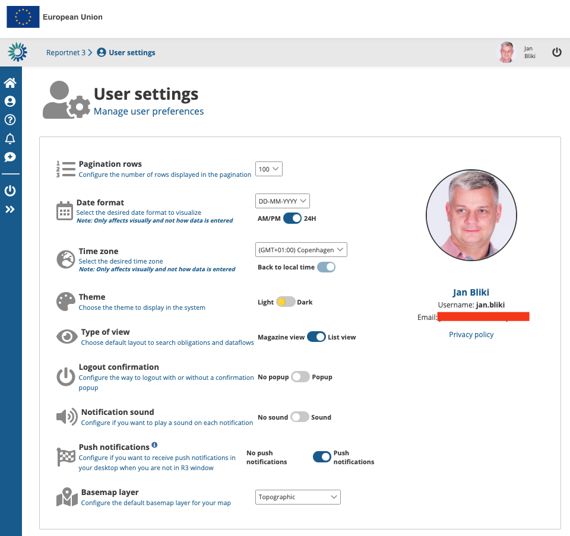

# User settings
The users settings are generic settings Reportnet will use when navigating the website.

### How to change my user settings

  1. On any screen, click on the “User profile details” button in the left context menu or click on your user picture on the top right.
  2. Available global settings can be managed from this page.
     * **Pagination rows** – Configure the number of rows displayed in the pagination.
     * **Date format** – Select the desired date format to visualize.
     * **Time zone** – Your time zone. This information will not change the actually reported data but will convert the global time representation into your local time.
     * **Theme** – Choose the theme to display in the system.
     * **Type of view** – Choose default layout to search obligations and dataflows.
     * **Logout confirmation** – Configure the way to logout with or without a confirmation popup.
     * **Notification sound** – Choose if you wish sound to be used on your desktop when notification popup.
     * **Push notifications** – When activated your windows notification will display Reportnet notifications.
     * **Basemap layer** – Configure the default basemap layer for your map-views.

### How to change my profile photo

  1. In the profile details described above you will see a “picture space”.
  2. Click on the picture space or on your picture.
  3. You can select an avatar or upload a photo from your desktop.
