# Preparation datasets
**Preparation datasets** are a Reportnet 3 feature that allows reporters to divide the preparation of data into smaller, independent work areas. These can be organised by criteria such as data type, geographical area, administrative unit, or organisational responsibility.

Key points:

  * Use of preparation datasets is optional and they are managed by the lead reporter within the platform.
  * This functionality is available only for **Big Data** dataflows. All planned future dataflows will use the Big Data data store.
  * A maximum of **15 preparation datasets** can be created for each dataflow.
  * Non-lead reporters can be granted access through the existing **supporting reporters** functionality.
  * The reporter is responsible for moving data from preparation datasets into the national dataset used for official reporting.

Preparation dataset functionality is only available in dataflows marked as “(Big Data)”

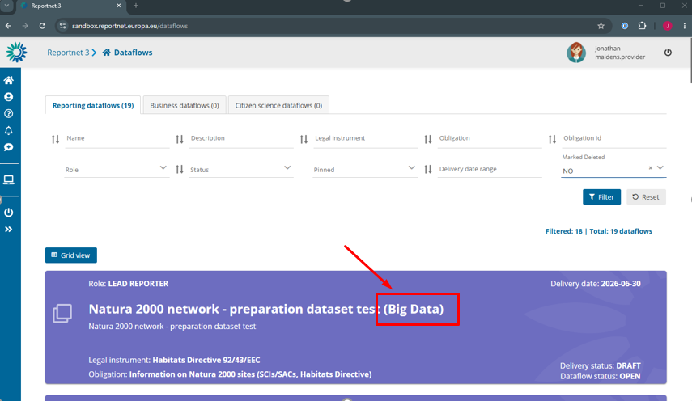

New icons appear in dataflows where preparation datasets are available.

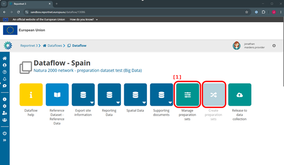

[1] First step is to create a preparation dataset.
Click on “Manage preparation sets”.

Click on the ‘Add’ button to create a new preparation set.

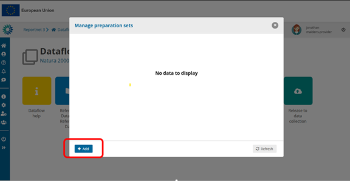

Give a name to the new preparation set. The name must start with a letter and can include letters, numbers, spaces, underscore (_), dash (-) and parenthesis( ).

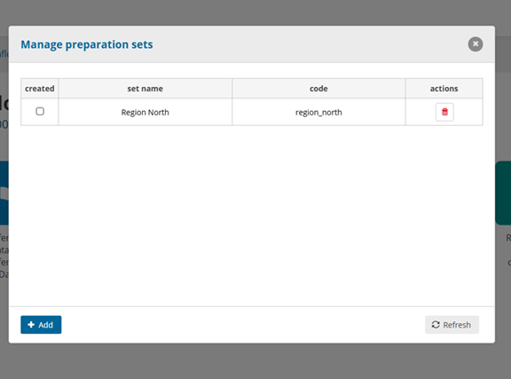

You can add more by following the same procedure

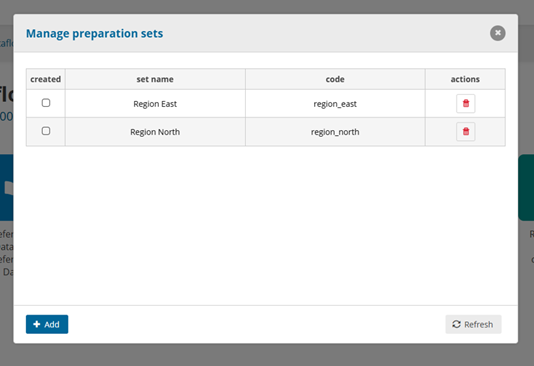

The “Create preparation sets” button is now enabled. Click on it to start the process.

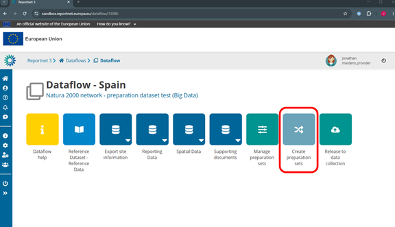

> Note: The preparation datasets will be a copy of the national dataset, including any data at this point.

The process of the creation of the preparation datasets has started. It can take some minutes depending on the number of tables and number of preparation datasets requested.

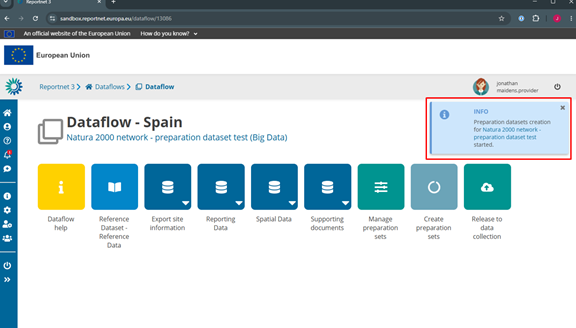

When the process is finished, you will see the two new preparation datasets created.

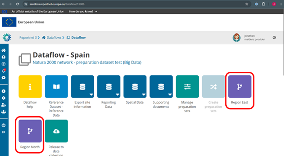

Click **Manage preparation sets** again. The dialog will now show the selected checkboxes, indicating that the preparation datasets have been created.

> Note: If you want to create an additional preparation dataset, select the new dataset and click **Create preparation sets** again.
>

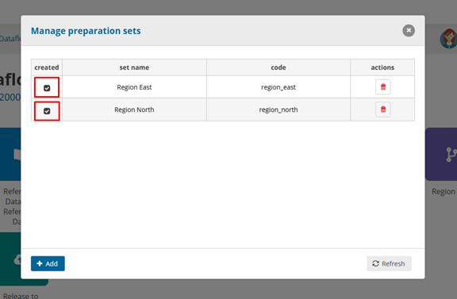

From this dialog, you can also delete a preparation dataset by clicking the **Delete** button.

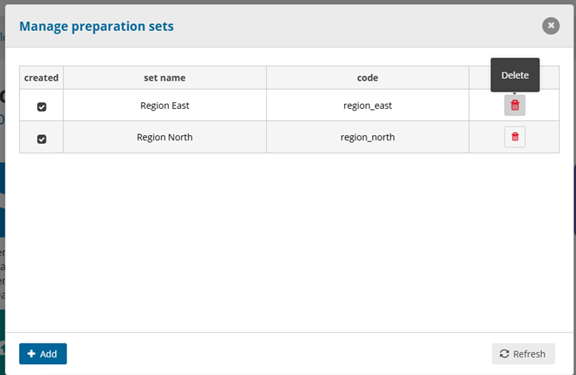 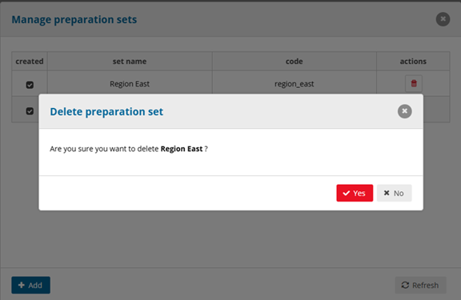

### Adding supporting reporters

You can now add the supporting reporters who will work with the preparation datasets. Click on the **Manage Reporters** icon on the left sidebar.

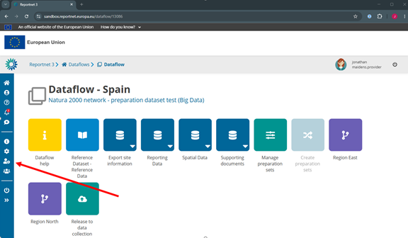

Click the **Add** button.

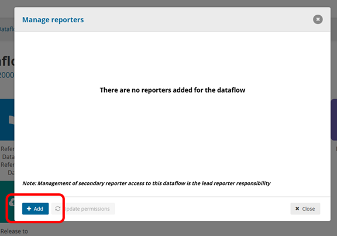

Select the users you want to add as supporting reporters.

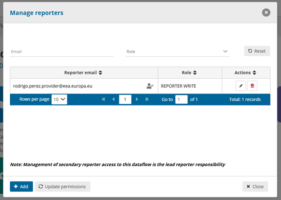

> **Note:** Access cannot be granted to individual preparation datasets. Supporting reporters are given access to both the national dataset and all preparation datasets for the dataflow. Coordination between reporters is therefore required.

After adding a reporter, we can navigate into the Preparation dataset.

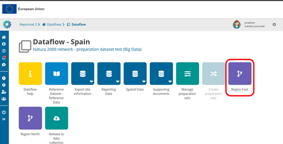

Inside the preparation dataset you see the same schemas as the National dataset.

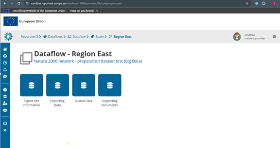

Each schema has exactly the same tables as the national dataset.
The user can identify that he is inside the preparation dataset from the Title of the dataset.

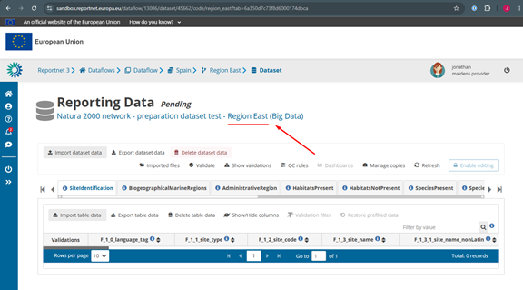

Import **[1]** , Export **[2]** and Validation **[3]** functionalities work as normal.
It is not possible to enable editing **[4]** .

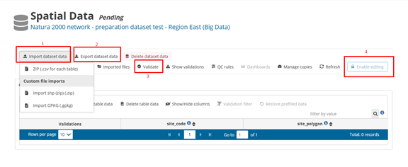

With validation you could see unresolvable blockers if you are only working with a part of the whole dataset. These should be resolved in the national dataset.

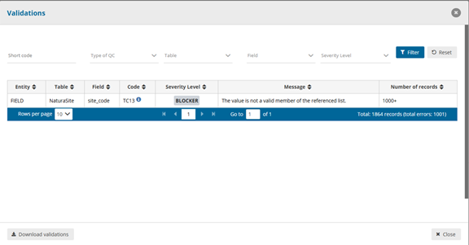

### Copying data to the national dataset

Data must be copied to the national dataset manually. From the preparation dataset, export the data as a ZIP file and then import it into the national dataset for reporting.

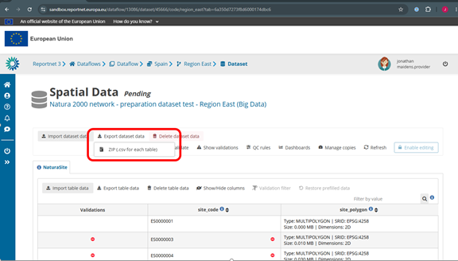

Navigate to the National Dataset.

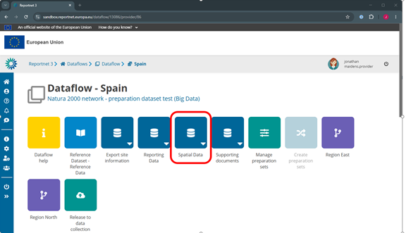

  * In the national dataset, import the exported ZIP file.
  * Managing multiple parts of the data requires coordination between reporters.

> Notes:
>
>   * Do not overwrite the dataset if it already contains data imported from other preparation datasets or other sources.
>   * Consider using Manage copies to create restore points before importing additional data.
>

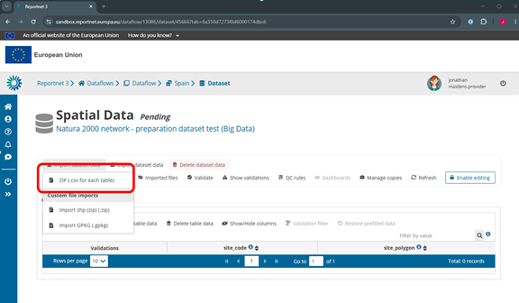

Once all data has been consolidated into the national dataset, the reporting process continues as normal. Data is delivered from the national dataset, and only the **lead reporter** can perform the delivery action.

### Show/Hide Preparation sets.

The preparation dataset functionality is **disabled by default** for all dataflows.

Dataflow custodians can enable preparation datasets for a specific dataflow in either of the following ways:

  1. During dataflow creation, by selecting the **Enable preparation datasets** checkbox.

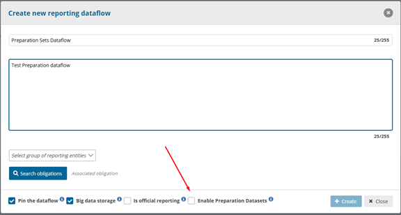

2\. By editing an existing dataflow and selecting the same **Enable preparation datasets** checkbox.

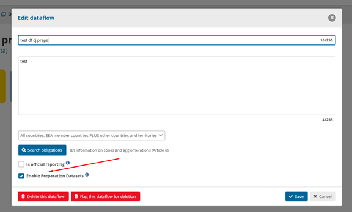

When the preparation dataset functionality is disabled for a dataflow:

  * Lead reporters cannot see the **Manage preparation datasets** or **Create preparation datasets** buttons.
  * Any existing preparation datasets associated with the dataflow are hidden and cannot be accessed until the functionality is re-enabled.
