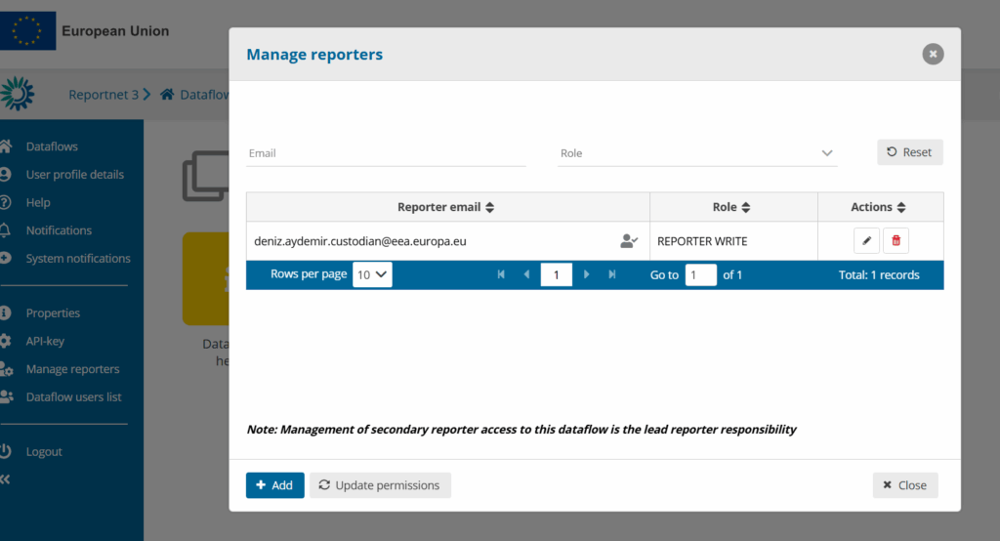

# How to add supporting reporters to my dataflow
More than one person can be added as a reporter, but only the lead reporter has the permission to add additional contributors. This ensures that access management remains controlled and consistent within each dataflow.

  1. **Go to the Dataflow page.**
  2. **Expand the left-hand menu** by clicking the double arrow at the bottom left corner.
  3. **Click on the “Manage reporters” button.**
  4. A pop-up window will appear where you can add reporter accounts.
  5. In the  _Account_ field, enter the registered user’s email address and select an access level: either **read** or **read-write**.
  6. Click outside the input fields to confirm the entry.
  7. If the system cannot find the email as a registered user:
     * A red box will appear around the email address.
     * An icon will indicate that the user is not valid.
     * You can click the **Update the permissions** button to check whether the user exists and has the necessary permissions.
  8. If the email is accepted:
     * A new  _Account_ field will automatically appear.
     * You can continue adding additional reporters.
  9. **Note:**
     * Users with **read** access can only view the dataflow schema via  _Dataflow help → Dataset schemas_.
     * Reporters may see a different interface than the Lead Reporter (e.g., they will not see the  _Technical Feedback_ button).
  10. Once all reporters have been added, click **Close** to finish.
