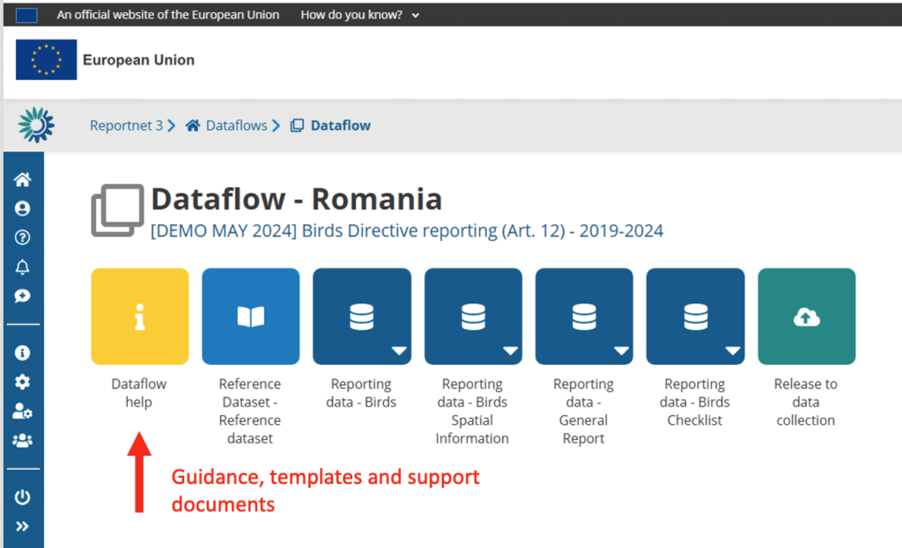
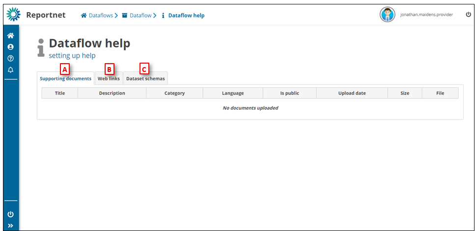

# Dataflow specific help
Every data flow has its own documentation. They are usually specific to the dataflow itself. This area is read only for reporters.

Every dataflow details page has a yellow icon with the letter “I”, click on this to see the dataflow help.

  * [A] – **Supporting documents** – Documents to support the data delivery for example reporting guidance or templates.
  * [B] – **Web links** – links to external resources relevant to the reporting. For example the link to the EC Report Obligation.
  * [C] – **Dataset schemas** – Information on the dataset schema – Extension , Operations, Unique constrains, Validations rules, Table and Field names with descriptions.
