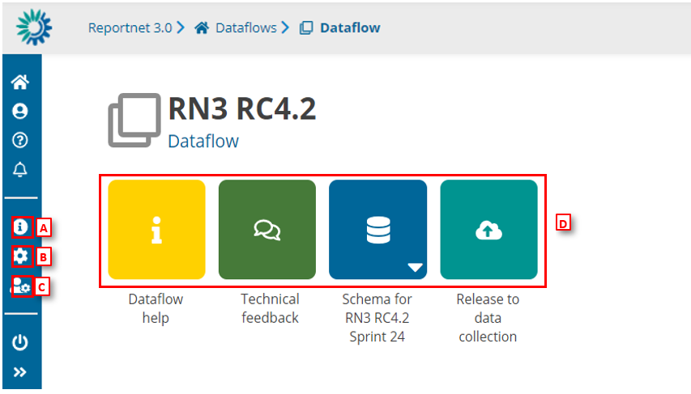

# Dataflow home page
Once you click on one of the dataflows inside the dataflow overview page you enter into the main overview for that particular dataflow.

  * [A] – Properties, the icon marked with ‘i’, displays the information regarding the dataflow, reporting obligation and legal instrument (extracted from Reporting Obligations Database).
  * [B] – API-key, the cog button, displays a dialog showing the parameters which are needed to access the Reportnet 3 API (explained in section How to generate API-key).
  * [C] – Manage reporters displays a dialog where a lead reporter can provide access to the dataflow for other reporters (explained in section How to add reporters to my dataflow).
  * [D] – The main part of the page are icons which take you to the components of the dataflow:
    * Dataflow help for accessing to the dataflow help page, in here you will find three tabs showing documents, links and technical overview of the reporting schema (explained in section Dataflow help).
    * ‘Technical Feedback’ for communicating with Custodian and for receiving technical acceptance review (explained in section How to receive technical acceptance review).
    * Reporting data is where the data in the excel spreadsheet is uploaded and validated. The user can also find Reference data, codelist and/or different dataset schemas where to report descriptive and spatial data.
    * Release to data collection for submitting your reported data once you have uploaded and validated it.

At the botom of the page you have a symbol >>. Clicking on this symbol will expand the option menu with more explenations
