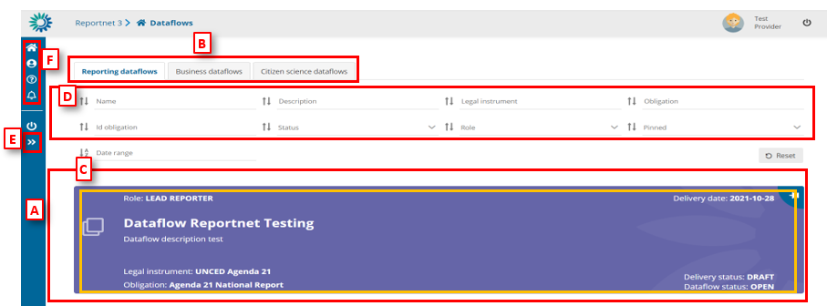
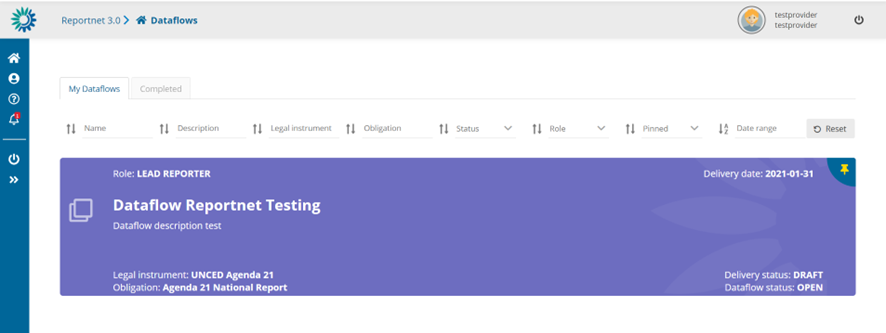

# Dataflows overview page
Once you have successfully logged into Reportnet 3, you will be immediately redirected to the Dataflow Overview page. This page displays only the dataflows that you are expected to contribute to, providing a focused view of your relevant tasks.

Please note that you might not see any dataflows when you first login. Either, an email will be send when the reporting is open or if reporting is already open, please inform the relevant support address or Service Desk that you have logged in.

If you have many dataflows you can use the “Pin” option so those dataflows you are interested in are listed at the top of the list.

  * [A] – The main part of the page comprises the list of dataflows which you have access to – ‘Reporting dataflows’ and ‘Business dataflows’
  * [B] – The list of the ‘Reporting dataflows’, ‘Business dataflows’ and ‘Citizen science, dataflows’
  * [C] – A dataflow is colour coded according to the current status – grey in design and purple when reporting is open. On the dataflow card, you can see various metadata
– Your role; Delivery date; Dataflow name; Dataflow description; Associated obligation and instrument; Reporting datasets status; Status.
  * [D] – Filters and sort on the various metadata of the dataflows list allow you to find things easily in the dataflows list.
  * [E] – This button will expand the menu, to show the icon labels.
  * [F] – The static menu is available on every page and has four buttons. From top to button, the buttons are:
    * My dataflows – will return you to this page.
    * User profile details – allows you to manage some global settings and see your user profile.
    * Help – Triggers a help walkthrough of the page you are currently on.
    * Notifications – This section displays a list of all system notifications, which also appear in the top-right corner of the screen. It’s important to note that the notification indicator only shows when a process—such as importing or validating—has started or ended; it does not include a progress bar or percentage indicator. Additionally, when a notification states that a process has been “sent,” it does not necessarily mean that processing has begun. Depending on the system load and the number of ongoing tasks in Reportnet 3, your process may be placed in a queue and will only start once previous processes have been completed.

### How to sort and filter my dataflow list

  1. The dataflow list is by default ordered first by status (design dataflows at the top) and secondly by delivery date (descending).
  2. Each of the metadata fields on the dataflows (name, description, legal instrument, obligation, status, role, date range of, etc) can be filtered or sorted on using the filter bar at the top of the dataflows list. The filters are applied on entering.
  3. Combinations of more than one filter can be used.
  4. The button on the right ‘Reset’ will put the list back to its default state.

### How to pin a dataflow

  1. There is a pin icon in the top right of each dataflow card.
  2. When clicking on pin, there is a notification message. The dataflow displays a pin icon in the right side and it goes to top of the list.
  3. When I have others already pinned, it keeps the same order criteria than when unpinned.
  4. When I unpin any, there is a notification message. The dataflow turns unpinned and come back to dataflow list following proper order criteria.

