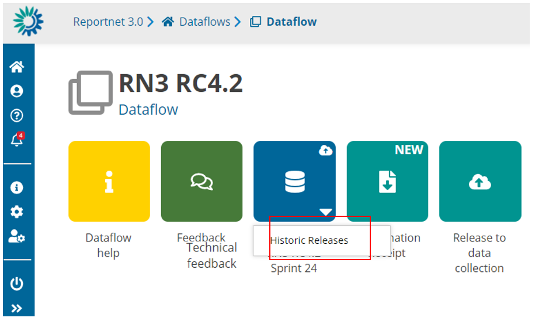
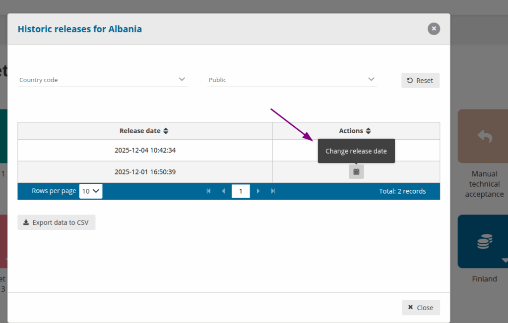
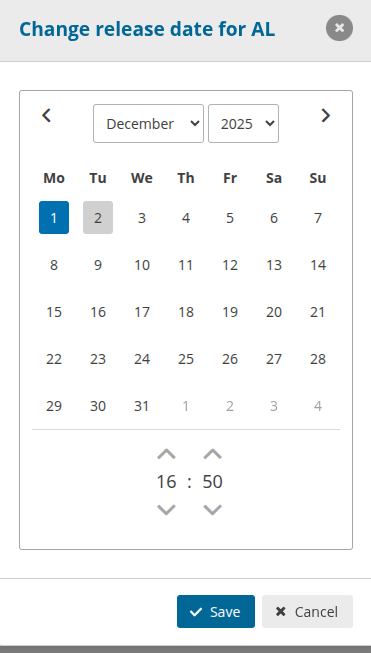

# Historical releases
## Historic Releases for a Data collection

Once you have released one or more data to data collection, click on ‘Historic Releases’ button inside Reporting dataset context menu.

A new dialogue will appear with the release history for this dataset

## Historic Releases EU dataset

From the ‘Dataflow’ page click on click on ‘Historic Releases’ button inside EU Dataset context menu.

i. A new dialogue will appear with the release history for this EU Dataset.
ii. If we have a released dataset, on the ‘Country code’ column we have a
link with a redirection to this country dataset.
iii. Note: This Historic will be empty until Data collections is copied to EU datasets correctly.

## Custodian/Admin – Release Date Update Functionality

  * A new **“Actions”** column has been introduced in the **Historic Releases** section for Providers. This column is visible only to users with the **Custodian** or **Admin** role.

  * By clicking the **Calendar** button, a new dialog opens, allowing the user to **modify the Release Date**.

  * The updated Release Date will be applied across **all schemas** of the specific provider.
