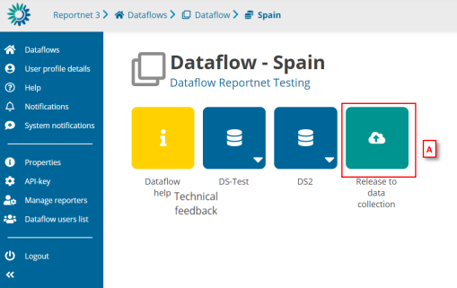
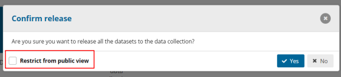
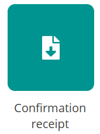
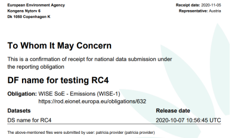

# Release to data collection
Go to the Dataflow overview and click [A] on ‘Release to data collection’

**WARNING!** In order for **Release to data collection** button to be available, editing should not be enabled inside any of the dataflow’s datasets. If a dataset that has editing enabled exists inside the dataflow, ****Release to data collection**** button will be disabled. If so, go inside the datasets and **Disable editing**.

A confirmation dialogue appears with a checkbox ´Restrict from public view’
(default: false). This checkbox is only visible if custodian has previously set the
datasets as ‘Available at public view’ and ‘Show public information’. If checked,
previous downloadable release will be deleted (if existed one).

The QC is run on each dataset and the ‘Show validations’ list refreshed in the
background.

If there are blockers in any dataset, the release is stopped and there is a
message to user to inform about that.

If the QCs run fine, a notification will appear saying the data is being validated
and sent to the data collection. An automatic copy will be created.

Note: the user cannot release a copy they have made themselves. But the user
can make copies for themselves as convenient restore points.

You will also see a new icon from which you can download a simple
‘confirmation receipt’. If you change the data and resubmit a new copy to the
data collection, then a new confirmation receipt is available for download.

