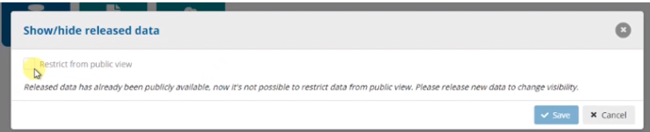
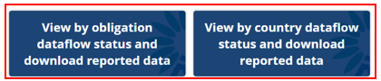
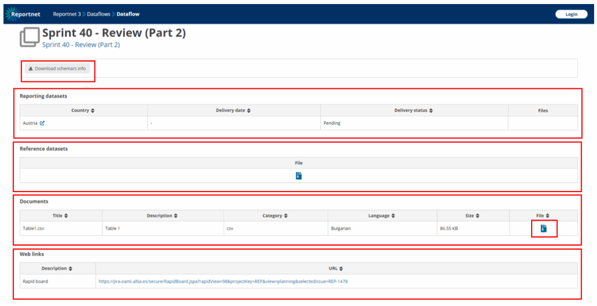
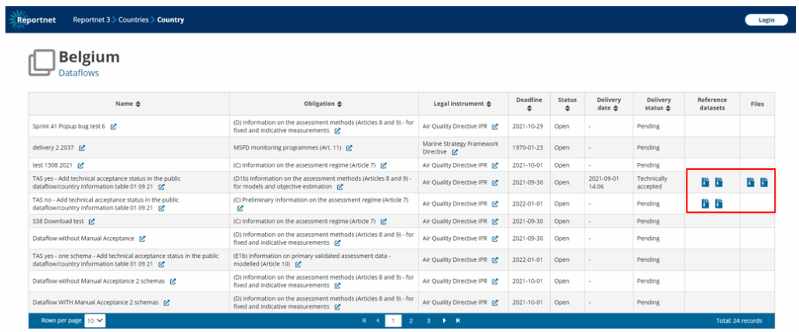

# Release to the public
Lead reporter has previously released to data collection without selecting “Restrict from
public” view option

Public user can choose in Reportnet3 Home page View by Obligation or View by country
to see dataflow status and download reported data.

By selecting any of the available dataflows or countries, a summary table is displayed
with release information, weblinks, documents, reference datasets, reporting datasets,
a button to download the schemas information and ZIP files with reported data
downloadable

In the figure here below, there is a box where is shown the ‘Reference datasets’. In some of the
dataflows it might appear “Reference tables” and/or “Codelist tables” that have been defined
by the data custodian.
The reference data is data that is there to check the validation of the data in QCs (Quality
Checks). These tables are in RN3 before the member states report data. If the reference data is
needed, the reporter will check that the data reported is correct in accordance with the
reference data. So, the reporter will have to report data that use identifiers from previous
reporting. These tables are read only so the reporter won’t be able to change them. Usually, it
will be included in the dataflow the last available data. The requesters will add in the description
of the reference tables where the data came from and when the data was imported to keep all
this information as metadata.

