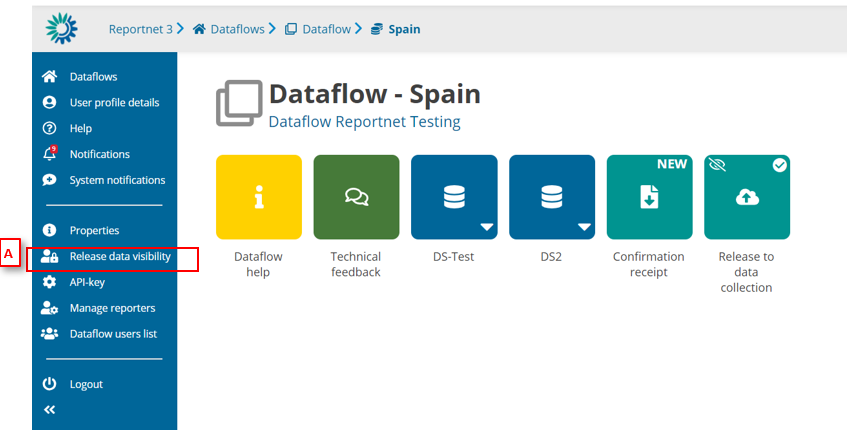
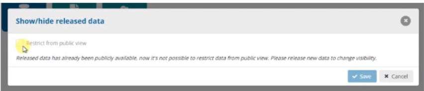

# Show/hide release data
Once you have released the data, you can show or hide the released data.

  1. Go to the Dataflow overview.
  2. [A] – Click on ‘Release data visibility’. If you didn’t check the option of as ‘Restrict from
public view’ when you made the release data collection, you will see the modal with the
option to change the visibility

But if you marked the release data collection with the check ‘Restrict from public view’,
the option is disabled. If you want to release the new data, you must release the data
collection again.

