# Dataset actions
## Dataset schema

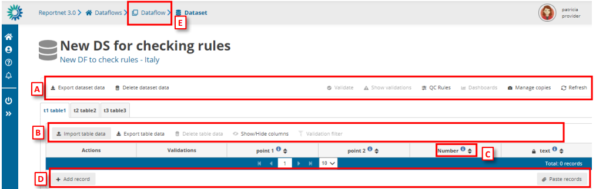

[A] – The top menu bar provides various functions which operate on the whole
dataset:
o Import dataset data – Imports the whole dataset into the platform:
▪ ZIP (.csv for each table): a ZIP file with CSV files inside, having one
CSV per each table.
▪ Custom file imports: the dataflows might have a custom process to
import data using a template file that will be the file type or types
that the requester or data custodian decides to have. This template
will be held in ‘Supporting documents’ of section 3.2 Dataflow
support documents.

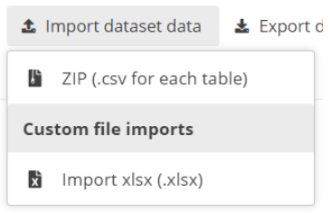

o Export dataset data – Exports the whole dataset into a downloadable file:
▪ (XLSX(.xlsx): normal export that gives the same info that appear in
the tables that follow the template to import.
▪ XLSX (.xlsx with validations): is an Excel file that after each column
has a column with the same name but for validation. Example, if
there is a column named “Name” there will be next to it another
column named “Name validation”. If this field is empty, it is because
the field is correct after passing the QCs.
▪ ZIP (XLSX + attachments): exports the dataset as a ZIP file that would
contain the Excel file inside.
▪ ZIP (CSV for each table): a ZIP file with CSV files inside, having one
CSV per each table.

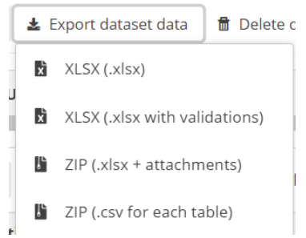

o Delete dataset data – Deletes all the data in the dataset.
o Validate – Runs validations for the whole dataset. There is no progress bar
to know the percentage that has been validated. All said in section 2.1
Dataflow overview [F] Notifications part, applies here. The amount of data
that has to be validated will make that the process could take minutes to
finish. The user doesn’t need to wait in front of the screen, they can leave
and come back later to see if the validation has finished.
o Show validations – Shows a table of all the validation issues found across
the whole dataset after a validation has been run.
o QC rules – shows a list of all the validations which have been created for the
dataset.
o Dashboards – Provides a visualisation of the validation feedback.
o Manage copies – Functionality to save copies of the data (snapshots or
restore points).
o Refresh – After import, validation and restore copy, you need to refresh the
tables.

**WARNING!** In order for **Import dataset data** ,**Export dataset data** ,**Delete dataset data** and**Validate** buttons to be available, **Enable editing** button should have not been pushed, otherwise the dataset will have entered edit mode and the buttons will be disabled. In order to enable them again click **Disable editing**.

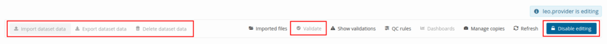 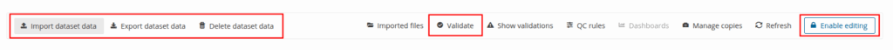

[B] – This menu bar provides functionality applicable to the selected (visible) table:
o Import table data – Import data into the table from an external file.
o Export table data – Export data from the table into an external file. There
are different ways of exporting:
▪ CSV
▪ CSV with filters: is a CSV with the filters that the user has selected
in RN3 to select only the data that they would like to view
▪ Excel file: the file will have only one tab with the name of the table
and following the template structure.

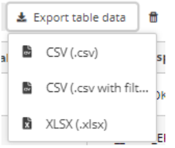

o Delete table data – Deletes all the data in the selected table.
o Show/hide columns.
o Validation filter – Show/hide records based on validation results

[C] – Column heading – however the mouse over the ‘i’ icon to see a pop-up with
the field type and description.

[D] – Below the table are buttons to add single records or paste single or multiple
records.

[E] – Navigate back to the dataflow overview using the breadcrumb. The delivery of
the data is triggered from the dataflow page.

For each of the ways of importing data into the platform it is important to understand properly the concept of incremental or partial reporting when the user selects ´Replace data’ option.
ReportNet3 maintains the information of users that have already reported to facilitate the work if a partial or incremental report is required. If the user uploads only a subset of data and click on ´Replace data’ then, the data that was before will be erased and will only leave the last subset of data uploaded. As an example, if a user has in a table 1000 rows and 100 of those have errors. If the user downloads the subset and correct afterwards and upload the data selecting ´Replace data’, the user will end up with only those 200 rows.
In this table is shown how partial or incremental reporting is saved in RN3

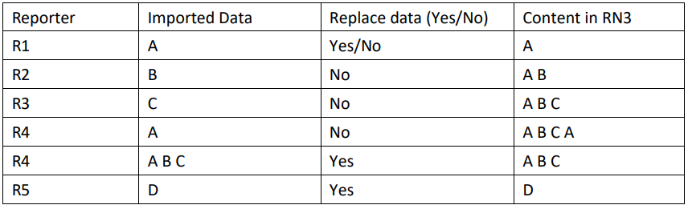

Normally, the relationships between the tables are 1 to 1, but they can be 1 to many. Let’s introduce the “Codelist” concept. If there is a list of chemical substances and the reporter has to include in a table some of those substances and that table column is defined as 1 to N, means that one record of the table is related to different chemical substances. In RN3, the 1 to N relationships with “Codelist” are included and it’s just one record and one table column. For example, if the user has a table column in a table that says chemical substance and the reporter can choose between different chemical substances from the “Codelist” and all of them are included in that table column and they are separated by semicolon. So, imagine that the “Codelist” are 1, 2, 3, 4, 5 and so on, and then the content of that table column would be “1, 2, 3” meaning that the table column is related to three different chemical substances. That is one option for 1 to N relationships.
The other option is to have two different tables and the common relationship 1 to N between them. In both cases, there are QCs and if there is a 1 to N relationship, if you cannot duplicate
the same record or if the 1 to N relationship must be reported, … For all that there is a QC control.

## Detailed page of a dataset

The details page of a dataset shows you the dataset title and its status and what part of the data you are providing. If the data is a member state the country will be shown, if it’s from an industry the company name is shown.

Notice we have several bar’s represented. The top bar provides various functions which operate on the whole dataset.

## How to load data from a previous reporting

[A] – The ‘Import dataset data’ will show a dropdown with different tools to import data
depending on the dataflow schema configuration. The one below ‘Import previous data’
is the option to click to load data from previous reporting.

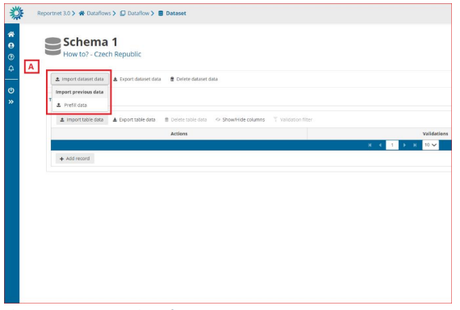

[B] – If we mark the ‘Replace data’ option, all data will be replaced with the imported data of the process. If not, the data will be added as appended following existing data.

[C] – Confirm the action with the ‘Import’ button.

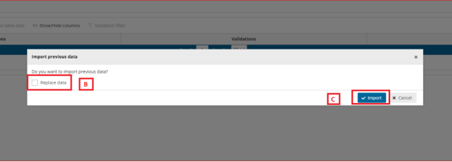

After import the validation will be automatically run.

Notifications in the top right will inform you the import has started and when the validation has finished. Once the validation is finished the ‘Refresh’ button will be highlighted and after clicking you will see the results of the validation.

In some projects there will be prefilling of the data for previous reporting periods. There is no
need for the member states to migrate or change formats of previous reporting because this
will be done automatically.

## Import the entire dataset in one go

Imports the whole dataset. This action can be very useful if you manage your own database and produce the entire dataset in one single process. For example you have an ETL or Script that produces exports of every single table in your database. You can produce them in one goal and zip the entire content as one single package.

The **ZIP (.csv for each table)** is a ZIP file that contains a CSV file for each table of the dataset.
You need to follow a naming convention such as naming your files with the exact name of the tables in the schema.
Also All files need to be in the root of the .zip file, not as a sub-folder. The field names need to be the same as defined exactly as in the table schema.

We suggest that you look at the [Create CSV-Files](create-csv-files.md) page for more information on how to generate a correct CSV-file.

Once the file is created you can upload that file into Reportnet and all tables will get filled in one single step.

## Use the custom file import solution

A dataset might have a custom import process. They are made for a particular dataflow. In many cases this would be an Excel-template. If any specific files are expected a template of that file would be available in [Help section](../../assets/DataFlowHelp-1.png) of the dataflow under ‘Supporting documents’ tab.

If such custom module exist it should appear inside the**Import dataset data** menu under the **Custom file imports**.

## Export dataset data

You can extract the entire dataset in one operation. The ZIP file would be exactly as described during the import section. This is actually a perfect way to get an example of the system on how the dataset zip file should be structured. When using ETL software you can use this file as a template.

Similar to the import a custom export can be provided as well. For example if data is pre-loaded and you use a custom excel template you can export the data into that template. This custom ETL scripts require an implementation cycle meaning that the availability is very depending on the available resources for a dataflow.

## Delete dataset data

You also have the option to remove all the already imported data. This can be helpful if you wish the perform an entire new import and you wish to perform this per table. For the entire dataset import the option can be found in the “import dataset data” operation. Both for the custom import and standard ZIP/CSV import.

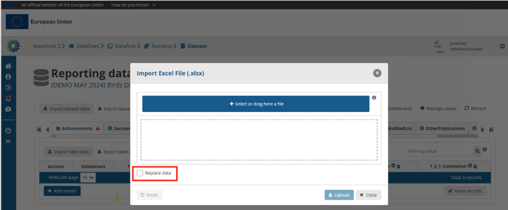

Note that not checking “Replace data” will concatenate your import data with the already available data. This can be useful in cases you have multiple data providers delivering their part of the data.

## Validate data and show validation results

Every dataset has a set of validation rules. Pressing the “Validate”-action will execute those validations over your imported data. The QC-rules can provide you the full list of validations that are executed. The required time to perform these validations is very depending on the dataset complexity and amount of records inside the dataset. We constantly optimize Reportnet 3 to make that as fast as possible.

A popup will appear once validation is completed. Simply use the refresh action to refresh the page. Records with errors will have symbols shown inside the table. Simply hoover over these symbols will provide you with the explanation.

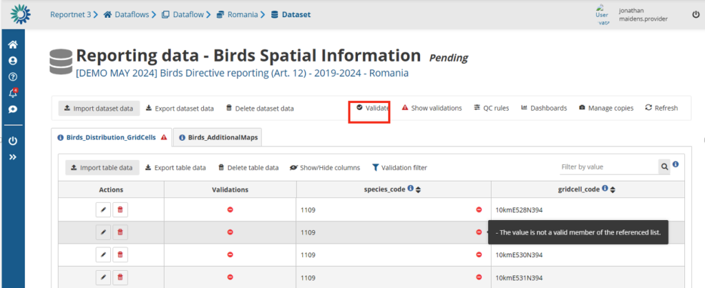

Reportnet has categorized these validations in the following level of severity.

**BLOCKER** : These are the hard once and need to be fixed before you will be allowed to submit your data. They mostly relate to the data consistency or to data quality that would severally limit the planned end products on the European level.

**ERROR** : An error is still serious and has implications on the overall quality of the dataset. These will not block your submission but might be picked up in the post processing. A communication between the data requester(s) and data reporter might take place to find solutions.

**WARNING** : A warning is mostly something we can clean up in the post processing. It lowers the overall quality of the European dataset if not cleaned up.

**INFO** : These might point to potential mistakes or ensure outcomes.

The outcome of the validation is shown in the table but can also be navigated per validation rule. A simple click on the “**show validation** ” action will show you a popup window of all those validations that produced an error.

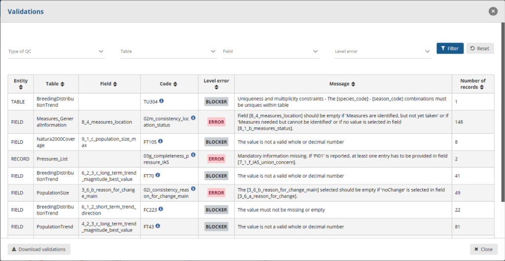

A click on the Number of records will filter those specific records inside the detailed table. You can remove that filter by clicking on the “**Remove Validation filter** ” in the table action bar. A number of filtering options are also available inside the validation popup window. For example you can focus only on the blockers by simply filtering the “**Level Error** “-option.

## Quality control rules (QC Rules)

The “QC Rules” action will provide you a full list of all validation rules for this dataset. This popup window also provide you a filtering option so you can search for the most important once or for a particular field.

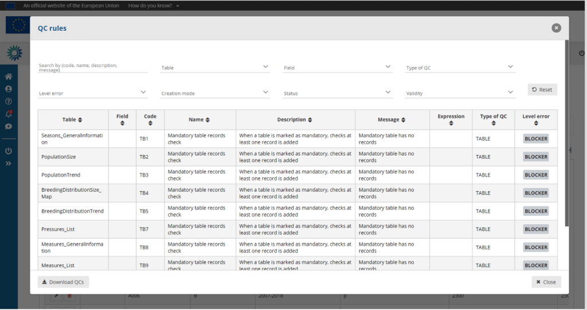

You can also download these QC-rules. A very useful function when you want to crosscheck these validations with your own local systems. Build those rules into your own environment will help reducing these during reporting.

You find more under the[ Validate data section](../validate-data/index.md) in this help.

## Dashboards

## Manage copies

## Refresh the webpage

After import or validation is finished your webpage will not show the content. Using the refresh button ensures you see the imported data and the validation symbols on records and tables.
