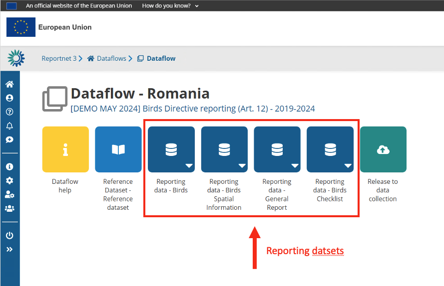
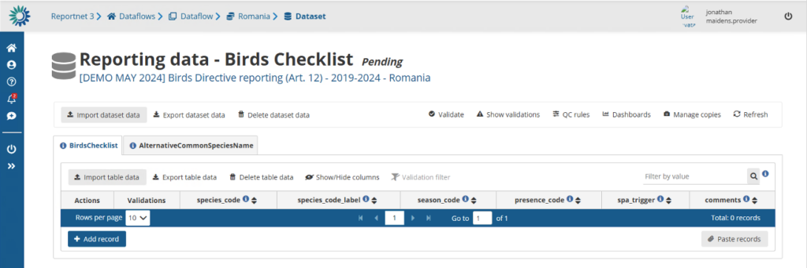
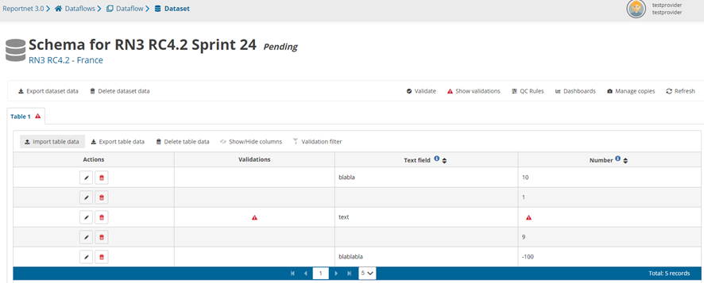
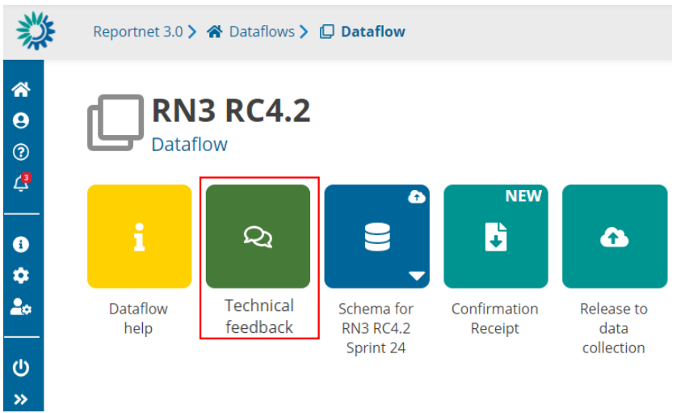
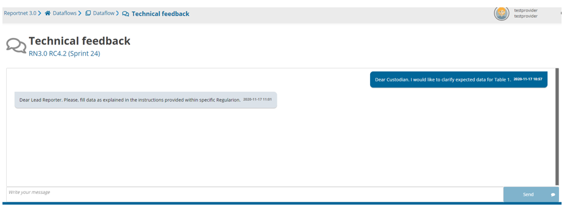

# Submit data
A reporter can submit data into Reportnet before submitting the final result to the requester. A reporter can perform several iterations such as import data, perform validations, correct data and import again. Sometimes data is pre-loaded for you. In that case you can snapshot this data or export a copy to your desktop, edit it over the interface or replace it with data from your own database. When you are at the dataflow main page you might see one or more “datasets”.

The dark blue icon(s) with a database symbol are datasets. Click on a dataset will bring you to the details of that dataset.

The details page of a dataset shows you the dataset title and its status and what part of the data you are providing. If the data is a member state the country will be shown, if it’s from an industry the company name might be shown.

## How to receive technical acceptance review

When a dataflow has been configured as “manual acceptance”, its status appears as ´Pending´
(displayed in Reporting datasets status and status next to dataset name):

  1. When the reporter releases data, the status is marked as ‘Final feedback’.
  2. The custodian makes a review of the data released in the data collection and sends feedback.
  3. It is possible to set the status to ‘technically accepted’ or ‘correction requested’.
  4. If ‘correction requested’, the data stays in the data collection, feedback is received and status is updated.
  5. If it’s ‘technical accepted’ then the version in the data collection is marked as such and status is updated.

## How to communicate with Custodian

There is a channel to communicate with Custodian at Dataflow level (‘Technical
Feedback’ button).

User can see the messages (not read), get previous messages and the option to
add new messages.

 

## How to submit an updated version of the data

  1. It is possible to resubmit data to the data collection whilst the reporting is still open.
  2. Go to the Dataflow overview.
  3. Click on ‘Release to data collection’.
  4. The QC is run on each dataset and the ‘Show validations’ list refreshed in the background.
  5. If there are blockers in any dataset, the release is stopped and there is a message to user to inform about that.
  6. If the QCs run fine, a notification will appear saying the data is being validated and sent to the data collection. A new automatic copy will be created.
  7. You will also see the icon ‘confirmation receipt’ is now updated from which you can download a new receipt reflecting the new delivery.

# You have the following options

  * [Perform actions on the entire Dataset](dataset-actions.md)
You can import or export an entire dataset, validate dataset, understand the quality rules and generate copies (snapshots) of a dataset.
  * [Perform actions on individual tables](table-actions.md)
  * Use Web forms, if made available
