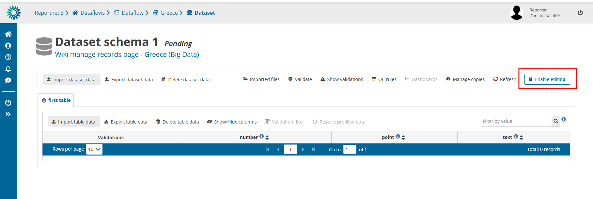
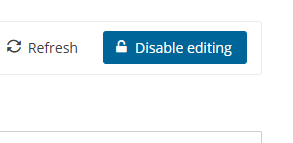
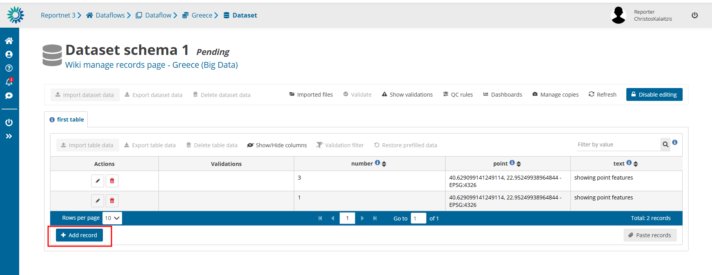
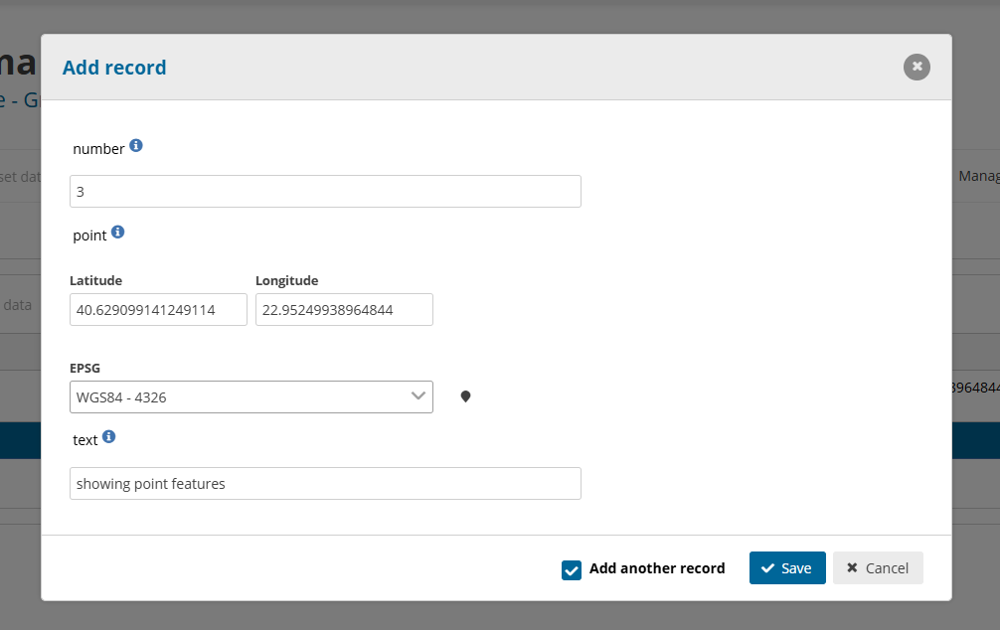
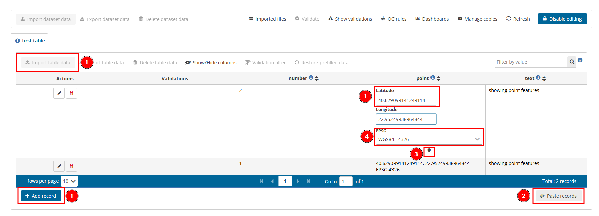
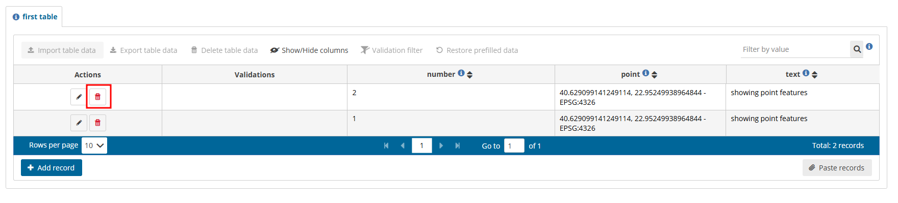

# Manage records
If it is **big data dataflow** , the actions below will only work after `Enable editing` is pressed.
After manual editing the data, `Disable editing` should be pressed.

**Big data dataflows** have a key difference: manual editing at data is not available if the button `Enable editing` at the top right corner is not pressed.

After it is pressed and the data have been converted to editable state, then top right corner will have the button of `Disable editing` instead of `Enable editing`. After applying any manual changes press the button `Disable editing` so all dataset actions can become available.

All standard actions apply after editing is enabled.

Button `Enable editing` may be unavailable (greyed out) for 3 reasons:

  1. As a design prerequisite, custodians should check a box of `Available for manual editing`. Only tables with this flag will be available to manual editing.
  2. Dataset releasing state: if dataset is currently releasing, `Enable editing` is not available.
  3. Data loading in progress: if there is any data loading (eg. import in progress), `Enable editing` is not available.

If it is a **Big Data dataflow** , then all actions below require that you have `Enable editing`. If not, you will not be able to add/delete or edit any record.
Note: For **Big Data dataflows** , all actions below (add, edit, delete) require that you have `Enable editing` activated. Without it, no manual changes are possible.

## How to **add records** through the web interface

1\. Add rows using the `Add record` button on the bottom left of the table.

2\. In the dialog, tab between fields to enter data.

3\. Enable the `Add another record` and the dialog will remain after ‘Save’ is clicked for the adding of the next record.

## How to edit records through the web interface

  1. Either click directly on the field you wish to edit or click on the `edit` icon to the
left of the record to see the pop-up.
  2. Note: Changes made online in Reportnet 3 are saved only within the platform. Your original file (for example, the CSV, Excel, or any type that is stored on your computer or organisation’s system) will **not** update automatically. To keep data consistent, export the updated data from Reportnet 3 or apply the same changes to your original file before reimporting.
  3. Note: Descriptive data can contain documents and references to documents that can’t be imported because it must be done manually

## How to load data for a Point field

Data can be introduced by:
[1] – Typing directly in box, importing or with `Add record`.
[2] – Pasting records.
[3] – Selecting point in the map.
[4] – Different spatial reference and basemap layer can be chosen.
For any other spatial data there won’t be any visualization tool to be able to preview that spatial
transformations have worked correctly.

Note: Big Data dataflows require to have manual editing turned off to `Import table data` with a file. Press `Disable editing` and `Import table data` will be available again.

## How to **delete a row**

1\. Click on the red trash-can icon in the first column.
2\. You will be prompted to confirm the deletion – click `yes` to confirm.

Note: All associated QC checks both automatic and manually added are also deleted

