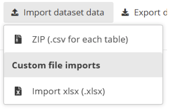
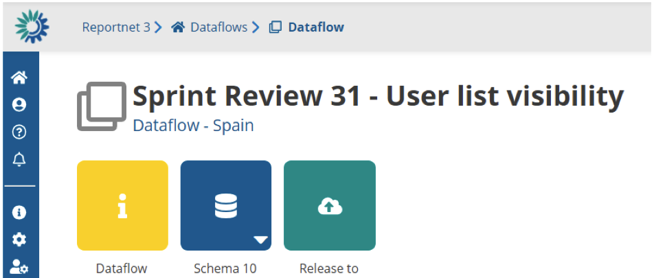

# Spatial data
## How to load data for spatial fields

Fields type such as **Line** , **Polygon** , **Multiple points** , **Multiple lines** and **Multiple polygons** can be imported through the “Import table data” functionality.in the drop down of the “Import table data” a list of options should be provided. The default one always available is “ZIP (that includes .csv-files)”



A data flow can also provide a Custom file imports and provide you different formats and solutions that are not described here. You should find help on these formats in the help inside your dataflow. You can find this in the yellow block that has an ‘I’ inside. Reportnet 3 has powerful ETL software (FME) that supports many formats out of the box. Today we have cases were we provide import for SQLite, Geopackage files and SHAPE files. But this must be agreed during the technical implementation of the Data Obligation.



## How ZIP (.csv for each table) is structure

The zip-file is containing .csv-files in the **root-folder**. A .csv file for every table in the dataset. The name of the the file must **match** the table name. For example if you have a table in the schema called “protected-sites” you would name the .csv file “protect-sites.csv”.

You have two options. A ZIP file for the entire dataset meaning you add all .csv files for each table in a single .zip file or perform an import for a single table. In the case of a single table you would only zip that single table into the zip file.

## What do you need to be aware of when delivering Geo spatial data

Be always aware of what is written inside the Data Obligation documentation of the data flow your are reporting against. Usually they provide some insights what quality is expected. Here we give a number of areas you should concider.

**Geospatial projection** : When submitting geospatial data to the EEA, countries must follow EU and INSPIRE guidelines by using the WGS84 (EPSG:4326) or ETRS89 (EPSG:4258) projection. This ensures consistency, interoperability, and accurate integration across datasets. Do not just change your projection file instead perform a re-projection in your GIS Software.

  * QGIS User Guide → [Working with Projections ](https://docs.qgis.org/latest/en/docs/user_manual/working_with_projections/index.html)
  * [GDAL/OGR](https://gdal.org) → A simple command “ogr2ogr -f “ESRI Shapefile” -t_srs EPSG:4326 output.shp input.shp”

**Spatial resolution** : In the context of Reportnet 3, spatial resolution for vector data refers to the level of detail represented in the spatial dataset, typically defined by the scale or minimum mapping unit. The EEA commonly expects vector data to be generalized to a 100 m resolution as a standard practice. However, this default should only be applied if the specific Reporting Obligation documentation does not define a different spatial resolution requirement. It is therefore essential that reporters first consult the official Reporting Obligation documentation to ensure compliance with the specified spatial resolution before applying the 100 m standard. Spatial resolution has an impact on the storage size of the spatial object. If not alla countries deliver the same resolution the quality of the overall dataset will only be the equal to the lowest reported spatial resolution.

**Geometry Validity** : This refers to whether vector geometries (points, lines, polygons) conform to the rules defined by spatial data standards such as the OGC Simple Feature Specification. For polygons, this means boundaries must be closed, rings must not self-intersect, and there should be no overlaps or gaps in multipart features. Invalid geometries can include self-intersecting polygons, duplicate vertices, unclosed rings, or lines that form impossible shapes. Such errors can cause problems in spatial analyses, visualisation, and automated validation workflows, including those used in Reportnet 3. To ensure high data quality, reporters should validate and, if needed, correct geometries using tools like “Check Validity” or “Fix Geometries” in GIS software before submission.

  * **QGIS** : QGIS includes built-in tools like Geometry Checker and Fix Geometries that help users detect and repair invalid vector geometries. Common issues such as self-intersections, duplicate nodes, sliver polygons, and unclosed rings can be flagged using the Check Validity tool, which follows OGC standards. For more advanced correction workflows, users can also integrate GRASS or SAGA cleaning tools.
  * **GDAL / OGR** : The command-line tool ogr2ogr supports geometry validation and repair through the -makevalid option (available in GDAL 3.11 and later). It uses the GEOS library to detect and fix invalid geometries. With the SQL dialect in GDAL, users can also run functions like ST_IsValid() to check geometries and automate cleanup in large-scale data processing workflows.
  * **ArcGIS / ArcGIS Pro** : ArcGIS provides Check Geometry and Repair Geometry tools that work with both Esri’s internal rules and the OGC Simple Features standard. These tools identify issues such as null geometries, incorrect ring orientation, overlaps, and self-intersections. The tools can be used in GUI or scripted workflows, making them suitable for both desktop and enterprise environments.
  * **PostGIS (PostgreSQL)** : PostGIS offers geometry validation through SQL functions like ST_IsValid() for checking and ST_MakeValid() for correcting invalid geometries. This allows users to enforce topological integrity within spatial databases and integrate validation directly into data ingestion, transformation, or update processes.

## How is GeoJSON stored inside a CSV-file

Take an example of a GeoJSON representation of a point.
`"{"type": "Point", "coordinates": [12.4924, 41.8902]}"`

A comma separated CSV file would need to double quote the GeoJSON otherwise it would break the CSV record structure. So the data would look like this. Notice the “” that are used. This tells the CSV reader that it should ignore ” and not consider it as an end of string. Default CSV writer libraries usually take care of this for you.

`id,name,geometry
1,Colosseum,"{""type"": ""Point"", ""coordinates"": [12.4924, 41.8902]}"
2,Eiffel Tower,"{""type"": ""Point"", ""coordinates"": [2.2945, 48.8584]}"
3,Statue of Liberty,"{""type"": ""Point"", ""coordinates"": [-74.0445, 40.6892]}"`

Many geospatial software and coding-software support this kind of export methodology. To make it easier for you we demonstrate how it works in a number of software. Any GIS software has a similar solution. This might give you some insigts.

# Example using QGIS-software

## Step 1: Open the GeoJSON in QGIS

  * Launch QGIS.
  * Go to Layer > Add Layer > Add Vector Layer.
  * Choose the GeoJSON file from your system and click Open.
You should now see your points, lines, or polygons loaded as a layer in QGIS.

## Step 2: Open Attribute Table (optional)

  * Right-click the layer in the Layers panel.
  * Choose Open Attribute Table to inspect your data.
  * Make sure any non-geometry attributes you want to export (like id, name, etc.) are visible.

## Step 3: Export the Layer to CSV

  * Right-click the layer and select Export > Save Features As…
  * In the Export Layer dialog:
  * Format: Choose Comma Separated Value (.csv)
  * File name: Choose your output path and filename

## Step 4: Set Geometry Export Options

  * Under Geometry, choose one of the following:
Geometry: AS_WKT (Well-Known Text)
  * Result: Geometry will be in this format:
POINT(12.4924 41.8902)

## Step 5: Set CRS (Coordinate Reference System)

  * Set the CRS to EPSG:4326 (WGS 84) if you want standard latitude/longitude values.
  * Set the CRS to EPSG3035 (ETRS89 / LAEA Europe) if you follow INSPIRE, Eurostat, EEA and Copernicus. Check your Data obligation for more details.
  * You can also reproject if your source GeoJSON uses a different CRS.

## Step 6: Finish Export

  * Click OK.

QGIS will generate the .csv file at your chosen location, with geometry either as WKT or as separate coordinates.

# Export a Layer in ArcGIS Pro to CSV (with Geometry as GeoJSON)

## Step 1: Open or Load Your Layer

  * Open ArcGIS Pro.
  * Add your layer (shapefile, GeoPackage, feature class, etc.) to your map.

## Step 2: Add a New Text Field for the GeoJSON Geometry

  * Right-click the layer in the Contents pane.
  * Click Attribute Table.
  * In the attribute table, click the Field view (top left “Fields”).
  * Add a new field:
    * Name: geometry_geojson
    * Type: Text
    * Length: Set to 5000 (or more for complex geometries)
  * Click Save in the ribbon.

## Step 3: Use Python Parser to Convert Geometry to GeoJSON

  * Return to the attribute table.
  * Right-click geometry_geojson > Calculate Field
  * Choose Python 3 as the expression type.
  * Use the following code in the Code Block section:

```
import json

    def to_geojson(shape):
    # Convert ArcGIS geometry object to a Python dictionary
    geom_dict = json.loads(shape.JSON)

    # Mapping from ArcGIS to GeoJSON types
    arcgis_to_geojson = {
        "esriGeometryPoint": "Point",
        "esriGeometryPolyline": "LineString",
        "esriGeometryPolygon": "Polygon",
        "esriGeometryMultipoint": "MultiPoint",
        "esriGeometryEnvelope": "Polygon"
    }

    geom_type = arcgis_to_geojson.get(shape.type, "GeometryCollection")

    if geom_type == "Point":
        coords = [geom_dict["x"], geom_dict["y"]]
    elif geom_type == "MultiPoint":
        coords = [[pt[0], pt[1]] for pt in geom_dict["points"]]
    elif geom_type == "LineString":
        coords = [[pt[0], pt[1]] for pt in geom_dict["paths"][0]]
    elif geom_type == "Polygon":
        coords = [[[pt[0], pt[1]] for pt in ring] for ring in geom_dict["rings"]]
    else:
        coords = None  # fallback

    return json.dumps({
        "type": geom_type,
        "coordinates": coords
    })
```

  * Then in the Expression field (bottom):

```
to_geojson(!SHAPE!)
```

## Step 4: Inspect the Output CSV

  * Your output CSV will now contain:

All attribute fields
A geometry_geojson field with standard RFC 7946 GeoJSON strings like:

# Script examples

  * A [Python script ](../../../assets/ArcGisPro_Python.py_.zip)that uses ArcPy (ESRI) to export towards CSV
  * A [Python script](../../../assets/SQLLiteToCSv.py_.zip) that exports an SQL Lite table towards CSV
