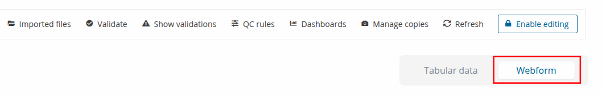
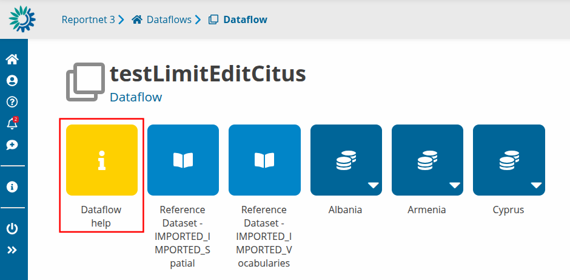
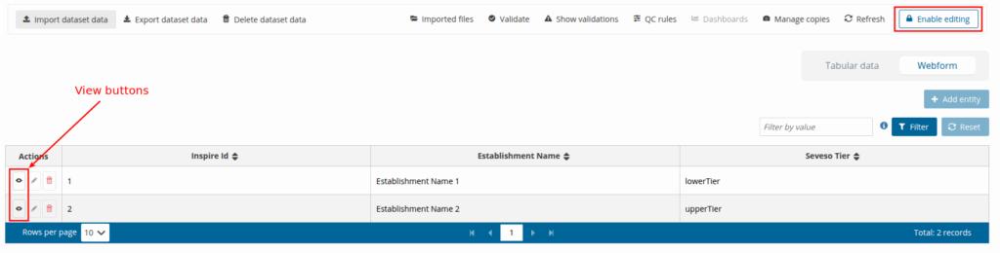
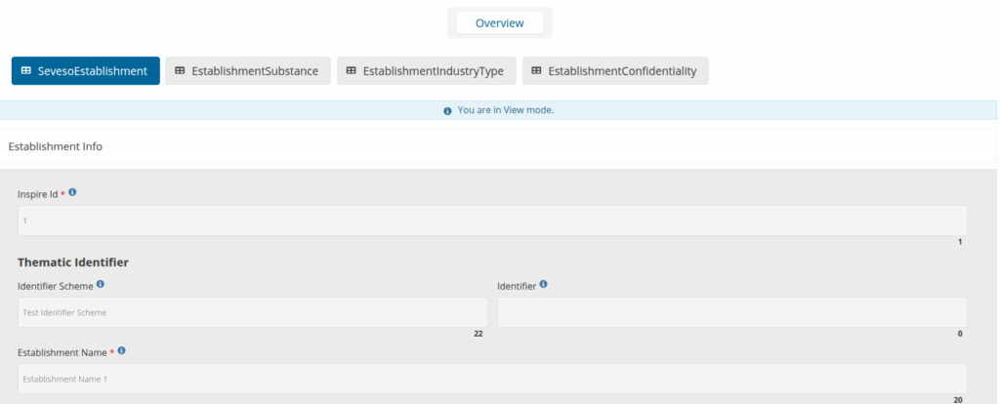
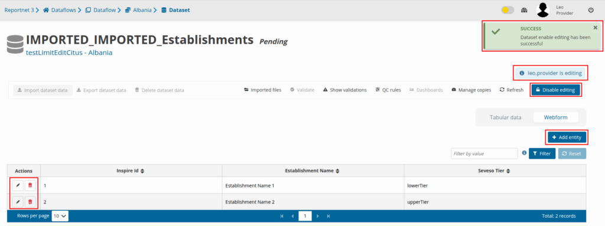
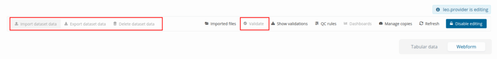
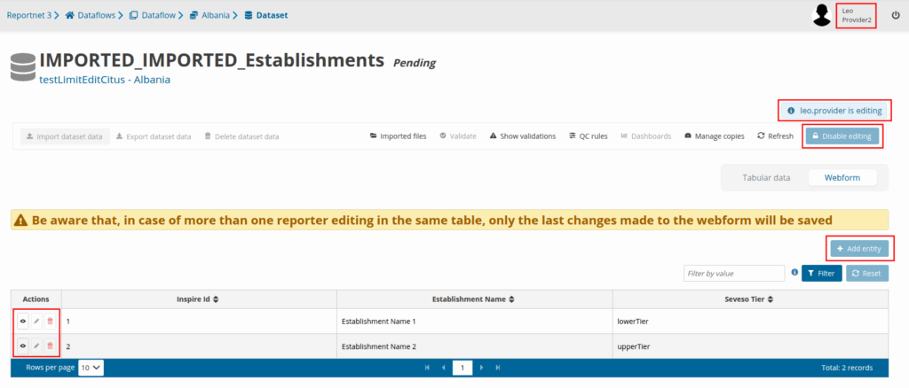
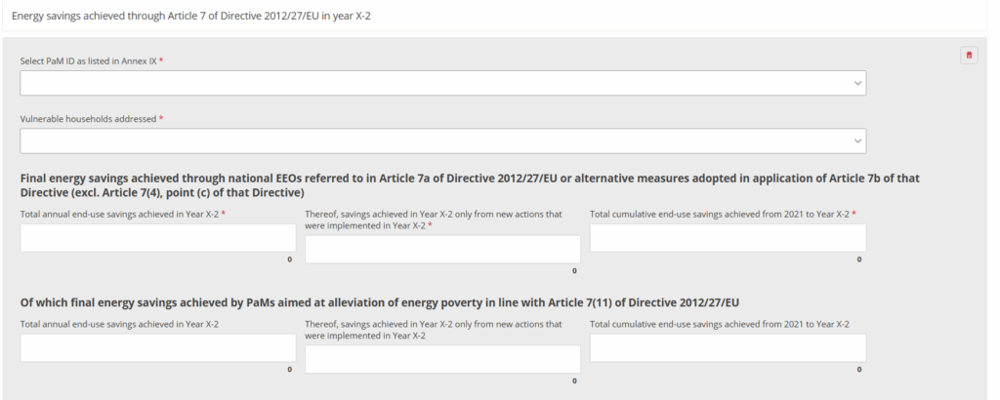
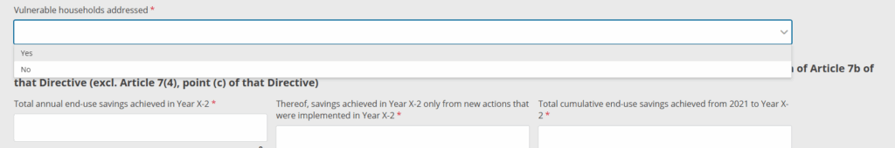
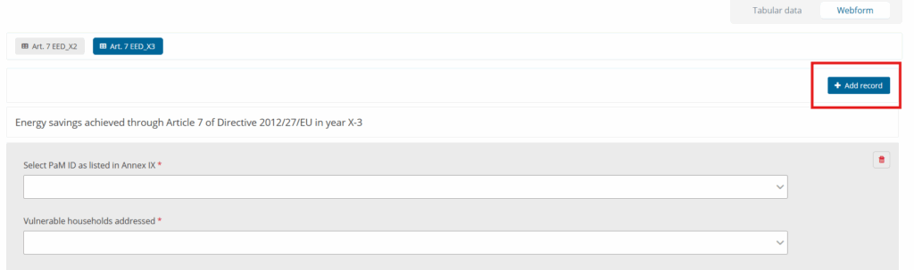

# Webform data input
Datasets can have a pre-designed webform available. If it is available you should see the **Webform** button inside the interface.

Webforms are very specific so if they exist and are not self explainable a document should be available inside the dataflow help itself.

# **Editing a Webform**

**WARNING!** Actions related to Webforms such as opening or closing a webform, editing, deleting, or enabling/disabling editing may take some time to complete, especially for large datasets. Dataset editing and the preparation required for editing are performed in the background and may require additional processing time.

If the **Webform** button is pushed, user will be able to see the webforms **Overview** table with all the records that have been added so far. In order to edit a record or add a new one, editing should be enabled by pushing the **Enable editing** button at the top right. Otherwise the only option will be to just view a record without having the ability to edit or add a new one.

Next comes an example of a webform where editing has not been enabled yet and as a result the user can only view the form without having the ability to edit the fields as they are greyed out. The **Overview** button can get the user back to the overview table.

After **Enable editing** is triggered, a notification will inform the user that editing for the specific dataset has been successfully enabled. The **Enable editing** button will change to **Disable editing** and the username of the user that is currently editing inside the dataset will be shown to anyone that gets into this specific dataset including the user that is editing. This information will be available above the **Disable editing** button. Now the user will have the ability to add a new record or edit/delete an existing one.

When editing is enabled **Import dataset data** , **Export dataset data** , **Delete dataset data** and **Validate** are disabled. In order to use one of these options, editing should be disabled first.

Editing is available for only one user each time. All the other users will not have the ability to either edit or even use the **Disable editing** button which can be triggered only be the user that has enabled editing. Below there is an example of what a second user will see when entering the dataset where the first user has enabled editing.

Webforms can look and feel very different from dataflow to dataflow, as they are tailored for a specific need. We show here a number of webforms as example.

Once you have finished editing inside the webform, use the **Disable editing** button in order to make the webform available for editing again to the other users.
