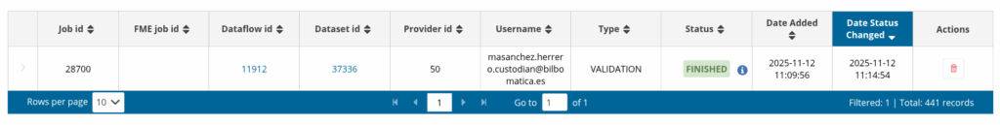
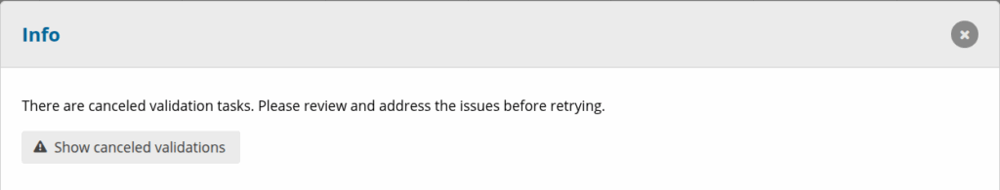
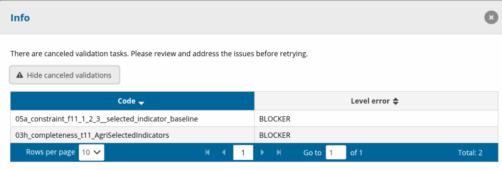

# Canceled validation tasks
**How to view the canceled validation tasks**

During the validation of a dataset, some QC rules might not be validated even though the job has finished successfully. These rules can be found in the job monitoring window for the validation job and are described as Canceled Validation Tasks. Jobs with further information have an info icon next to the status. This button is clickable.

If the reporter clicks on the icon, he can see if there are canceled validation tasks.

The user can click on the Show canceled validations button to view the tasks information such as the QC code and severity level.

If the reporter is releasing and there are canceled validation tasks with severity level BLOCKER, the release will fail.

**Reason for validation task cancelation**

A validation task might be canceled due to:

  * **Data in dataset cannot be validated by the SQL rule.** The custodian needs to check if the data can be handled by the SQL rule.
  * **SQL rule being too complex.** The custodian needs to check the rule and simplify it.
  * **No reference data exists.** If reference data is missing, the custodian needs to add it so that the reporter can validate properly.
