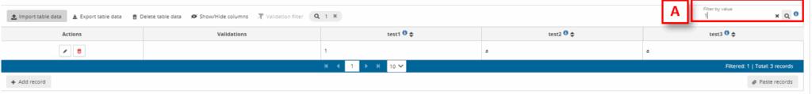

# Filter table data
To filter table data, insert in an input text in the table bar ‘Filter value’ [A] the text you want
to search in all fields.
The geometer fields will be omitted, and the filter is case sensitive.

