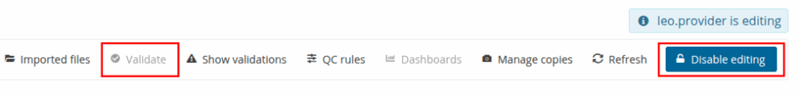
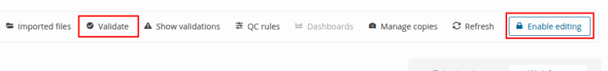
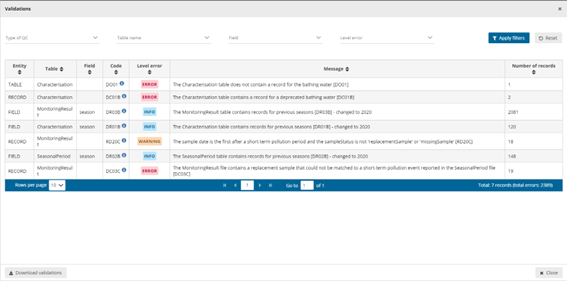

# Validate data
After submitting your data, you have the opportunity to validate the uploaded datasets. Each data flow includes a series of built-in quality controls designed to check for completeness, consistency, and compliance with the reporting requirements. These controls help ensure that the submitted data meets the expected standards and supports a high level of data quality across all reporting activities.

## How to validate the data manually,

In the reporting dataset you will find several menu buttons for quality control

  * **Validate** – Runs validations for the whole dataset
  * **Show validations** – Shows a table of all the validation issues found across the whole dataset after a validation has been run.
  * **QC rules** – shows a list of all the validations which have been created for the dataset.**Dashboards** – Provides a visualisation of the validation feedback.
  * **Manage copies** – Functionality to save copies of the data (snapshots or restore points)
  * **Refresh** – After import, validation and restore copy, you need to refresh the tables

Click on ‘**Validate** ’. Shortly after a notification in the top right will indicate the validation has started and another notification when it has been completed. It is important to press the **Refresh** button to demand your browser refreshing to current table view.

**WARNING!** In order for **Validate** button to be available, **Enable editing** button at the top right should have not been pushed, otherwise the dataset will have entered edit mode and **Validate** button will be disabled. In order to enable it again click **Disable editing**.

 

The system has four types of error entities (field level, record level, table level and dataset level)

  * Field level errors have icons next to value in the field. Hover over it to see the error message.
  * The column ‘Validations’ shows for each record which level of errors at field and record level.
  * Table level errors can be seen by clicking on the **Show validation** button. These errors are displayed in a summary table, grouped by a particular error type.

## Validation errors view page

All validations are shown here and the interface allows for filtering. Meaning you can focus only on a specific entity.

  * Entity – One of FIELD/RECORD/TABLE/DATASET.
  * Table – the table with the error.
  * Field – the type of field affected with the error.
  * Code – the error code.
  * Validation level:
  * Error message – What the issue is.
  * Number of records – Total number of records we found that error.

Page through it and sort it to understand errors in data. It is also possible to filter records in the validation table to make it easier to work with. You can filter on the error messages either by the error level or the entity type.

Click on an error in the list to go to the record in the table and it will be highlighted. When clicking on a grouping, it filters the main table with all those records that triggered the error. Click on button **Download validations** if you want to download the validation information grouped by a particular error type. Click on **Dashboards** to get a visual overview of the number of errors in the data.

## Correct the errors and revalidate the data.

Only BLOCKERS will stop the data from being released to the data collection.

To make clearer how to deal with the correction of the errors in the data we provide here an example of the steps you could apply to your process.

  1. Import data as explained in section ‘[Submit data](../submit-data/index.md)‘ and don’t forget to click on the **Refresh** button to ensure your browser refreshes the table.
  2. Click on ‘**Validate** ’ button and after the process finishes click on ‘**Refresh** ’ button again.
  3. Check if there are **errors and/or blockers**.
  4. Analyze the errors and/or blockers using the table view or**Show Validation** table.
  5. Update your local original dataset to if you have errors.
     * If using an form or excel and the number of errors are limited then you can perform a manual intervention. To ensure that what you report is also what you have local we advice you to make any changing you do inside Reportnet as well to you original dataset. Making changes on the platform can allow you a quicker response but the master data is still your local copy.
     * If you have many errors then scripting or a number of database UPDATE statements might be the faster solution.
     * If it is a formatting issue (for example date format) the export script might need a change.
  6. You can as well export the data by clicking on **Export dataset data** and download the excel file with validations. This only works for small and medium dataset sizes. The file would contain a field that explains the error after the column with the error. That file could be used in relation with a clean script.
  7. After fixing issues you can re-upload your new version and go back to step 1.
  8. Remember to select the ‘**Replace data** ’ checkbox. As you can see, although there are extra columns that are not in the template, but only the columns that
appear in the template will be uploaded and updated.
