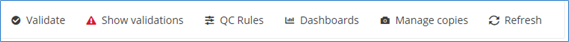
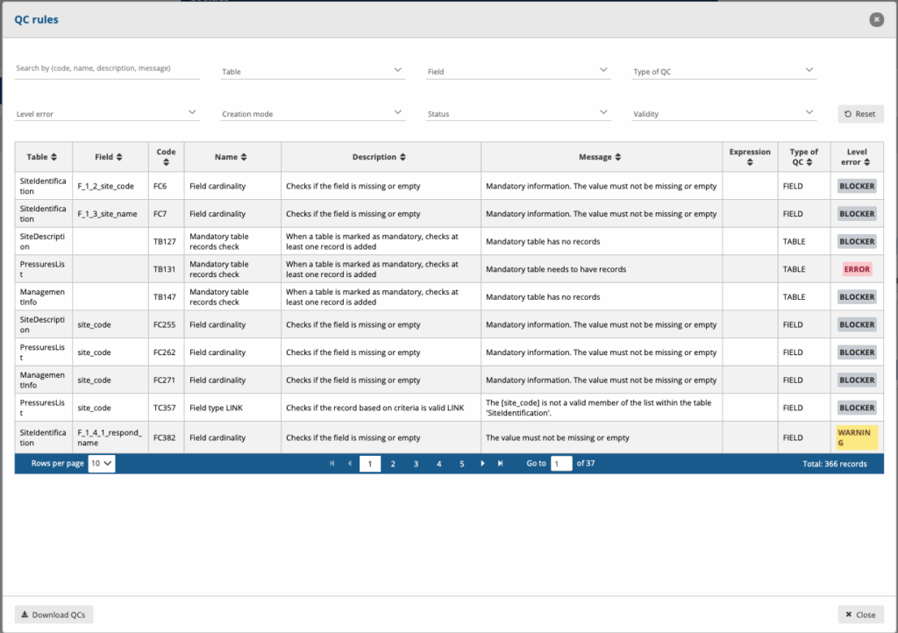
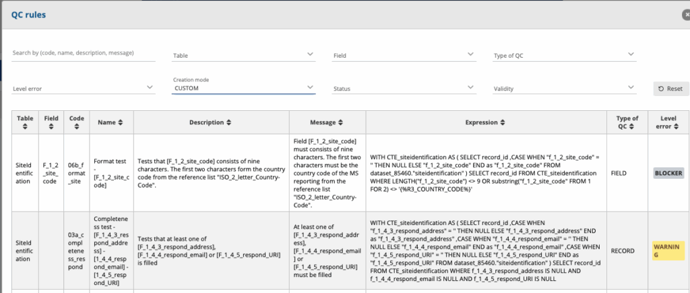
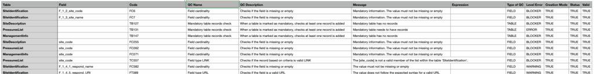

# Quality control rules
In the reporting dataset you will find several menu buttons for quality control

In the top menu click on **QC rules** to see which rules have been defined for the dataset. Use the filter option to navigate through the sometimes extensive list of rules.

You can filter on Table, Field, Type of QC, Level of Error, Creation mode, Status and Validity. In rare cases a validation rule can be disabled and the “Status” attribute would allow you to filter on those.

The expression field might be very useful for the more advanced validations towards database managers. The expression would be in SQL-syntax and could be used to filter the same records out of your own database. The syntax might have the be altered slightly.

The filter **Creation Mode** allows two options that needs some explanation for the outsider. Reportnet has a number of validation it produces out of the box. These usually don’t have an SQL expression. Those “Automatic” rules are basic validations such as checking of the value in a number when we defined the data type as integer. Custom validation are produced by the data custodian and in most cases or data flow specific. They are written in SQL-language a database expert can easily reproduce in it’s own database.

It is possible to download the list of QCs in a CSV file by clicking on the ‘**Download QCs** ’ button.

