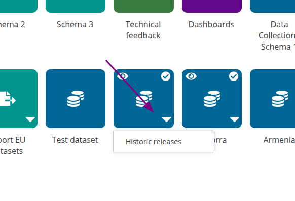

# Change Release Date of Dataset (Custodian/Admin)
In **Historic Releases** section, a new functionality was implemented.

A new **“Actions”** column has been introduced. This column is visible only to users with the **Custodian** or **Admin** role.

  * By clicking the **Calendar** button, a new dialog opens, allowing the user to **modify the Release Date**.

  * The updated Release Date will be applied across **all schemas** of the specific provider.
