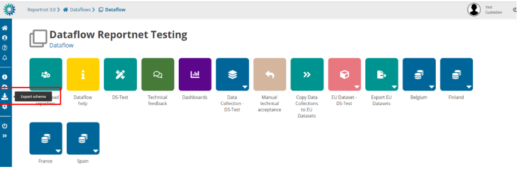
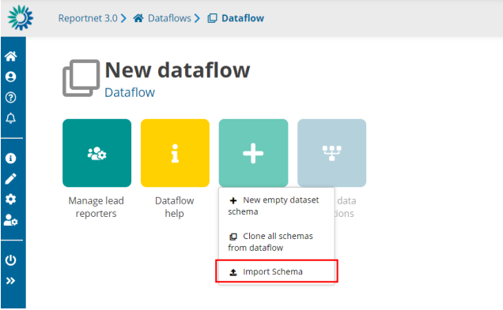
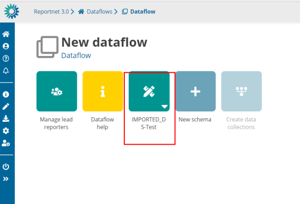

# Import/export data schema’s
**How to import and export schemas**

In order to**export** a schema from one dataflow with complete information (all datasets, tables,
fields, webforms, QCs, uniques, external integrations…) you have to click on button “Export
schema” and a file will be generated.

# ****Export schemas****

## Overview

The **Export Schemas** function allows you to download the complete structure and configuration of all datasets within a specific **dataflow**.
This feature is mainly used for:

  * Creating a **backup** of the dataset structures
  * **Transferring** schemas to another environment

When executed, the system creates a single **ZIP file** that contains the definitions and rules of every dataset in the selected dataflow.

## ZIP File Contents

For each dataset included in the dataflow, several files are generated inside the ZIP.
Each file has a specific extension indicating the type of information it contains.

File name (per dataset)| Description
---|---
`datasetName.schema`| The **dataset schema** — describes the data structure, tables, fields, and data types.
`datasetName.qcrules`| The **qc rules** that validate the dataset’s data.
`datasetName.unique`| The **unique constraints** — rules that ensure certain field combinations are unique.
`datasetName.integrity`| The **integrity rules** that define relationships between datasets.
`datasetName.extintegrations`| The **external integrations** linked to the dataset.

In addition to the dataset-specific files, two reference files are included:

File name| Description
---|---
`datasetSchemaNames.names`| Lists all dataset schema names included in the export.
`datasetSchemaIds.ids`| Lists the unique identifiers (IDs) of each dataset.

## How It Works

  1. The user triggers the **Export Schemas** action from the application.
  2. The system retrieves all datasets linked to the selected dataflow.
  3. For each dataset, it gathers:
     * The schema definition
     * Quality control rules
     * Unique and integrity constraints
     * External integration settings
  4. These details are converted into JSON files with the respective extensions (`.schema`, `.qcrules`, etc.).
  5. All files are compressed into a single ZIP archive.
  6. The ZIP file is named using the dataflow name and the current date.
  7. The file is automatically downloaded to your device.

## Notes

  * If the dataflow does not contain any schemas, the system will display an error message indicating that there are no schemas available for export.
  * Avoid editing or removing files inside the ZIP unless you are familiar with the schema structure.
  * The exported ZIP can later be re-imported through the **Import Schemas** function (if available in your environment).

If you want to **import** a schema from one dataflow with complete information (all datasets,
tables, fields, webforms, QCs, uniques, external integrations…) you have to click on “New
schema” and click the option “Import Schema” where you can upload a file. A new schema will
be generated based on the file uploaded. Schema name can be changed.

 

# ******Import schemas******

## Overview

The **Import Schemas** function allows you to upload a ZIP file containing dataset schemas (previously exported from another dataflow or environment).
This feature is used to **restore** , **copy** , or **migrate** the structure of datasets — including tables, fields, validation rules, and integrations — into a new or existing dataflow.

## Expected Input

  * A single **ZIP file** generated by the _Export Schemas_ feature.
  * The ZIP must include files such as:
`.schema`, `.qcrules`, `.unique`, `.integrity`, `.extintegrations`, `datasetSchemaNames.names`, and `datasetSchemaIds.ids`.

If the ZIP does not contain valid schemas, the import process will stop and an error notification will be shown.

## How It Works

When you upload the ZIP file and start the import:

  1. **File extraction**
     * The system unpacks the ZIP and reads all schema files (datasets, rules, and configurations).
     * It validates that dataset and field names are correct and do not contain invalid characters or spaces.
  2. **Schema creation**
     * For each dataset in the ZIP, a **new dataset schema** is created inside the selected dataflow.
     * Each new schema gets a new internal ID.
     * A mapping table is built to link old schema IDs (from the ZIP) with the new ones.
  3. **Dataset registration**
     * A corresponding empty dataset is created in the system for each new schema.
     * Permissions for each dataset are automatically assigned to contributors.
  4. **Schema filling**
     * The new datasets are populated with:
       * Table structures and fields
       * Validation rules (quality control rules)
       * Unique and integrity constraints
       * External integrations and related configurations
  5. **Rules and validation setup**
     * All imported rules are registered in the validation service.
     * The system automatically runs an **SQL quality check validation** for each imported dataset to ensure rules are correctly applied.
  6. **Foreign keys and relationships**
     * If there are fields that link datasets together, those references are automatically updated to match the new dataset IDs created in the import.
  7. **Finalization and notifications**
     * Once everything is successfully imported, a completion notification is sent to the user.
     * If an error occurs (e.g., invalid characters in field names or corrupted ZIP file), an error notification is triggered instead.
     * The import lock on the dataflow is released when the process finishes.

## Notifications

During the import process, you may receive one of the following notifications:

Notification| Meaning
---|---
**Import started**|  The import process has begun.
**Import completed**|  All schemas were successfully imported.
**Import failed**|  There was a general error during the import.
**Import failed – illegal characters**|  Some table or field names contain invalid whitespace or characters.

## Summary of What Gets Imported

Element| Description
---|---
**Dataset schemas**|  Table structures and field definitions.
**Quality control rules**|  Validation logic for data correctness.
**Unique constraints**|  Rules that define uniqueness for specific fields.
**Integrity rules**|  Links and dependencies between datasets.
**External integrations**|  Connections with external services or APIs.
**Permissions**|  Contributor access rights for each dataset.

## Limitations of schema design

The following limitations are enforced:

  * The maximum number of fields per tables is 155 fields
  * The maximum number of tables per dataset is 60 tables
  * The maximum number of datasets per dataflow is 22 datasets

## Notes

  * Import can only be performed when the dataflow is in **Design** status.
  * The imported ZIP must be a valid file generated by the same system’s _Export Schemas_ function.
  * If the process fails, all temporary datasets created during the import are automatically cleaned up.
  * Avoid closing the browser during the import — it may take several seconds to complete, depending on the number of datasets.
