# Create a dataflow
A dataflow in Reportnet is a single entity that bundles all the datasets required for a specific reporting obligation. It can contain one or more datasets, encompassing all the relevant information needed for that obligation. The dataflow is the primary mechanism used to dispatch technical delivery instructions — performed by creating a data collections— to a group of designated data reporters (such as Member States, industries, or other entities), ensuring consistency and clarity in the data submission process.

Navigate to the dataflows overview page.

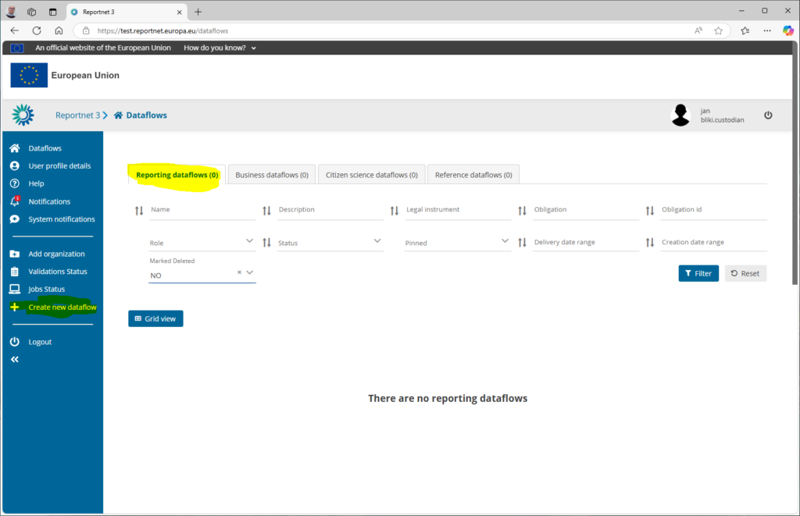

Click on “Create new dataflow” and make sure you are on the correct dataflow type tab. This will bring a create new dataflow popup window.


Provide the following details

**Dataflow name:** The new name representing the data flow

**Dataflow description:** Describe the dataflow in short. Maximum 255 characters.

Check the **“Pin the dataflow”** to keep it on top of the list. You can easily check this on/off later depending on your wished focus.

Check **“Big data storage”** so the system will use the latest storage solution inside Reportnet. We strongly recommend to use this new storage solution if your dataflow is not depending on the previous storage solution. For compatible reasons you might use the old storage system.

**Search obligation:** Find the correct Report Obligations. It is mandatory to assign this dataflow to one of the reporting obligations. Use the filter options to navigate towards all the Reporting obligations. Go to the reporting obligation database to add a new record if the Reporting Obligation is not in the system.

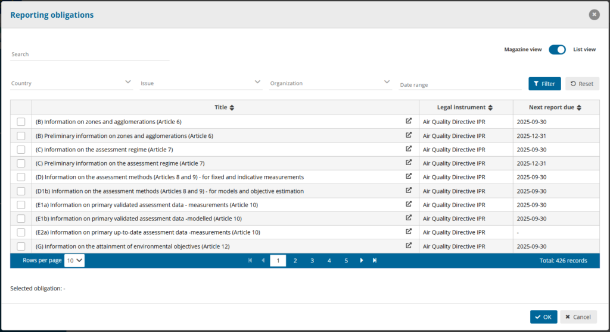

Finally press the **Ok** button to start the creation of this new dataflow.

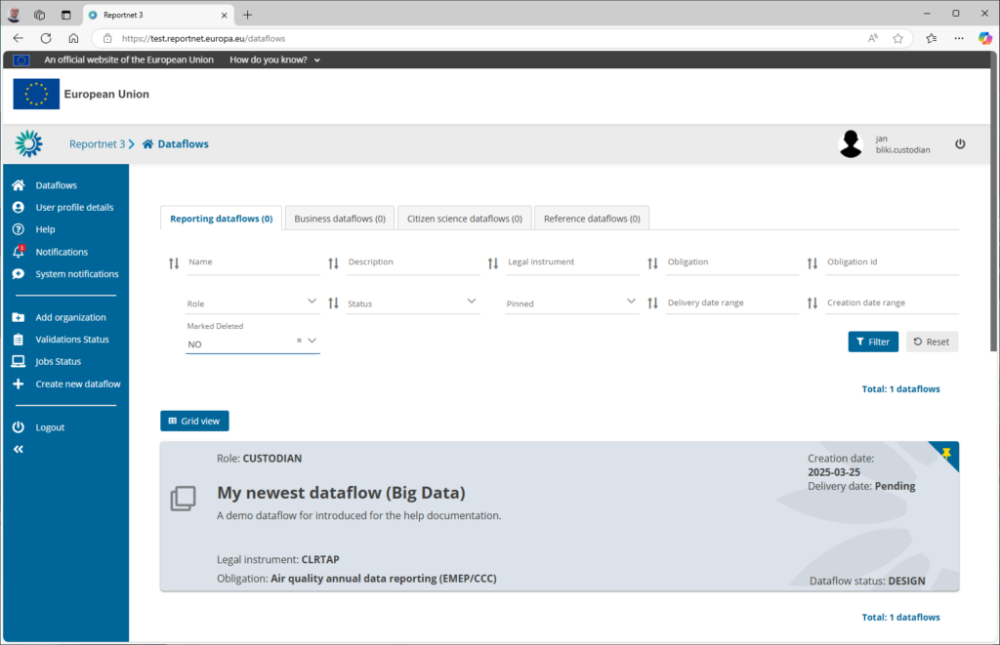

You should instantly see a new dataflow popup in the list. You are now ready to add dataset schema’s, dataflow documentations and reporters. Simply click on the dataflow to go inside.


By default we have two ready to use features available.

**Manage lead reporters** : An area where can manage the reporters. Go to [manage lead reporters](manage-lead-reporters.md) for more details.

**Dataflow help** : Provide any additional documentation, web links and view dataset schemas under his dataflow. Go to [manage specific help](manage-dataflow-help.md) for more details.

## How to create a new reference dataflow

A reference dataflow is a dataflow without ROD obligation (only name and description) with design schemas but without lead reporters. The reference dataset will be like DC, only read-only.
Also, reference dataflows will have the information about the dataflows that are using it as reference.
All custodians/stewards/editor write could use this reference dataflow as external link.

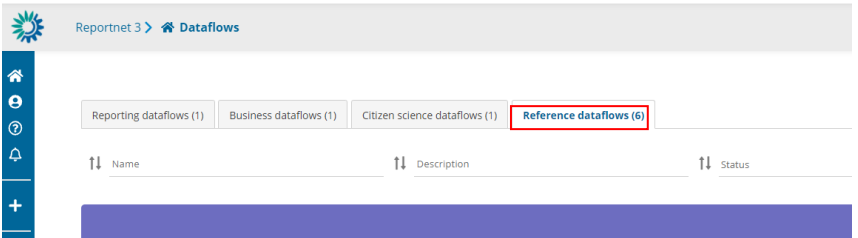

  1. Optional: Expand the left panel by clicking on the double arrow at bottom left.
  2. Click on ‘Create new dataflow’ in the left menu.
  3. In the next dialogue window, provide your new dataflow some metadata –
‘Dataflow name’ and ‘Dataflow description’. The name of the dataflow has to
be unique across all dataflows and a notification error will pop up if the dataflow
name already exists in the system. In this case, please choose another name for
your dataflow.
  4. Click on ‘Create’.
  5. You will now see your dataflow at the top of the list with a status of ‘Design’.

## How to create a new business dataflow

Only a user with admin role can create this business dataflow. As a custodian or steward you could see the list of business dataflow.
To create a business dataflow you need to add a name, description, obligation, select the group of companies to user in the manage lead reporters and the FME user

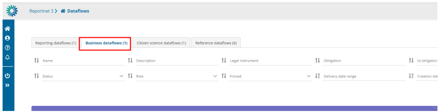

  1. Optional: Expand the left panel by clicking on the double arrow at bottom left.
  2. Click on ‘Create new dataflow’ in the left menu.
  3. In the next dialogue window, provide your new dataflow some metadata –
‘Dataflow name’, ‘Dataflow description’, ‘Group of companies’ and ‘FME user’.
The name of the dataflow has to be unique across all dataflows and a
notification error will pop up if the dataflow name already exists in the system.
In this case, please choose another name for your dataflow.
  4. Associate the dataflow to a reporting obligation in Reporting Obligations
Database (ROD). Click on the ‘Search obligations’ button and you will be taken
to a new window. You are now looking at all the obligations stored in the ROD.
To find the right obligation, you can either;
i. use the free text search field in the top left, or
ii. use the dropdowns to filter the list based on different metadata. To
apply your filter, you need to press ‘Apply filters’ button on the right,
and you also need to press this button after you press ‘reset’.
iii. Once you have found your obligation, select it and press ‘OK’ and you
will be taken back to the previous window.
  5. Click on ‘Create’.
  6. You will now see your dataflow at the top of the list with a status of ‘Design’.

## How to create a new citizen science dataflow

As a custodian or steward you could see the list of citizen science dataflows.
To create a citizen science dataflow you need to add a name, description and obligation.

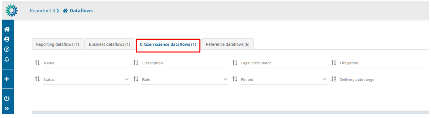

  1. Optional: Expand the left panel by clicking on the double arrow at bottom left.
  2. Click on ‘Create new dataflow’ in the left menu.
  3. In the next dialogue window, provide your new dataflow some metadata –
‘Dataflow name’ and ‘Dataflow description’. The name of the dataflow has to
be unique across all dataflows and a notification error will pop up if the dataflow
name already exists in the system. In this case, please choose another name for
your dataflow.
  4. Associate the dataflow to a reporting obligation in Reporting Obligations
Database (ROD). Click on the ‘Search obligations’ button and you will be taken
to a new window. You are now looking at all the obligations stored in the ROD.
To find the right obligation, you can either;
i. use the free text search field in the top left, or
ii. use the dropdowns to filter the list based on different metadata. To
apply your filter, you need to press ‘Apply filters’ button on the right,
and you also need to press this button after you press ‘reset’.
iii. Once you have found your obligation, select it and press ‘OK’ and you
will be taken back to the previous window.
  5. Click on ‘Create’.
  6. You will now see your dataflow at the top of the list with a status of ‘Design’.
  7. You will be able to do everything like in a reporting dataflow but with
organizations instead of countries

```
**Dataflow in design phase**
```

**Permissions depending on user role**

Different permission depending on role during dataflow in design phase:

  * Custodian – Write permission
  * Steward – Write permission
  * Editor write – Write permission
  * Editor read – read-only permission.

**How to work with the dataflow page**

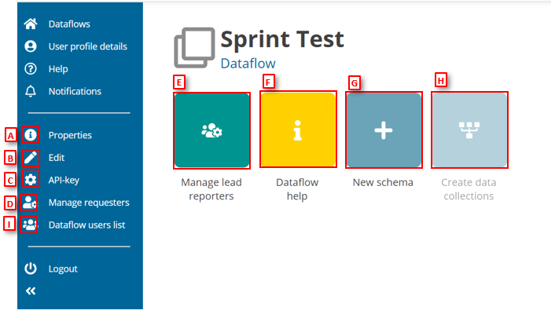

  * [A] – Properties, the icon marked with ‘i’, displays the information regarding the
dataflow, reporting obligation and legal instrument (extracted from ROD).
  * [B] – Edit, the pencil icon, enables to edit the name, description or associated obligation
of the dataflow as well as to delete it (explained in the next section).
  * [C] – API-key, the cog button, displays the API key and other parameters for accessing
Reportnet3 programmatically (explained in ‘How to generate API-key’).
  * [D] – Manage requesters button displays a dialogue to manage (add) other users to
collaborate in the dataflow design.
  * [E] – Manage lead reporters button displays a dialogue to manage (add) lead reporters
to the dataflow (explained in ‘How to add lead reporters to my dataflow’).
  * [F] – Dataflow help for accessing to the dataflow help page, in here you will find three
tabs showing documents, links and technical overview of the reporting schema
(explained in ‘Dataflow help’).
  * [G] – By clicking on ‘New schema’, you can create a new dataset schema or clone and
existing one (explained in ‘Create a dataset schema’). If cloning does not work, please check [Import/export data schema’s – Reportnet Help Pages](import-export-data-schemas.md)
  * [H] – The ‘Create data collections’ button published the dataflow out to the reporters.
It is enabled when there is a schema, and a reporter has been added (explained in ‘How to add lead reporters to my dataflow’).
  * [I] – Dataflow users list button displays a dialogue with the users assigned to this
dataflow (explained in ‘How to check dataflow users list’).
For an admin role we have a button ‘Datasets info’ where we can see the
list of all datasets (design, reporting, reference, test, DC and EU) with the name and the
ID. It is possible to filter the list by name, type and country/organization/company

**How to change the name, description, or associated obligation of my dataflow (only in design phase)**

  1. Go to the dataflow page.
  2. Click on ‘Edit’ button in the left context menu.
  3. In the next ‘Update dataflow’ dialogue window you can edit the name or
description.
i. On business dataflows, if you have an admin role, you can edit name,
description, group of companies, FME user and obligation.
ii. On business dataflows, if you have a custodian/steward with
permissions assigned for this kind of dataflow, you can edit name,
description and obligation.
  4. Click on the ‘Search’ button and you will be taken to a new window where you
can select a new obligation and press ‘OK’ to return to the ‘Update dataflow’
window.
  5. Click ‘Save’ to update the dataflow and return to the dataflow page.

**How to delete my dataflow (only in design phase)**

  1. Go to the dataflow page.
  2. Click on ‘Edit’ button in the left context menu.
  3. In the next ‘Update dataflow’ dialogue window click on the ‘Delete this
dataflow’ button.
  4. Follow the instructions in the dialogue window to delete the dataflow.

**How to add collaborators to support design of my dataflow**

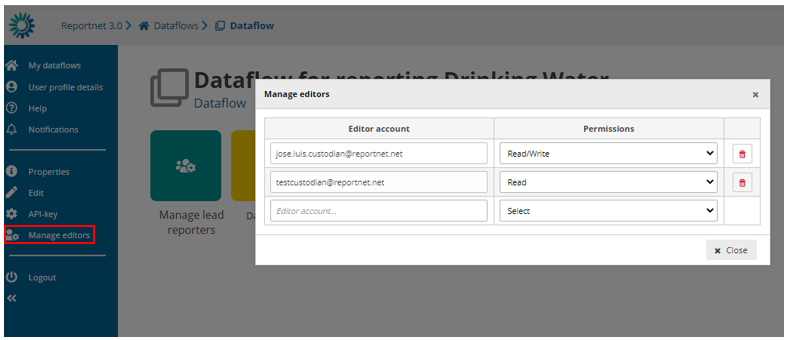

  1. Go to the dataflow page.
  2. Click on the double arrow at bottom left to expand the left menu, and click on
the button ‘Manage editors’.
  3. A pop-up will appear where you can add editors.
  4. Add the editors accounts. Under the account field, add the registered users
email address and select an editor level of ‘read’ or ‘read-write’. Click on the
dialogue away from the input fields.
– If the system cannot find the email as a registered user, then a red box
will appear around the email address.
– If it is accepted, then you will be able to add another editor (the account
field is automatically generated after a successful entry) and so on.
  5. Note: ‘read’ can only see the dataflow schema through the ‘Dataflow help’ ->
‘Dataset schemas’ page
  6. Once you have added all your editors click ‘Close’.
  7. Note: Once the dataflow moves to Draft status, these collaborators are
removed.

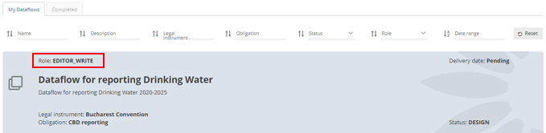 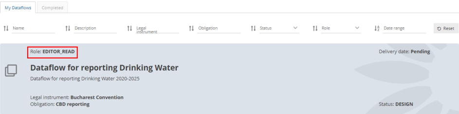

**How to create the data collection and start reporting**

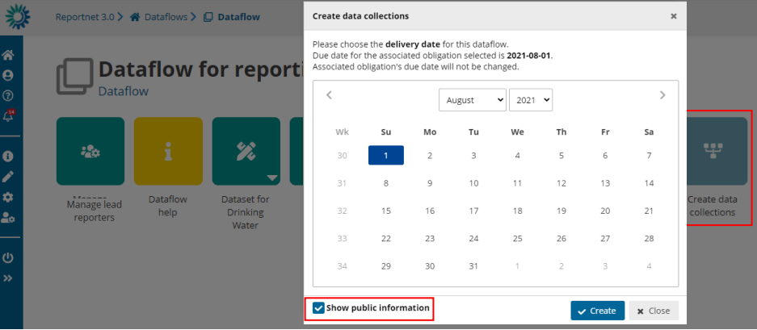

  1. Go to the dataflow page.
  2. If you have added at least one registered user as a reporter and created a
dataset schema, then the ’Create data collections’ button will be enabled.
  3. Click the ’Create data collections’ button. A warning appears when there are
any QC disabled or SQL QCs invalid (and the count of each type).
  4. In the data selection dialogue, you choose the closing data for the reporting. If
it exists, the delivery date is automatically taken from the metadata in ROD, but
you can override it here. Leave the date or select a new one.
  5. By default, option to “Show public information” is selected, meaning that this
dataflow will be on the list of reported data publicly available (View by
obligation https://reportnet.europa.eu/public/dataflows or View by country
https://reportnet.europa.eu/public/countries). This attribute can be changed
afterwards (see section below ‘How to change Public status’).
“BDR Dataflow” will have only the Dataflow Help part visible.
  6. Click on ‘Create’.
  7. A confirmation dialogue appears to warn the user that edition related to design
datasets (tables, fields, QC’s, snapshots, etc) will be no longer allowed.
  8. There is the possibility to add a technical acceptance step for the reporter
submissions (explained in section 4.1.9).

  9. You are returned to the dataflow page. The view now changes so you can see
the data collection, which contains all data which has been released by the
countries, a status dashboard and the individual reporter datasets, which
contain the latest version of the data.
  10. Go back to the dataflows list and you will see status and color of dataflow has
now changed.
  11. Reporting has now been opened and the dataflows assigned to all the reporters.

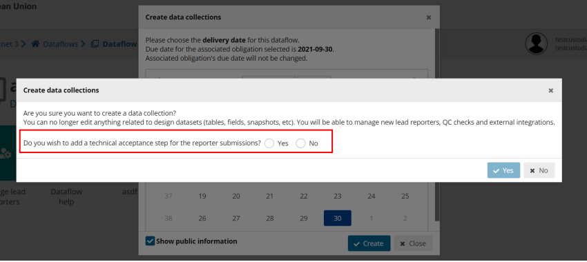

**How to change Public status**

In a dataflow in open status, public attribute can be changed from “Public
status” button in left bar.

This option is not available for business dataflows

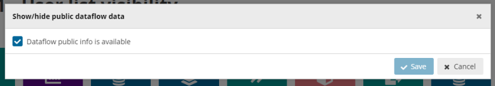
