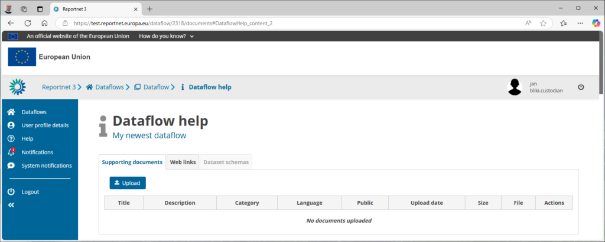
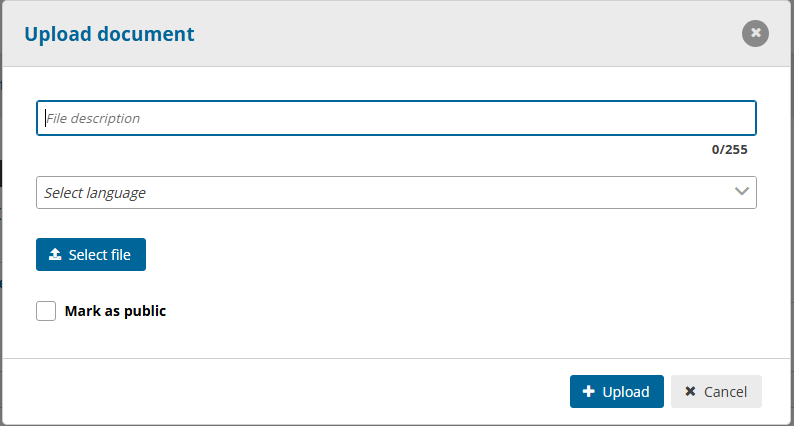
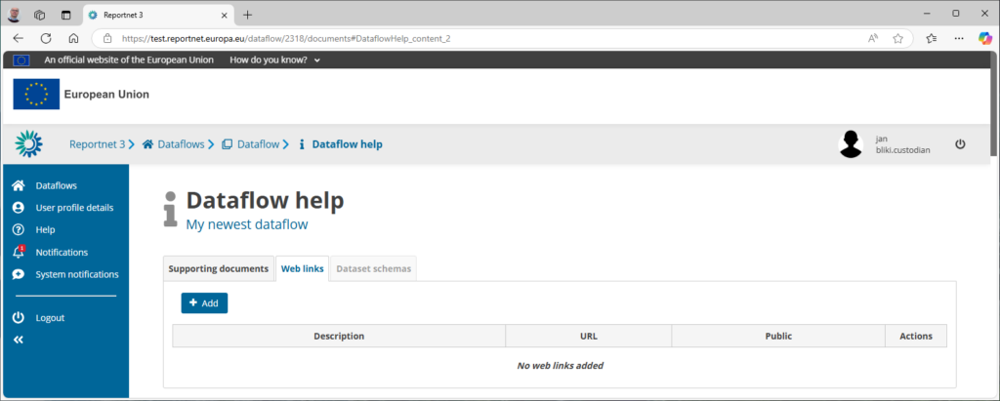
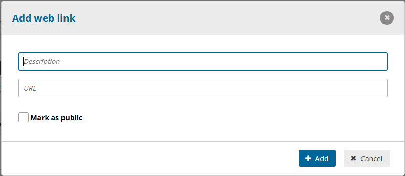

# Manage dataflow help

The first tab “Supporting documents” can hold any kind of file you wish to share with the data reporter. Usually these are pdf or word or power point documents that provide additional explanation or support on reporting instructions.

This can also contain specific data template examples. For example an excel template that provide a structured support assisting the data reporting. Or a zip file providing an example on how data should be structured when a tailored import format is provided.

The file description provide a brief explanation about the file. Multilingual is supported so the same file can be translated and uploaded in different languages. The **mark as public** will allow this file to be shown on the public section of Reportnet.

The second tab “Web links” allows you to provide link to other places on the web. For example the documentation of the report obligation is already published by the European Commission in many languages, We would simply link for convenience.

Same as with a document upload. Provide a line that describes the link and use **Mark as public** if we wish to show that link on the Reportnet public area.

Data reporters will see those same tables but in a read only solution.

The last tab “Dataset schemas” will view the dataset schemas designed in this dataflow but only in a read only fashion. As a data requester you can edit that information from the [dataset schema design](../create-a-dataset-schema/index.md).
