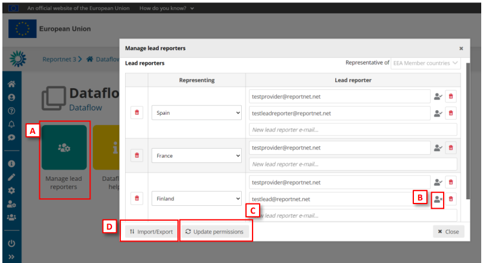
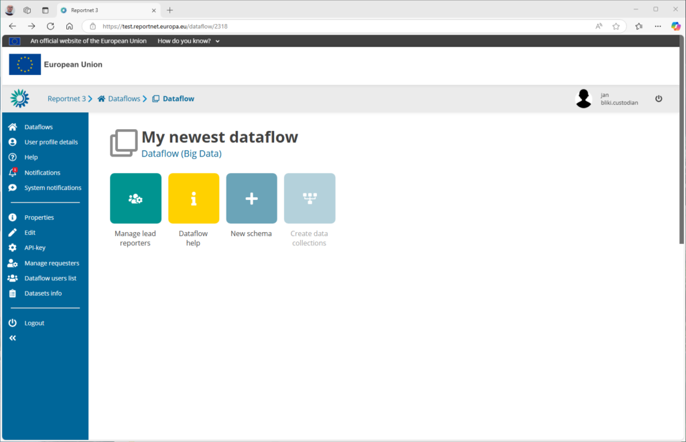
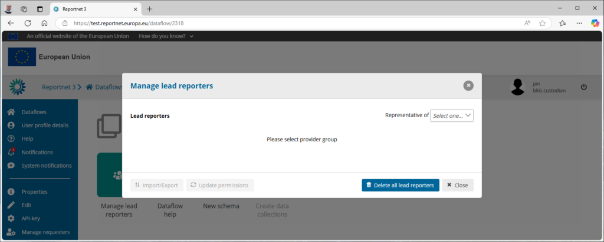
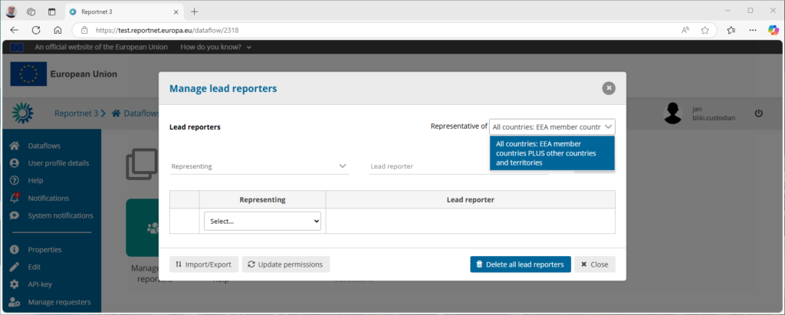
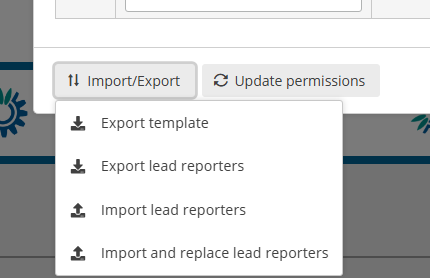
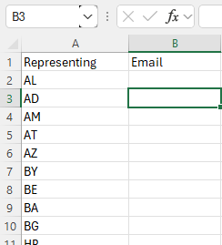
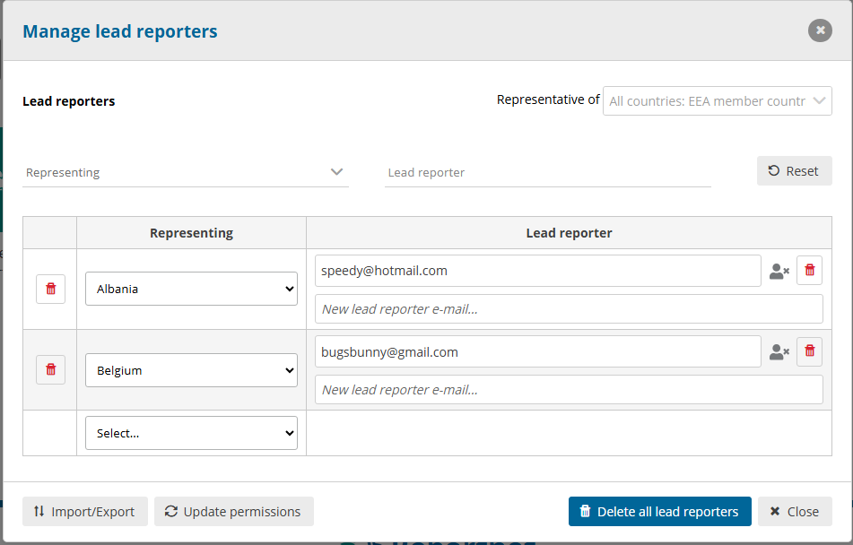
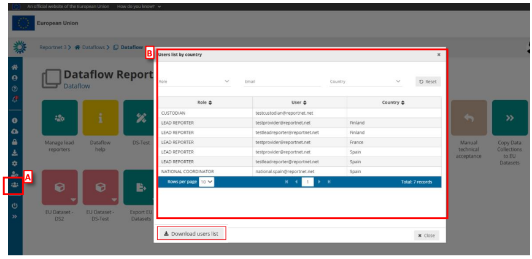
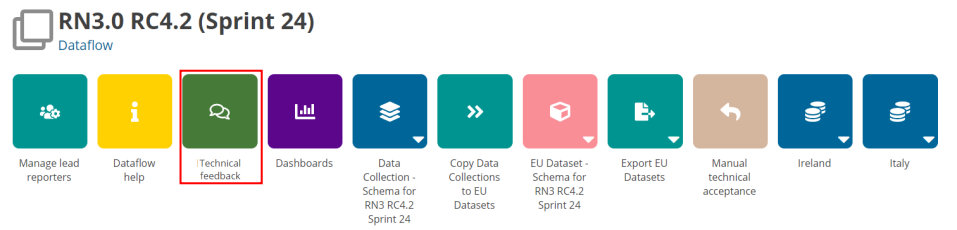
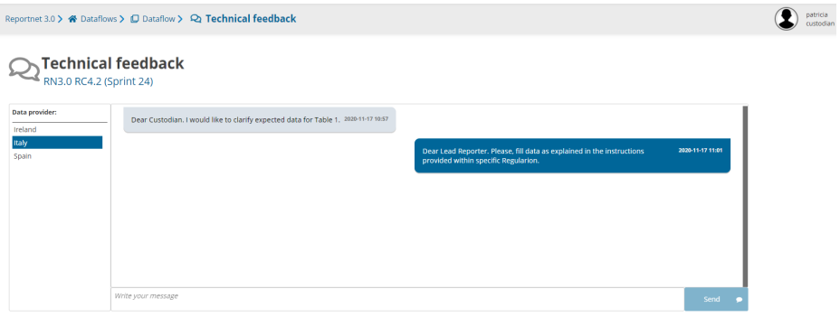

# Manage lead reporters
Lead reporters are the primary points of contact responsible for submitting data on behalf of their respective organizations or jurisdictions. Their specific role depends on the type of dataflow involved. For instance, in standard Reporting Dataflows—which typically gather information from Member States—there is usually one lead reporter per country. This individual (or designated authority) works directly with the data requestors, ensuring that all necessary data is collected, validated, and submitted accurately and on time.

## How to add lead reporters to my dataflow

  1. Go to the dataflow page.
  2. Click on the button ‘Manage reporters’ [A].
  3. A pop-up will appear where you can add reporters.
  4. On ‘Representative of’ drop down, choose either ‘EEA Member countries’ or ‘All
countries: EEA Member countries PLUS other countries and territories’. This
changes the countries available to assign reporters to, depending on the needs
of the reporting obligation.
  5. Add the lead reporter accounts. Under the account field, add the registered
users email address and select a country. Click on the dialogue away from the
input fields.
i. If the system cannot find the email as a registered user, then a red box
will appear around the email address and an icon indicating the user is
not valid [B]. Moreover, you have a button “Update the permissions”
[C] to check if the user is or not created and has permissions.
ii. If it is accepted, then you will be able to add another reporter (the
account field is automatically generated after a successful entry) and so on.
  6. In addition, you can load the lead reporters [D] with a CSV file.
i. If a country-reporter exists previously, it will be skipped.
ii. If there are errors on the CSV file, they will be skipped, and a CSV will
be downloaded with the records with fails and a message (user or
country does not exist)
  7. You can add multiple reporters in the same country.
  8. Moreover, you can export a CSV [D] with the current lead reporters.
  9. You can export a template file to managing the reporters with the
representatives for the group selected.
  10. Once you have added all your reporters click ‘Close’.

## How to manage lead reporters

Select the first icon “manage lead reporters”. A popup as follow will be shown.

The first action is to select the **“Representative of”-** list. The popup on the top right allows you to select one. For the standard Reporting dataflows there is currently only one called “All countries; EEA Member countries PLUS other countries and territories”.

You will notice that a table is generated where you can select a **Representing** and **Lead reporter**. Each time you select a country a text field appears where you can write the reporters email-address. More then one lead reporter can be provided. Reportnet allows you export and import that list as well as this is a lot off manual labor you don’t want to repeat every year.

**Export template** : Will generate you a template you can edit in a notepad or excel. Be aware that the format is .csv and not excel. Reportnet will use the ISO2 code for each country and a place where you can write the email address.

**Export lead reporters** : Will export all the lead reporters you have entered in the interface.

**Import lead reporters** : You can add additional reports to the list you are already having.

**Import and replace lead reporters** : You can replace the lead reporters with an .csv file from your desktop.

The button**“Delete all lead reporters”** will empty the entire table.

The button **Update permissions** will refresh the reporters permissions settings when the reporting dataset have been created by the data requester. The little people with cross icons would change into green with a little v icon if that was successful.

**How to add reporters after reporting has started**

Under the account field, add the registered users email address and select a country. Click on the dialogue away from the
input fields.
i. If the system cannot find the email as a registered user, then a red box
will appear around the email address and an icon indicating the user is
not valid. Moreover, you have a button “Update the permissions” to
check if the user is or not created and has permissions.
ii. If it is accepted, then you will be able to add another reporter and so
on

Only one lead reporter needs to be assigned per country because the lead reporters manage additional access for their countries.

Once you have added all your reporters click ‘Close’.

**How to see the list of users by country in a dataflow**

Go to the dataflow page:

  * There is an icon on ‘User list by country’ [A].

  * A pop-up [B] will appear where you can see the list of users for this dataflow
and the country.
  * There is also the possibility to download the list of users.

**How to Communicate with Lead Reporter**

  1. When data is released, a channel to communicate with Lead Reporters appears
at Dataflow level (‘Technical Feedback‘ button).
  2. User can select a country and see the messages (not read), get previous
messages and the option to add new messages (text messages, upload files and
delete a message).

 
