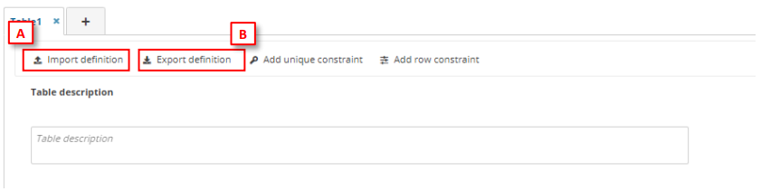
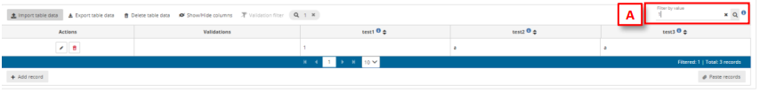

# Import/Export table definitions
**How to Import/Export CSV to create/update/replace schemas**

  1. To import the definition in a table, on the table menu, click on ‘Import
definition’ [A], then a dialog to select a CSV file will be appear and you can check
if you want to replace or not the data. The Field name, PK, Required, ReadOnly,
Field description, Field type, Extra information will be informed on this file. Then
the fields of the tables will be created.
  2. To export the definition in a table, click on ‘Export definition’ [B], then a CSV file
is downloaded with the table definition.

**How to filter table data**

To filter table data, insert in an input text in the table bar ‘Filter value’ [A] the text you want
to search in all fields.
The geometer fields will be omitted, and the filter is case sensitive.

**Limitations of import table definition**

The maximum number of fields per tables is 155 fields
