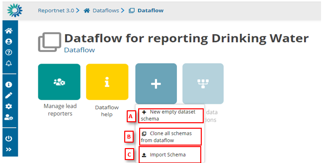
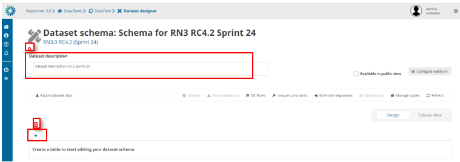
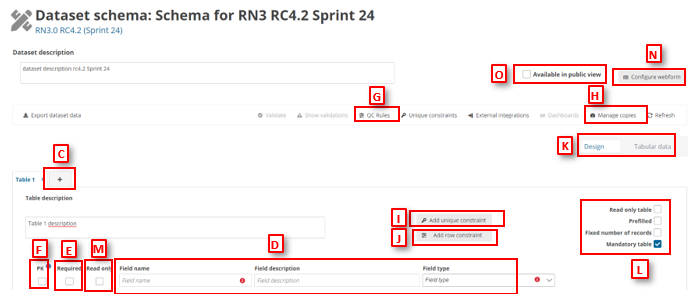
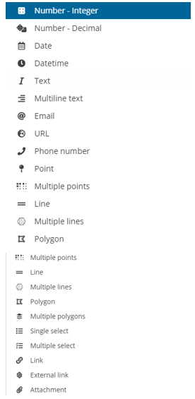
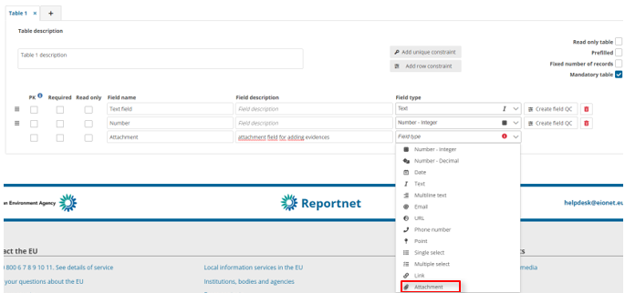
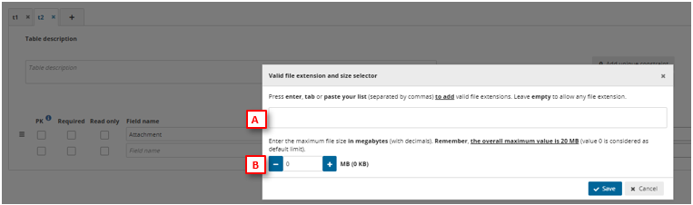
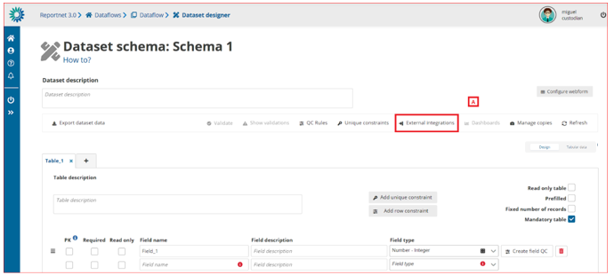
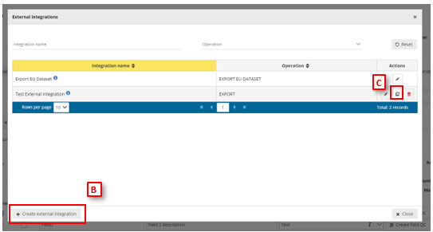
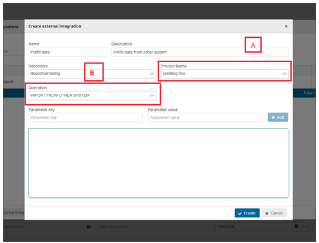

# Create a dataset schema
**How to add a dataset schema**

  1. Go to the dataflow page.
  2. Click on the ‘New item’ button and either select ‘New empty dataset schema’
or ‘clone all schemas from dataflow’.
  3. [A] For new empty schema, in the dialogue give your dataset schema a name.
  4. Click on ‘Create’.
  5. [B] For cloning an existing dataflows schema, in the dialogue select the dataflow
you wish to copy the schema from.
  6. Click on ‘Close selected dataflow’.
  7. After cloning, you can rename your schema.
  8. [C] For importing schema, you will need to import a zip file and upload it
(explained in ‘How to import and export schemas’).

**How to rename or delete my dataset schema**

  1. Go to the dataflow page.
  2. Click on the down arrow on the design schema icon to bring up a small menu.
  3. Click on ‘rename’ and give your schema new name OR click on ‘delete’ to
remove it.

**How to get an overview of the design schema page**

Initial view:

  * [A] – Metadata in this field will be reflected on the Dataflow help page.
  * [B] – Click here to add a Table by clicking the tab with a ‘+’ icon

After table has been added:

  * [C] – Add more tables by clicking the tab with a ‘+’ icon. By double clicking on the table,
it is possible to rename tables. Drag and drop allows you to change the order of the
tables. Right clicking enables you to delete the table.
  * [D] – Add fields by typing in Field name and Field description (to be reflected on the
Dataflow help page). You can choose the field type from the dropdown menu.
  * [E] – Once clicked on the Required, the reporter must enter data to that particular field.
  * [F] – Primary Key (PK) links the fields in the different tables together. If this PK is a text
field, it may not contain commas.
  * [G] – Manage table and field restrictions (QC rules) from this button.
  * [H] – Save a copy of the design schema that you can always revert back to.
  * [I] – Add uniqueness constraints (QC rules) to records in a table.
  * [J] – Add a row constraint to the defined fields.
  * [K] – By switching the toggle from ‘Design’ to ‘View data’ to test a schema design.
o Please, refer to HowTo_Reporter document for further details on features of View Data mode.
  * [L] – Prefill a table with data and make it read-only (code lists or reference data). Also
set table as Mandatory (QC rule associated) and fix number of records to disable users
the option to modify the number of records in this table.
  * [M] – Once clicked on Read Only, reporters can´t change value of this field.
  * [N] – Configure Webforms is explained in a section 3.3.28.
  * [O] – Option that makes this specific dataset publicly available when releasing

**How to add tables and fields to my schema**

Go to the dataset schema design page.

In the design view, add a table by clicking on the tab with the plus, give it a
name. Once you have entered the name, click away from the entry filled and
the table will be created.

Then add fields for that table, one by one by providing a name, description
(optional) and field type. The description will be part of the documentation on
Dataflow Help page, and also as a pop-up from the ‘i’ icon in a table column.

The field types could be:

QC rules are automatically created to validate the data to ensure it respects the
field type limitations. Go to the ‘QC Rules’ dialog and you will see that a QC rule
has been automatically added for the ‘table’ and ‘field’ you just created. Click
on the edit button to the right of the rule in order to edit the error message.

Click on the tab with a plus to add further tables.

**How to change field order**

If you have more than one field defined, change the order of fields using the
button on the very left of the field name, with three horizontal bars, to drag a
field to its new desired position.

**How to rename a table, or change the order of tables**

  * Rename tables by double clicking on the table name, or right clicking on the
table name and selecting ‘Edit’ from the context menu.
  * Use a drag and drop to change the order of tables.

**How to delete a table**

  * Right click on a table name
  * Select ‘Delete’ from the context menu.

**How to delete a field**

  * Click on the red trash-can icon to the very right if the field.
  * You will be prompted to confirm the deletion – click ‘yes’ to confirm.
Note: All associated QC checks both automatic and manually added are also deleted.

**How to configure an Attachment field**

Go to the dataset schema design page.
In field type, select Attachment

 

[A] List of valid extension can be added in here separated by commas. If the user
leaves empty this list, any file extension will be valid.

[B] The maximum file size in megabytes is set through this box, taking into
account maximum value is 20MB.

**To review the schema technical documentation**

From the ‘Dataflow’ page click on ‘Dataflow help’.
Select the ‘Dataset schemas’ tab.

You will see the technical documentation for the reporting schema. It lists the
codelists, tables, fields, uniques, QC checks including all the description text
added in the design view.

If you wish to update any of the text, then go back to the schema design view
to edit any description text.

**How to configure prefilling of previously reported data**

 

[A] – The ‘External integrations’ button pops up a dialog with a list of the External
integrations set up in the system. An ‘Export EU Dataset’ integration is created by
default on each dataflow creation.

[B] – You can add a new integration by clicking ‘Create external integration’ where you
will be able to set the type of external integration

[C] – You can clone a new integration by clicking on the clone button [C] where you will
be able to prefill new external integration from an existing one.

[A] – Select the proper process that will connect with the proper database or file
(configured in the FME process).

[B] – Select ‘Import from other system’.

**How to prefill a table with data and make it read-only (code lists or reference
data)**

  1. To the right, in the table design mode, enable the tick box ‘Read only table’.
  2. This will automatically enable ‘Prefilled’.
  3. Toggle the ‘View data’ so you can see the dataset view.
  4. Add rows, paste records or import data as you prefer into the table.
  5. When the data collection is created this table will be visible to the user readonly and populated with the prefilled data.
  6. It is possible to link fields on other tables to this prefilled data, in order to create
code lists or reference data.

**How to save a copy of the design schema**

  1. On the table menu bar, click on ‘Manage copies’.
  2. In the dialogue, give your copy a description in the text field at the top and press
the ‘+’ button.
  3. Click ‘Yes’ to confirm in the popup.
  4. The copy will be of both the design and any data added to tables.
  5. The copy will now be listed on the right.
  6. Close the right panel and continue working.

**How to restore a copy of the design schema**

  1. On the table menu bar, click on ‘Manage copies’.
  2. In the list, press the ‘Restore copy’ button next to the copy you wish to revert
to (WARNING: the current design will be overwritten – consider taking a copy
of the current schema before reverting to an older one).
  3. Confirm in the dialogue you wish to continue.
  4. Wait for the green notification to appear in the top right, confirming the copy
has been successfully restored.
  5. Close the right panel.
  6. Click on the ‘Refresh’ button.

**How to test a schema design**

  1. To the right of the table design view toggle from ‘Design’ to ‘View data’.
  2. You will now see the data entry view of your schema.
  3. Add data through add records, paste records or import.
  4. Click ‘Validate’ in the table menu bar to run the quality control checks.

**How to add descriptive text dataset schema documentation**

  1. Go into the ‘Schema design’ view where you add tables and fields to your
schema.
  2. Add text in the description text boxes at the levels of dataset, table field, and
QC rule as appropriate (see image below).
  3. Return to the ‘Dataset schemas’ tab in the ‘Dataflow help’ to see these
descriptive texts as part of the technical documentation.

**Limitations of schema design**

The following limitations are enforced:

  * The maximum number of fields per tables is 155 fields
  * The maximum number of tables per dataset is 60 tables
  * The maximum number of datasets per dataflow is 22 datasets
